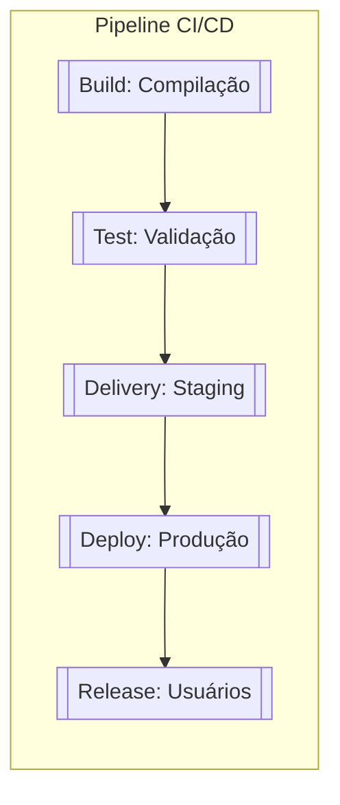

| Tipo                     | Definição                                                                                                                            | Objetivo                                                                                                                   |
| ------------------------ | ------------------------------------------------------------------------------------------------------------------------------------ | -------------------------------------------------------------------------------------------------------------------------- |
| **Delivery (Entrega)**   | Fase em que o software é **preparado e validado** para ser implantado em produção, garantindo que está funcional, testado e estável. | Assegurar que o código está **pronto para ser implantado**, mas ainda não está em produção ou disponível para os usuários. |
| **Deploy (Implantação)** | Processo de **colocar o código em produção**, atualizando a infraestrutura com a nova versão do software.                            | Disponibilizar o software no ambiente de produção, mas **não necessariamente torná-lo acessível aos usuários**.            |
| **Release (Liberação)**  | Ativação das funcionalidades para os **usuários finais**, tornando-as visíveis e utilizáveis.                                        | Controlar **quando** e **como** as novas features ou correções são disponibilizadas aos usuários.                          |
### **Diferenças Chave**

| Critério                   | **Delivery**               | **Deploy**                      | **Release**                    |
| -------------------------- | -------------------------- | ------------------------------- | ------------------------------ |
| **Foco**                   | Preparação e validação     | Implantação técnica em produção | Disponibilização para usuários |
| **Automação**              | Parcial (validação)        | Total (em CD)                   | Parcial (depende de decisão)   |
| **Ambiente**               | Staging/Pré-produção       | Produção                        | Produção (com controle)        |
| **Risco**                  | Baixo (sem impacto direto) | Moderado (infraestrutura)       | Alto (experiência do usuário)  |
| **Exemplo de Ferramentas** | Jenkins, GitLab CI         | Kubernetes, Terraform           | LaunchDarkly, Optimizely       |

A diferença entre **Delivery** e **Deploy** em uma pipeline de CI/CD está no **escopo**, **responsabilidade** e **momento em que ocorrem** no fluxo de entrega de software. Ambos são etapas críticas, mas atendem a objetivos distintos:

A implantação de um novo recurso significava a coordenação com a equipe de operações por exemplo:
- [ ] Métricas,
- [ ] Alertas;
- [ ] Considerações de capacidade e, em seguida, entregava o código para a equipe de operações implantar e operar.

Para ser eficaz na execução do código e dos parceiros de suporte, as equipes de operações precisavam de treinamento contínuo sobre novos recursos e correções de bugs.

O processo de implantação envolve a transferência de compilações de um ambiente para outro.

Os ambientes de destino e atual são controlados durante o processo de implantação.

Alguns dos ambientes em que ocorrem atividades de implantação são este contexto, ambientes referem-se à localização do servidor da aplicação ou software, que são divididos de acordo com o estado do software. De modo geral, existem quatro tipos de ambientes no desenvolvimento de software:

| Tipo de Ambiente | Entenda                                                                                                                                                                                                                                                                                                                  |
| ---------------- | ------------------------------------------------------------------------------------------------------------------------------------------------------------------------------------------------------------------------------------------------------------------------------------------------------------------------ |
| Desenvolvimento  | Ocorre o desenvolvimento do software. Onde os desenvolvedores escrevem as primeiras linhas do código e fazem todas as atualizações do código.                                                                                                                                                                            |
| Teste            | O controle de qualidade testem códigos novos e alterados, seja por meio de técnicas automatizadas ou não automatizadas.                                                                                                                                                                                                  |
| Staging          | Uma réplica quase exata do ambiente de produção, o objetivo deste ambiente é testar em um nível próximo de produção, mas em um ambiente que não seja de produção, para verificar se o aplicativo se comportará corretamente após a implantação.                                                                          |
| Produção         | Ao implantar uma nova versão para produção, em vez de implantá-la imediatamente para todos os usuários, a versão pode ser implantada em fases para um segmento de seus usuários primeiro para ver seu desempenho para detectar e corrigir quaisquer bugs adicionais antes de implantar para o restante de seus usuários. |

| Release                                                                                          | Deployment                                                                                                                                               |
| ------------------------------------------------------------------------------------------------ | -------------------------------------------------------------------------------------------------------------------------------------------------------- |
| Uma versão de software é um conjunto de mudanças a serem entregues no ambiente de produção.      | A implantação é uma mudança de código construído de um ambiente controlado para outro.                                                                   |
| Existem lançamentos frequentes para atualizar as alterações nas implantações de produção.        | É a última fase do SDLC e é executada em domínios.                                                                                                       |
| Apresenta riscos maiores de expor os usuários a versões com bugs, erros e problemas no software. | No entanto, o risco de expor os usuários a compilações propensas a erros é menor do que as versões, pois a implantação ocorre em um ambiente controlado. |
| O código de lançamento pode não estar pronto para produção. (Feature Toggle vs. Feature Flag)    | Os códigos de implantação estão prontos para produção.                                                                                                   |
| As versões de software ficam visíveis para os usuários.                                          | Os códigos implantados podem ser executados em qualquer ambiente de destino dentro da infraestrutura.                                                    |

## Feature Toggle x Flag
A separação entre implementação de recursos e implantação de código, no contexto da entrega contínua, fornece a base para uma estrutura que permitiria aos desenvolvedores lançar software com mais rapidez e menos riscos.

As alternâncias de recursos permitem que os desenvolvedores assumam o controle total de seus lançamentos de recursos, inicialização ocultar e reverter os recursos de baixo desempenho.

## Entrega progressiva baseada em sinalizadores de recursos
Agora suponha que você precise trabalhar em um recurso importante, que exigiria vários sprints para ser concluído. Uma abordagem típica seria usar uma estratégia de ramificação de recursos: criar uma ramificação de recursos, trabalhar no recurso e, quando estiver pronto, fundi-lo na ramificação principal e colocá-lo em produção.

Observação:  No entanto, esta abordagem traz de volta pesadelos de desenvolvimento em cascata. A fusão de filiais é conhecida por ser complicada, propensa a erros e introduz um alto grau de risco/incógnita.

Os sinalizadores de versão ajudam a separar o lançamento e a implantação do recurso. Eles permitem o verdadeiro desenvolvimento ágil e CI/CD. Muitos apelidaram isso de Entrega Progressiva.

