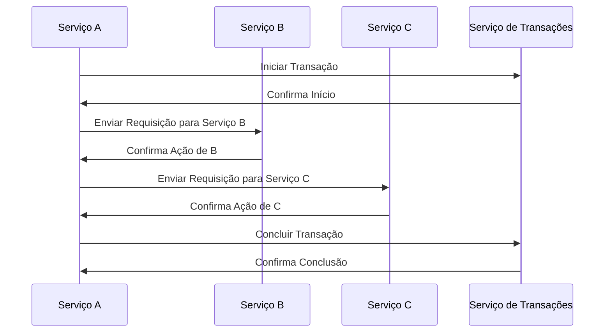
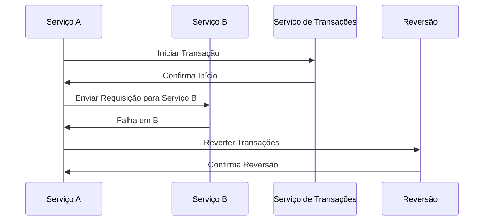
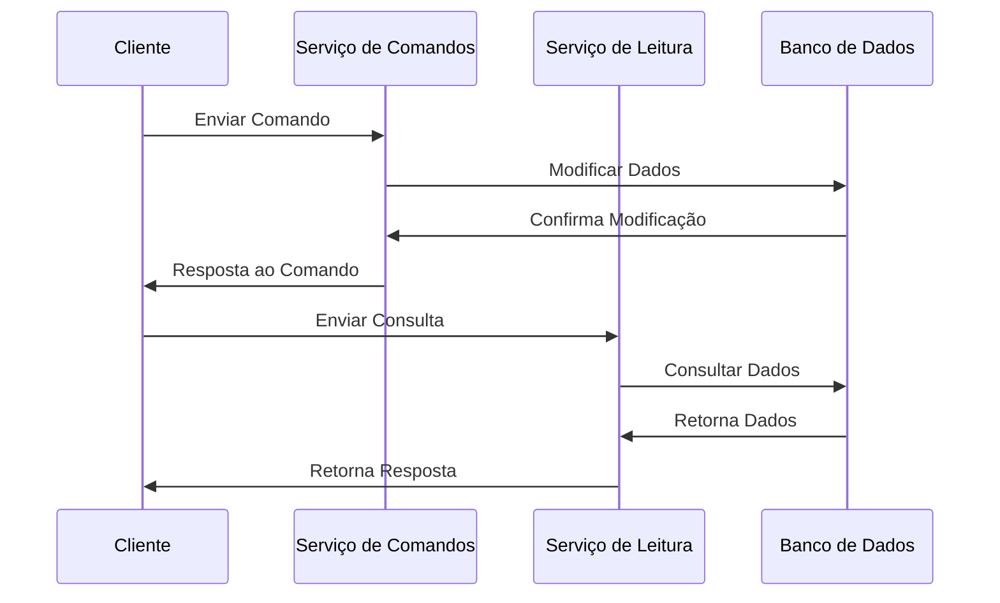
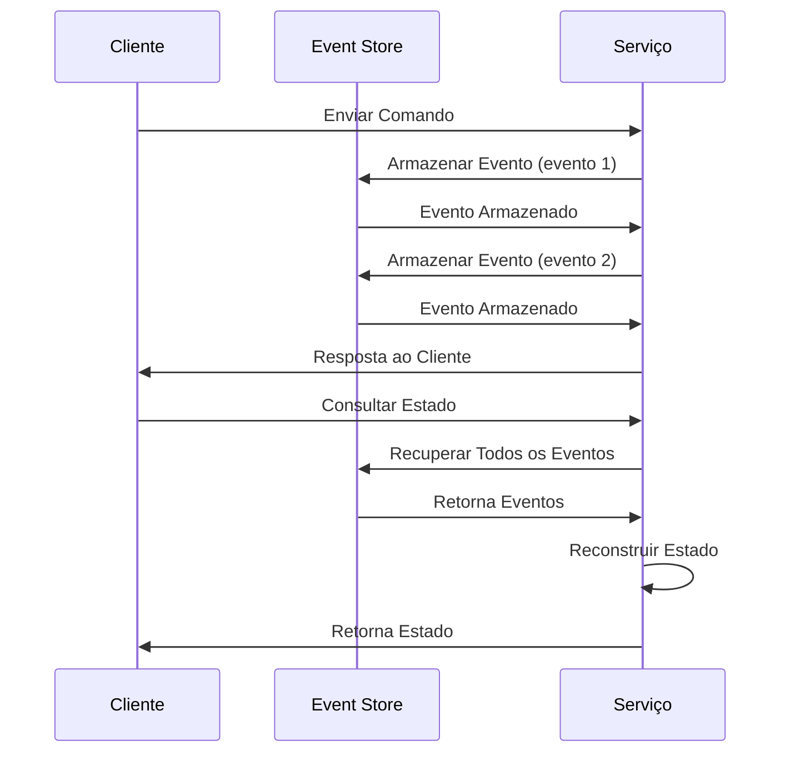
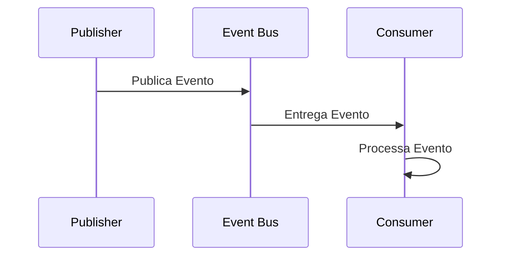
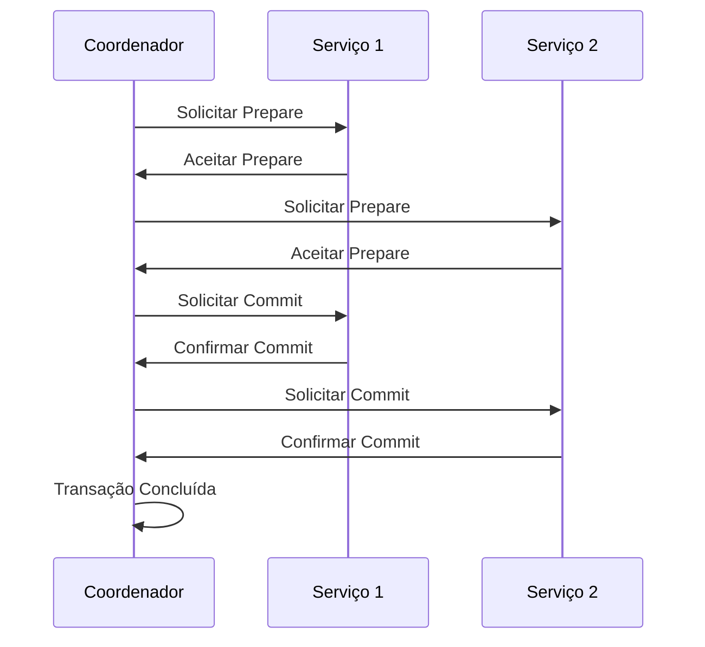
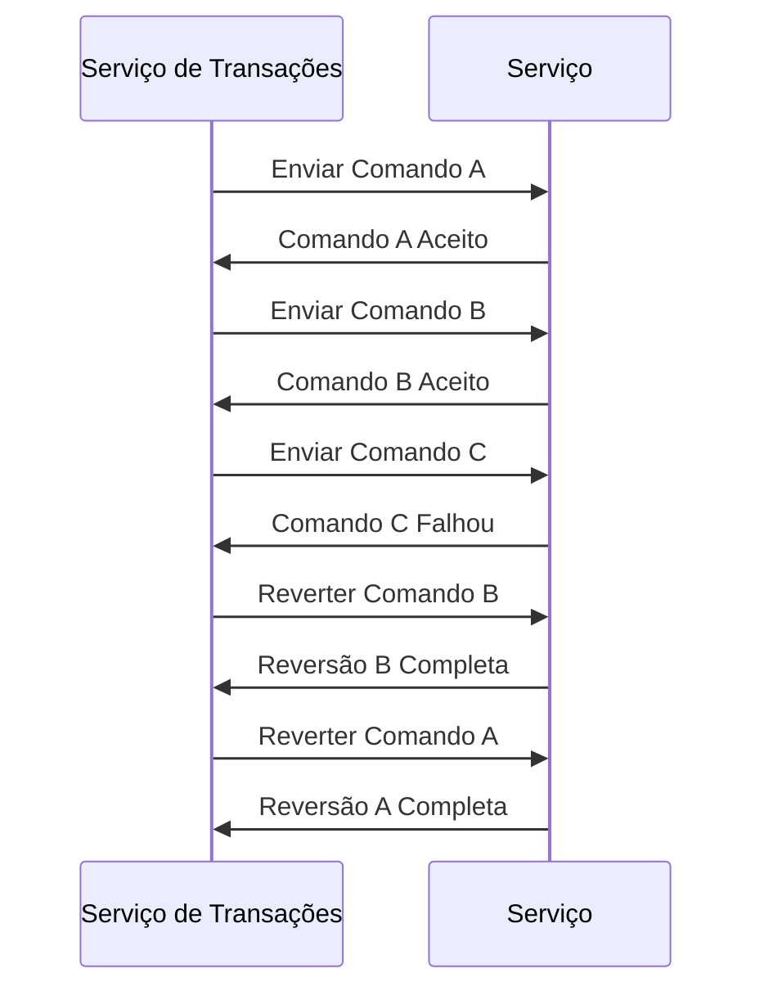

A **Gestão de Dados em Microsserviços** trata da forma como os dados são armazenados, acessados, compartilhados e sincronizados em uma arquitetura baseada em microsserviços.

Diferente das arquiteturas monolíticas, onde o banco de dados é geralmente centralizado, os microsserviços seguem o princípio de **banco de dados por serviço** (_Database per Service_), garantindo independência e autonomia.
## **Isolamento de Dados**
Cada microsserviço deve possuir seu **próprio banco de dados** ou esquema, impedindo acessos diretos de outros serviços. Isso promove:

- [ ] Autonomia
- [ ] Desacoplamento
- [ ] Escalabilidade independente
### **Consistência Eventual**
Devido ao isolamento, a consistência forte nem sempre é viável. Adota-se, então:
- [ ] **Eventual Consistency** com uso de eventos assíncronos (por exemplo, via Kafka, RabbitMQ)
- [ ] **Sagas** para coordenação de transações distribuídas
### **Responsabilidade Única**
Cada serviço gerencia apenas os dados pertencentes ao seu **domínio de negócio**, segundo o **Domain-Driven Design (DDD)**.

## Estratégias de Gestão de Dados

| Tipo                                  | Entenda                                                                                                                                                                                                                                                                                                      | Vantagens                                                                    | Desvantagens                                                                                                                        |
| ------------------------------------- | ------------------------------------------------------------------------------------------------------------------------------------------------------------------------------------------------------------------------------------------------------------------------------------------------------------ | ---------------------------------------------------------------------------- | ----------------------------------------------------------------------------------------------------------------------------------- |
| Database per Service                  | Cada microsserviço possui sua própria instância de banco de dados, com a liberdade de escolher entre: Oracle, MySQL, MariaDB, Cassandra, Redis                                                                                                                                                               | Independência tecnológica e Deploys e escalabilidade isoladas                | - Complexidade para agregações e relatórios e Gestão de transações entre serviços                                                   |
| Sincronização de Dados entre Serviços | Usamos **eventos de domínio** para replicar estados entre serviços: **Event Sourcing**: Armazenamento de eventos que representam mudanças de estado, **Change Data Capture (CDC)**: Kafka Connect + Debezium e - **Outbox Pattern**: Armazenamento de eventos no mesmo banco, publicados de forma assíncrona | Autonomia dos Serviços, Redução de Acoplamento, Resiliência e Escalabilidade | Consistência Eventual, Complexidade Operacional, Redundância de Dados, Manutenção de Integrações e Gerenciamento de Erros e Retries |

# Padrões para Integridade e Transações
## Saga Pattern
O padrão Saga é uma maneira de gerenciar transações distribuídas em sistemas, onde uma série de transações menores são realizadas e podem ser revertidas caso algo falhe.

Em caso de falha em um dos serviços, há um processo de compensação para reverter as ações anteriores:

## CQRS (Command Query Responsibility Segregation)
O CQRS separa as responsabilidades de leitura e escrita. Os comandos são usados para alterar o estado, enquanto as consultas (queries) são usadas para leitura.

## Event Sourcing
Event Sourcing envolve armazenar todos os eventos que alteram o estado do sistema, ao invés de armazenar o estado atual. O sistema reconstruí o estado através desses eventos.

## Arquitetura Orientada a Eventos (Event-Driven Architecture - EDA)
Na Arquitetura Orientada a Eventos, o sistema reage aos eventos em vez de realizar chamadas diretas entre os serviços.

Aqui, o Publisher envia eventos para um barramento de eventos (Event Bus), que então entrega esses eventos aos consumidores interessados.

## Transações Distribuídas
Em um sistema distribuído, as transações podem ser complexas devido à latência e à falha de serviços. Aqui, você pode usar abordagens como o Two-Phase Commit (2PC) ou o Three-Phase Commit (3PC).

### Two-Phase Commit (2PC):

### Compensação de Transações
Quando há falha em uma transação e a reversão das etapas anteriores é necessária, pode-se usar a compensação para desfazer as ações.

