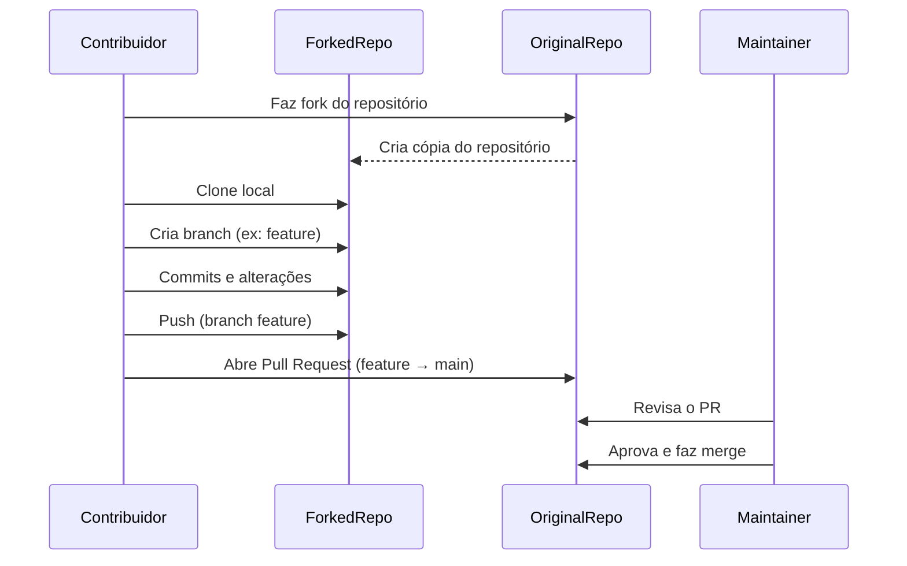
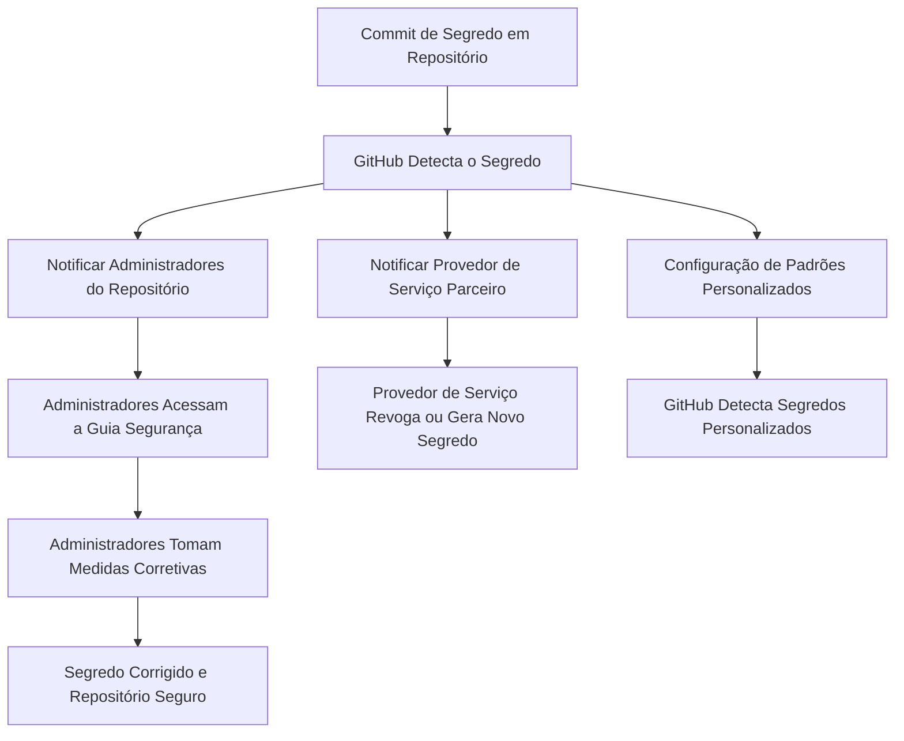

### Dica nº 1 – Não armazene suas credenciais no GitHub
A primeira coisa que você deve sempre cuidar são os seus [segredos do GitHub](https://gitprotect.io/blog/how-to-safely-store-secrets-in-github/) . Por que isso é tão vital? Porque esses dados podem ser facilmente comprometidos e, nesse caso, você pode perder não apenas os dados de acesso da sua conta pessoal, mas também todo o projeto – meses ou até anos de trabalho árduo e muito dinheiro.
O GitHub fornece varredura secreta em duas formas:
- [ ] Utilize Secrets;
- [ ] Varredura secreta de padrões de parceiros, que é executada automaticamente em repositórios públicos.
- [ ] Varredura avançada de segredos de segurança, que é uma varredura adicional para repositórios de propriedade das organizações que usam o GitHub Enterprise Cloud.
### Dica nº 2 – Restrinja e controle o acesso concedido

- [ ]  Regra de privilégio mínimo que pode protegê-lo contra acesso malicioso e erros.
### Dica nº 3 – Use equipes do GitHub

- [ ] Criar equipes para os fluxos de trabalho da sua organização.
- [ ] Conceda a cada uma dessas equipes o acesso adequado;
### Dica nº 4 – Use 2FA ou MFA
O GitHub recomenda fortemente que você habilite a autenticação de dois fatores e fornece um [código de recuperação](https://gitprotect.io/blog/github-recovery-code/) 2FA caso você perca o acesso ao telefone.

### Dica nº 5 – Gire os tokens de acesso pessoal e as chaves SSH
Você pode preferir usar tokens de acesso pessoais ou chaves SSH e desistir de usar senhas “comuns” para autenticação na sua conta do GitHub. 

No entanto, não se esqueça de que vale a pena atualizá-los regularmente. Outra boa ideia é protegê-los com uma senha ou gerar suas chaves SSH em uma chave de segurança de hardware.

### Dica nº 6 – Garanta a proteção dos ramos do código

- [ ] Permitir pushes e exclusões forçadas
- [ ] Restringir o acesso àqueles que podem enviar para os ramos correspondentes
- [ ] Ramo de bloqueio
- [ ] Verifique a revisão necessária da solicitação de pull , verificações de status e resolução de conversas antes da mesclagem
- [ ] Verificar os commits assinados necessários
- [ ] Requer histórico linear e fila de mesclagem
- [ ] Exigir que as implantações sejam bem-sucedidas antes da mesclagem
### Dica nº 7 – Não esqueça de criar um arquivo SECURITY.md

- [ ] Política de divulgação, que define o procedimento de como os usuários devem se comunicar sobre as informações descobertas e com quem eles devem entrar em contato sobre esse assunto.
- [ ] Política de atualização de segurança, que define o processo de comunicação das vulnerabilidades encontradas a terceiros.
- [ ] Configuração relacionada à segurança, que inclui as configurações que ajudam a fortalecer a postura de segurança durante a implantação do projeto.
- [ ] Melhorias futuras e lacunas de segurança conhecidas, que incluem algumas melhorias de segurança que sua organização ainda não implementou.

### Dica nº 8 – Desabilite a bifurcação
Do ponto de vista da segurança, ele tem suas desvantagens. Primeiro, o forking atrasa o processo de rastreamento de segurança e o torna um pouco mais complicado.



### Dica nº 9 – Pense duas vezes sobre qual aplicativo GitHub incluir
sua confiabilidade e se ele adota todas as medidas de segurança para manter seus dados protegidos.

### Dica nº 10 – Faça backup do seu ambiente GitHub
Backups regulares podem ajudar a resistir a diversas situações desagradáveis.

- [ ] Dados para backup – certifique-se de que inclui todos os seus repositórios e metadados do GitHub
- [ ] Escolha de armazenamento – vale a pena escolher alguns destinos de backup para armazenar seus dados
- [ ] Retenção ilimitada – que garante que seus projetos serão armazenados para sempre
- [ ] [Cumprimento da regra de backup 3-2-1](https://xopero.com/blog/en/backup-3-2-1-what-is-it-and-why-should-you-use-it-2/) – quando você tem pelo menos 3 cópias de seus dados vitais em 2 instâncias de armazenamento diferentes, uma das quais está fora do local
- [ ] [Proteção contra ransomware](https://gitprotect.io/use-cases/ransomware.html) – um conjunto de recursos que capacitará sua equipe de DevOps com a confiança de que a construção do código-fonte está bem protegida
- [ ] Criptografia – que permite criptografar os dados em trânsito e em repouso, mesmo com sua própria chave de criptografia

### Dica nº 11 – Acompanhe as atividades por meio de registros de auditoria
Use registros de auditoria para monitorar a atividade de todos os funcionários.

### Dica nº 12 – Examine seus repositórios regularmente
Varreduras regulares de vulnerabilidades e segurança de código podem trazer mais tranquilidade para você e sua organização, pois sua equipe de DevOps terá a oportunidade de detectar e resolver problemas mais rapidamente.

### Dica nº 13 – Mantenha seus repositórios privados seguros
usar repositórios públicos na sua organização, vale a pena desabilitar a criação de um.

### Dica nº 14 – Gerencie endereços IP
Conceder acesso apenas a partir do endereço IP da rede do seu escritório.

### Dica nº 15 – Verifique o código-fonte antes de importá-lo para o GitHub
Auditar partes menores pode parecer razoável.

todos os planos, como grafo de dependência e alertas do Dependabot. Outros só são executados em um modo de funcionalidade limitado em repositórios públicos. Há outros que também exigem uma licença de Segurança Avançada do GitHub para serem executado em repositórios privados.

| **Recurso**              | **Repositório público**               | **Repositório privado sem Segurança Avançada** | **Repositório privado com Segurança Avançada** |
| ------------------------ | ------------------------------------- | ---------------------------------------------- | ---------------------------------------------- |
| Varredura de código      | Sim                                   | Não                                            | Sim                                            |
| Verificação de segredo   | Sim (somente funcionalidade limitada) | Não                                            | Sim                                            |
| Análise de Dependência   | Sim                                   | Não                                            | Sim                                            |
| Visão geral de segurança | Não                                   | No                                             | Yes                                            |


![[Pasted image 20250429095158.png]]


Agora, vamos ver o mesmo ciclo de vida de desenvolvimento de software com a Segurança Avançada do GitHub.
![[Pasted image 20250429095934.png]]


![[Pasted image 20250429191804.png]]

Habilitar os recursos da Segurança Avançada do GitHub em sua instância do Enterprise Server fará com que os serviços voltados para o usuário no GitHub Enterprise Server sejam reiniciados. Você deve cronometrar essa mudança com cuidado, para minimizar o tempo de inatividade dos usuários.

- Para habilitar a varredura de código, insira `ghe-config app.minio.enabled true` seguido por `ghe-config app.code-scanning.enabled true`.
- Para habilitar a verificação de segredo, insira `ghe-config app.secret-scanning.enabled true`.
- Para habilitar o grafo de dependência, insira `ghe-config app.dependency-graph.enabled true`.

## Gerenciar o acesso a alertas de segurança

|**Tipo de alerta de segurança**|**Funções e permissões necessárias**|
|---|---|
|Alertas de varredura de código|Permissão de gravação no repositório|
|Alertas de verificação de segredo|Administradores de repositório e proprietários da organização|
|Alertas do Dependabot|Administradores de repositório e proprietários da organização|
## Definir uma política de segurança no nível do repositório
Pode adicionar um arquivo `SECURITY.md` à pasta raiz, `docs`ou `.github` do repositório do projeto. Em seguida, quando alguém cria um problema em um repositório, essa pessoa vê um link para a política de segurança do projeto.

Depois que alguém relatar uma vulnerabilidade de segurança em seu projeto, você poderá usar os Avisos de Segurança do GitHub para divulgar, corrigir e publicar informações sobre a vulnerabilidade.


A tabela seguinte explica quais pontos de extremidade estão disponíveis para cada recurso de Segurança Avançada com links para sua documentação.

| **Recurso**            | **Pontos de extremidade**                                                                                                                                                                                                                                                | **Documentação**                                                                                                                                                                           |
| ---------------------- | ------------------------------------------------------------------------------------------------------------------------------------------------------------------------------------------------------------------------------------------------------------------------ | ------------------------------------------------------------------------------------------------------------------------------------------------------------------------------------------ |
| Varredura de código    | Recupere e atualize alertas de verificação de código de um repositório.  <br>Crie relatórios automatizados para alertas de verificação de código em uma organização.  <br>Carregue os resultados da análise gerados usando ferramentas de verificação de código offline. | [API de varredura de código](https://docs.github.com/en/rest/reference/code-scanning)                                                                                                      |
| Verificação de segredo | Habilite ou desabilite a verificação de segredo de um repositório.  <br>Recupere e atualize alertas de verificação de segredo de um repositório privado.                                                                                                                 | [API de repositórios](https://docs.github.com/en/rest/reference/repos#update-a-repository)  <br>[API de verificação de segredo](https://docs.github.com/en/rest/reference/secret-scanning) |
| Análise de dependência | Habilite e desabilite alertas de dependência e o grafo de dependência de um repositório.  <br>Habilite e desabilite correções de segurança para um repositório.  <br>Exibir informações de dependência.                                                                  | [API de repositórios](https://docs.github.com/en/rest/reference/repos)  <br>[API GraphQL](https://docs.github.com/en/graphql)                                                              |


```yaml
name: Create issue on commit

on: [ push ]

jobs:
  create_commit:
    runs-on: ubuntu-latest
    permissions:
      issues: write
    steps:
      - name: Create issue using REST API
        run: |
          curl --request POST \
          --url http(s)://[hostname]/api/v3/repos/${{ github.repository }}/issues \
          --header 'authorization: Bearer ${{ secrets.GITHUB_TOKEN }}' \
          --header 'content-type: application/json' \
          --data '{
            "title": "Automated issue for commit: ${{ github.sha }}",
            "body": "This issue was automatically created by the GitHub Action workflow **${{ github.workflow }}**. \n\n The commit hash was: _${{ github.sha }}_."
            }' \
          --fail
```

## Verificação de Segredo




A lista dos provedores e padrões que o GitHub detecta automaticamente em repositórios públicos e privados, confira os [Padrões de verificação secretos](https://docs.github.com/code-security/secret-scanning/secret-scanning-patterns)

## Proteção por push
Alertas de verificação secretos para usuários estão disponíveis gratuitamente em todos os repositórios públicos. As organizações com uma licença do GitHub Advanced Security também podem habilitar a verificação secreta em seus repositórios privados e internos.

## Excluir arquivos da verificação
Criar um arquivo `.github/secret_scanning.yml` no seu repositório que exclua alguns diretórios da verificação.

- [ ] Se houver mais de 1.000 entradas em `paths-ignore`, a verificação de segredo excluirá apenas os 1.000 primeiros diretórios das verificações.
- [ ] Se `secret_scanning.yml` for maior que 1 MB, a verificação de segredo ignorará o arquivo inteiro.
## Responder a um alerta

- [ ] Exclua o token comprometido, crie um token e atualize todos os serviços que usam o token antigo.
- [ ] Para todos os outros segredos, primeiro verifique se o segredo com o commit feito no GitHub é válido. Nesse caso, crie um novo segredo, atualize todos os serviços que usam o segredo antigo e exclua o segredo antigo.
## Criar um padrão personalizado
Podemos definir padrões personalizados de verificação de segredo em sua empresa, organização ou repositório privado. A verificação de segredo dá suporte a até **500 padrões** personalizados para cada organização ou conta empresarial e até **100 padrões** personalizados por repositório privado.


```
name: Analyze PL/SQL with SonarQube

on:
 workflow_dispatch:
jobs:
  sonarqube-analysis:
    runs-on: ubuntu-latest
    steps:
      - name: Checkout code
        uses: actions/checkout@v4

      - name: Set up Java
        uses: actions/setup-java@v3
        with:
          java-version: '17'

      - name: Run SonarQube scanner
        env:
          SONAR_TOKEN: ${{ secrets.SONAR_TOKEN }}
        run: |
          wget https://binaries.sonarsource.com/Distribution/sonar-scanner-cli/sonar-scanner-cli-5.0.1.3006-linux.zip
          unzip sonar-scanner-cli-5.0.1.3006-linux.zip
          export PATH=$PATH:$PWD/sonar-scanner-5.0.1.3006-linux/bin
          sonar-scanner \
            -Dsonar.projectKey=SEU_PROJETO \
            -Dsonar.sources=. \
            -Dsonar.host.url=https://SEU_SONARQUBE \
            -Dsonar.login=$SONAR_TOKEN \
            -Dsonar.language=plsql

```

O que o CodeQL faz pela primeira vez ao criar um banco de dados? Extrai uma única representação relacional de cada arquivo de origem.
Qual é o formato do comando para criar e analisar um banco de dados CodeQL da CLI? `codeql [command] [subcommand]`
O que é um extrator? Uma ferramenta que produz os dados relacionais.

As operações de pesquisa internas da CLI fazem qual das seguintes operações?

Por padrão, qual nível de gravidade causa uma falha de verificação de solicitação de pull durante a verificação de código? `Error`

Qual é uma maneira de otimizar os tempos de execução de análise de CodeQL? Aumente a memória.
