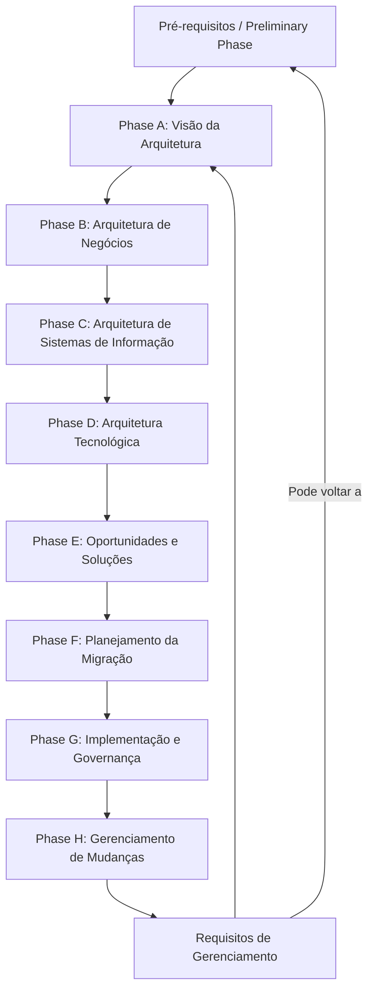
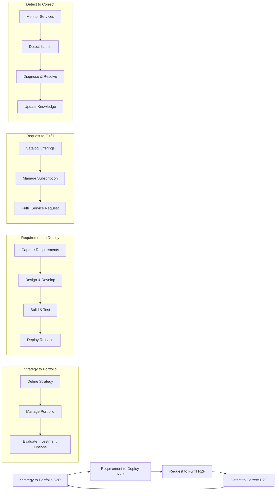
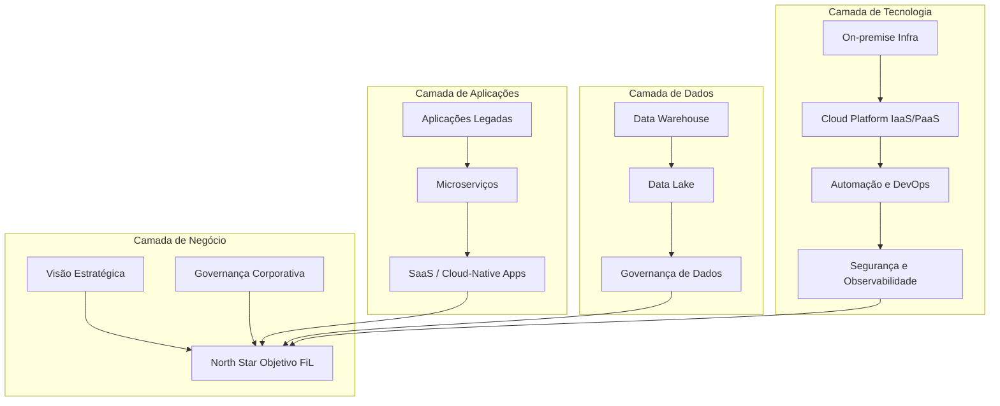
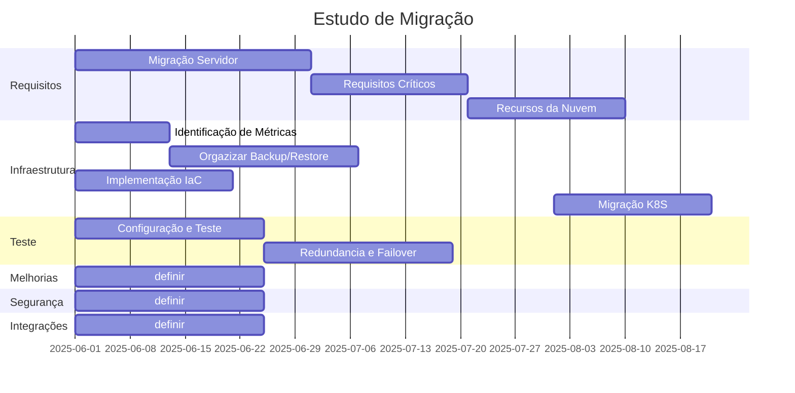

Computação em Nuvem é um modelo de entrega de serviços de TI sob demanda via internet, onde recursos como servidores, armazenamento, bancos de dados, redes, softwares, inteligência artificial e análises são disponibilizados de forma escalável, flexível e paga conforme o uso.
### **Origem do Conceito**
A ideia central da computação em nuvem remonta à **década de 1960**, com visões de compartilhamento de recursos computacionais:

- [ ] **J.C.R. Licklider** (1960s): Cientista da ARPA que idealizou uma rede interconectada ("Intergalactic Computer Network"), base do que viria a ser a internet.
- [ ] **Termo "Cloud"**: Surgiu nos anos 1990 como metáfora para a internet (representada por uma nuvem em diagramas de rede).
- [ ] **John McCarthy** (1927–2011) foi um cientista da computação pioneiro, conhecido por:
   - [ ] **Visão da Computação como Utility** (1961): Em um discurso no MIT, ele propôs que a computação poderia ser organizada como um **serviço público**, semelhante à eletricidade ou água, onde usuários pagariam apenas pelo que consumissem.
### **CAPEX vs OPEX**

- [ ] CapEx é a abreviação de Capital Expenditures ou "Despesas de Capital". Essas despesas consistem nos fundos que as empresas usam para comprar os principais bens físicos ou serviços que a empresa usará (geralmente) por mais de um ano.
	- [ ] Uma vez que o ativo está sendo usado, ele é depreciado ao longo do tempo para distribuir o custo do ativo ao longo de sua vida útil. Em outras palavras, a cada ano, uma parte do ativo fixo está sendo "consumida" ou "depreciada".
	- [ ] A depreciação representa o grau de desgaste de um ativo. As empresas podem deduzir o valor da depreciação em sua declaração anual de impostos.
	- [ ] Em alguns casos, pode ser conhecido como custos "Up-Front". Ou seja, a empresa precisa pagar ou adquirir um equipamento antes de usá-lo.

- [ ] OpEx é a abreviação de Operational Expenditures ou "Despesas Operacionais". Refere-se às despesas que uma empresa incorre em suas operações diárias.
	- [ ] Como as despesas operacionais constituem a maior parte dos custos contínuos de uma empresa, a administração normalmente procura maneiras de reduzir seu OPEX sem causar uma queda crítica na qualidade ou na produção.
	- [ ] As despesas operacionais são deduzidas integralmente na declaração anual de impostos, no período em que foram incorridas.

| **Aspecto**            | **CAPEX (Despesas de Capital)**                                                                         | **OPEX (Despesas Operacionais)**                                                                                            |
| ---------------------- | ------------------------------------------------------------------------------------------------------- | --------------------------------------------------------------------------------------------------------------------------- |
| **Definição**          | Gastos com aquisição de ativos físicos ou investimentos de longo prazo.                                 | Gastos recorrentes com operações diárias, serviços ou recursos consumidos durante o uso.                                    |
| **Exemplos**           | Compra de servidores físicos  Aquisição de licenças de software perpétuas   Data centers próprios | Pagamento mensal por serviços de nuvem (OCI, GCP, AWS, Azure)   Modelo "pay-as-you-go"   Custos de manutenção de SaaS |
| **Impacto Financeiro** | Alto custo inicial   Ativo registrado no balanço patrimonial   Depreciação ao longo do tempo      | Custo variável conforme o uso   Despesa operacional (dedutível imediatamente)   Sem depreciação                       |
| **Flexibilidade**      | Menos flexível (investimento fixo)   Risco de obsolescência tecnológica                              | Alta flexibilidade (escala conforme demanda)   Atualizações automáticas e sem custo adicional                            |
| **Escalabilidade**     | Requer planejamento prévio para expansão   Limitações físicas (espaço, energia, hardware)            | Escalabilidade elástica (aumento/redução de recursos em minutos)                                                            |
| **Responsabilidade**   | Empresa responsável por manutenção, upgrades e segurança física                                         | Provedor de nuvem gerencia infraestrutura, segurança e atualizações                                                         |
| **Benefício Fiscal**   | Depreciação do ativo ao longo de anos (redução gradual do impacto fiscal)                               | Dedução fiscal imediata (100% do custo como despesa operacional no ano)                                                     |
| **Cenários de Uso**    | Cargas de trabalho previsíveis e estáveis   Requisitos regulatórios de infraestrutura local          | Demanda variável   Startups ou empresas que buscam redução de custos iniciais   - Inovação ágil                       |

### **Comparação Direta na Nuvem**

| **Característica**       | **CAPEX (Modelo Tradicional)**                                      | **OPEX (Cloud Computing)**                                    |
| ------------------------ | ------------------------------------------------------------------- | ------------------------------------------------------------- |
| **Custo Inicial**        | Alto investimento em hardware, licenças e infraestrutura.           | Baixo ou nenhum custo inicial (pago conforme o uso).          |
| **Alocação de Recursos** | Recursos fixos (subutilização ou falta de capacidade comum).        | Recursos sob demanda (evita desperdício).                     |
| **Inovação**             | Lentidão para adotar novas tecnologias (ciclos longos).             | Acesso imediato a tecnologias emergentes (ex.: IA, Big Data). |
| **Risco Financeiro**     | Alto risco de investimento em ativos que podem se tornar obsoletos. | Risco reduzido (custos alinhados ao crescimento do negócio).  |

### **Planejamento de Negócios**
É avaliar os níveis de serviço e os indicadores de desempenho de aplicativos e sistemas de TI.

| Indicador                         | Métrica Exemplo                   | Objetivo                                                                                                                                                               |
| --------------------------------- | --------------------------------- | ---------------------------------------------------------------------------------------------------------------------------------------------------------------------- |
| **Disponibilidade**               | 99.99%                            | Minimizar tempo de inatividade. Refere-se ao tempo em que o serviço está operacional e acessível. Quanto maior o número de "9s", menor o tempo de inatividade por ano. |
| **Durabilidade**                  | 99.999999999% (11 9s)             | Evitar perda de dados. Probabilidade de perda de dados ao longo do tempo.                                                                                              |
| **Backup**                        | Diariamente, RPO de 15min         | Garantir recuperação de dados históricos. Frequência dos backups, Tipo(incremental, completo, diferencial),                                                            |
| **RTO(Recovery Time Objective)**  | 2 horas                           | Tempo máximo para retomada do serviço após falha. Quanto tempo o sistema pode ficar fora do ar antes de impactar criticamente o negócio.                               |
| **RPO(Recovery Point Objective)** | 15 minutos                        | Perda máxima aceitável de dados.  Quanto de dados (em tempo) pode ser perdido após uma falha. Se o RPO for 15 min, backups devem ocorrer ao menos a cada 15 minutos.   |
| **BC(Business Continuity)**       | Alta disponibilidade, redundância | Manutenção da operação durante eventos críticos                                                                                                                        |
| **DR (Short Distance)**           | < 1 min failover                  | Alta disponibilidade dentro de uma mesma região                                                                                                                        |
| **DR (Long Distance)**            | Failover em horas                 | Garantia de recuperação mesmo com desastre em região inteira                                                                                                           |

### Modelos de Serviços

| Modelo                            | Entenda                                                                                                                                               |
| --------------------------------- | ----------------------------------------------------------------------------------------------------------------------------------------------------- |
| IaaS(Infrastructure as a Service) | As empresas realizam um "lift and shift" de suas máquinas (virtuais) para recursos hospedados na nuvem.                                               |
|                                   | Provedor de nuvem gerenciará apenas a infraestrutura para o cliente: rede, armazenamento, computação e a camada de virtualização.                     |
| PaaS (Platform as a Service)      | Provedores de nuvem assumem maior responsabilidade sobre os recursos, agora incluindo sistemas operacionais e middleware.                          |
| SaaS(Software as a Service)       | Provedor de nuvem gerencia tudo na pilha de software, desde a infraestrutura até o aplicativo em si, com todos os seus componentes, incluindo dados.  |
| FaaS (Function as a Service")     | Um serviço de nuvem que permite o desenvolvimento e o gerenciamento de aplicativos de computação sem servidor.                                        |
|                                   | Os devs podem programar serviços sem se preocupar em configurar e manter um servidor: isso fica a cargo do provedor de nuvem.                         |
| CaaS (Container as a Service)     | As empresas gerenciar e implementar aplicações em contêineres, proporcionando soluções portáteis e escaláveis.                                        |
| CaaS(Credit as a Service)         | É um modelo financeiro que permite a empresas oferecer crédito como um serviço, sem a necessidade de operar como bancos tradicionais.                 |
| XaaS (Anything as a Service)      | Termo usado para expressar a ideia de que os usuários podem ter tudo como um serviço.                                                              |
|                                   | O conceito é amplamente difundido, por exemplo, com Hardware como Serviço (HaaS), Desktop como Serviço (DaaS) ou Banco de Dados como Serviço (DBaaS). |

### Analogia ao Telefone Móvel
Não precisa se preocupar com atualizações, sistema operacional será atualizado automaticamente, maioria dos aplicativos instalados continuará funcionando perfeitamente e caso não funcione, imediatamente, logo/logo estará em funcionamento.

### **Modelos de Cloud Public**
São provedores que oferecem serviços de TI sob demanda a partir de plataformas centralizadas que utilizam a internet pública.
##### **Public Cloud**
A **nuvem pública** é um modelo de computação em nuvem onde os recursos (servidores, armazenamento, redes, etc.) são disponibilizados por um **provedor terceirizado** via internet, sendo compartilhados entre múltiplos clientes ("multi-tenancy").

Os usuários **pagam apenas pelo que configuram**, sem necessidade de investir em infraestrutura física.

- [ ] A nuvem pública é **100% operacional** (OPEX), pois os custos são recorrentes e baseados no uso (ex.: pagamento mensal por horas de servidor ou GB armazenados).

##### **Vantagens Financeiras e Operacionais**

| **Característica** | **Descrição**                                                           |
| ------------------ | ----------------------------------------------------------------------- |
| **Flexível**       | Adaptação rápida a necessidades variáveis sem custos fixos.             |
| **Escalável**      | Expansão ou redução automática de recursos conforme a demanda.          |
| **Resiliente**     | Alta disponibilidade e recuperação de desastres sem intervenção manual. |

- [ ] **Redução de CAPEX**: Elimina investimentos em hardware, licenças perpétuas e data centers próprios.
- [ ] **Custo variável**: Pague apenas pelo uso real (ideal para empresas com demanda flutuante).
- [ ] **Foco no core business**: A empresa não precisa gerenciar infraestrutura, apenas consumir serviços

##### **Hybrid Cloud**
A **Nuvem Híbrida** é um ambiente de computação em nuvem que combina infraestrutura **local (on-premises)**, **nuvem privada** (geralmente dedicada a um único cliente) e **nuvem pública**, permitindo que dados e aplicações sejam compartilhados entre elas.
O objetivo é equilibrar controle, segurança, custos e flexibilidade, usando cada ambiente para cargas de trabalho específicas.
##### **Vantagens Financeiras e Operacionais**

| **Característica** | **Descrição**                                                                  |
| ------------------ | ------------------------------------------------------------------------------ |
| **Flexível**       | Movimentação dinâmica de cargas entre ambientes conforme necessidades.         |
| **Escalável**      | Expansão temporária de recursos na nuvem pública sem investimento local.       |
| **Resiliente**     | Alta disponibilidade através de redundância entre ambientes locais e na nuvem. |

- [ ] **Controle e conformidade**: Dados sensíveis permanecem on-premises ou em nuvem privada, atendendo a regulamentações (ex.: LGPD, GDPR).
- [ ] **Otimização de custos**: Uso da nuvem pública apenas para demandas variáveis, reduzindo CAPEX em hardware.
- [ ] **Inovação gradual**: Migração de aplicações legadas para a nuvem pública sem abandonar investimentos locais.
- [ ] **Setores regulamentados**: Saúde, finanças ou governo (exige controle de dados).
- [ ] **Cargas de trabalho mistas**: Algumas aplicações exigem baixa latência (local), enquanto outras precisam de escalabilidade (nuvem pública).
- [ ] **Transição para a nuvem**: Empresas em processo de migração que não podem abandonar infraestrutura legada rapidamente.
- [ ] **Pode ser vista**, como uma ponte entre o **controle tradicional** e a **agilidade da nuvem pública**, ideal para organizações que buscam equilibrar segurança, custos e inovação.

###  **Private Cloud**
A **Nuvem Privada** é um ambiente de computação em nuvem dedicado exclusivamente a uma única organização. Pode ser hospedado **on-premises** (no data center local) ou por um provedor terceirizado, mas os recursos não são compartilhados com outros usuários ("single-tenancy"). Oferece maior controle, segurança e personalização em comparação com a nuvem pública.

##### **Vantagens Financeiras e Operacionais**
A Private Cloud **prioriza CAPEX**, mas pode incluir OPEX dependendo do modelo:

- [ ] **CAPEX**: Investimento em hardware, licenças de software e infraestrutura física (ex.: servidores locais).
- [ ] **OPEX**: Custos recorrentes se a nuvem privada for hospedada por um provedor terceirizado (ex.: manutenção, atualizações).

| **Característica** | **Descrição**                                                          |
| ------------------ | ---------------------------------------------------------------------- |
| **Flexível**       | Adaptação completa a requisitos técnicos e regulatórios.               |
| **Escalável**      | Expansão limitada pela infraestrutura física ou contrato com provedor. |
| **Resiliente**     | Disponibilidade garantida por redundância controlada internamente.     |

- [ ] **Segurança avançada**: Dados sensíveis não são compartilhados com terceiros.
- [ ] **Conformidade**: Adequação a leis locais (ex.: GDPR, LGPD) e setores regulados (saúde, governo).
- [ ] **Desempenho previsível**: Latência controlada e recursos dedicados para aplicações críticas.
- [ ] **Dados altamente confidenciais**: Setores como defesa, saúde ou finanças.
- [ ] **Aplicações legadas**: Sistemas que dependem de arquiteturas não compatíveis com nuvem pública.
- [ ] **Controle total**: Organizações que não podem delegar gestão de infraestrutura a terceiros.

Em resumo: Na maioria das implantações em nuvem, o cliente realmente paga apenas pelo que está **usando/configurado**. Se os recursos ficarem ociosos, eles podem ser desligados e os custos cessarão. Possivelmente você não desliga instâncias de sistemas ERP, para esses sistemas, as empresas provavelmente usarão recursos mais **stateful, como instâncias reservadas que são fixas por um período mais longo**.
Para provedores de nuvem, isso significa uma fonte estável de renda por um período mais longo e, portanto, eles oferecem instâncias reservadas contra tarifas mais baixas ou para aplicar descontos. Para encurtar a história, a nuvem não é OpEx por padrão.
### Multi-cloud
Multi-cloud é um tema em alta entre as empresas. A maioria delas já adota multi-cloud, Software como Serviço (SaaS), como o Office 365 da Microsoft.
Multicloud refere-se ao uso de dois ou mais sistemas de computação em nuvem simultaneamente . A
implantação pode usar nuvens públicas, nuvens privadas ou uma combinação das duas. As implantações
multi-cloud visam oferecer redundância em caso de hardware/falhas de software e evitar dependência de fornecedores.

Fica claro que ele é dominado por alguns grandes players, ou seja, os mencionados anteriormente: AWS, Microsoft Azure e GCP, no entanto, há o surgimento diversos provedores, motivados por questões geográfico, e  regras de conformidade (Alguns não estão autorizados a utilizar, por exemplo, provedores de nuvem americanos ou o provedor deve ter presença local no país). Alibaba Cloud e Tencent (China),Gaia-X, IBM Cloud, Fujitsu.
## Definições
Mas a simples funcionalidade de combinar soluções e serviços de diferentes provedores de nuvem e/ou nuvens privadas não constitui por si só o conceito de multi-cloud.

| Definição   | Entenda                                                                                                                                                                                                                                                                                                                                                                                                                                                                                          |
| ----------- | ------------------------------------------------------------------------------------------------------------------------------------------------------------------------------------------------------------------------------------------------------------------------------------------------------------------------------------------------------------------------------------------------------------------------------------------------------------------------------------------------ |
| Híbrido     | Combina o Local com o Cloud                                                                                                                                                                                                                                                                                                                                                                                                                                                                      |
| Multi-Cloud | Combina dois ou mais provedores de nuvem.                                                                                                                                                                                                                                                                                                                                                                                                                                                        |
| Privado     | Recursos dedicados a uma empresa ou usuário. apenas para usuários selecionados, e não para o público em geral.                                                                                                                                                                                                                                                                                                                                                                                |
| Público     | Os recursos são compartilhados (observe que isso não significa que qualquer pessoa tenha acesso aos seus dados. Na nuvem pública, teremos locatários separados, mas esses locatários compartilharão recursos, por exemplo, na rede). é definida como serviços de computação oferecidos por provedores terceirizados pela internet pública, disponibilizandoos a qualquer pessoa que queira usá-los ou adquiri-los. AWS, Microsoft Azure, GCP, Oracle Cloud Infrastructure e Alibaba Cloud, |
**Nasce a TI híbrida**: O uso de sistemas privados em data centers privados para sistemas de produção críticos que hospedam aplicativos com dados confidenciais que precisam estar on-premises por motivos de latência, enquanto a nuvem pública é usada para permitir o desenvolvimento rápido e ágil de novos aplicativos.

Duas razões óbvias para o híbrido — uma mistura entre as nuvens públicas e privadas — são
a segurança e a latência.  que muitas empresas já tinham ambientes locais antes

- [ ] Segurança: Trata-se de dados sensíveis e privacidade, especialmente no que diz respeito a dados que não podem ser hospedados fora de um país ou de determinadas fronteiras regionais.
- [ ] Latência: Manter os sistemas no local. Um exemplo com o qual provavelmente todos se identificam são os servidores de impressão. Problema com servidores de impressão é o processo de spool. _Servidores_ de impressão na nuvem pública podem causar atrasos nesse processo.

_Não é_ tão útil ter uma estratégia de nuvem totalmente pública, nuvem em primeiro lugar ou somente nuvem para diversas empresas e instituições.

Todas essas empresas descobriram que o desenvolvimento de aplicativos era muito mais ágil na nuvem pública.
### Método de Desenvolvimento de Arquitetura
O princípio básico do Método de Desenvolvimento de Arquitetura é o BDAT: o ciclo de negócios, dados, aplicações e tecnologia.

Um único provedor pode não ser capaz de fornecer todos os serviços necessários, por isso, essas empresas buscam soluções multi-nuvem e de ponta para atender a esses requisitos.

- [ ] Reunindo requisitos para multi-cloud
	- [ ] Qual será o valor agregado do uso da tecnologia de nuvem para os negócios?
	- [ ] As empresas não migram para a nuvem porque podem, mas porque a tecnologia de nuvem pode lhes trazer benefícios
- [ ] Identificar requisitos
	- [ ] Segurança
	- [ ] Interoperabilidade, Configurabilidade, Desempenho, Desempenho, Portabilidade, Usabilidade.
	- [ ] Prevenção do aprisionamento tecnológico;
- [ ] As assinaturas são flexíveis por padrão: os clientes podem assinar, alterar assinaturas, suspendê-las, interrompê-las e reativá-las. Isso requer plataformas e sistemas que suportem essa flexibilidade.
### Definindo uma Arquitetura
O arquiteto corporativo coleta requisitos de negócios que sustentam a estratégia geral de negócios e os traduz em uma arquitetura que permite aos arquitetos de soluções desenvolver soluções para entregar produtos e serviços.
A arquitetura se torna mais uma arquitetura "flutuante", evoluindo à medida que o desenvolvimento do produto
evolui e as compilações são executadas de forma iterativa.

- [ ] **VOC (Voice of Customer**) é a "voz do cliente", representando as suas necessidades e expectativas.
- [ ] **QFD (Quality Function Deployment)** visa transformar as necessidades do cliente em especificações técnicas, garantindo que o produto final atenda às expectativas.
- [ ] **HOQ (House of Quality)** ajuda a identificar e priorizar as necessidades do cliente, e a relacioná-las com as características técnicas do produto.
### Desafios de negócios da multi-cloud
Uma empresa que planeja a transformação digital deve criar um roteiro abrangente que inclua a organização da transformação, a avaliação do modo atual de operações e do cenário de TI e, em seguida, mapear os serviços de TI elegíveis para a transformação.

- [ ] Qual é a melhor solução para um serviço específico?
- [ ] Quais são os benefícios de migrar aplicativos para a nuvem?
### Preparando o cenário para a transformação
**Metamorfose Empresas**: Não se trata mais apenas de adquirir uma solução e implantá-la. Não se trata de uma simples solução de software. É você mesmo pensando no seu futuro como uma empresa digital.

- [ ] Defina um catálogo de todos os aplicativos e tecnologias utilizados, incluindo os procedimentos operacionais;
- [ ] Pense em gestão de incidentes, problemas, mudanças e configurações.
- [ ] Liste os níveis de serviço em que os serviços são entregues à empresa;
- [ ] Mapeie este catálogo para um catálogo em nuvem;
- [ ] Não basta servir ao negócio. É preciso ser (a alma) do negócio.

#### Mudança para uma economia baseada em assinaturas
- [ ] A economia moderna está migrando de modelos baseados em propriedade (CaPEx) para modelos baseados em assinatura(OpEx);
- [ ] As assinaturas vêm com novos modelos de pagamento, como os conceitos de **pagamento por
utilização (PAYG - Pay as you go)** e **freemium** (é um modelo de negócio baseado na criação e disponibilização de um produto ou serviço gratuito, porém, conforme o usuário avança em sua jornada de consumo ou o objeto da relação não supre mais a demanda adequadamente, a empresa disponibiliza uma opção paga que conta com funcionalidades extras ou recursos mais avançados.);
- [ ] Os consumidores podem ter serviços em qualquer dispositivo a qualquer hora e em qualquer lugar que desejarem;
- [ ] Não se trata mais de uma venda única, e os clientes podem, de fato, fazer algo com a assinatura: ela pode ser pausada, alterada, suspensa, renovada ou interrompida completamente.
- [ ] **Dados são a chave**.
	- [ ] Não se trata apenas de dados brutos aos quais uma empresa (pode) ter acesso, mas também de analisar esses dados.
	- [ ] Onde estão meus clientes?
	- [ ] Quais são as suas demandas?
	- [ ] Em que circunstâncias essas demandas são válidas e o que as faz mudar?
	- [ ] Como posso responder a essas mudanças?
	- [ ] Quanto tempo eu teria para atender às demandas iniciais e aplicar essas mudanças, se necessário?
	- [ ] Como podemos disponibilizar essas fontes para uma empresa — de forma segura, respeitando a confidencialidade, a privacidade e outras normas de conformidade.

#### Planejamento de longo prazo
- [ ] Onde a empresa quer estar daqui a 5 anos?
	- [ ] Qual a visão ou como determinar como o mercado se desenvolverá e como a empresa pode antecipar as mudanças?
		- [ ] Os dados são absolutamente essenciais, mas a rapidez com que as empresas podem mudar de rumo.
- [ ] Estrutura financeira
	- [ ] Como os custos estão relacionados aos diferentes domínios de negócios, divisões da empresa e seus ativos?
	- [ ] Como você pode identificar com precisão quanto custo uma empresa gera em termos de consumo de TI?
	- [ ] Quando os negócios crescem, o consumo de TI pode aumentar e quando caem, os sistemas em nuvem podem ser reduzidos e, com isso, geram custos mais baixos, enquanto a TI tradicional é muito mais estática.
#### Adaptando a tecnologia de nuvem
- [ ] Ao terceirizar contratos, a empresa que assume os serviços realiza a chamada due diligence (uma avaliação abrangente de um negócio realizada por um **potencial comprador ou provedor de nuvem**, especialmente para estabelecer seus ativos e passivos e avaliar seu potencial comercial");
- [ ] Plataformas de nuvem pública oferecem calculadoras de Custo Total de Propriedade (TCO).
	- [ ] Custos associados a toda a equipe que trabalha na infraestrutura e nos aplicativos de TI:
		- [ ] Isso inclui contratados e funcionários de fornecedores terceirizados que trabalham nesses sistemas.
	- [ ] Todas as licenças e custos associados ao suporte de um fornecedor ou de terceiros para sistemas;
		- [ ] Os custos sejam alocados a um processo de negócios específico, divisão ou até mesmo grupo de usuários, para que fique evidente de onde vêm os custos das operações de TI.
	- [ ] **Cost of Delay - CoD (Custo do Atraso)**: Quanto valor (normalmente monetário) é perdido por não entregar uma funcionalidade, projeto ou produto dentro do tempo ideal. Custo do atraso é o risco de perder o impulso porque as mudanças não foram adotadas em tempo hábil;
	- [ ] **Benefício da oportunidade**:  Em acelerar os negócios explorando desenvolvimentos futuros e tecnologias relacionadas.
- [ ] **Planejamento técnico**: Os principais provedores de nuvem têm arquiteturas de referência, melhores práticas e casos de uso que ajudarão você a planejar e construir a base, garantindo que você possa incorporar novos componentes e soluções quase o tempo todo.
- [ ] **Fluxos de valor do IT4IT**: O portfólio é a gestão de projetos para alinhar o negócio e a TI.
	- [ ] Na criação e implementação de novos serviços ou na adaptação de serviços existentes, a fim de atingir um padrão de qualidade mais elevado ou obter um nível;
	- [ ] Em termos simples, este fluxo de valor visa facilitar a vida dos clientes finais dos serviços implantados. de custo mais baixo.
	- [ ] Fluxo permite o monitoramento, o gerenciamento, a correção e outros aspectos operacionais que impulsionam essas mudanças;

- [ ] Há três aspectos importantes que devem ser considerados ao gerenciar a arquitetura de nuvem:
	- [ ] Arquitetura de base;
	- [ ] Custo do atraso;
	- [ ] Benefício da oportunidade
- [ ] Estratégia de nuvem
	- [ ] **Software para serviços**: Software totalmente gerenciado por provedores externos.
		- [ ] Baseia-se na teoria econômica do crescimento endógeno, que afirma que o crescimento econômico pode ser alcançado por meio do desenvolvimento de novas tecnologias e melhorias na eficiência da produção. Usando PaaS e SaaS, essa eficiência pode ser significativamente acelerada.
	- [ ] **VM para contêiner**: A virtualização trouxe muita eficiência aos data centers, _os contêineres são ainda mais eficientes no uso de capacidade computacional e armazenamento.
	- [ ] **Computação sem servidor**: Escrever e implantar código sem se preocupar com a infraestrutura subjacente. Os desenvolvedores pagam apenas pelo que usam, como capacidade de processamento ou armazenamento.

- [ ] Você precisa saber de onde vem para definir para onde vai.
- [ ] Como os aplicativos devem ser migrados para a plataforma?
- [ ] Quem são todas as partes interessadas que precisam estar envolvidas nas atividades?
- [ ] Quais são os motivadores para iniciar a transição e a transformação para uma plataforma de nuvem?
- [ ] A organização está pronta para começar a trabalhar nesse modelo?
- [ ] Prontidão organizacional.
	- [ ] **Defina o escopo**: Quais são as funções de negócio que se beneficiariam de uma transformação e do uso da tecnologia em nuvem?
	- [ ] Quais soluções precisamos para implementar a infraestrutura na nuvem?
	- [ ] Os aplicativos estão prontos para a nuvem?
	- [ ] Podem ser migrados para a infraestrutura de nuvem? Ou precisamos refatorar, replataformar ou até mesmo redesenhar os aplicativos antes de poder hospedá-los na nuvem?
	- [ ] Qual seria o esforço para tornar os aplicativos prontos para a nuvem?
	- [ ] Quais políticas de segurança estão em vigor e como elas se aplicam à nuvem?
	- [ ] As políticas existentes incluem declarações de conformidade e, em caso afirmativo, as soluções em nuvem aderem a essas regras de conformidade?
- [ ] Acompanhando a inovação
	- [ ] Como as empresas acompanham todas as inovações?
		- [ ] Os serviços precisam estar alinhados com a ambição,a estratégia e os objetivos do negócio.
		- [ ] O desafio de toda inovação é questionar qual benefício ela trará aos clientes de uma empresa e qual valor agregado está envolvido?
		- [ ] Está melhorando a experiência do cliente?
		- [ ] Deixará os clientes mais felizes?
		- [ ] Está melhorando a sustentabilidade da empresa e/ou da sociedade em geral?
		- [ ] Dada a ambição geral do negócio, vale a pena o investimento e como isso impactará o desempenho financeiro?
		- [ ] Inovações que causam alterações nos sistemas podem levar a falhas e até mesmo à indisponibilidade dos sistemas, resultando em muito trabalho extra para eles.
	- [ ] Arquitetura North Star.

![[Pasted image 20250512182610.png]]

DESAFIOS DO CLIENTE

- [ ] Complexidade da arquitetura e dívida técnica
- [ ] Incerteza sobre a arquitetura-alvo desejada e seu próprio roteiro.
- [ ] Nenhuma ligação clara entre o planejamento da arquitetura e a estratégia e os objetivos do negócio
- [ ] Aproveite os recursos e inovações da nuvem

ABORDAGEM DE ENGAJAMENTO PREMIUM

- [ ]  Orientação para Transformação Holística
- [ ] Cobertura de todos os Domínios da Arquitetura Corporativa
- [ ] Abordagem modular e iterativa baseada no SAP Enterprise Architecture Framework
- [ ] Ferramentas, modelos e aceleradores para as melhores práticas de arquitetura corporativa

RESULTADOS DE NEGÓCIOS

- [ ] Estratégia de transformação claramente definida e roteiro plurianual para acelerar a adoção da nuvem
- [ ] Arquitetura preparada para o futuro para a transformação em uma empresa inteligente
- [ ] Supere a complexidade da arquitetura com escolhas consistentes de cenários

| Fase | Desc Fase                                  | Objetivos                                                                                                                                                           | Resultados                                                                                                                                                                                                                                      |
| ---- | ------------------------------------------ | ------------------------------------------------------------------------------------------------------------------------------------------------------------------- | ----------------------------------------------------------------------------------------------------------------------------------------------------------------------------------------------------------------------------------------------- |
| F    | Fundamentos                                | Compreender sua prontidão geral para a transformação e identificar o valor da transformação.                                                                        | Uma visão holística para avaliar o estado atual de uma transformação com foco em pessoas, processos, sistemas e dados; Uma integração completa do valor de negócios e dos princípios de design, concretizando-a ao longo de todo o programa; |
| 1    | Architecture Strategy and Planning         | Desenvolver um roteiro estratégico plurianual que atenda às necessidades de transformação digital em todos os domínios da Arquitetura Corporativa                   | Minimizar riscos futuros e reduzir custos do cenário-alvo, considerando a estratégia e os objetivos de negócios. Direcionamento claro das atividades de planejamento necessárias para o sucesso da transformação;;                           |
| 2    | Processos e Inovação                       | Identificar oportunidades de inovação e alavancar capacidades inteligentes para enfrentar desafios e oportunidades de negócios                                      | Insights detalhados e um entendimento comum da maturidade atual da inovação com as próximas etapas recomendadas; Reduzir os riscos relacionados à transformação de negócios;                                                                 |
| 3    | Estratégia Técnica                         | Planejamento estratégico para construir uma arquitetura técnica robusta como base para um projeto de transformação bem-sucedido                                     | Arquitetura técnica definida em nuvem híbrida, incluindo a escolha da plataforma correta; Estimativa adequada dos requisitos de hardware necessários;                                                                                        |
| 4    | Análise e Estratégia de Dados              | Recupere valor dos dados por meio da análise com uma estratégia sólida, um roteiro acionável e uma arquitetura de dados de destino robusta                          | Arquitetura e roteiro de dados e análise de destino; Usuários de negócios mais eficientes, ágeis e trabalhando em tempo real;                                                                                                                |
| 5    | Estratégia de Extensibilidade e Integração | Alavanque estratégias de extensão baseadas nas melhores práticas, otimize a estratégia de gerenciamento de mudanças de software e impulsione o DevOps Transformação | Integração corporativa e estratégia de extensibilidade com base nas melhores práticas da SAP; Otimize sua estratégia de gerenciamento de mudanças de software para cenários híbridos ou centrados na nuvem;                                  |
| 6    | Cadeia de Ferramentas, UX e Segurança      | Desenvolva uma estratégia de UX clara, incorporando Segurança e conformidade à arquitetura geral. Crie um conceito sólido de Gestão do Ciclo de Vida de Aplicações  | Conceito claro sobre como utilizar as ferramentas SAP Cloud ALM em sua transformação; Adoção das melhores práticas para arquitetura SAP Fiori e segurança cibernética;                                                                       |

### Configurando Conectividade
Ao contratar o serviços no Azure, AWS, GCP ou qualquer outra nuvem pública, você está estendendo seu data center para essa nuvem, sendo necessário uma conexão entre seu data center e essa extensão na nuvem pública. Há pelo menos três opções para habilitar essa conexão:

- [ ] Rede **virtual privada (VPN)** : Configurar uma zona na nuvem pública com um gateway onde a VPN termina. A partir do gateway, o tráfego pode ser roteado para outros recursos na nuvem, usando regras de roteamento e tabelas na nuvem;
	- [ ] **Site to Site(S2S)** é uma conexão VPN entre duas redes privadas, geralmente redes empresariais. Esse tipo de conexão permite que as redes se comuniquem de forma segura, como se estivessem fisicamente conectadas. A VPN Site to Site é configurada através de gateways de VPN, que permitem o tráfego de dados entre as redes.
	- [ ]  **Cliente to Site(C2S)** é uma conexão VPN que permite que um dispositivo remoto se conecte a uma rede privada, como uma rede empresarial. Nesse tipo de conexão, o dispositivo remoto age como um cliente da VPN, e a rede privada age como o servidor da VPN. Essa conexão é geralmente configurada através de um software cliente VPN.
- [ ] Conexões diretas;
- [ ] Serviço de corretagem totalmente gerenciado de uma empresa de telecomunicações ou parceiro de conectividade;
