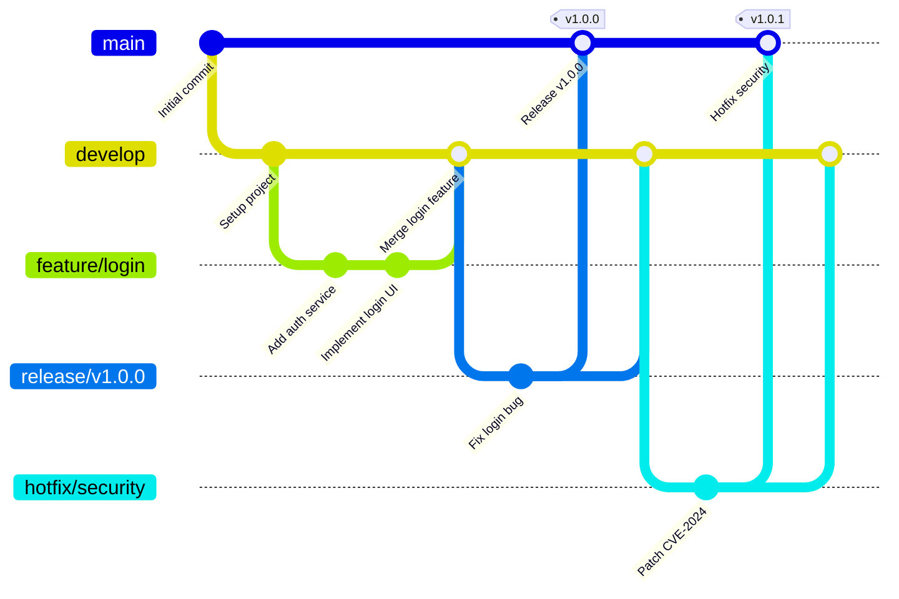
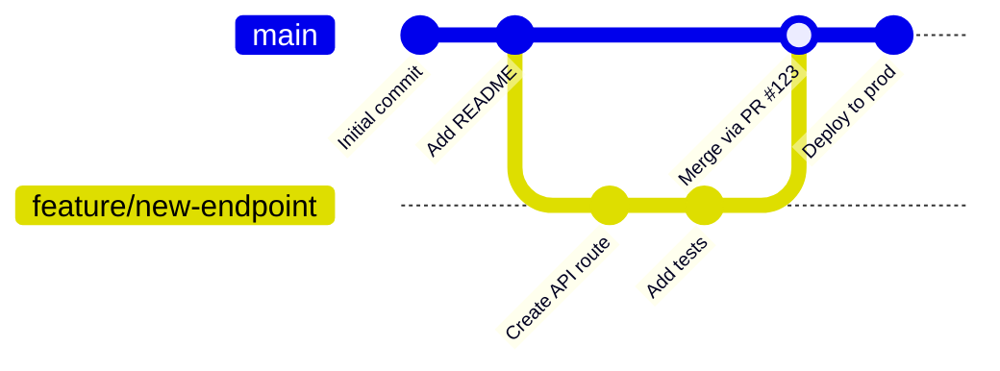
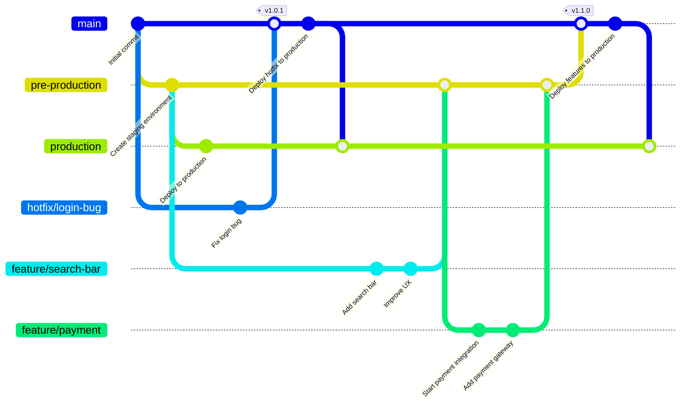
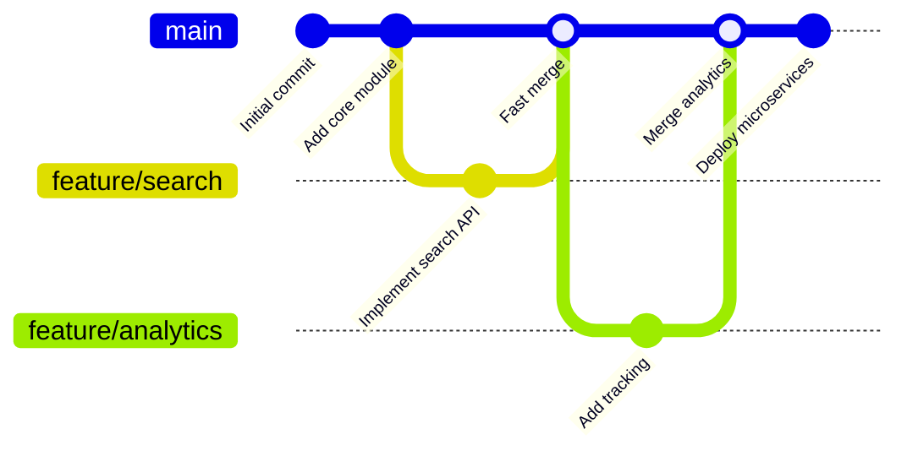
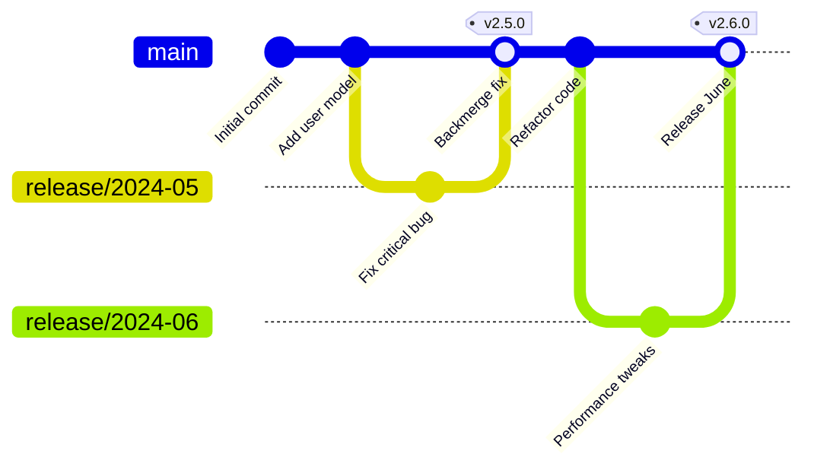

#### **GitFlow**

```mermaid
gitGraph
commit id: "Initial commit"
branch develop
checkout develop
commit id: "Setup project"
branch feature/login
checkout feature/login
commit id: "Add auth service"
commit id: "Implement login UI"
checkout develop
merge feature/login id: "Merge login feature"
branch release/v1.0.0
checkout release/v1.0.0
commit id: "Fix login bug"
checkout main
merge release/v1.0.0 id: "Release v1.0.0" tag: "v1.0.0"
checkout develop
merge release/v1.0.0
branch hotfix/security
checkout hotfix/security
commit id: "Patch CVE-2024"
checkout main
merge hotfix/security id: "Hotfix security" tag: "v1.0.1"
checkout develop
merge hotfix/security
```
#### **GitHub Flow**

```mermaid
gitGraph
commit id: "Initial commit"
commit id: "Add README"
branch feature/new-endpoint
checkout feature/new-endpoint
commit id: "Create API route"
commit id: "Add tests"
checkout main
merge feature/new-endpoint id: "Merge via PR #123"
commit id: "Deploy to prod"
```

#### **GitLab FLOW**

```mermaid
gitGraph
commit id: "Initial commit"
branch pre-production
checkout pre-production
commit id: "Create staging environment"
branch production
checkout production
commit id: "Deploy to production"
checkout main
branch hotfix/login-bug
commit id: "Fix login bug"
checkout main
merge hotfix/login-bug tag: "v1.0.1"
commit id: "Deploy hotfix to production"
checkout production
merge main
checkout pre-production
branch feature/search-bar
commit id: "Add search bar"
commit id: "Improve UX"
checkout pre-production
merge feature/search-bar
branch feature/payment
commit id: "Start payment integration"
commit id: "Add payment gateway"
checkout pre-production
merge feature/payment
checkout main
merge pre-production tag: "v1.1.0"
commit id: "Deploy features to production"
checkout production
merge main
```

#### **TBD Trunk-Based Development**

```mermaid
gitGraph

commit id: "Initial commit"

commit id: "Add core module"

branch feature/search

checkout feature/search

commit id: "Implement search API"

checkout main

merge feature/search id: "Fast merge"

branch feature/analytics

checkout feature/analytics

commit id: "Add tracking"

checkout main

merge feature/analytics id: "Merge analytics"

commit id: "Deploy microservices"
```
#### **Trunk-Based Release Train**

```mermaid
gitGraph
commit id: "Initial commit"
commit id: "Add user model"
branch release/2024-05
checkout release/2024-05
commit id: "Fix critical bug"
checkout main
merge release/2024-05 id: "Backmerge fix" tag: "v2.5.0"
commit id: "Refactor code"
branch release/2024-06
checkout release/2024-06
commit id: "Performance tweaks"
checkout main
merge release/2024-06 id: "Release June" tag: "v2.6.0"
```
