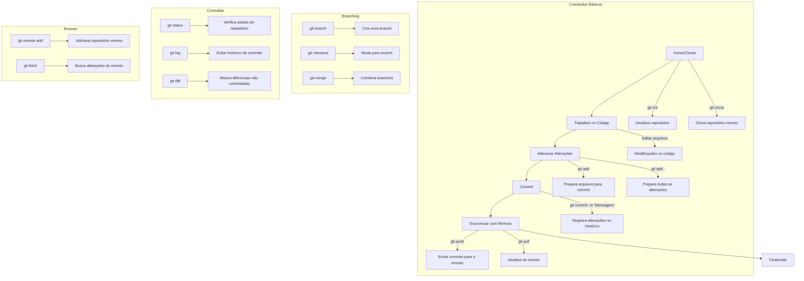

```mermaid
graph TD
    A[Iniciar/Clonar] --> B[Trabalhar no Código]
    B --> C[Adicionar Alterações]
    C --> D[Commit]
    D --> E[Sincronizar com Remoto]
    E --> F[Finalizado]

    subgraph Comandos Básicos
        A -->|git init| A1["Inicializa repositório"]
        A -->|git clone <url>| A2["Clona repositório remoto"]
        B -->|Editar arquivos| B1["Modificações no código"]
        C -->|git add <arquivo>| C1["Prepara arquivos para commit"]
        C -->|git add .| C2["Prepara todas as alterações"]
        D -->|git commit -m 'Mensagem'| D1["Registra alterações no histórico"]
        E -->|git push| E1["Envia commits para o remoto"]
        E -->|git pull| E2["Atualiza do remoto"]
    end

    subgraph Branching
        G[git branch <nome>] --> H["Cria nova branch"]
        I[git checkout <branch>] --> J["Muda para branch"]
        K[git merge <branch>] --> L["Combina branches"]
    end

    subgraph Consultas
        M[git status] --> M1["Verifica estado do repositório"]
        N[git log] --> N1["Exibe histórico de commits"]
        O[git diff] --> O1["Mostra diferenças não commitadas"]
    end

    subgraph Remoto
        P[git remote add <nome> <url>] --> P1["Adiciona repositório remoto"]
        Q[git fetch] --> Q1["Busca alterações do remoto"]
    end
```