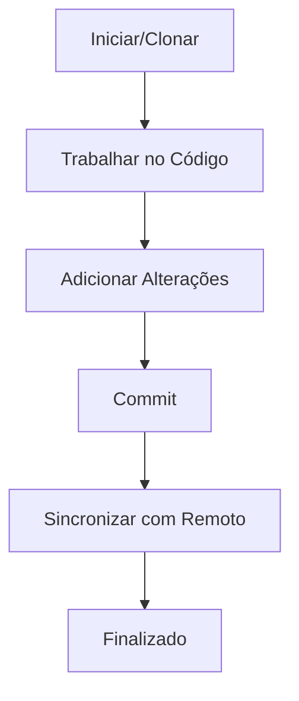
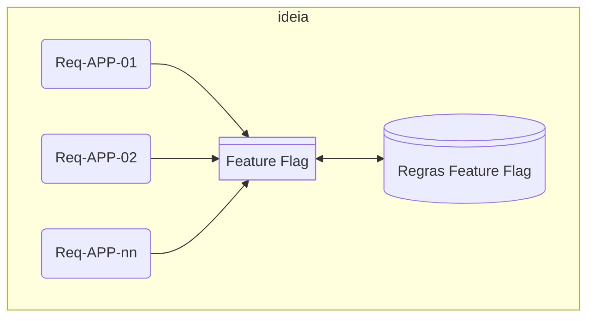
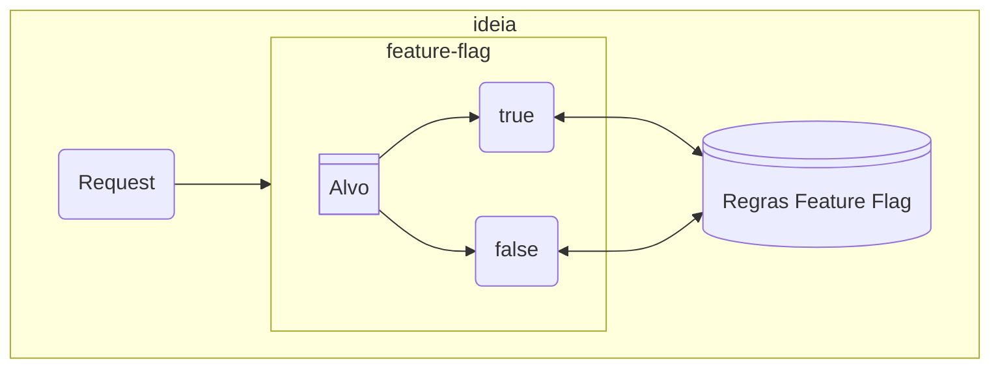
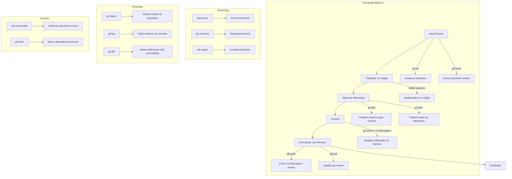

```mermaid
graph TD

```






# Requisitos de Arquitetura

[](https://mermaid.live/edit#pako:eNp1U8tuGzEM_BVhTwkQIEDRk1E0MNYueogRxBs0F1_oFS2zWYkbPdI6QT6m6KGnnoJ-wf5YGNv7gJ3eRM4MOaSkp6xkjdkos-S0hXrhlPLM8eRk6iI6jf7T-dJ_ZuXQNC8l8enpG0WpLxDZY1D3CbeMnCtYsge7g5W6ZGfUmoLQNm2uQBdY5WxTRxuLSINBq75yJWwqoYW-UWh-c0eMFJNGlfvmb8-6TkBBQRB_JYZAGjSGVjKVcha8SiE1vzxxB2x1LnK4OMhIoejBBWj-NP_wAK4Uq4i25u3AYkXmrzlEuDhsWMqETjxKlX4ApeZYQWxexMmgcDErBtHtGmIY1_UgdYNgWydtgxssHVdsqFvW-DF57EUTfOB6MG_OMhw59GLCyJr7O7kkuWg_8MPOgb9Oy67aLS4L9A9U4qDg1XxStNFVkqUNsAlEuGTQfcbeaS4HjDZjofQc6ioZcseoqcis45J_viNEb4H0h_9J_fbthh9gDPpj0h7YsY7VezhRBPNOb3K02hwWreg-0RICDgX9WYR3fasin3WQodid5eFYio_ohqjl77SLJwRGvli_69l0fj6Zztsw_6hm8p2rDt5tSWxkZ9l-ZfLXn97wRRbXaHGRjeSocQWpiots4Z6FCilysXFlNoo-4VmWag0R992z0QqqgM-vXmNQaA){width="1200" height="300" style="display: block; margin: 0 auto"}
CI/CD Pipelines

1 Software development Lifecycle


-------------------------- Develop ----------------------

Staged Changes (Changes tracked by git) --> Commit (Changes are informed to git) --> Push --> E2E Tests (This is where) --> Deploy(happens...)


2 CI/CD

Continuous Integration. | Continuous Delivery


* Build and test if code in commit works well with other components

*If everything is okay so far deploy & package

$ git clone repo

/-> Unit Test

Checkout Repo --> Build --> integration TesT --> deploy --> package

\-> Test on \-> Loging Monitoring


Every step is triggered one after the other of

in parallel, thus called

as pipelines
