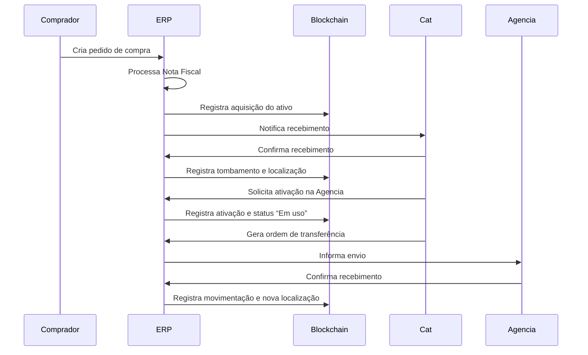

O **blockchain** em ativos empresariais está na **transparência, segurança e eficiência** na **gestão, rastreabilidade e transferência desses ativos**.
### **1. Rastreabilidade e Transparência**
- [ ] Cada transação envolvendo o ativo é registrada de forma **imutável** e **auditável**.
- [ ] Permite o acompanhamento completo do histórico do ativo (ex.: transferências, alterações, avaliações), útil especialmente para **ativos físicos valiosos** ou **ativos digitais únicos**.
### **2. Redução de Fraudes e Manipulações**
- [ ] Os dados registrados no blockchain **não podem ser alterados** sem o consenso da rede.
- [ ] Isso reduz o risco de **fraudes contábeis**, **duplicação de ativos** ou manipulação de registros patrimoniais.
### **3. Eficiência Operacional e Menor Custo**
- [ ] Elimina intermediários em processos como transferências de propriedade, auditorias e validações.
- [ ] Pode **automatizar** processos com **smart contracts**, como liberação de garantias ou pagamentos vinculados a ativos.
### **4. Liquidez e Tokenização de Ativos**
- [ ]  Permite **tokenizar ativos** (ex.: imóveis, máquinas, propriedade intelectual), dividindo-os em frações e facilitando a negociação.
- [ ] Cria **mercados secundários**, aumentando a **liquidez** de ativos que antes eram pouco negociáveis.
### **5. Conformidade e Auditoria em Tempo Real**
- [ ] Facilita auditorias com acesso instantâneo a um **registro confiável e em tempo real**.
- [ ] Melhora a conformidade com normas regulatórias, como as exigidas por contabilidade e compliance

```Exemplo de entrada na blockchain:
{
  ativo_id: AT-0001,
  tipo: "Servidor HP DL380 Gen10",
  nota_fiscal: "NF-987654",
  fornecedor: "Tecnologia XYZ Ltda",
  data_aquisicao: "2025-05-16",
  valor: "R$ 65.000,00",
  status: "Aguardando Recebimento"
}
```
```
Atualização na blockchain:
{
  ativo_id: AT-0001,
  status: "Recebido",
  localizacao: "Almoxarifado RJ - Unidade Centro",
  responsavel: "João Pereira",
  timestamp: "2025-05-17T10:34:12"
}
```

```
Evento de ativação na blockchain:
{
  ativo_id: AT-0001,
  evento: "Ativação",
  data: "2025-05-20",
  centro_custo: "TI - Infraestrutura",
  localizacao: "Datacenter - Centro/RJ",
  status: "Em uso"
}
```

```
Evento de movimentação na blockchain:
{
  ativo_id: AT-0001,
  evento: "Transferência de Local",
  origem: "Datacenter - Centro/RJ",
  destino: "Filial SP - Av. Paulista",
  data_envio: "2025-06-01",
  data_recebimento: "2025-06-03",
  responsavel_envio: "João Pereira",
  responsavel_recebimento: "Luciana Ramos",
  status: "Em uso - Filial SP"
}
```
