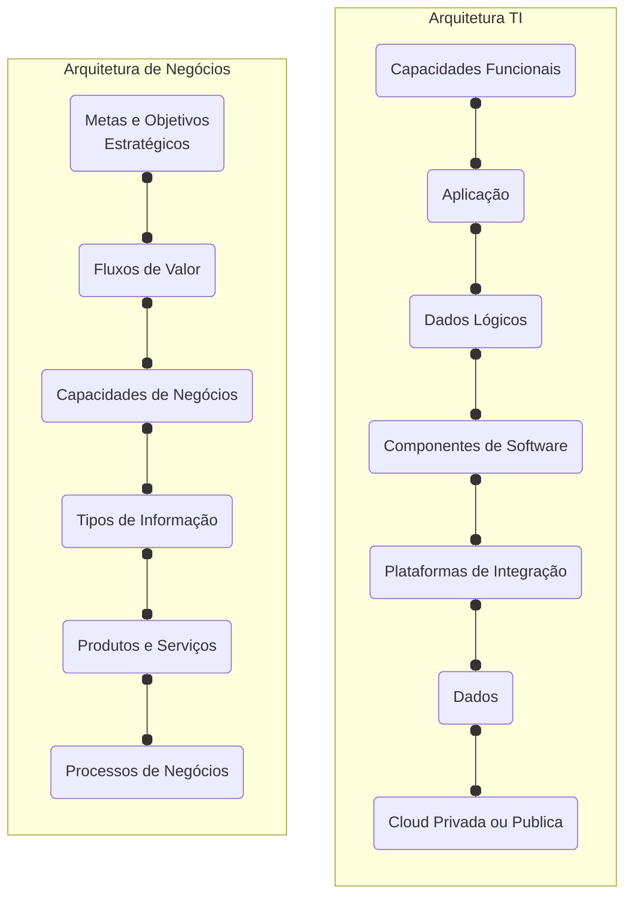
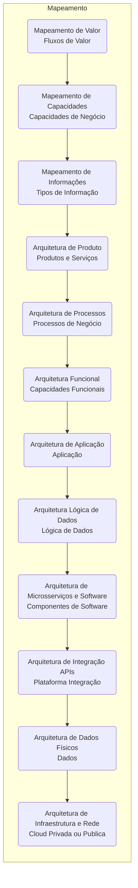

As tecnologias digitais são hoje a espinha dorsal das sociedades modernas, sustentando tudo, desde a prestação de serviços até as transações financeiras.

No entanto, na maioria das empresas e países, muitos desses serviços essenciais  permanecem fragmentados, duplicados e projetados de forma isolada vinculados a áreas, programas ou agências individuais, em vez de tratados como infraestrutura.

Essa fragmentação leva a ineficiências dispendiosas, oportunidades perdidas de inovação intersetorial e barreiras à inclusão.

Esses custos não são apenas técnicos, são sociais, econômicos e políticos.

As instituições continuam investindo em múltiplos sistemas digitais sem capturar economias de escala ou os efeitos colaterais e externalidades que a infraestrutura digital pode gerar.

- [ ] **Define a natureza infraestrutural dos sistemas digitais**: Identifique as características que fazem com que sistemas e serviços digitais funcionem como infraestrutura.
- [ ] **Analisa como a infraestrutura digital molda a economia**;
- [ ] **Propõe uma estrutura de medição de valor público para o Digital Public Infrastructure (DPI)**;
- [ ] **Identifica fatores adicionais que influenciam a criação de valor**;
- [ ] **Trate os serviços digitais essenciais como infraestrutura (duradoura, transversal e fundamental para o dinamismo econômico)**;
- [ ] **Projete para gerar valor desde o início (O valor não é automático. Depende de escolhas técnicas, governança)**;
- [ ] **Planejamento precisam ir além da lógica baseada em projetos e assumir um papel estratégico na formação dos ecossistemas**;
- [ ] **Incorpore medições dinâmicas além da eficiência (Ferramentas para avaliar o valor sistêmico, os resultados a longo prazo e as compensações que moldam quem se beneficia)**.

## Fragmentados
Essa fragmentação é custo. E  muitos sistemas permanecem incompatíveis, levando à duplicação, ineficiências, desperdício e "pay as you go" ao invés de "pay as you setup".
Essas ineficiências e oportunidades perdidas de impacto estão levando à empresas, governos a repensar sua abordagem de transformação digital.

Assim como estradas e redes de energia, esses sistemas fornecem sistemas compartilhados e reutilizáveis que facilitam a interoperabilidade, a eficiência e a inovação. Esses sistemas compartilhados prometem reduzir a duplicação, otimizar os serviços e permitir a inovação do setor.

## China como Exemplo
A China é um país muito diverso. Segundo país mais populoso do mundo.
Abrigar diversas minorias, a China é etnicamente bastante homogênea, diferenças regionais em termos de cultura, gastronomia e geografia.
Apenas 0,07% de sua população é composta por imigrantes.
Outra diferença entre as diferentes áreas, e em particular as cidades, é o seu nível de desenvolvimento.
Não oficialmente a China possui níveis de Cidades, em contrário com a  maioria dos países ocidentais, as diferenças entre cidades e entre áreas rurais e urbanas.
Eles pontuam as cidades com base em um grande número de métricas em 5 dimensões:

- [ ] Concentração de recursos comerciais;
- [ ] A extensão em que uma cidade serve como um centro comercial/de infraestrutura;
- [ ] Vitalidade dos moradores urbanos;
- [ ] Competitividade em novas indústrias;
- [ ] Adaptabilidade futura;

Há quatro cidades de nível 1, que são Xangai, Pequim, Shenzhen e Guangzhou.

O PIB per capita médio dessas cidades de primeiro nível é 50% maior do que o das cidades de segundo nível, embora elas abriguem apenas 6% da população da China.

(https://www.datayicai.com/)

