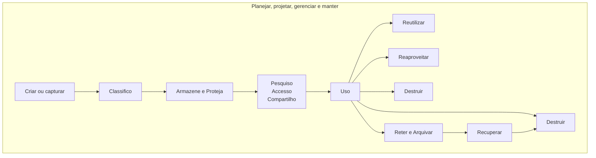
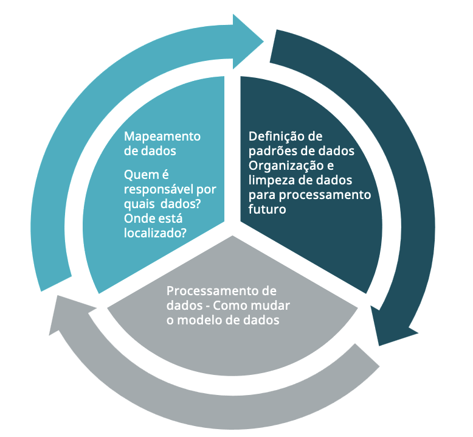
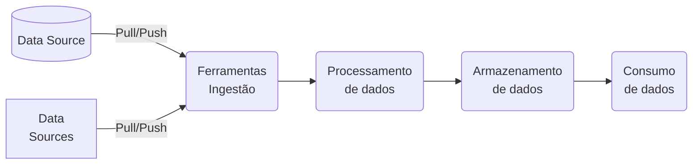
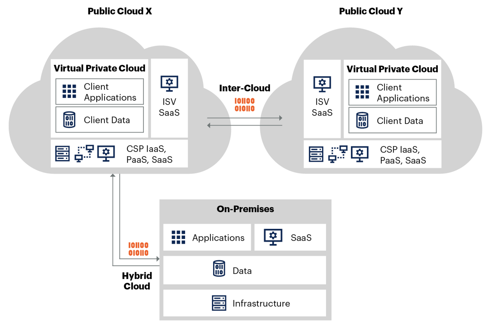
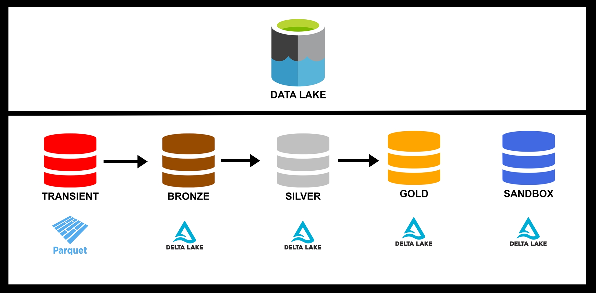
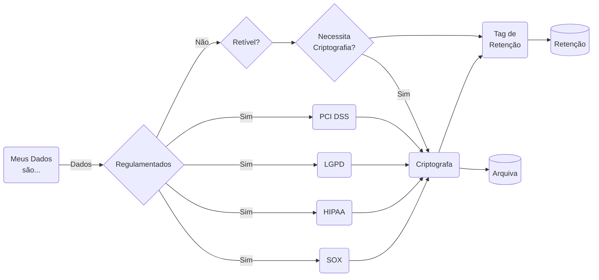
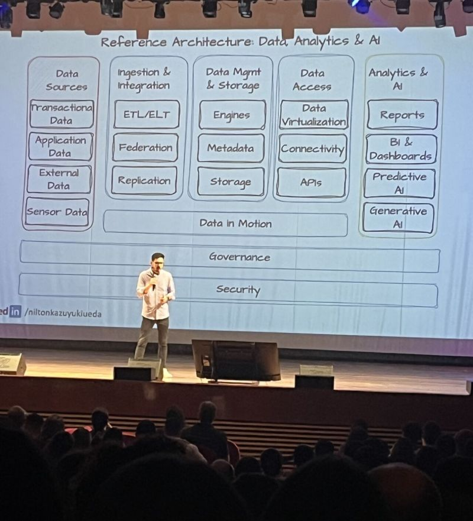

Na última década, assistimos a um crescimento exponencial do volume de dados, impulsionado por avanços na conectividade sem fio, nuvem, proliferação de dispositivos de Internet das Coisas (IoT) e Inteligência Artificial.

Os dados impulsionam partes significativas de nossas vidas, desde recomendações até sistemas de inteligência artificial que identificam tratamentos médicos mais eficazes.

O mesmo se aplica aos negócios, que estão se tornando cada vez mais **orientados por dados** na busca do aprimoramento de serviços ou venda de produtos ou operações.
## Revolução Industrial

{width="600" height="450" style="display: block; margin: 0 auto" }

| Revolução Industrial | Motivo                                                                                                                                                                                     | Resumo                    |
| -------------------- | ------------------------------------------------------------------------------------------------------------------------------------------------------------------------------------------ | ------------------------- |
| Primeira             | Novas relações de trabalho, energia produzida pelo homem por energias como a vapor, eólica e hidráulica;                                                                                   | Mecanização               |
| Segunda              | Aumentaram ainda mais a produtividade e, consequentemente, os lucros das indústrias, Uso do petróleo como fonte de energia, utilizado na nova invenção: o motor à combustão, eletricidade. | Escalação                 |
| Terceira             | Desenvolvimento de infraestrutura das telecomunicações e transporte; integração entre economia e política;                                                                                 | Automatização             |
| Quarta               | Tecnologias para automação e troca de dados – ela se caracteriza, por um conjunto de tecnologias que permitem a fusão do mundo físico, digital e biológico.                                | Personalizando a Produção |

{width="600" height="450" style="display: block; margin: 0 auto" }

  “Com cada revolução industrial, houve uma revolução de aprendizagem correspondente que na época, parecia proibitivamente cara. No entanto, o custo de manter o status quo no passado era o custo da oportunidade perdida que, em muitos casos, era uma fortuna.” — Jesse Martin
## Dado é o novo Petróleo

- [ ] Toda empresa é uma empresa de dados..
- [ ] Um dos maiores desafios no caso do Petróleo, é localizar as boas reservas naturais que são subterrâneas, com dados é diferente, o desafio é qualificar e cruzar informações criando visões de cenários específicos para a realidade das empresas, a partir de uma grande massa de dados disponível através da utilização de sistemas de gestão empresarial.
- [ ] A famosa frase do matemático britânico Clive Humby: "Dados são o novo petróleo" (Data is the new oil).
- [ ] Mas, se não for refinado, não pode ser usado, portanto, os dados devem ser divididos, analisados para que tenham valor", ou seja, assim como o petróleo deve ser refinado, os dados precisam receber um tratamento correto para estarem prontos para sua utilização em seu total potencial.
- [ ] Podemos lembrar do Pré-sal
- [ ] A publicação da The Economist: "O recurso mais valioso do mundo não é mais o petróleo, mas dados" (The world’s most valuable resource is no longer oil, but data) tem sido muito citadas pelo mercado e executivos mundo afora, apontando que aqueles que possuírem dados terão um recurso muito valioso e mãos.

Porem cada vez menos empresas consideraram sistematicamente e começaram a abordar os aspectos éticos do gerenciamento de dados, o que pode ter amplas ramificações e responsabilidades.

- [ ] Como as empresas devem começar a pensar sobre gerenciamento ético de dados?
- [ ] Quais medidas elas podem colocar em prática para garantir que estejam usando dados de consumidores, pacientes, RH, instalações e outras formas de dados apropriadamente em toda a cadeia de valor — da coleta à análise e insights?
- [ ] Embora considerações de privacidade e ética sejam essenciais sempre que as empresas usam dados (incluindo aplicativos de inteligência artificial e aprendizado de máquina), elas geralmente não são a principal preocupação de alguns executivos.
- [ ] Há bastante dados distorcidos ou tendenciosos durante a ingestão de dados.

- [ ] Apenas 17% disseram que suas empresas têm um comitê de governança de dados dedicado que inclui profissionais de risco e jurídicos.

| Definição  | Entenda                                                                                                                                                                                                                   |                                                                                                                                                                                                                         |
| ---------- | ------------------------------------------------------------------------------------------------------------------------------------------------------------------------------------------------------------------------- | ----------------------------------------------------------------------------------------------------------------------------------------------------------------------------------------------------------------------- |
| Upstream   | Atividades de busca, identificação e localização das fontes de óleo, e ainda o transporte deste óleo extraído até as refinarias, onde será processado. Resumindo, são as atividades de exploração, perfuração e produção. | Coleta e geração de dados. Isso inclui a captura de dados de várias fontes, como sensores, dispositivos IoT, transações de clientes, redes sociais, etc.                                                                |
| Midstream  | São as matérias-primas (hidrocarbonetos) são transformadas em produtos prontos para uso específico (gasolina, diesel, querosene, GLP, nafta, óleo lubrificante, …). São as atividades de refino.                          | Transporte, armazenamento e processamento inicial. Isso pode incluir a transferência de dados para data centers, armazenamento em nuvem, e o processamento inicial para limpeza e organização dos dados.                |
| Downstream | O transporte dos produtos da refinaria até os locais de consumo. Resume-se no transporte, distribuição e comercialização dos derivados do petróleo.                                                                       | Análise, refino e distribuição dos dados. Isso inclui a análise de dados para obter insights, a criação de relatórios, dashboards, e a distribuição desses insights para as partes interessadas para tomada de decisão. |

## Negócio e suas queixas

- [x] Times de Dados vs Times de Negócio;

- [x] Dificuldade na obtenção de informações;

- [x] Dados descentralizados;

- [x] Negócio e suas queixas;

- [x] Demora nas entregas da TI;

## Times de Dados e suas queixas

- [x] Falta de clareza nas definições;

- [x] Falta de engajamento das áreas;

- [x] Falta de governança nas Pontas;

- [x] Falta mindset analítico nas ponta;

## Quanto mais...

- [ ] Quanto mais dados mais disperdícios e este é um processo Lean.
- [ ] Combustível é refinado - O petróleo é o DADO.. A informação é o COMBUSTÍVEL;

## **Data Mess** (Bagunça de Dados)
É um termo usado informalmente para descrever uma situação onde os dados de uma organização estão em **estado caótico ou bagunçados** — ou seja, desorganizados, mal gerenciados e difíceis de usar de forma eficiente.
### **Características de um Data mess e uma Possível Solução**

| Características                            | Consequências                                                                                                                                                                                                                                                        | Vamos Resolver?                                                                           |
| ------------------------------------------ | -------------------------------------------------------------------------------------------------------------------------------------------------------------------------------------------------------------------------------------------------------------------- | ----------------------------------------------------------------------------------------- |
| Múltiplas versões da verdade               | Decisões erradas por causa de dados ruins                                                                                                                                                                                                                            | Definir responsáveis, padrões de qualidade e políticas de atualização.                    |
| Dados duplicados e redundantes             | Perda de tempo e dinheiro                                                                                                                                                                                                                                            | Usar ferramentas como **ETL** (_Extract, Transform, Load_) ou plataformas de integração.  |
| Ausência  de padronização                  | Dificuldade para implementar BI, IA ou automação                                                                                                                                                                                                                     | Identificar e remover duplicatas, corrigir inconsistências e preencher lacunas.           |
| Dados incompletos ou desatualizados        | Problemas de compliance (ex: GPDR(**General Data Protection Regulation** (Europa)), PCI DSS (Payment Card Industry Data Security Standard), LGPD(**Lei Geral de Proteção de Dados** (Brasil)), HIPAA (**Health Insurance Portability and Accountability Act** (EUA)) | Centralizar dados críticos, Mestres e de Referencia  em uma fonte única de verdade.       |
| Silos de dados                             |                                                                                                                                                                                                                                                                      | Usar validações automáticas e workflows para evitar erros humanos.                        |
| Falta de governança de dados               |                                                                                                                                                                                                                                                                      | CENTRAL DE CADASTRO: Treinar colaboradores em boas práticas de entrada e gestão de dados. |
| Falta de ferramentas e processos adequados |                                                                                                                                                                                                                                                                      | Monitorar a qualidade dos dados e ajustar estratégias conforme necessário.                |

Ao desenvolver soluções de dados e análises, um fator determinante para o seu sucesso
é o **patrocinador do negócio** e o trabalho que você está realizando para atender às suas
necessidades.

**Sem entender o verdadeiro destino**, você não pode ter certeza de que o incremento em que está trabalhando o está levando na direção certa.

Gosto sempre de me reunir com o patrocinador do negócio primeiro, antes de qualquer outra coisa, para ter uma ideia clara da visão e do escopo do que buscamos alcançar.

Para aprimorar seus programas de dados e análises, você precisa garantir que haja uma
visão compartilhada bem definida. Aqui estão algumas perguntas que precisam ser
respondidas:

- [ ] Para seus programas de dados e análises, todas as partes interessadas têm uma
visão compartilhada sobre o que você está tentando alcançar?
- [ ] Essa visão é definida de forma a servir como uma bússola para a iniciativa geral?
- [ ] Você definiu claramente o patrocínio com alguém que é apaixonado pelo resultado da
iniciativa?
- [ ] A visão define a cadeia de montanhas ou o pico imediatamente à sua frente?

Requer combinação de **tecnologia**, **processos bem definidos** e **pessoas capacitadas**.

Organizações que priorizam a qualidade dos dados ganham eficiência, reduzem riscos e habilitam insights estratégicos, transformando o caos em um **ativo valioso**.

### Ciclo de vida dos Ativos de Informação

#### Centralização dos Cadastros
O objetivo deste documento é de abordarmos o tema de GERENCIAMENTO DE DADOS – CENTRAL DE CADASTRO, sendo uma estratégia crucial, para reconhecermos que a eficácia desse processo, não depende apenas de ferramentas e tecnologias, mas sim da colaboração ativa de todos os envolvidos.

Gerenciar dados de forma eficiente exige um esforço conjunto, onde cada pessoa traz sua expertise, insights e experiências para enriquecer nossas estratégias.

O cenário atual nos desafia a sermos não apenas gestores, mas também inovadores, capazes de transformar dados em um ativo estratégico que impulsione nossas decisões e fortaleça nossa competitividade no mercado.

Cada um de nós lida com diferentes aspectos dos dados em nosso dia a dia – veja o ciclo de vida.

Essa diversidade de perspectivas é o que nos permitirá construir um sistema de GERENCIAMENTO DE DADOS, que seja robusto, flexível e capaz de atender às diversas demandas.

Por isso, convido todos a se engajarem nessa análise prepositiva, compartilhando suas experiências e ideias sobre como podemos aprimorar nossos processos de Gerenciamento de Dados.

Queremos ouvir suas sugestões sobre como garantir a qualidade dos dados, melhorar nossa governança e explorar novas formas de integrar e utilizar as informações de maneira eficaz.

Juntos, podemos construir uma abordagem inovadora, onde cada voz contribui para o fortalecimento do nosso gerenciamento de dados, resultando em melhores resultados.

Junte-se a Modernização de Dados Mestres interseção do MDM/MDG (Master Data Management/Governance) com  Retrieval-Augmented Generation (RAG).
#### ODTA-C
Como gostamos de acrônimos, elaboramos o **ODAT-C**, como uma forma de engajar nossos colaboradores de forma mais assertiva e colaborativa.

| **Letra** | **Objeto**                             | **Razão**                                                           |
| --------- | -------------------------------------- | ------------------------------------------------------------------- |
| **O**     | **OMNI** (abrangente, total)           | Omnipresença de dados e informações;                                |
| **D**     | DATA (informação, análise)             | **D**ados para fundamentar decisões;                                |
| **T**     | **TRABALHO em CONJUNTO**               | Colaboração no sentido de Equipe;                                   |
| **A**     | **Assertividade (confiança, clareza)** | **A**ssertividade na comunicação e na execução de tarefas;          |
| **C**     | **Conexão**                            | **Conexão entre todos os elementos para atingir objetivos comuns.** |

Assim, abre-se um conceito ou abordagem que integra e unifica dados de diversas fontes e formatos, proporcionando uma visão holística e abrangente das informações disponíveis.

Essa abordagem permite que organizações identifiquem, coletem, analisem e utilizem dados de maneira eficiente, favorecendo uma tomada de decisão mais informada e estratégica.

ODTA-C representa uma abordagem estratégica para a gestão e utilização de dados, visando maximizar o valor das informações disponíveis e impulsionar a eficiência operacional e a inovação nas organizações, aplicando em toda a organização à maneira como os dados são obtidos, rastreados, usados, entregues e descartados.

Dados são um ativo estratégico e devem ser gerenciados.

Se os dados não forem gerenciados, eles frequentemente acabam sendo duplicados, de baixa qualidade e não suportam os insights que são produtos valiosos de bons dados.

Os dados exigem administração e responsabilização, este princípio exige que indivíduos sejam designados como **administradores e zeladores dos dados**.

A administração de dados consiste nas pessoas, na organização e nos processos necessários para garantir que os administradores devidamente designados sejam responsáveis pela governança.

### **Movendo dados para um Estado Governado**
O propósito de executar a Governança de Dados é mover dados de um estado não governado para um estado governado.

Eles raramente são definidos, sua qualidade é desconhecida, suas regras de negócios são inexistentes ou conflitam entre si, e ninguém é responsável pelos dados.

Dados governados são dados que são confiáveis e compreendidos e pelo qual, alguém é responsável por ambos os dados em si e para abordar questões sobre os dados.

### **Tabela de Background-Check**
A identificação de uma fonte segura para Dados Mestres/Referência e/ou a criação de estruturas de codificação faladas são fundamentais, para a iniciação de um processo de adaptação antes da migração de um sistema de Gestão. Estruturamos o levantamento das informações em QUATRO etapas:

| **Fase**                             | **Objetivo**                                                                                                                                                                                                              |
| ------------------------------------ | ------------------------------------------------------------------------------------------------------------------------------------------------------------------------------------------------------------------------- |
| **Levantamento de Dados Existentes** | Mapeamento das fontes atuais de dados dentro da organização;                                                                                                                                                              |
| **Definir Gestores de Dados**        | Estabelecer uma área responsável para a Análise da Qualidade, Definição de Critérios, Designação de um Líder de Dados e a elaboração de um processo de Monitoramento e Revisão para assegurar a continuidade da operação. |
| **Análise de Qualidade de Dados**    | Avaliar a precisão, completude e consistência dos dados coletados. Isso ajuda a identificar quais informações são confiáveis e quais precisam ser ajustadas ou eliminadas.                                                |
| **Definição de Critérios**           | Estabelecer critérios claros para a seleção de dados que serão considerados como fontes seguras, levando em conta fatores como frequência de atualização, legitimidade da origem e relevância para a operação.            |

Em um cenário empresarial em constante evolução, a gestão eficaz de informações tornou-se um fator crucial para o sucesso das organizações. No centro dessa transformação, surge a necessidade de uma Central de Cadastro Integrada, que visa otimizar o relacionamento com padrões, responsáveis, interagir fornecedores e aprimorar o atendimento ao cliente.

Não obstante a esta central e com a combinação do Master Data Management/Governance (MDM/MDG) e Inteligência Artificial (IA), poderíamos automatizar o processo de detecção e correção de erros de dados, recomendações de itens duplicados, identificar e mitigar potenciais riscos de conformidade.

Entende-se neste contexto, que a governança de dados e o MDM/MDG não são idênticos, onde o primeiro estabelece as bases para sua solução MDM e garante que você obtenha o máximo valor.

### **Identificação do Problema**
Registros com informações faltantes, duplicação de dados, risco de exposição de informações sensíveis, especialmente em conformidade com regulamentações como a LGPD, ausência de controles de acesso adequados, permitindo que usuários não autorizados acessem informações confidenciais, silos de dados (dificuldade em integrar dados de diferentes fontes, resultando em visões fragmentadas das informações), entre outros.

Essa fragmentação de informações causa inconsistências com a análise de dados de atendimento, financeiro e administrativo, dificultando a comunicação com os fornecedores (prestadores de serviço, parceiros) e compromete a eficácia no atendimento ao cliente.

- [ ] Os dados são compartilhados e usados por muitos, para muitos propósitos diferentes. Então, quem é o dono deles?
- [ ] Quem toma decisões sobre eles e é responsável quando os dados dão “errado”?
- [ ] Inexistência de fluxo padrão para o cadastro dos principais dados mestres;
- [ ] Ausência de padronização descritiva, gerando produtos duplicados ou incompletos;
- [ ] Ausência da definição de papéis e responsabilidades;
- [ ] Falta de documentação clara sobre políticas e procedimentos pode levar a erros.
- [ ] Dificuldades em manter a central em conformidade com leis e regulamentos de proteção de dados.
- [ ] Dificuldade em gerar relatórios úteis e insights a partir dos dados armazenados.
- [ ] Várias bases de dados Analíticas e acesso a informações que não refletem a realidade atual da organização.

Mapear os dados de uma organização requer uma compreensão profunda do cenário do sistema e do processo de manutenção dos dados. O mapeamento de dados abrange:

- [ ] Identificação de ativos de dados e seus repositórios;
- [ ] Identificar e definir os atuais proprietários dos dados;
- [ ] Descrever os fluxos de dados e as regras de distribuição de dados;
- [ ] Descrever os padrões de dados atuais, incluindo regras de validação;
### Proposta
A proposta de criação de uma Central de Cadastro ou a sua remodelagem, surge como uma solução eficaz para esses desafios.
Este espaço dedicado permitirá a centralização (processos de mudança) e padronização das informações (padrões de dados) e responsabilização (indicadores de acurácia e tempo atendimento).

| **Expectativa**           | **Entenda**                                                                                                                                                               |
| ------------------------- | ------------------------------------------------------------------------------------------------------------------------------------------------------------------------- |
| **Qualidade**             | Auxilia manutenção da qualidade dos dados ao impor padrões, validações e procedimentos de limpeza.                                                                        |
| **Governança de dados**   | Adotar as políticas e procedimentos definidos pelo Data Product Manager.                                                                                                  |
| **Agilidade Aumentada**   | Centralização permite a instituição se adapte rapidamente a mudanças nos requisitos de negócios.                                                                          |
| **Data Flow**             | Fluxo de trabalho definido, registros das mudanças.                                                                                                                       |
| **Análise de Desempenho** | Centralização dos dados possibilitará análises mais robustas sobre o desempenho dos fornecedores, permitindo à empresa escolher parcerias mais estratégicas e eficientes. |
| **Aumento da Eficiência** | Com todos os cadastros em um único local, podemos impor padrões, validações e procedimentos de limpeza.                                                                   |

#### Definindo padrões de dados
Bons padrões de dados estão no centro de uma solução MDM que funciona perfeitamente. Eles são essenciais para sua capacidade de colaborar e trocar dados dentro da organização, bem como externamente.

O primeiro passo para garantir uma alta qualidade de dados é aplicar lógica aos seus padrões de dados, como usar formatos unificados para endereços e descrições de produtos. Você precisa definir quais tipos de dados podem ser inseridos como valores de atributos. Certifique-se de que cada atributo só possa conter dados em um formato especificado, por exemplo:

| Tipo de dados      | Formatos especificados                                                |
| ------------------ | --------------------------------------------------------------------- |
| Texto numérico     | `^[A-Z]{1,60}$`                                                       |
| Número             | `1.25 OR 3 OR -4.5`                                                   |
| CPF                | `\b\d{3}\.\d{3}\.\d{3}-\d{2}\b`                                       |
| CNPJ               | `\b\d{2}\.\d{3}\.\d{3}/\d{4}-\d{2}\b`                                 |
| NCM                | `\b\d{8}\b`                                                           |
| Tipo de Logradouro | `Rua, Avenida, Praça, Travessa, Alameda, Estrada, Beco, Largo, Viela` |

### **Diferenciação do CSC para uma CC**

| **Função**                  | **Central de Cadastros**                                                                                                                                          | **Centro de Serviço Compartilhado (CSC)**                                                                                                                                   |
| --------------------------- | ----------------------------------------------------------------------------------------------------------------------------------------------------------------- | --------------------------------------------------------------------------------------------------------------------------------------------------------------------------- |
| **Principal**               | Centraliza e gerencia informações cadastrais de clientes, fornecedores, produtos, entre outros. É responsável por manter os dados atualizados e acessíveis.       | Centraliza e padroniza serviços de apoio, como finanças, recursos humanos, entre outros, para várias unidades de uma empresa.                                               |
| **Foco**                    | Dados e informações. A central de cadastros garante que todas as informações necessárias estejam corretas e disponíveis para diferentes departamentos da empresa. | Processos e serviços. O CSC busca otimizar a eficiência operacional e reduzir custos ao unificar serviços que seriam realizados separadamente por diferentes departamentos. |
| **Precisão e Consistência** | Reduz erros e duplicidades nos dados.                                                                                                                             | Melhora a produtividade e a qualidade dos serviços.                                                                                                                         |
|                             | Facilita a obtenção de informações precisas e atualizadas.                                                                                                        | Economiza recursos ao evitar duplicação de esforços                                                                                                                         |
|                             | Ajuda a empresa a cumprir regulamentações e normas de proteção de dados.                                                                                          | Garante que os processos sejam realizados de maneira uniforme e consistente.                                                                                                |
| **Similaridades**           |                                                                                                                                                                   |                                                                                                                                                                             |
| **Centralização**           | Ambos centralizam funções importantes para a empresa, seja de dados ou serviços.                                                                                  |                                                                                                                                                                             |
|                             | Visam aumentar a eficiência e reduzir custos operacionais.                                                                                                        |                                                                                                                                                                             |
|                             | Servem como suporte para outras áreas da empresa, permitindo que estas se concentrem em suas atividades principais.                                               |                                                                                                                                                                             |
### **Plano de Ação**
A implementação de um plano de ação de Governança de Dados estruturado ajudará a sua organização a gerenciar dados de forma eficaz, garantindo qualidade, segurança e conformidade. Identificação dos processos de cadastros, responsabilização e autorização em dados Mestres/Referência e Transacional.

| **Avaliação dos**                  | **Cadastros – Processos**                                                                                                                                                                                                                                                |
| ---------------------------------- | ------------------------------------------------------------------------------------------------------------------------------------------------------------------------------------------------------------------------------------------------------------------------ |
| **Diagnóstico**                    | Identificamos os principais problemas encontrados durante à análise dos processos atuais e os cadastros.                                                                                                                                                                 |
| **Mapeamento AS-IS/TO-BE e TO-DO** | Os fluxos atuais de cadastros, identificando os principais problemas ou ocorrências.  Elaborar os novos fluxos otimizados (TO-BE).                                                                                                                                 |
| **Papéis e Responsabilidades**     | O fluxo cadastral e suas responsabilidades e quais áreas devem assumir RACI, também quais novas posições devem ser criadas no organograma empresarial.(Treinar ou Agrupar)                                                                                               |
| **Desenvolver KPI**                | Definir quais serão os indicadores que serão usados para mensurar o novo processo de cadastro.                                                                                                                                                                           |
| **Desenvolver SLA**                | Definir qual o prazo adequado para a conclusão do processo cadastral, checklist e o workflow.                                                                                                                                                                            |
| **Ciclo de Vida**                  | Definir quando/como os dados mestres devem ser inativados ou atualizados.                                                                                                                                                                                                |
| **Regras de Padronização**         | Definição de quais as técnicas de padronização serão adotadas. (NBR, ISO e etc).                                                                                                                                                                                         |
| **Background-Check**               | Quais as fontes públicas e privadas, que serão utilizadas.                                                                                                                                                                                                               |
| **Ética e Compliance**             | Componentes essenciais da governança de dados e IA, garantem que as práticas relacionadas à coleta, uso e gestão de dados, bem como ao desenvolvimento e aplicação de sistemas de IA, sejam realizadas de maneira responsável e de acordo com as leis e normas vigentes. |
### Indicadores
Os indicadores de uma Central de Cadastro, geralmente, são estipulados pelos pilares (SUGESTÃO):

| **Indicadores Base**        |                                                                                                                                                                                  |
| --------------------------- | -------------------------------------------------------------------------------------------------------------------------------------------------------------------------------- |
| **Tempo médio**             | Tempo utilizado para inclusão, alteração ou exclusão de um dado mestre ou referência.                                                                                            |
| **Validade e Conformidade** | Determinar se o valor preenchido corresponde ao padrão do campo, caso não haja o bloqueio Sistemico e/ou Relatório de Exceção.                                                   |
| **Completude**              | Expresso em percentual, e indica o quão nosso cadastro está completo para as nossas necessidades, através de Relatório de Exceção, caso não haja como efetuar a obrigatoriedade. |
| **Acurácia e Precisão**     | Avaliação de qualidade de dados, para determinar se aquele dado corresponde a uma entidade real, indicadores pelos usuários NÃO responsáveis pelo PRODUTO.                       |
#### Background-Check
Este processo visa acelerar e padronizar a origem das informações a serem inseridas nos sistemas corporativos através de busca e integração com os órgãos ou entidades da administração pública direta ou indireta ou pessoa jurídica de direito privado, que sejam reconhecidamente, detentores "Serviços de Assessoramento” de informações, tais como:

- [ ] Produtos;
- [ ] Dados de Referência;
- [ ] Fiscais;
- [ ] Financeiros;
- [ ] Comerciais.
­
A tabela Background-Check visa indicar alguns órgãos, para a automatização da central de cadastro, cabendo uma revisão e análise qual seria a melhor fonte de dados, quais os documentos e validações necessárias e o tempo de atualização cadastral de forma automática e a emissão de relatórios de exceção.
#### Compliance

| **Objeto**                        |                                                                                                                                                                             |
| --------------------------------- | --------------------------------------------------------------------------------------------------------------------------------------------------------------------------- |
| **Direito/Jurídico**              | Validação como o Jurídico de normativos necessários (Base Legal sobre TEMPORALIDADE GRANULAR).                                                                              |
|                                   | Entender as variáveis que podem ser utilizadas e quais não devem ser usadas na criação de modelos.  Necessidade em documentar e restringir no catálogo.               |
| **Responsabilidade**              | Assegurar que as ações e decisões tomadas com base em dados e IA, sejam responsáveis e que haja mecanismos para corrigir erros ou injustiças.                               |
| **Treinamento e Conscientização** | Treinar, Treinar e Treinar objetivando que todos os colaboradores e partes envolvidas estejam cientes das políticas e regulamentos relacionados à governança de dados e IA. |
####  Ética de Dados
Podemos definir como práticas relacionadas a dados que buscam preservar a confiança de usuários, funcionários/colaboradores e clientes, bem como abrange as obrigações morais de coletar, proteger.

A ética é domínio de todos, não apenas o pessoal da TI ou de equipes jurídicas e de conformidade.  Os funcionários de toda a organização precisarão levantar, responder e pensar em várias questões éticas envolvendo dados.

À medida que as organizações geram mais dados, adotam novas ferramentas e tecnologias para coletar e analisar dados e encontram novas maneiras de aplicar insights de dados, novos desafios e complicações de privacidade e ética surgirão.

Devemos criar uma estrutura de uso de dados que reflita uma visão e missão compartilhadas para o uso de dados pela instituição. Depois de estabelecer regras comuns de uso de dados, é importante comunicá-las efetivamente dentro e fora da organização.

#### De onde vieram os dados?

- [ ] Este fornecedor pode garantir que os sujeitos dos dados deram seu consentimento informado para uso por terceiros?
- [ ] Devemos criar uma estrutura de uso de dados que reflita uma visão e missão compartilhadas para o uso de dados pela instituição.
- [ ] Depois de estabelecer regras comuns de uso de dados, é importante comunicá-las efetivamente dentro e fora da organização.
- [ ] Podemos nos concentrar em transparência e protocolos opt-in/opt-out.
- [ ] Devem ter uma variedade de gêneros, raças, etnias, classes e assim por diante: uma organização terá mais probabilidade de identificar problemas logo no início quando pessoas com uma variedade de origens e experiências diferentes se sentam ao redor da mesa.
- [ ] Uma coisa é definir o que constitui o uso ético de dados e definir regras de uso de dados; outra é integrar essas regras às operações em toda a organização.

#### Princípios de Ética de Dados

| Princípio     | Descrição                                                                                                                                                                               |
| ------------- | --------------------------------------------------------------------------------------------------------------------------------------------------------------------------------------- |
| Propriedade   | Um indivíduo tem propriedade sobre suas informações pessoais é ilegal e antiético coletar dados pessoais de alguém sem seu consentimento.                                               |
| Transparência | Titulares dos dados têm o direito de saber como você planeja coletá-las, armazená-las e usá-las. Ao coletar dados, exercite a transparência.                                            |
| Privacidade   | Garantir a privacidade dos titulares dos dados. Os informações pessoalmente identificáveis ​​(PII) deve estar declarada e declaradas.                                                   |
| Intenção      | As intenções importam, por isso, antes de coletar dados, pergunte a si mesmo por que você precisa deles, o que você ganhará com eles e quais mudanças você poderá fazer após a análise. |
| Resultados    | Quando as intenções são boas, o resultado da análise de dados pode causar danos inadvertidos a indivíduos ou grupos de pessoas.                                                         |
#### Padronização
A padronização de dados elimina a semântica da complexidade envolvendo a coleta, harmonização e compilação de dados.

| **Regras**     | **Entenda**                                                                                                        |
| -------------- | ------------------------------------------------------------------------------------------------------------------ |
| **Taxonomia**  | Regras mapeiam colunas e valores de dados do parceiro com dados da empresa.                                        |
| **Modelagem**  | Regras especificam como agrupar elementos de dados e distribuí-los no sistema organizacional.                      |
| **Semânticas** | Regras estabelecem o significado dos elementos de dados e como são usados pela empresa para descrever seu domínio. |
#### Controle de Acesso aos Dados
O operador é toda pessoa física ou jurídica, de direito público ou privado, que realiza o tratamento de dados em nome do controlador (a quem competem as decisões sobre o tratamento de dados).

O controle de acesso é fundamental da segurança da informação, proporcionando mecanismos e políticas para garantir que apenas indivíduos e sistemas autorizados possam acessar e manipular recursos empresariais.

Cada equipe de domínio, definida na RACI, trata os dados que produz como um PRODUTO, com um proprietário de PRODUTO, um ciclo de vida definido e um foco na entrega de valor para os consumidores desses dados.

#### Desburocratização e Utilização de Dados
A obtenção de dados de fontes governamentais, como Banco do Brasil, Banco Central do Brasil (BACEN) e Instituto Brasileiro de Geografia e Estatística (IBGE), bem como de empresas renomadas como GS1 e Serasa, é fundamental para a criação de critérios eletrônicos padronizados e que aumentam significativamente a transparência e a confiança.

Fontes governamentais fornecem dados confiáveis e abrangentes que são essenciais para a construção de modelos de análise de crédito robustos.

Como exemplo poderíamos retornar a utilização do BACEN, com as informações de fechamento do cambio.

O IBGE contribui com dados demográficos e econômicos que ajudam a contextualizar as análises de crédito.

A Loja do Serpro é outra ferramenta valiosa nesse contexto. Ela oferece serviços completos de consulta de CNPJ, permitindo acesso a informações públicas do Cadastro Nacional de Pessoas Jurídicas.

A Serasa, por sua vez, é uma das principais fontes de informações de crédito no Brasil, oferecendo dados detalhados sobre o histórico de crédito dos consumidores.

A padronização dos critérios eletrônicos baseados nesses dados aumenta a transparência, podendo reduzir a subjetividade, erros humanos na impostação de informações no sistema corporativo.

Em resumo, a integração de dados de fontes confiáveis em um sistema de MDM/G e uma central de cadastro, com critérios eletrônicos padronizados, traz inúmeros benefícios, aumenta a transparência, fortalece a confiança, simplifica processos e torna a análise de crédito mais eficiente.

#### Intregração com Parceiros
A criação de um Registro de Decisão de Arquitetura (ADR) é essencial para documentar e justificar as decisões arquitetônicas tomadas durante o desenvolvimento de sistemas, especialmente quando se trata de integração com aplicações SaaS e parceiros tecnológicos.

Aqui está um exemplo de como um ADR pode ser estruturado para estabelecer critérios de integração:

|                                                 | **Registro de Decisão de Arquitetura (ADR)**                                                                                                                                                                                                                                                                                  |
| ----------------------------------------------- | ----------------------------------------------------------------------------------------------------------------------------------------------------------------------------------------------------------------------------------------------------------------------------------------------------------------------------- |
| **Título**                                      | Comunicação Segura entre Duas Empresas (B2B/B2C) para Troca de Informações de Cadastro de Pessoas                                                                                                                                                                                                                             |
| **Contexto e Problema**                         | As empresas precisam estabelecer um canal de comunicação seguro para trocar informações de cadastros. Esta troca deve garantir a privacidade dos dados, manter a governança e os protocolos de autorização, e ser protegida por um Acordo de Confidencialidade (Non Disclosure Agreement - NDA) assinado por ambas as partes. |
| **Fatores de Decisão**                          |                                                                                                                                                                                                                                                                                                                               |
| **Privacidade dos Dados**                       | Conformidade com regulamentações de proteção de dados (e.g., GDPR, LGPD).                                                                                                                                                                                                                                                     |
| **Segurança**                                   | Garantir que os dados sejam transmitidos e armazenados de forma segura, com perfis de acesso e controlados por tempo;                                                                                                                                                                                                         |
| **Governança**                                  | Políticas e procedimentos claros para o manuseio dos dados.                                                                                                                                                                                                                                                                   |
| **Autorização**                                 | Somente pessoal autorizado pode acessar os dados. A instituição poderá solicitar a qualquer tempo, quem acessa e por qual finalidade.                                                                                                                                                                                         |
| **Proteção Legal**                              | NDA para vincular legalmente ambas as partes à confidencialidade.                                                                                                                                                                                                                                                             |
| **Opções Consideradas**                         |                                                                                                                                                                                                                                                                                                                               |
|                                                 |                                                                                                                                                                                                                                                                                                                               |
| **Integração Direta via API REST (Sincrona)**   | Troca de dados em tempo real, alto controle sobre o fluxo de dados. Limitada a x registros.                                                                                                                                                                                                                                   |
| **Integração Direta via API REST (Assíncrona)** | Maior flexibilidade e escalabilidade, permite processamento em segundo plano.                                                                                                                                                                                                                                                 |
| **Detalhes da Implementação**                   |                                                                                                                                                                                                                                                                                                                               |
| **Criptografia**                                | Uso de TLS/SSL para dados em trânsito.                                                                                                                                                                                                                                                                                        |
| **Autenticação**                                | Implementação de OAuth 2.0 para autenticação segura.                                                                                                                                                                                                                                                                          |
| **Autorização**                                 | Controle de acesso baseado em funções (RBAC) para garantir que apenas pessoal autorizado possa acessar a API.                                                                                                                                                                                                                 |
| **Governança de Dados**                         |                                                                                                                                                                                                                                                                                                                               |
| **Classificação de Dados**                      | Classificar os dados para determinar a sensibilidade e os requisitos de manuseio.                                                                                                                                                                                                                                             |
| **Logs de Auditoria**                           | Manter logs de todos os acessos e transações de dados para fins de auditoria.                                                                                                                                                                                                                                                 |
| **Política de Retenção de Dados**               | Definir e aplicar políticas de retenção de dados.                                                                                                                                                                                                                                                                             |
| **Monitoramento e Conformidade**                |                                                                                                                                                                                                                                                                                                                               |
| **Auditorias Regulares**                        | Poderá ser realizada auditorias de segurança regulares para garantir conformidade com as regulamentações de proteção de dados.                                                                                                                                                                                                |
| **Plano de Resposta a Incidentes**              | Não foi escopo deste trabalho desenvolver um plano de Resposta a Incidentes, por isso, para cada integração, deverá ser desenvolvido e mantido com uma periodicidade não superior a 1(um) ano, um plano de resposta a incidentes para lidar com possíveis violações de dados.                                                 |
#### Temporalidade de Dados
A informação deve ser considerada como patrimônio pela empresa, até porque é um ativo de informação a ser protegido, lembrando que os dados pertencem aos titulares.

Deve ter garantida a confidencialidade, disponibilidade e integridade da informação, como pilares da segurança da informação.

A temporalidade dos dados é crucial para a gestão eficaz de dados, especialmente quando se considera a distinção entre dados correntes, intermediários e permanentes. (Análise com o Jurídico).

A Tabela de Temporalidade Documental (TTD) tem por finalidade estabelecer informações sobre o ciclo de vida,  prazo de conservação, frequência de utilização e destinação final de documentos.

A partir da consulta à tabela de temporalidade é possível evitar a eliminação incorreta de documentos e o armazenamento de arquivos que não sejam mais  necessários à organização.

|                   | **Correntes**                           | **Intermediários**                                                                        | **Permanentes**                                                                                |
| ----------------- | --------------------------------------- | ----------------------------------------------------------------------------------------- | ---------------------------------------------------------------------------------------------- |
| **Transacionais** | Recentes e frequentemente acessados.    | Que não são mais usados diariamente, mas ainda são necessários para consultas periódicas. | Dados de transações históricas que precisam ser preservados por razões legais ou de auditoria. |
| **Referência**    | Frequentemente atualizados e acessados. | Que não são mais atualizados frequentemente, mas ainda são necessários para consultas.    | Históricos que precisam ser preservados.                                                       |
| **Mestres**       | Frequentemente atualizados e acessados. | Que não são mais atualizados frequentemente, mas ainda são necessários para consultas.    | Históricos que precisam ser preservados.                                                       |
Usou-se a conceituação de dados vivos, sendo aqueles que estão em uso ativo – **Alta frequência de utilização**, geralmente acessados e modificados frequentemente, por outro lado, são dados que não estão sendo ativamente usados ou modificados, mas ainda precisam ser armazenados para consultas futuras ou conformidade regulatória, mas em ambos os casos necessitam ser protegidos, antes do descarte.

Cabe ressaltar que esta diferença se faz necessária pois envolvem custos de soluções de armazenamento, tempo de guarda longo prazo e/ou discos de baixo custo.

Em suas operações ou processos comerciais diários as EMPRESAS coletam e armazenam registros de vários tipos e em vários formatos diferentes.

A importância relativa à sensibilidade desses registros também altera e está sujeita ao regime de classificação de segurança de dados da organização.

É importante que esses registros sejam protegidos contra perda, destruição, falsificação, acesso não autorizado e liberação não autorizada, e uma variedade de controles são usados para garantir isso, incluindo backups, controle de acesso e criptografia.

Entretanto, considerando a existência de inúmeras legislações setoriais, bem  como de frequentes alterações na legislação e em normas que regulam a  guarda de documentos,  ao lado da consideração e necessidade de avaliação do prazo de  tempo   de   guarda sob   inúmeros   fatores,   como   por   exemplo:   trabalhista,  previdenciário,  fiscal,  tributário,  além  de  regulamentos  aplicáveis  somente  a determinados  setores,  demonstra-se neste documento e NÃO se fecha o contexto, que o guia abaixo deva ser apenas ORIENTATIVO  e em hipótese alguma servir de amparo para justificar a guarda e/ou a eliminação de documentos.

- [ ]  Instituto Nacional de Proteção de Dados, através do [Guia de Temporalidade e Conservação de Documentos](https://www.inpd.com.br/guia-temporalidade)
- [ ] Deverá ser estabelecido critérios de retenção de dados transacionais objetivando a migração para um Data Lakehouse, possivelmente de baixo custo.
- [ ] Normalmente os provedores de nuvem, utilizam modelo de preços, **pay-as-you-go**, onde você paga pelo uso real dos recursos, tipos de armazenamento (objetos ,arquivos etc), volume de dados, redundância/backup e transferência.
- [ ] Implementar práticas de otimização, como a exclusão de dados não utilizados e a escolha de tipos de armazenamento mais econômicos para dados menos acessados, podem reduzir **significativamente os custos** de armazenamento.
- [ ] Defina políticas claras de retenção de dados para eliminar dados desnecessários ou obsoletos. Isso ajuda a reduzir o volume de dados armazenados e, consequentemente, os custos.
#### **Anonimização**
A anonimização tem como objetivo a eliminação ou redução significativa dos riscos de reidentificação dos dados anonimizados, mas sempre preservando a veracidade dos resultados do seu tratamento.
O processo de anonimização, além de evitar a identificação do titular de dados pessoais, deve garantir que o tratamento realizado após a anonimização não implique em uma distorção dos dados reais.

## **Plataforma de Dados Robusta**
O foco principal reside na arquitetura de aplicações de Software como Serviço (SaaS) que lidam com grandes volumes de dados, explorando os benefícios e as considerações de plataformas de dados modernas, especialmente em ambientes de nuvem.

Uma plataforma de dados robusta, escalável, segregada entre armazenamento e computação, suporte a diferentes tipos de dados (estruturados e semiestruturados), segurança em ambientes multilocatários e novas formas de compartilhamento de dados, deve ser  bem projetada garantirá que os desenvolvedores de aplicativos possam se concentrar no que fazem de melhor — **criar novas experiências de usuário** e **recursos de plataforma para ajudar seus clientes** — sem precisar despender esforços significativos na construção e manutenção de sistemas de dados.
## **Visão Acadêmica**
"Quem nunca ouviu uma área de negócio reclamar que precisa analisar alguma informação importante, mas que a devs/areas de desenvolvimento estão demorando muito pra entregar. Hoje, em uma conversa, disseram TCU."

- [ ] **Falta dos responsáveis pelos dados**: Quem são os responsáveis pelos dados?
- [ ] **Problemas de Qualidade dos dados**: O time de infraestrutura é responsável pela qualidade, mas não conhece os dados tão bem, pois não estão intimamente ligados com o time de negócio.
- [ ] **Escalabilidade Organizacional**: O time centralizado de ETL se torna o gargalo na democratização dos dados na empresa.
### A Explosão de Dados e o Crescimento de Aplicações de Dados
A quantidade de dados criados anualmente está crescendo exponencialmente, impulsionando o desenvolvimento de **"aplicações de dados"** que utilizam esses dados para gerar valor para os clientes.
Trabalhar com grandes volumes de dados requer plataformas especializadas para coleta, organização e exibição.
Aplicações de dados agregam valor ao aproveitar a incrível quantidade e variedade de dados disponíveis para impulsionar oportunidades de negócios novas e existentes.
### Importância de uma Plataforma de Dados Robusta
Uma plataforma de dados bem projetada permite que desenvolvedores de aplicativos se concentrem na criação de novas experiências de usuário e recursos.

Recursos importantes de uma plataforma de dados incluem suporte a diferentes tipos e estruturas de dados, interoperabilidade com ferramentas externas e fontes de dados, e escalabilidade eficiente.
### Ambientes de Nuvem e suas Vantagens
Ambientes de nuvem oferecem vantagens significativas em relação a soluções locais em termos de velocidade, escalabilidade, custo e manutenção.

- [ ] **Elasticidade da Nuvem**: Permite dimensionar recursos para atender à demanda por um custo menor do que expandir um data center, e reduzir recursos quando a carga diminui, oferecendo economia.
- [ ] **Modelos de Nuvem**
	- [ ] **Hospedado na Nuvem**: Executa software projetado para sistemas locais na nuvem. É preferível ao modelo local, mas ainda acarreta manutenção significativa e limita o aproveitamento dos recursos da nuvem.
	- [ ] **Priorizado na Nuvem**: Software desenvolvido especificamente para aproveitar os benefícios da nuvem, como escalabilidade e elasticidade. O provedor assume a responsabilidade pela operação da pilha e pelo dimensionamento automático de recursos. Este modelo é considerado superior.

Ambientes que priorizam a nuvem maximizam os benefícios da nuvem, como a redução de uma parcela significativa da carga de manutenção na criação e operação de aplicativos de dados.

A disponibilidade em múltiplas regiões geográficas pode ser construída de forma mais eficaz em ambientes priorizados na nuvem, com migração automática em caso de problemas em uma região.
### Suporte a Bancos de Dados Relacionais e NoSQL
Bancos de dados relacionais (com suporte a SQL e garantias ACID) continuam sendo componentes críticos para suportar ferramentas de BI embarcadas, visualização e usuários analíticos.

O SQL se beneficia de décadas de desenvolvimento, possui milhões de usuários e um ecossistema robusto.

Dados semiestruturados (como JSON ou Parquet), cuja prevalência cresceu exponencialmente, demandaram o surgimento de bancos de dados NoSQL, que se destacam em gravações rápidas e de alto volume.
No entanto, bancos de dados relacionais evoluíram para incluir suporte a dados semiestruturados e mantêm a vantagem na expressão de consultas analíticas através do SQL.
Bancos de dados NoSQL geralmente requerem o aprendizado de linguagens de programação ou linguagens específicas, o que pode limitar o uso por programadores.
### Separação de Armazenamento e Computação
Historicamente acoplados, a separação de armazenamento e computação em plataformas de dados modernas oferece maior confiabilidade, escalabilidade e redução de custos.
Permite escalar recursos independentemente de acordo com a demanda (mais poder computacional em picos, mais armazenamento com o crescimento dos dados).
Evita custos adicionais por recursos desnecessários que seriam provisionados juntos em sistemas acoplados.
Protege contra perda de dados em caso de falhas na instância de computação.
### Isolamento de Carga de Trabalho em Ambientes Multilocatários:
Em aplicações de dados com múltiplos clientes (locatários), é crucial isolar as cargas de trabalho de ingestão, analíticas e as cargas de trabalho de diferentes clientes uns dos outros para evitar a degradação do desempenho.
Existe uma disputa inerente por recursos em sistemas de dados, tornando o isolamento essencial.
### Extensibilidade da Plataforma de Dados
A capacidade de utilizar recursos de terceiros e código personalizado (User-Defined Functions - UDFs e Stored Procedures) é importante.
UDFs permitem encapsular código (em SQL, Python, Java) para reutilização em consultas SQL.
Stored Procedures são sub-rotinas SQL armazenadas em bancos de dados relacionais, úteis para gerar SQL dinamicamente ou executar operações CRUD.
A integração com sistemas externos para obter dados adicionais ou realizar análises é uma necessidade frequente.
### Escalabilidade em Aplicações de Dados
Escalabilidade é um requisito fundamental para o sucesso de aplicações de dados, permitindo integrar novos clientes rapidamente, executar novas cargas de trabalho sem impactar outros e aproveitar a elasticidade da nuvem para controlar custos.

- [ ] **Escalabilidade Vertical**: Fornecer recursos mais poderosos para executar uma tarefa.
- [ ] **Escalabilidade Horizontal**: Adicionar mais nós (instâncias) para lidar com o aumento da demanda. Plataformas priorizadas na nuvem geralmente gerenciam esse processo automaticamente.

Warehouses virtuais (como no Snowflake) e warehouses multicluster são mencionados como mecanismos para fornecer escalabilidade e isolamento de recursos computacionais para diferentes locatários e níveis de serviço.
### Padrões de Design para Armazenamento em Ambientes Multilocatários
Diferentes métodos para isolar dados entre locatários:
- [ ] **Tabelas Multilocatário**: Todos os locatários compartilham as mesmas tabelas, com segurança aplicada no nível da linha ou coluna. Requer consideração para garantir o desempenho.
- [ ] **Objeto por Locatário**: Locatários possuem seus próprios bancos de dados, esquemas e tabelas, agrupados em uma única instância de banco de dados, com controle de acesso baseado em função (RBAC). Pode se tornar difícil de gerenciar com muitos clientes.
- [ ] **Conta por Locatário**: Cada locatário possui uma instância de banco de dados dedicada associada à sua conta. Oferece maior isolamento, mas aumenta a sobrecarga administrativa e de manutenção.
### Padrões de Design para Segurança em Ambientes Multilocatários
A segurança dos dados é uma preocupação fundamental dos clientes.
Mecanismos de segurança devem incluir garantias para requisitos regulatórios e contratuais, bem como gerenciamento de acesso a dados e recursos computacionais.
- [ ] **Controle de Acesso Baseado em Função (RBAC)**: Agrupa privilégios em funções que são atribuídas aos usuários.
- [ ] **Controle de Acesso Discricionário (DAC)**: Proprietários de objetos podem conceder acesso a outros usuários a seu critério. O Snowflake combina esses modelos, com proprietários concedendo acesso por meio de funções atribuídas aos usuários.
É recomendável minimizar a distribuição de privilégios de um objeto entre várias funções e utilizar uma hierarquia de funções para criar combinações de privilégios.
A capacidade de auditar alterações nos controles de acesso é crucial.
Outras considerações de segurança incluem autenticação, gerenciamento de criptografia e design de rede segura.
### Processamento de Dados (ETL vs ELT):
- [ ] **Data Warehouses**: Armazenam apenas dados conformados (transformados em um esquema definido durante a ingestão).
- [ ] **Data Lakes**: Contêm dados em seu formato bruto, com a transformação ocorrendo sob demanda (esquema na leitura).
A decisão sobre o que conformar e o que deixar em estado bruto depende de como os dados serão usados.
- [ ] **ETL (Extract, Transform, Load)**: Dados são transformados antes de serem carregados no data warehouse.
- [ ] **ELT (Extract, Load, Transform)**: Dados brutos são carregados primeiro e a transformação ocorre quando necessário para análise (esquema na leitura). O ELT é facilitado por plataformas de nuvem com poder computacional elástico.
O esquema na leitura (ELT) é preferido por fornecedores de dados, pois reduz a carga de lidar com alterações na fonte de dados.

O tipo de dado VARIANT do Snowflake permite o esquema na leitura para dados semiestruturados.
- [ ] **Processamento em Lote (Batch Processing)**: Processa grandes volumes de dados em intervalos definidos.
- [ ] **Processamento de Streaming**: Opera continuamente em eventos individuais ou microlotes.
### Compartilhamento de Dados
A capacidade de compartilhar dados com segurança e em tempo real é essencial para aplicações de dados.
- [ ] **Compartilhamento por Cópia**: Abordagem legada que envolve a criação e transferência de cópias de dados, gerando custos de armazenamento, sobrecarga de manutenção e problemas de versionamento e atualização.
- [ ] **Compartilhamento por Referência**: Abordagem moderna onde os dados permanecem fixos e o acesso é concedido por meio de referências, eliminando a necessidade de cópia e permitindo o compartilhamento imediato e revogação de acesso.

O Snowflake Secure Data Sharing permite que consumidores e provedores acessem a mesma cópia dos dados, aproveitando a arquitetura de dados compartilhados e multicluster. O acesso é controlado pela camada de serviços e metadados, permitindo concessão e revogação instantâneas.
- [ ] **Snowflake Data Marketplace**: Permite que provedores de dados monetizem seus dados e que consumidores descubram e acessem dados de diversas fontes sem a complexidade da cópia.

O compartilhamento de dados por referência quebra silos de dados, facilita um ciclo de feedback entre provedores e consumidores e mantém custos e carga de manutenção sob controle.

### Principais Recursos de uma Plataforma de Dados Moderna (implícito)

- [ ] Separação de armazenamento e computação.
- [ ] Suporte nativo para dados semiestruturados.
- [ ] Suporte para SQL padrão.
- [ ] Isolamento de carga de trabalho em ambientes multilocatários.
- [ ] Escalabilidade elástica para corresponder à demanda.
- [ ] Recursos de compartilhamento de dados seguros e eficientes.
### **Conceituando**
Integridade de dados refere-se à garantia de que os dados permanecerão precisos, inalterados e consistentes durante todo o seu ciclo de vida.

| **Característica**     | **Data Warehouse**                                                     | **Data Lake**                                                           | **Data Mesh**                                                            |
| :--------------------- | :--------------------------------------------------------------------- | :---------------------------------------------------------------------- | :----------------------------------------------------------------------- |
| **Tipo de Dados**      | Dados estruturados                                                     | Dados estruturados e não estruturados                                   | Dados distribuídos, por domínio                                          |
| **Processamento**      | ETL (Extração, Transformação e Carga antes do armazenamento)           | ELT (Extração, Carga e Transformação após o armazenamento)              | Processamento descentralizado por cada domínio                           |
| **Objetivo Principal** | Análises de Business Intelligence (BI) e relatórios                    | Armazenamento de grandes volumes de dados brutos para análise posterior | Escalabilidade e autonomia na gestão de dados por domínio                |
| **Exemplo de Uso**     | Relatórios financeiros, dashboards e KPIs                              | Análises de dados não estruturados, machine learning, logs              | Grandes organizações com múltiplos departamentos e sistemas distribuídos |
| **Escalabilidade**     | Limitada, pois depende de uma estrutura centralizada                   | Alta, permite armazenamento de dados em grande escala                   | Muito alta, cada domínio pode escalar independentemente                  |
| **Governança**         | Centralizada, controlada por uma equipe de TI                          | Menos rigorosa, exige boas práticas de governança                       | Descentralizada, cada domínio gerencia seus próprios dados               |
| **Vantagens**          | Consultas rápidas, alta performance para BI                            | Flexibilidade no armazenamento de dados e baixo custo                   | Autonomia, escalabilidade e alinhamento com as necessidades de negócios  |
| **Desvantagens**       | Rigidez na estrutura de dados, dificuldades com dados não estruturados | Governança e consultas podem ser mais difíceis de gerenciar             | Complexidade de gestão e padronização entre os domínios                  |
| **Tecnologias Comuns** | Google BigQuery, Amazon Redshift, Snowflake, Microsoft SQL Server      | Hadoop, Apache Spark, AWS S3, Azure Data Lake, Google Cloud Storage     | Arquitetura distribuída, com ferramentas como Kubernetes, Kafka, etc.    |
###  **Arquitetura Integração de Dados**
As arquiteturas de integração de dados tornam-se canais para coletar e fornecer insights sobre processos e dados de negócios.
### **Arquitetura Integração de Dados**
A economia digital colocou mais demanda por serviços de dados dentro de uma organização, sobrecarregando a TI para fornecer esses serviços, acarretando uma proliferação de integrações não governadas na verdade piora na entrega e manutenção da mesma.

Arquiteturas de integração de dados consistem em múltiplas tecnologias que também podem ser alinhadas a outras áreas, como gerenciamento de dados ou governança de dados.
As arquiteturas de integração de dados tornam-se canais para coletar e fornecer insights sobre processos e dados de negócios.
A integração de dados geralmente é uma tarefa dentro de um projeto maior, sendo um método que fornece dados que podem suportar algum conjunto de requisitos de negócios, objetivando uma melhorara na eficiência geral das organizações comerciais e técnicas, validando efetivamente seus pipelines e resultados de dados e análises.
Uma arquitetura de integração auxuliará a organizar as integrações em um ambiente coerente e estruturado.
Para podermos iniciar o trabalho, foi necessário efetuar um mapeamento dos dados mestres e referêmcia, propondo uma higienização durante o processo de implantação de um novo sistema de Gestão Empresarial. Nosso objetivo foi a promoção da higienização, designação do gestor, background check e seus metadados.
Foram identificados neste trabalho, ciclos viciosos de desenvolvimento em uma arquitetura acidental, que não garantiam a qualidade dos dados, aumentavam as dívida técnica e de processo.
Eventualmente, surgem perguntas sobre como os resultados foram derivados, a qualidade dos dados, a fonte dos dados e por que as mesmas métricas têm resultados diferentes em diferentes operações de negócios.

Uma arquitetura de integração de dados consiste nas tecnologias, dados e padrões, processos de negócios, necessidades de armazenamento e requisitos operacionais que permitem a entrega da integração de dados.

| Requisitos             | Tecnologia   | Design              | Implementação       | Monitoramento |
| ---------------------- | ------------ | ------------------- | ------------------- | ------------- |
| Dados Estruturados     | Mensageria   | Replicação          | Data Pipeline       | Custo         |
| Dados Não Estruturados | ETL/ELT/ETLT | Preparação          | Integração Metadata | Adminitração  |
| Processos de Negócio   | Orquestração | Transformação       | Armazenagem         | Suporte       |
| Metadata               | DatOps       | Orquestraçãp        |                     |               |
| Temporalidade          | Catalogação  | ETL/ELT/ETLT        |                     |               |
| Performance            |              | Pipeline Integração |                     |               |

## **Base de governança de dados e gerenciamento de informações**

Crie uma base de governança de dados e gerenciamento de informações para dar suporte ao gerenciamento de dados mestres e gerenciamento de metadados para dar suporte a casos de uso de governança de dados e análises; desenvolva novas habilidades e práticas recomendadas; e estabeleça segurança, privacidade e conformidade no gerenciamento de dados.

## **Arquitetura e modernização de gerenciamento de dados**
Implante uma infraestrutura de gerenciamento de dados escalável e confiável e arquitete a arquitetura de dados moderna mais adequada, incluindo gerenciamento de dados local, nativo da nuvem e híbrido para oferecer suporte a volume, velocidade e variedade de dados extremos.
## Princípios e implantações de gerenciamento de dados
Selecione, projete, implante e operacionalize sistemas de gerenciamento de dados usando tendências emergentes em armazenamentos de dados para fins especiais, como armazenamentos não relacionais, gráficos e de objetos, e migre bancos de dados para executar cargas de trabalho híbridas, multicloud e de borda.
## Integração de dados de última geração
Desenvolva as melhores práticas e arquitetura para integração de dados, aproveitando os princípios de engenharia de dados e as tecnologias de virtualização de dados para oferecer suporte a casos de uso de streaming em lote e em tempo real.
## Design de integrações usando métodos apropriados
O design de uma arquitetura de integração pega os processos de negócios definidos e os traduz em pipelines de integração. As fontes de dados e processos se tornam o pipeline de integração; o uso de dados e os tipos de dados se tornam os métodos de integração e transformações; e a usabilidade e o acesso aos dados se torna Insights sobre formatos de dados, uso dos dados, métodos de armazenamento, podem determinar o método de integração.
#### **Processos de negócios e regras de transformação**
As perguntas a serem respondidas pelos requisitos do processo incluem:

| Perguntas                                                | Perguntas                                              |
| -------------------------------------------------------- | ------------------------------------------------------ |
| Qual é a fonte dos dados ?                               | Existe algum Orgão regulador? Há contratos?            |
| Quem criará os dados?                                    | Quem poderá ler, consultar ou manter?                  |
| Dados históricos deverão ser mantidos, por quanto tempo? | Dados históricos precisarão ser modificados?           |
| Quais os tipos de validações, serão necessárias?         | Como os dados serão usados?                            |
| Que tipo de metadados devem ser capturados?              | Como os usuários consumirão/acessarão os dados finais? |

Os metadados contêm as informações necessárias para fornecer informações sobre definições de dados ou dicionários, linhagem de dados, pipelines de dados para usuários corporativos e desenvolvedores.

Esses tipos incluem metadados operacionais (relacionados a operações da arquitetura de integração, como tempos de execução de pipeline, número de falhas, transformações, agregações e junções executadas em dados) e metadados de negócios (como dicionários de dados e linhagem).
## Métodos de integração
Existem vários métodos de integração de dados, dependendo do formato, caso de uso e volume. Há plataformas de integração que fornecem recursos que vão além de apenas extrair, transformar e carregar (ETL/ELT/ETLT), como catálogos de dados, recursos de IA, governança de dados e suporte a DataOps, integração de fluxo ou virtualização.

| Técnica de Integração  | Descrição                                                                                                                                                                                                       |
| ---------------------- | --------------------------------------------------------------------------------------------------------------------------------------------------------------------------------------------------------------- |
| Replicação             | Pode ser considerada a forma mais básica de integração, pois envolve a cópia direta de dados de um sistema para outro.                                                                                          |
| Virtualização          | Executa consultas em várias fontes de dados para criar visualizações virtuais integradas de dados sob demanda.                                                                                                  |
| ETL/ELT                | Os dados de origem são extraídos e podem ser gravados como um arquivo em lote ou processados em trânsito, aproveitando uma ferramenta ou plataforma de integração de dados.                                     |
| ETLT                   | Mesmos conceitos fundamentais de ETL, porem, o processo de integração envolve várias etapas de extração, transformação e carga, e também pode incluir etapas adicionais de carregamento e transformação.        |
| Stream Data Processing | É um método para ingerir, integrar e processar dados em tempo real assim que são produzidos. A latência entre a criação e o processamento de dados é extremamente baixa em comparação ao processamento em lote. |
## Plataformas de integração
As plataformas de integração visam ser uma plataforma única para recursos de dados.
Com as permissões e acesso adequados, os usuários podem acessar dicionários de dados, entender a precisão e a qualidade dos dados, integrar dados mestres, visualizar a linhagem de dados e ver transformações, validações e quaisquer consolidações de dados até a fonte.
## Scheduler e Workflow Manager
O agendamento de pipeline de integração e o gerenciamento de fluxo de trabalho, como execução de frequência de trabalhos, alertas e automação são padrão, definidas nestas plataformas.
## Catálogos de dados
Os catálogos de dados armazenam metadados, tanto operacionais quanto comerciais, que complementam as transformações de dados ou análises para visualizar a jornada de dados.

- [ ] CI/CD, DataOps, Orquestração: Orquestração é o processo de criação de uma unidade lógica de pipelines de dados relacionados, fluxos de trabalho e componentes associados que produzem os conjuntos de dados desejados, incluindo seus artefatos (por exemplo, metadados, dicionário de dados, qualidade de dados e estatísticas de validação).
- [ ] HA, DR, Escalabilidade: O foco principal em alta disponibilidade (HA) e recuperação de desastres (DR) é manter o sistema operacional o tempo todo. No entanto, a principal diferença é que a HA aborda o problema enquanto o sistema é executado, enquanto a DR entra depois que ele falha.

Independentemente de quão altamente disponível um sistema seja, qualquer aplicativo de produção precisa ter planos de recuperação de desastres, pois alta disponibilidade e recuperação de desastres não são mutuamente exclusivas.
## Integração
A implementação dependerá das funções e recursos da ferramenta, que deveriam ter sido avaliados.

- [ ] Qual a melhor forma de implementar o CDC e onde?
- [ ] Como lidamos com dados atrasados/duplicados?
- [ ] Em caso de falha do pipeline, o processo deve ser executado novamente ou precisa continuar de onde falhou? Quais verificações de integridade de dados são necessárias?
- [ ] Como acompanhamos as métricas e monitoramos os pipelines de qualidade de dados (DQ)/SLAs?
- [ ] Como maximizamos o desempenho — taxa de transferência ou latência?
- [ ] Como orquestramos pipelines de dados de ponta a ponta?
- [ ] Como podemos depurar a lógica de transformação em um ambiente altamente distribuído?
- [ ] Como o sistema lida com a propagação de alterações upstream?
- [ ] Como gerenciamos a configuração e o estado do pipeline?
- [ ] Como a reutilização será gerenciada/integrada às equipes de desenvolvimento?
- [ ] Qual é o processo de implantação?
- [ ] O que é o ambiente de desenvolvimento?
- [ ] Como o aterro será realizado?
- [ ] Como implementamos pipelines de dados orientados por metadados?

| Tipo                 | Descricao                                                                                                                                                                                                                                                                                                                                                                                                                                                          |
| -------------------- | ------------------------------------------------------------------------------------------------------------------------------------------------------------------------------------------------------------------------------------------------------------------------------------------------------------------------------------------------------------------------------------------------------------------------------------------------------------------ |
| Microlotes           | Divide o conjunto de dados resultante em lotes menores, agendando as extrações várias vezes ao longo do dia e da noite.                                                                                                                                                                                                                                                                                                                                            |
| Integração em lote   | Método tradicional, onde o processo começa assim que todos os dados a serem integrados são identificados, seja de um arquivo ou consultando o sistema de origem.                                                                                                                                                                                                                                                                                                   |
| Streaming de eventos | Fluxos de eventos de alta frequência que precisam ser processados dentro de SLAs muito rígidos – por exemplo, na detecção de fraudes, monitoramento de rede, consistência transacional ou monitoramento da cadeia de suprimentos – podem aproveitar o streaming de eventos. À medida que os eventos são processados no pipeline do fluxo de eventos, eles podem ser mesclados/atualizados/adicionados aos dados históricos armazenados para análise em tempo real. |
| Virtualização        | Método eficaz para combinar fontes de dados diferentes em uma única camada de acesso sem precisar mover dados fisicamente.                                                                                                                                                                                                                                                                                                                                         |
| Replicação           | Método que pega os dados da origem e os copia diretamente para o destino especificado.                                                                                                                                                                                                                                                                                                                                                                             |
## Armazenamentos de dados e modelos de dados
Do ponto de vista da integração de dados, os armazenamentos de dados podem servir a várias finalidades. Eles podem ser uma área central que armazena todos os dados de origem em vários formatos, armazenamentos intermediários para dados processados, armazenamentos temporários para integrações e agregações temporárias ou o produto de dados final em que os dados estão prontos para serem consumidos pelos usuários finais.

- [ ] Os dados residirão em uma tabela existente ou em uma nova tabela?
- [ ] Como os dados serão usados?
- [ ] Existem preocupações com a segurança dos dados/informações de identificação pessoal (LGPF, GPDR, HIPAA)?
- [ ] A quais dimensões os dados serão associados se empregar um esquema em estrela?

## Fluxo de trabalho de agendamento e integração
Os pipelines de integração precisarão de alguma forma de agendamento para serem executados em um agendamento ou janela designada. Alguns pipelines de integração também terão dependências de outros pipelines antes de serem executados.
O desenvolvimento da ingestão de dados é a base para a extração de dados de sistemas de dados de origem e orquestração de diferentes métodos de integração de gerenciamento de dados.
## Monitorar/Suporte
Métricas bem definidas podem ser aproveitadas para avaliar a qualidade dos dados. Métricas operacionais sobre tempo de atividade, tempo defuncionamento, tempo para resolver problemas e monitoramento proativo de possíveis problemas também podem ser coletadas.
Os aspectos de administração podem exigir a integração de novas administrações e suporte ao conhecimento de novas ferramentas de integração e metodologias de desenvolvimento, como implantação rápida. Existem duas áreas distintas de administração de suporte: a administração de infraestrutura, operações e aplicativos e a administração dos pipelines de integração e aplicativos relacionados.

## Plataforma de Dados
Implantar a plataforma de dados significa abrir as válvulas para permitir a entrada dos dados (lote/streaming).
Essa deve ser a última etapa da implantação e deve ser feita no final do provisionamento da plataforma de processamento/ingestão.

- [ ] Verifique se o armazenamento de dados é provisionado com políticas de capacidade/acesso a dados.
- [ ] Verifique se um agente de streaming está provisionado e pronto.
- [ ] Verifique as qualidade dos dados são implantadas;
- [ ] Orquestração de dados seja provisionada;
- [ ] Ferramentas de gerenciamento e controle de versão do ciclo de vida dos dados estejam implantadas e prontas.
- [ ] Ferramentas de detecção de descompasso de dados estejam em vigor e ativas.
- [ ] Defina métricas a serem monitoradas em cada camada.
- [ ] Defina o intervalo normal de métricas.
- [ ] Armazene métricas em um repositório de configuração.
- [ ] Selecione ferramentas para monitoramento e observabilidade de dados — não há uma ferramenta única
- [ ] Obtenha respostas para estas perguntas no sistema de monitoramento:
- [ ] O processamento/ingestão de dados está ocorrendo na taxa/latência esperada?
- [ ] Existem problemas de qualidade de dados na ingestão, postagem, pré-processamento e pós-processamento?
- [ ] As variáveis de ambiente/sistema/aplicativo são otimizadas para o fluxo e o processamento de dados?
- [ ] Realize o monitoramento de esquema.
- [ ] Realize o monitoramento da qualidade dos dados.
- [ ] Taxas de transferência;
- [ ] Taxas de erro;
- [ ] Tempo de execução por estágio;
- [ ] Erros de estrutura;
- [ ] Detecção de informações de identificação pessoal (PII);
- [ ] Alertas de desvio de esquema;
- [ ] Alertas de desvio semântico;
- [ ] Métricas de execução de trabalho e metadados correspondentes;
- [ ] O tempo para iterar representa a capacidade de entender, monitorar e depurar pipelines existentes e criar novos
- [ ] Hora de implantar;
- [ ] Hora de resolver problemas;
- [ ] Frequência de implantação;
- [ ] Tempo médio de restauração (MTTR);
- [ ] Prazo de entrega para alterações;
- [ ] Hora de restaurar os serviços;
- [ ] Taxa de falha de alteração

## Automação

## Avaliando as opções de arquitetura para bancos de dados multicloud
As arquiteturas centradas em dados multicloud são complexas.
### O que é multicloud?
No contexto de arquiteturas multicloud, é útil entender a distinção entre "híbrido" e "intercloud":

- [ ] Híbrido refere-se a componentes locais que são combinados com componentes baseados em nuvem.
- [ ] Intercloud refere-se a componentes de solução baseados em nuvem que estão sendo implantados em vários ambientes de nuvem.

## Data Lake
- [ ] **Transient/Staging**: Camada onde os dados são recebidos e armazenados em seu formato original.
- [ ] **Bronze/Raw**: Camada onde os dados são transformados para um formato padronizado e carregados no data lake.
- [ ] **Silver/Trusted**: Camada onde os dados são limpos, corrigidos e enriquecidos com metadados.
- [ ] **Gold/Refined**: Camada onde os dados são preparados para análise e visualização.
- [ ] **Sandbox**: Camada onde os dados são usados para desenvolvimento, testes e experimentação.

### Existem três grupos principais em um ecossistema de dados moderno:
- [ ] **Produtores de dados**: Os especialistas de domínio que possuem os sistemas ou fontes de dados recebidos (pedidos, faturas, inventário e assim por diante).
- [ ] **Construtores de Plataforma de Dados**: Um segmento da equipe de TI com diversas habilidades de dados, dependendo da maturidade da empresa.
- [ ] **Consumidores de Dados**: Analistas e operadores que usam dados para otimizar os negócios, tomar decisões e definir estratégias.
## Data Mesh (Zhamak Dehghani)

O gerenciamento é conduzido no nível da unidade, onde os indivíduos mais familiarizados com os dados em suas respectivas áreas determinam os métodos de processamento ideais. Sua proximidade com os dados e familiaridade com os requisitos permitem que eles garantam sua qualidade.

Responsabilidade das unidades individuais que produzem os dados.

Capacitar equipes de domínio para assumir a responsabilidade por seus próprios produtos de dados e garantir que os princípios de governança, como qualidade e segurança de dados, sejam respeitados.

  
A organização precisa dar suporte a uma mudança cultural em que as equipes de domínio sejam capacitadas para assumir a propriedade de seus pipelines de dados e entregar dados como um produto.

Uma infraestrutura robusta de ferramentas de dados de autoatendimento é essencial, permitindo que as unidades de negócios consumam, analisem e obtenham insights de dados de forma independente.

O Data Mesh oferece um novo paradigma para cumprir o valor prometido dos dados. Ela rejeita padrões de longa data arquiteturas de dados centralizadas, como o `data lake` e o `data warehouse` e seus associados equipes centralizadas. Em vez disso, ele descentraliza tanto a propriedade dos dados quanto os dados em si, transferindo-os para os domínios funcionais que criam e usam dados para administrar seus negócios.

Seus quatro pilares:

- [ ] **Propriedade de domínio**: Uma equipe de domínio está próxima dos principais processos de negócios, conhece os dados que o domínio produz e as análises que seus stakeholders precisam para resolver problemas e capitalizar oportunidades.
- [ ] **Dados como um produto**: Os produtos de dados consistem em mais do que apenas dados. Eles incluem código para coletar e transformar dados e habilitar acesso gerenciado por meio de APIs. Eles incluem metadados que descrevem o produto, como esquema, semântica e métricas de qualidade.
- [ ] **Plataforma de dados self-service**: As equipes de domínio precisam de uma plataforma de autoatendimento para entregar e gerenciar dados produtos. Eles precisam provisionar infraestrutura de armazenamento e computação, construir, implantar e gerenciar versões de produtos de dados, limpar e transformar dados, fornecer acesso seguro a dados e cumprir políticas e regulamentações.
- [ ] **Governança computacional Federada**: Órgão federado composto por representantes de equipes de domínio e aqueles com responsabilidades globais de dados, como conformidade regulatória e gerenciamento de qualidade. Preocupações comuns, como o que constitui qualidade,classificações de dados e como lidar com diferentes níveis de sensibilidade, modelagem de dados que abrangem domínios e padrões para metadados de produtos de dados.

A malha de dados (Data Mesh) aborda essas dimensões, fundadas em quatro princípios:

- [ ] **Arquitetura de dados descentralizada orientada ao domínio**:
	- [ ] Os diferentes domínios de negocios (produtores de dados) sao responsaveis ​​por curar, validar, publicar, manter e gerenciar o ciclo de vida dos dados que possuem.
	- [ ] Data lakes que são gerenciados centralmente pela TI;
- [ ] **Dados disponibilizados como produto**:
	- [ ] Em um data lake típico, o data lake e os pipelines de dados são o produto. Em uma malha de dados, os dados e o domínio e a expertise do produtor que reúne e publica os dados são o produto.
	- [ ] Cada domínio deve ter um proprietário do produto de dados, responsável por garantir que os dados sejam entregues como um produto.
	- [ ] Qualidade de dados, menor tempo de espera de consumo de dados e, em geral, satisfação do usuário de dados.
	- [ ] Quem são os usuários dos dados;
- [ ] **Infraestrutura para disponibilizar os dados como self-service**: (Plataforma de dados self-service)
	- [ ] Armazenamento de dados escalável;
	- [ ] Esquema de produtos de dados;
	- [ ] Construção e orquestração de pipeline de dados;
	- [ ] Linhagem de dados;
- [ ] **Controle de acesso granular e escalável**
	- [ ] Os produtores especificam políticas de acesso, governança e retenção e quaisquer políticas de acesso personalizadas com base na granularidade dos dados.
	- [ ] Interoperabilidade por meio de padronização global,
	- [ ] Topologia dinâmica;
## Quais ferramentas:

- [ ] Dataflow:
- [ ] Google Cloud Dataflow
- [ ] AWS Data Pipeline/AWS Glue/Amazon Kinesis Data Streams
- [ ] Azure Data Factory/Azure Stream Analytics
- [ ] Oracle Cloud Data Flow
- [ ] Snowflake Data Cloud
- [ ] Apache Kafka
- [ ] Apache Nifi
- [ ] Apache Airflow e porque não Rundeck.
- [ ] Data Catalog:
- [ ] [Google Cloud Data Catalog](https://cloud.google.com/data-catalog/docs/concepts/overview?hl=pt-br)
- [ ] [Microsoft Azure Purview](https://learn.microsoft.com/pt-br/purview/purview)
- [ ] [DataHub](https://datahubproject.io/)
- [ ] [Metacat](https://github.com/Netflix/metacat)
- [ ] [Egeria](https://egeria-project.org/)
## Por onde começar?

- [ ] Mapeie os domínios da sua organização;
- [ ] Avalie os impulsionadores do negócio e comece pequeno;
- [ ] Defina padrões de produtos de dados;
- [ ] Atribuir proprietários de produtos de dados;
- [ ] Crie a plataforma de dados de autoatendimento;
## Definida onde queremos

- [ ] Defina uma estratégia de dados;
- [ ] Qual é a natureza dos dados?
- [ ] Diferenciar informações sensíveis (como dados de clientes ou funcionários) de informações não sensíveis (como informações de produtos).
- [ ] Quando os dados foram criados ou alterados?
- [ ] Quem realizou operações nos dados?
- [ ] Por que esses dados estão sendo armazenados? (Dados pessoais devem ser armazenados apenas para um propósito comercial legítimo.)
- [ ] Quanto tempo esses dados estão sendo armazenados?
- [ ] Como esses dados estão sendo usados?
- [ ] Descrever todos os aplicativos que têm dependência desses dados.
- [ ] Desenvolver um modelo de governança;
- [ ] Avalie a maturidade do Agile e do DevOps;
- [ ] Plataformas de design e padrões técnicos.
# Gerenciamento de Dados

É uma estratégia usada por organizações para tornar os dados seguros, eficientes e disponíveis para quaisquer propósitos comerciais relevantes.

Gerenciamento de dados se refere tanto a processos quanto a tecnologia. Processos são geralmente definidos pela estrutura de governança de dados da organização, e cada um desses processos é implementado com as ferramentas de software relevantes.

## Classificação dos Dados

- [ ] Dados Mestres (Master Data): Descrevem locais (estabelecimentos), entidades (pessoas (funcionários, parentescos, prestadores de serviço, temporários), clientes, fornecedores, instituição) e coisas que fazem parte de um contexto empresarial.

| Tipo         | Exemplo                                                     |
| ------------ | ----------------------------------------------------------- |
| Cliente      | Dados do Cliente                                            |
| Financeiro   | Grupos contábeis, Ativos, Hierarquias de contas             |
| Governança   | Dados que dão suporte à privacidade, Regulamentações        |
| Instituição  | Dados da Instituição, estruturação                          |
| Funcionários | Dados sobre o funcionário , salários, funções e hierarquia. |
| Produto      | Descrições de produtos, Part-Number e etc.                  |

- [ ] **Dados de Referência (Reference Data)**: São um conjunto de valores ou esquemas de classificação que servem de apoio a um dado mestre.
- [ ] **Dados de referência externos**: APIs conectam os dados de referência a autoridades regulatórias externas, como agências governamentais ou conversores de moeda. Os dados recebidos são classificados e selecionados para se alinharem com os dados mestres estabelecidos.
- [ ] **Dados de referência interna**: As definições e categorias permanecem relevantes para os processos de negócios atuais e atendem às necessidades de todas as disciplinas de negócios. Garanta que os administradores de dados permaneçam consistentes na criação e no gerenciamento de dados de referência.
- [ ] **Dados transacionais**: São as informações operacionais cotidianas em seus bancos de dados de CRM, ERP e HCM. Como por exemplo: Notas Fiscais, Ordens de Compra, Lançamentos Financeiros e etc.
- [ ] **Dados não estruturados**: São dados de postagens em mídias sociais, e-mails, white papers ou chats de ajuda que são difíceis de categorizar.

## Algumas definições

| Definição         | Entenda                                                                                                                                                                                                                                                    |
| ----------------- | ---------------------------------------------------------------------------------------------------------------------------------------------------------------------------------------------------------------------------------------------------------- |
| Elemento de Dados | É uma unidade de dados, que possui significado preciso ou semântica precisa. Por definição, um elemento de dados é indivisível. Número de conta, um nome, data de nascimento e etc.                                                                        |
| Domínio de Dados  | Definido pelo usuário que representa o significado funcional de uma coluna com base nos dados da coluna ou no nome da coluna. Exemplos: número de Previdência Social, número do cartão de crédito e ID de e-mail. (Atributos, Relacionamento e Hirarquia). |
| Metadados         | São dados que fornecem informações sobre outros dados.                                                                                                                                                                                                     |
### Pontos Chaves

- [ ] Modelo de Dados
- [ ] Qualidade dos Dados
- [ ] Integração
- [ ] Escalabilidade
- [ ] Auditoria
- [ ] Controle de Metadados
- [ ] Workflow

## Estratégia de Gerenciamento de Dados

### Definição

- [ ] Resumo da estratégia corporativa e de negócios;
- [ ] Níveis de maturidade atuais e desejados da análise de dados;
- [ ] Visão, missão e valores da análise de dados;
- [ ] Objetivos estratégicos e KPIs para atingir nossa visão;
- [ ] Equipe e orçamento;
- [ ] Princípios orientadores.
### Maturidade

- [ ] Gerenciamento e infraestrutura de dados;
- [ ] Qual/is as fontes e aquisição de dados?
- [ ] Como avalio a qualidade e limpeza de dados?
- [ ] Como são as soluções de armazenamento e processamento de dados?
- [ ] Como faço a Integração, Transformação e Disponibilização?
- [ ] Como faço a escalabilidade e desempenho da infraestrutura de dados?
- [ ] Quais são as Tecnologias em gestão e infraestrutura de dados?
- [ ] Como posso avaliar se a implementações foi/esta bem-sucedida?
- [ ] Governança e conformidade de dados
- [ ] Como a governança de dados permite que uma organização se torne orientada por dados?
- [ ] Como DIVIDIR, os dados e dividir a responsabilidade da governação de dados?
- [ ] Como tratar a questão da privacidade e segurança de dados?
- [ ] Como gerir a conformidade de dados?
- [ ] Como estabelecer a definição de ética de dados e seu uso responsável?
- [ ] Como implementar a governança e conformidade de dados?
- [ ] Ferramentas e técnicas de análise;
- [ ] Como padronizar e estabelecer o uso de ferramentas e técnicas de visualização de dados?
- [ ] Como padronizar e estabelecer o uso de modelos e técnicas de análise estatística?
- [ ] Como padronizar e estabelecer o uso de Ferramentas e técnicas de Machine learning?
- [ ] Como padronizar e estabelecer o uso de Ferramentas e técnicas de big data?
- [ ] Como padronizar e estabelecer o uso de Ferramentas e técnicas de preparação de dados?
- [ ] Como padronizar e estabelecer o uso de Matriz de seleção de ferramentas analíticas?
- [ ] Organização orientada a dados
- [ ] Como posso afirmar, que a organização ESTÁ orientada À dados?
- [ ] Como posso construindo uma cultura baseada em dados na organização?
- [ ] Como podemos criar uma infraestrutura de dados fácil de usar, consumir e distribuir?
- [ ] Como podemos fomentar a experimentação e a inovação, com os Dados?

| Dimensão                                | Emergente - Nível 1 | Pré-Adoção Nível 2 | Areas - Nível 3 | Corporativa- (Nível 4) | Maduro - (Nível 5) |
| --------------------------------------- | ------------------- | ------------------ | --------------- | ---------------------- | ------------------ |
| Governança e conformidade de dados      |                     |                    |                 |                        |                    |
| Gerenciamento e infraestrutura de dados |                     |                    |                 |                        |                    |
| Ferramentas e técnicas de análise       |                     |                    |                 |                        |                    |
| Organização orientada a dados           |                     |                    |                 |                        |                    |
#### Estratégia de Dados

| Estratégia   | Entenda                                                                                                                                                                                                                                                                                                                                                          |
| ------------ | ---------------------------------------------------------------------------------------------------------------------------------------------------------------------------------------------------------------------------------------------------------------------------------------------------------------------------------------------------------------- |
| Ingestão     | Os dados devem ser adquiridos de fontes confiáveis, como bancos de dados de produção ou terceiros confiáveis.                                                                                                                                                                                                                                                    |
| Data Lineage | Linhagem de dados é o nome de um tipo específico de metadados que contém o histórico completo de seu assunto. Metadados de linhagem descrevem a origem dos dados aos quais se referem e fornecem detalhes de quaisquer operações desde o início. A linhagem de dados funciona como um tipo de changelog para esses dados, registrando cada operação que ocorreu. |
| Acesso       | Supervisionar a criação de funções de usuário e garantir que cada usuário receba acesso de leitura e gravação apropriados.                                                                                                                                                                                                                                       |
| Integração   | Processo de pegar dados de várias fontes diferentes e agrupá-los em um único local. Processos: ETL, ELT, ETLT.                                                                                                                                                                                                                                                   |
|              | Validação : verificar a precisão dos dados comparando-os a um esquema.                                                                                                                                                                                                                                                                                           |
|              | Consolidação : centralizar o armazenamento de dados para melhorar a eficiência ou armazenar big data de forma mais econômica.                                                                                                                                                                                                                                    |
|              | Habilitação de processo: novo processo que só é possível com uma fonte de dados integrada.                                                                                                                                                                                                                                                                       |
|              | Gerenciamento de dados mestres (MDM) : técnicas de integração para produzir dados mestres.                                                                                                                                                                                                                                                                       |
|              | Análise e inteligência empresarial (BI) : fonte de dados unificada para fins de análise, bem como outras aplicações de BI.                                                                                                                                                                                                                                       |
| Metadados    | Reunir e indexar metadados relevantes, e que esses metadados estejam disponíveis quando necessário.                                                                                                                                                                                                                                                              |
| Conformidade | Gerenciamento de dados deve refletir todos os requisitos regulatórios e garantir que a organização permaneça no lado certo da lei. (LGPD (Regulamento Geral de Proteção de Dados), PCI DSS (Padrão de Segurança de Dados do Setor de Cartões de Pagamento), HIPAA (Portabilidade e Responsabilidade de Seguro Saúde)) e SOX (Sarbanes-Oxley)                     |
| Análise      | análises para impulsionar suas tomadas de decisão. uporte aos esforços do tempo de análise e garantir que os dados disponíveis sejam oportunos, relevantes e completos.                                                                                                                                                                                          |
| Segurança    | Gerente de dados é responsável por trazer problemas de segurança à tona e também por organizar auditorias e testes regulares.                                                                                                                                                                                                                                    |
| Arquivamento | Recomendará soluções preferenciais para que a organização tenha uma abordagem unificada para armazenamento de dados de longo prazo.                                                                                                                                                                                                                              |
| Eficiência   | Revisar regularmente sua estratégia de gerenciamento de dados para perguntar se a abordagem atual é econômica e sustentável.                                                                                                                                                                                                                                     |
| Escala       | gerenciamento de dados deve planejar escalar facilmente quando necessário.(ex."IoT,Logs)                                                                                                                                                                                                                                                                         |
### BuzzWord - Organizacional e Estratégia de IA

- [x] Resumo da estratégia corporativa e de negócios

- [x] Fundamentos da IA

- [x] Níveis de maturidade atuais e DESEJADOS da IA

- [x] Visão, missão e valores da IA

- [x] Objetivos estratégicos e KPIs para atingir nossa visão

- [x] Princípios orientadores

- [x] Centro de dados de IA

- [x] Machine Learning/Deep Learning

- [x] NLP(Natural Language Processing) & Prompt Engineering

- [x] Equipe e Orçamento

#### Delivery e Responsibility

- [x] Estratégia de gerenciamento de mudanças

- [x] Planos de gerenciamento de mudanças

- [x] Avaliação pós-programa/projetos mudanças e como reuno(PDCA) lições aprendidas

- [x] Análise dos stakeholders

- [x] Estratégia de engajamento dos stakeholders

- [x] Plano detalhado de engajamento dos stakeholders

## Data Mesh vs. Data Fabric

- [ ] Data Fabric é uma solução centralizada e orientada por tecnologia, que visa criar uma plataforma unificada para gerenciar e acessar dados onde quer que eles residam.
- [ ] Data Mesh, por outro lado, descentraliza os dados e sua propriedade.
- [ ] Em um data mesh equipes individuais ou unidades de negocios sao responsaveis ​​por seus próprios dados e sao encarregadas de criar produtos de dados, para seu proprio consumo e presumivelmente o consumo de outros na organizacao.

## Dados Links
### Linhagem de Dados

- [x] [SAS](https://www.sas.com/)
- [x] [Informática](https://www.informatica.com/)
- [x] [Octopai](https://www.octopai.com/) Adquirida recentemente pela [Cloudera](https://www.cloudera.com/about/news-and-blogs/press-releases/2024-11-14-cloudera-to-acquire-octopais-platform.html)
- [x] [Datahub](http://datahub.io/)

### Dados Abertos

- [x] [Microdados ENEM](http://portal.inep.gov.br/microdados)

- [x] [Portal Brasileiro de Dados Abertos](http://dados.gov.br/)

- [x] [NASA](http://data.nasa.gov/)

- [x] [The World Bank](http://data.worldbank.org/)

- [x] [United States Government](http://www.data.gov/)

# Conceitos

## Fundamentais

- [ ] Modularidade: Deve ser construída com componentes independentes que se integram facilmente, promovendo flexibilidade e escalabilidade.
- [ ] Data as a Product: Cada conjunto de dados é tratado como um produto, com “donos” responsáveis, SLAs definidos e interfaces claras para consumo.
- [ ] Interoperabilidade: Capaz de suportar diferentes tecnologias e padrão para facilitar integração.
- [ ] Replicabilidade: Processos como ingestão de dados, transformação e monitoramento devem ser automatizados para reduzir erros e aumentar a eficiência.
- [ ] Segurança e Governança: Proteção de dados, rastreabilidade e conformidade regulatória são fundamentais e não podem ficar de fora.
## Componentes Importantes

- [ ] Sources: Pontos de origem dos dados, como bancos de dados transacionais, APIs, logs.
- [ ] Ingestion: Ferramentas para capturar e transferir dados de fontes para ambiente de armazenamento.
- [ ] Storage: Foco em armazenamento de dados em formatos brutos e também estruturado e otimizado para análises.
- [ ] Processing: Processamento em lote (batch) e em tempo real (streaming).
- [ ] Transformation (ETL/ELT): Preparação e transformação e limpeza dos dados usando pipelines.
- [ ] Governance & Metadata Management: Controle de qualidade, catálogo de dados e gerenciamento de metadados.
- [ ] Orchestration: Coordenação de workflows de dados.
- [ ] Consumption: Interfaces e ferramentas para acessar dados em dashboards.
- [ ] Monitoring & Observability: Rastreamento de desempenho, latência e falhas.
- [ ] Security & Compliance: Criptografia, autenticação (IAM) e controle de acessos.

## Lakehouse: A convergência de data warehousing, Ciência de Dados e Governança de Dados

Os formatos de arquivo abertos subjacentes, como Parquet e Avro , e as estratégias de otimização de dados em data lakehouses podem fornecer às organizações uma vantagem competitiva em governança de dados, análise de dados e ciência de dados.

- [ ] Data Warehouse é projetado para armazenar dados refinados, estruturados e relacionais com um esquema projetado no início. Onde os dados são armazenados em um formato estruturado.
- [ ] Data lake é projetada para armazenar dados não estruturados, não refinados e não relacionais com um esquema projetado no final. Usado principalmente para ciência de dados e análises avançadas para aprendizado de máquina e IA, pois permite a conexão de vários tipos de dados de diversas fontes.

{width="650" height="950" style="display: block; margin: 0 auto"}

	- [ ] Arquiteturas de data lakehouse podem atingir a conformidade com ACID ( atômica, consistente, isolamento e durabilidade ) na presença de leitores e escritores simultâneos, aproveitando formatos de arquivo como [ORC , Parquet e Avro](https://www.astera.com/pt/type/blog/avro-vs-parquet-is-one-better-than-the-other/).
- [ ] ORC e ​​Parquet usam um formato de armazenamento em colunas, permitindo acesso e modificação eficientes de colunas específicas, mantendo a integridade dos dados por meio de arquivos de metadados.
- [ ] vro é um formato popular de serialização de dados que pode ser usado para definir a estrutura de dados armazenada em um formato em colunas , como Parquet ou ORC , permitindo armazenamento e recuperação de dados mais eficientes.
- [ ] Os data-frames oferecem uma abstração de tabela com vários operadores de transformação, muitos dos quais são mapeados para álgebra relacional.
- [ ] Os data lakehouse é sua conformidade com o ACID , que complementa a governança de dados e os regulamentos de privacidade (por exemplo, gerenciamento de dados mestres (MDM), GDPR) ao fornecer uma maneira confiável e eficiente de atualizações e exclusões em nível de registro.

A arquitetura do data lakehouse difere dos sistemas tradicionais de data lake e warehouse porque inclui metadados, cache e camadas de indexação sobre o armazenamento de dados.
Da perspectiva comercial, Delta Lake, Iceberg e Hudi(Hadoop Upsert/Delete/Increment) são três tecnologias populares de data lakehouse que oferecem vários benefícios para armazenamento e processamento de dados.

O Hive LLAP ( Low Latency Analytical Processing ) também pode ser usado como um data lakehouse armazenando dados em um sistema de armazenamento baseado em nuvem ou Hadoop e criando tabelas no Hive que mapeiam os dados.

## Data Warehouse x Data Lake x Data Lakehouse: Visão Geral

| Tipo de solução                           | Data warehouse                                                     | Data lake                                                      | Data lakehouse                                                        |
| ----------------------------------------- | ------------------------------------------------------------------ | -------------------------------------------------------------- | --------------------------------------------------------------------- |
| Tipo de dados                             | Dados estruturados                                                 | Estruturado, semiestruturado, não estruturado                  | Estruturado, semiestruturado, não estruturado                         |
| Qualidade dos dados                       | Dados altamente selecionados e confiáveis, segurança de alto nível | Dados brutos, baixa qualidade                                  | Dados brutos e estruturados, alta qualidade e alto nível de segurança |
| Em processamento                          | ETL — extrair, carregar, transformar                               | ELT – extrair, transformar, carregar                           | Tanto ETL quanto ELT                                                  |
| Política de preços                        | O armazenamento é caro                                             | O armazenamento é econômico e facilmente escalonável           | O armazenamento é econômico e facilmente escalonável                  |
| Conformidade com ACID Compatível com ACID | Não compatível com ACID                                            | Compatível com ACID                                            |                                                                       |
| Análise                                   | BI, relatórios                                                     | Análise avançada – aprendizado de máquina, análise de big data | Análise avançada, BI e outros tipos de fluxos de trabalho analíticos  |
| Usuários                                  | Equipes de BI, relatórios e dados                                  | Cientistas de dados e engenheiros de dados                     | Cientistas de dados e engenheiros de dados                            |

# Change Data Capture (CDC)

Para tirar vantagem, as organizações de TI precisam primeiro reinventar a forma como movem, armazenam, processam e analisam dados.

E os desafios são reais.
Os trabalhos de replicação em lote e os procedimentos manuais de script de extração, transformação e carregamento (ETL) são lentos e ineficientes.

As alterações feitas em um registro específico em um banco de dados e permitem que os consumidores de eventos tomem medidas com base nessas informações, permitindo uma ampla gama de casos de uso , como ETL em tempo real (propagando os dados atualizados em armazenamentos de dados downstream, como data warehouses, bancos de dados analíticos ou índices de pesquisa de texto completo), troca de dados de microsserviços ou registro de auditoria.

| Evento                   | Entenda                                                                                                                                                 |
| ------------------------ | ------------------------------------------------------------------------------------------------------------------------------------------------------- |
| Completos                | Sempre que algo muda em um registro em um armazenamento de dados de origem, esse evento de alteração conterá o estado completo desse registro.          |
| Delta                    | Eles não contêm o estado completo do registro representado, mas apenas aquelas colunas ou campos cujo valor realmente mudou, bem como o id do registro. |
| Somente de identificação | Eles apenas descrevem qual registro no banco de dados de origem foi afetado por uma alteração.                                                          |

Observação: as ferramentas CDC emitem eventos de alteração de forma assíncrona, o que significa que, no momento em que você executa uma consulta para obter o estado completo da linha, essa linha pode já ter sido mutada novamente.

  ## Metadados do Evento
- [ ] O tipo de uma alteração (inserir, atualizar, excluir)
- [ ] Carimbo de data e hora em que o evento ocorreu
- [ ] Nome do banco de dados, esquema e tabela de origem
- [ ] ID da transação
- [ ] Posição do evento no log de transações do banco de dados de origem
- [ ] A consulta que desencadeia uma alteração

# Testes de Migração de Dados
É um esforço que garante uma transição perfeita de um sistema legado para um novo com interrupção mínima e sem perda ou corrupção de dados. Ele verifica se os dados atuais, bem como os novos dados, serão manipulados corretamente pelos aspectos funcionais e não funcionais do seu aplicativo. Portanto, você deve garantir que:

- [ ]  Os dados existentes chegam à nova estrutura sem perda ou corrupção;
- [ ] Os aplicativos legados e novos estão funcionando corretamente em relação à "nova" estrutura do banco de dados (assumindo que os aplicativos legados estarão em uso na produção após a migração, o que é provável);
- [ ] Cumpra as leis aplicáveis ​​sobre privacidade e proteção de dados (GPDR/LGPD): Consulte seu gerente de produto ou stakeholders e, se necessário, a equipe DPO da organização para determinar se a migração de dados envolve quaisquer dados de usuário regulamentados e se etapas adicionais precisam ser tomadas.
- [ ] Os usuários devem conseguir acessar todos os recursos do software sem problemas após a conclusão da migração.
- [ ] Você quer evitar qualquer inconveniência para os usuários do sistema, sejam eles clientes B2C ou funcionários de organizações que usam o sistema.

## Desafios da migração de dados

- [ ] Manipulando grandes conjuntos de dados
- [ ] Garantindo a consistência dos dados
- [ ] Abordando possíveis bugs que surgem durante a migração do sistema
- [ ] Dados em mais de um conjunto de caracteres
- [ ] Migrando dados e introduzindo novos recursos ao mesmo tempo
- [ ] Ofuscação adequada de dados de identificação pessoal do usuário
- [ ] "Mobilidade" de um conjunto de dados que contém dados de usuário e IDs de usuário ofuscados

## Estratégia de teste de migração de dados

- [ ] Auditoria Pré-migração: **Examine** os dados em sistemas legados e tabelas de banco de dados para identificar problemas como inconsistências, duplicatas, corrupção ou incompletude. Isso pode evitar complicações durante a migração real na produção e ajuda a preparar dados de teste realistas.
- [ ] Teste de compatibilidade : **Garanta** a compatibilidade com dados e recursos existentes;
- [ ] Teste de reversão : **Valide** a capacidade de reverter para o banco de dados legado, se necessário;
- [ ] Validação de dados pós-migração : **Confirme** se todos os dados foram migrados, estão no formato esperado e funcionam conforme o esperado no novo ambiente;
- [ ] Verifique se os recursos e sistemas funcionam com os dados migrados conforme o esperado.
- [ ] Teste as interfaces entre os dados migrados em aplicativos e outros serviços com os quais eles interagem.
- [ ] Teste o desempenho para garantir que ele esteja no mesmo nível (ou seja, mais rápido que) o do sistema legad
- [ ] **Execute** testes estáticos e funcionais em cada ambiente de teste;
- [ ] **Verifique** se os dados parecem bons, se tudo funciona e se não há travamentos em cada preparação separadamente.

## Governança de IA

Nesse contexto, tanto a regulamentação europeia (EU AI Act) quanto o Projeto de lei brasileiro (PL 2338/23) compartilham princípios comuns ao tratar da governança de IA, com foco na transparência, privacidade, uso ético, combate à discriminação e mitigação de vieses.

O objetivo vai além de simplesmente garantir o cumprimento das leis: trata-se de alinhar a IA aos valores da organização, promovendo uma cultura de responsabilidade no uso desses sistemas.

- [ ] A ética, nesse contexto, é indispensável, abrangendo desde a análise crítica dos resultados gerados pela IA até o combate a vieses que possam estar incorporados nos algoritmos.
- [ ] A transparência, mesmo que a empresa não seja responsável pelo desenvolvimento dos sistemas de IA que utiliza, é imperativo que seus operadores compreendam como essas ferramentas funcionam e como devem ser utilizadas de maneira adequada.
- [ ] A segurança dos sistemas de IA é igualmente crucial os dados inseridos nesses sistemas podem afetar diretamente a segurança da informação, expondo segredos comerciais, informações financeiras e outros dados sensíveis.
- [ ] A privacidade é um princípio essencial da governança de IA, especialmente quando o uso da tecnologia envolve dados pessoais de clientes, colaboradores ou parceiros.

### Estrutura Programa de Governança de IA
- [ ] **Organização**: Compor uma área por representantes das áreas de privacidade, compliance, segurança da informação, TI, desenvolvimento e inovação.
- [ ] **Diagnóstico**: É mapear o uso de IA na empresa e identificar possíveis lacunas ou riscos. O resultado dessa fase é um relatório detalhado, que lista os gaps identificados, como a ausência de políticas adequadas, o uso de dados sem autorização ou a falta de explicabilidade nos modelos de IA.
- [ ] **Adequação**: é essencial garantir que os sistemas adquiridos estejam em conformidade com as normas vigentes e não apresentem riscos para a organização.
- [ ] **Melhoria contínua**: Envolve a revisão periódica das políticas e práticas, além da implementação de ações corretivas ou preventivas sempre que necessário.
## Modelo de Privilégio Mínimo
É uma prática recomendada de segurança que exige que as permissões de acesso sejam concedidas estritamente com base na necessidade de saber. Com muita frequência, dados confidenciais são acessados por grandes grupos de usuários em clara violação do princípio do menor privilégio.

# Lakehouse: A convergência de data warehousing, Ciência de Dados e Governança de Dados
Os formatos de arquivo abertos subjacentes, como Parquet e Avro , e as estratégias de otimização de dados em data lakehouses podem fornecer às organizações uma vantagem competitiva em governança de dados, análise de dados e ciência de dados.

- [ ] Data Warehouse é projetado para armazenar dados refinados, estruturados e relacionais com um esquema projetado no início. Onde os dados são armazenados em um formato estruturado.
- [ ] Data lake é projetada para armazenar dados não estruturados, não refinados e não relacionais com um esquema projetado no final. Usado principalmente para ciência de dados e análises avançadas para aprendizado de máquina e IA, pois permite a conexão de vários tipos de dados de diversas fontes.

{width="650" height="950" style="display: block; margin: 0 auto"}

- [ ] Arquiteturas de data lakehouse podem atingir a conformidade com ACID ( atômica, consistente, isolamento e durabilidade ) na presença de leitores e escritores simultâneos, aproveitando formatos de arquivo como [ORC , Parquet e Avro](https://www.astera.com/pt/type/blog/avro-vs-parquet-is-one-better-than-the-other/).
- [ ] ORC e ​​Parquet usam um formato de armazenamento em colunas, permitindo acesso e modificação eficientes de colunas específicas, mantendo a integridade dos dados por meio de arquivos de metadados.
- [ ] Avro é um formato popular de serialização de dados que pode ser usado para definir a estrutura de dados armazenada em um formato em colunas , como Parquet ou ORC , permitindo armazenamento e recuperação de dados mais eficientes.
- [ ] Os data-frames oferecem uma abstração de tabela com vários operadores de transformação, muitos dos quais são mapeados para álgebra relacional.
- [ ] Os data lakehouse é sua conformidade com o ACID , que complementa a governança de dados e os regulamentos de privacidade (por exemplo, gerenciamento de dados mestres (MDM), GDPR) ao fornecer uma maneira confiável e eficiente de atualizações e exclusões em nível de registro.
- [ ] A arquitetura do data lakehouse difere dos sistemas tradicionais de data lake e warehouse porque inclui metadados, cache e camadas de indexação sobre o armazenamento de dados.

Da perspectiva comercial, Delta Lake, Iceberg e Hudi(Hadoop Upsert/Delete/Increment) são três tecnologias populares de data lakehouse que oferecem vários benefícios para armazenamento e processamento de dados.

O Hive LLAP ( Low Latency Analytical Processing ) também pode ser usado como um data lakehouse armazenando dados em um sistema de armazenamento baseado em nuvem ou Hadoop e criando tabelas no Hive que mapeiam os dados.

## Data Warehouse x Data Lake x Data Lakehouse: Visão Geral

| Tipo de solução                           | Data warehouse                                                     | Data lake                                                      | Data lakehouse                                                        |
| ----------------------------------------- | ------------------------------------------------------------------ | -------------------------------------------------------------- | --------------------------------------------------------------------- |
| Tipo de dados                             | Dados estruturados                                                 | Estruturado, semiestruturado, não estruturado                  | Estruturado, semiestruturado, não estruturado                         |
| Qualidade dos dados                       | Dados altamente selecionados e confiáveis, segurança de alto nível | Dados brutos, baixa qualidade                                  | Dados brutos e estruturados, alta qualidade e alto nível de segurança |
| Em processamento                          | ETL — extrair, carregar, transformar                               | ELT – extrair, transformar, carregar                           | Tanto ETL quanto ELT                                                  |
| Política de preços                        | O armazenamento é caro                                             | O armazenamento é econômico e facilmente escalonável           | O armazenamento é econômico e facilmente escalonável                  |
| Conformidade com ACID Compatível com ACID | Não compatível com ACID                                            | Compatível com ACID                                            |                                                                       |
| Análise                                   | BI, relatórios                                                     | Análise avançada – aprendizado de máquina, análise de big data | Análise avançada, BI e outros tipos de fluxos de trabalho analíticos  |
| Usuários                                  | Equipes de BI, relatórios e dados                                  | Cientistas de dados e engenheiros de dados                     | Cientistas de dados e engenheiros de dados                            |
## Change Data Capture (CDC)
Para tirar vantagem, as organizações de TI precisam primeiro reinventar a forma como movem, armazenam, processam e analisam dados.

- [ ] Os trabalhos de replicação em lote e os procedimentos manuais de script de extração, transformação e carregamento (ETL) são lentos e ineficientes.
- [ ] As alterações feitas em um registro específico em um banco de dados e permitem que os consumidores de eventos tomem medidas com base nessas informações, permitindo uma ampla gama de casos de uso , como ETL em tempo real (propagando os dados atualizados em armazenamentos de dados downstream, como data warehouses, bancos de dados analíticos ou índices de pesquisa de texto completo), troca de dados de microsserviços ou registro de auditoria.

| Evento                   | Entenda                                                                                                                                                 |
| ------------------------ | ------------------------------------------------------------------------------------------------------------------------------------------------------- |
| Completos                | Sempre que algo muda em um registro em um armazenamento de dados de origem, esse evento de alteração conterá o estado completo desse registro.          |
| Delta                    | Eles não contêm o estado completo do registro representado, mas apenas aquelas colunas ou campos cujo valor realmente mudou, bem como o id do registro. |
| Somente de identificação | Eles apenas descrevem qual registro no banco de dados de origem foi afetado por uma alteração.                                                          |

Observação: as ferramentas CDC emitem eventos de alteração de forma assíncrona, o que significa que, no momento em que você executa uma consulta para obter o estado completo da linha, essa linha pode já ter sido mutada novamente.

## Metadados do Evento

- [ ] O tipo de uma alteração (inserir, atualizar, excluir)
- [ ] Carimbo de data e hora em que o evento ocorreu
- [ ] Nome do banco de dados, esquema e tabela de origem
- [ ]  ID da transação
- [ ] Posição do evento no log de transações do banco de dados de origem
- [ ] A consulta que desencadeia uma alteração

# Plataforma de integração como serviço (iPaaS)
É um modelo de software baseado em nuvem para integrar dados de várias aplicações em uma única solução. Atualmente, a maioria das organizações tem diversas aplicações que lidam com vários aspectos dos processos de negócios e operações de TI.

O objetivo da ferramenta é facilitar a comunicação entre as diversas soluções que uma empresa utiliza, com o fim de eliminar a necessidade de desenvolver códigos complexos ou contratar serviços especializados.

Uma plataforma de integração pode servir para diversos propósitos, como:

- [ ] Facilitar a interoperabilidade;
- [ ] Viabilizar a automatização de processos e fluxos de trabalho;
- [ ] Facilitar a transferência e sincronização de dados entre sistemas;
- [ ] Suportar a integração de aplicativos e serviços baseados em nuvem;
- [ ] Fornecer uma interface centralizada para gerenciar e monitorar as integrações;
- [ ] Conectar sistemas, aplicativos e serviços, independentemente de sua localização ou arquitetura tecnológica.

| Status              | [apipass](https://apipass.com.br/?gad_source=1&gclid=EAIaIQobChMIgeP5s-b-hgMVhUFIAB3s2QJNEAAYASAAEgKu2_D_BwE) | [_zapier](https://zapier.com/) | [make](https://www.make.com/en/product) | [n8n](https://n8n.io/) | [BuildShip](https://buildship.com/integrations) | [IBM](https://www.ibm.com/br-pt/ipaas?utm_content=SRCWW&p1=Search&p4=43700079774631172&p5=p&p9=58700008688205171&gad_source=1&gclid=CjwKCAjwvvmzBhA2EiwAtHVrb9aMsF3VEnuYk5esv4CvLeU6ArLy64ssHx01l3qFMgpkOwfVx9-kTxoCKzQQAvD_BwE&gclsrc=aw.ds) | [Softwareag](https://www.softwareag.com/pt_br/platform/integration-apis/application-integration.html) |
| ------------------- | ------------------------------------------------------------------------------------------------------------- | ------------------------------ | --------------------------------------- | ---------------------- | ----------------------------------------------- | --------------------------------------------------------------------------------------------------------------------------------------------------------------------------------------------------------------------------------------------- | ----------------------------------------------------------------------------------------------------- |
| Integrações Prontas | ***                                                                                                           | ***                            | **                                      | **                     | **                                              | ***                                                                                                                                                                                                                                           |                                                                                                       |
| Facilidade de Uso   | ***                                                                                                           | ***                            | **                                      | **                     | **                                              |                                                                                                                                                                                                                                               |                                                                                                       |
| Flexibilidade       | ***                                                                                                           | *                              | **                                      | ***                    | **                                              |                                                                                                                                                                                                                                               |                                                                                                       |
| Valores             | ***                                                                                                           | ***                            | **                                      | **                     | **                                              |                                                                                                                                                                                                                                               |                                                                                                       |
# Testes de Migração de Dados
É um esforço que garante uma transição perfeita de um sistema legado para um novo com interrupção mínima e sem perda ou corrupção de dados. Ele verifica se os dados atuais, bem como os novos dados, serão manipulados corretamente pelos aspectos funcionais e não funcionais do seu aplicativo. Portanto, você deve garantir que:

- [ ]  Os dados existentes chegam à nova estrutura sem perda ou corrupção;
- [ ] Os aplicativos legados e novos estão funcionando corretamente em relação à "nova" estrutura do banco de dados (assumindo que os aplicativos legados estarão em uso na produção após a migração, o que é provável);
- [ ] Cumpra as leis aplicáveis ​​sobre privacidade e proteção de dados (GPDR/LGPD): Consulte seu gerente de produto ou stakeholders e, se necessário, a equipe DPO da organização para determinar se a migração de dados envolve quaisquer dados de usuário regulamentados e se etapas adicionais precisam ser tomadas.
- [ ] Os usuários devem conseguir acessar todos os recursos do software sem problemas após a conclusão da migração.
- [ ] Você quer evitar qualquer inconveniência para os usuários do sistema, sejam eles clientes B2C ou funcionários de organizações que usam o sistema.

## Desafios da migração de dados

- [ ] Manipulando grandes conjuntos de dados
- [ ] Garantindo a consistência dos dados
- [ ] Abordando possíveis bugs que surgem durante a migração do sistema
- [ ] Dados em mais de um conjunto de caracteres
- [ ] Migrando dados e introduzindo novos recursos ao mesmo tempo
- [ ] Ofuscação adequada de dados de identificação pessoal do usuário
- [ ] "Mobilidade" de um conjunto de dados que contém dados de usuário e IDs de usuário ofuscados

## Estratégia de teste de migração de dados

- [ ] Auditoria Pré-migração: **Examine** os dados em sistemas legados e tabelas de banco de dados para identificar problemas como inconsistências, duplicatas, corrupção ou incompletude. Isso pode evitar complicações durante a migração real na produção e ajuda a preparar dados de teste realistas.
- [ ] Teste de compatibilidade : **Garanta** a compatibilidade com dados e recursos existentes;
- [ ] Teste de reversão : **Valide** a capacidade de reverter para o banco de dados legado, se necessário;
- [ ] Validação de dados pós-migração : **Confirme** se todos os dados foram migrados, estão no formato esperado e funcionam conforme o esperado no novo ambiente;
- [ ] Verifique se os recursos e sistemas funcionam com os dados migrados conforme o esperado.
- [ ] Teste as interfaces entre os dados migrados em aplicativos e outros serviços com os quais eles interagem.
- [ ] Teste o desempenho para garantir que ele esteja no mesmo nível (ou seja, mais rápido que) o do sistema legad
- [ ] **Execute** testes estáticos e funcionais em cada ambiente de teste;
- [ ] **Verifique** se os dados parecem bons, se tudo funciona e se não há travamentos em cada preparação separadamente.
# Taxonomia de eventos de alteração de dados

Eventos Completos
Eventos Delta
Eventos somente de identificação
