A gestão de dados é um tema emergente e disruptivo, impulsionado pela transformação digital e pela proliferação de dados em todos os setores.

A quantidade e a complexidade dos dados gerados estão crescendo exponencialmente, impactando a gestão de dados devido a tendências como a adoção da nuvem, conectividade, ecossistemas, microserviços, dados abertos (open data), software como serviço (SaaS) e novos modelos de entrega de software.

Essas tendências levam à fragmentação do cenário de dados, resultando em mais interfaces ponto a ponto, discussões sobre qualidade e propriedade dos dados, dilemas éticos e legais.

A necessidade de agilidade e inovação rápida compete com a demanda por governança clara e estabilidade a longo prazo.

Os dados impulsionam partes significativas de nossas vidas, desde recomendações até sistemas de inteligência artificial que identificam tratamentos médicos mais eficazes.

O mesmo se aplica aos negócios, que estão se tornando cada vez mais **orientados por dados** na busca do aprimoramento de serviços ou venda de produtos ou operações.
## Revolução Industrial

{width="600" height="450" style="display: block; margin: 0 auto" }

| Revolução Industrial | Motivo                                                                                                                                                                                     | Resumo                    |
| -------------------- | ------------------------------------------------------------------------------------------------------------------------------------------------------------------------------------------ | ------------------------- |
| Primeira             | Novas relações de trabalho, energia produzida pelo homem por energias como a vapor, eólica e hidráulica;                                                                                   | Mecanização               |
| Segunda              | Aumentaram ainda mais a produtividade e, consequentemente, os lucros das indústrias, Uso do petróleo como fonte de energia, utilizado na nova invenção: o motor à combustão, eletricidade. | Escalação                 |
| Terceira             | Desenvolvimento de infraestrutura das telecomunicações e transporte; integração entre economia e política;                                                                                 | Automatização             |
| Quarta               | Tecnologias para automação e troca de dados – ela se caracteriza, por um conjunto de tecnologias que permitem a fusão do mundo físico, digital e biológico.                                | Personalizando a Produção |

{width="600" height="450" style="display: block; margin: 0 auto" }

  “Com cada revolução industrial, houve uma revolução de aprendizagem correspondente que na época, parecia proibitivamente cara. No entanto, o custo de manter o status quo no passado era o custo da oportunidade perdida que, em muitos casos, era uma fortuna.” — Jesse Martin
## Dado é o novo Petróleo?

- [ ] **Toda empresa é uma empresa de dados**..
- [ ] A famosa frase do matemático britânico Clive Humby: "Dados são o novo petróleo" (Data is the new oil).
	- [ ] Um dos maiores desafios no caso do Petróleo, é localizar as **boas reservas naturais** que são subterrâneas, com dados é diferente, o **desafio é qualificar e cruzar informações**  criando visões de cenários específicos para a realidade das empresas, a partir de uma grande massa de dados disponível através da utilização de sistemas de gestão empresarial.
	- [ ] Mas, se não for refinado, não pode ser usado, portanto, os dados devem ser divididos, analisados para que tenham valor, ou seja, assim como o petróleo deve ser refinado, os dados precisam receber um tratamento correto para estarem prontos para sua utilização em seu total potencial.
	- [ ] Podemos até lembrar do Pré-sal.
- [ ] A publicação da The Economist: "O recurso mais valioso do mundo não é mais o petróleo, mas dados" (The world’s most valuable resource is no longer oil, but data) tem sido muito citadas pelo mercado e executivos mundo afora, apontando que aqueles que possuírem dados terão um recurso muito valioso e mãos.

| Definição  | Petróleo                                                                                                                                                                                                                  | Dados                                                                                                                                                                                                                   |
| ---------- | ------------------------------------------------------------------------------------------------------------------------------------------------------------------------------------------------------------------------- | ----------------------------------------------------------------------------------------------------------------------------------------------------------------------------------------------------------------------- |
| Upstream   | Atividades de busca, identificação e localização das fontes de óleo, e ainda o transporte deste óleo extraído até as refinarias, onde será processado. Resumindo, são as atividades de exploração, perfuração e produção. | Coleta e geração de dados. Isso inclui a captura de dados de várias fontes, como sensores, dispositivos IoT, transações de clientes, redes sociais, etc.                                                                |
| Midstream  | São as matérias-primas (hidrocarbonetos) são transformadas em produtos prontos para uso específico (gasolina, diesel, querosene, GLP, nafta, óleo lubrificante, …). São as atividades de refino.                          | Transporte, armazenamento e processamento inicial. Isso pode incluir a transferência de dados para data centers, armazenamento em nuvem, e o processamento inicial para limpeza e organização dos dados.                |
| Downstream | O transporte dos produtos da refinaria até os locais de consumo. Resume-se no transporte, distribuição e comercialização dos derivados do petróleo.                                                                       | Análise, refino e distribuição dos dados. Isso inclui a análise de dados para obter insights, a criação de relatórios, dashboards, e a distribuição desses insights para as partes interessadas para tomada de decisão. |

## Negócio e suas queixas - Uma análise

<div class="mdx-columns2" markdown>
- [x] Times de Dados vs Times de Negócio;
- [x] Dificuldade na obtenção de informações;
- [x] Dados descentralizados;
- [x] Negócio e suas queixas;
- [x] Demora nas entregas da TI;
</div>

## Times de Dados e suas queixas

<div class="mdx-columns2" markdown>

- [x] Falta de clareza nas definições;

- [x] Falta de engajamento das áreas;

- [x] Falta de governança nas Pontas;

- [x] Falta mindset analítico nas ponta;

</div>

## Fala-se de Tecnologia?

### Big Data/Analytics sem maturidade de dados = Caos com volume
#### **Sem**

- [ ] Governança de dados;
- [ ] Arquitetura clara;
- [ ] Papéis definidos (Data Owner, Steward, etc.);
- [ ] Objetivos analíticos reais;
- [ ] … o Big Data vira custo alto sem retorno;

Muitas vezes, empresas investem em Big Data/Analytics por pressão de mercado ou tendência, sem ter clareza sobre:

- [ ] Qual problema real será resolvido?
- [ ] Qual o ROI (retorno sobre investimento)?
- [ ] Se os dados que elas já possuem, sequer são confiáveis.
- [ ] Nesses casos, o "Big Data" vira **buzzword**, não solução.
- [ ] Ou seja: Comprar um data lake sem saber o que vai nadar nele é desperdício.

{width="600" height="450" style="display: block; margin: 0 auto" }

### Por fim…
Big Data **não é uma ferramenta**, é um **conceito** que envolve lidar com grandes volumes, velocidades e variedades de dados — os famosos "5 Vs":

| V              | Descrição                                                      |
| -------------- | -------------------------------------------------------------- |
| **Volume**     | Grandes quantidades de dados                                   |
| **Velocidade** | Dados gerados em tempo real                                    |
| **Variedade**  | Dados estruturados e não estruturados (texto, vídeo, IoT etc.) |
| **Veracidade** | Qualidade e confiabilidade dos dados                           |
| **Valor**      | Capacidade de gerar insights úteis                             |
## Mas, não se esqueça quanto mais...

- [ ] **Quanto mais dados mais desperdícios e este é um processo Lean**;
- [ ] **Combustível é refinado - O petróleo é o DADO.. A informação é o COMBUSTÍVEL**;
- [ ] Se os dados são mal geridos, não importa o tamanho — **é só confusão em escala**;
	- [ ]  **Mais importante do que ter Big Data é ter um "Big Insight".**

# **Data Mess** (Bagunça de Dados)
É um termo usado informalmente para descrever uma situação onde os dados de uma organização estão em **estado caótico ou bagunçados** — ou seja, desorganizados, mal gerenciados e difíceis de usar de forma eficiente, sem uma fonte única da verdade, ou seja, WSSOT - Without a Single Source of Truth (WSSOT).
### **Características de um Data mess e uma Possível Solução**

| Características                            | Consequências                                                                                                                                                                                                                                                        | Vamos Resolver?                                                                           |
| ------------------------------------------ | -------------------------------------------------------------------------------------------------------------------------------------------------------------------------------------------------------------------------------------------------------------------- | ----------------------------------------------------------------------------------------- |
| Múltiplas versões da verdade               | Decisões erradas por causa de dados ruins                                                                                                                                                                                                                            | Definir responsáveis, padrões de qualidade e políticas de atualização.                    |
| Dados duplicados e redundantes             | Perda de tempo e dinheiro                                                                                                                                                                                                                                            | Usar ferramentas como **ETL** (_Extract, Transform, Load_) ou plataformas de integração.  |
| Ausência  de padronização                  | Dificuldade para implementar BI, IA ou automação                                                                                                                                                                                                                     | Identificar e remover duplicatas, corrigir inconsistências e preencher lacunas.           |
| Dados incompletos ou desatualizados        | Problemas de compliance (ex: GPDR(**General Data Protection Regulation** (Europa)), PCI DSS (Payment Card Industry Data Security Standard), LGPD(**Lei Geral de Proteção de Dados** (Brasil)), HIPAA (**Health Insurance Portability and Accountability Act** (EUA)) | Centralizar dados críticos, Mestres e de Referencia  em uma fonte única de verdade (SSOT) |
| Silos de dados                             |                                                                                                                                                                                                                                                                      | Usar validações automáticas e workflows para evitar erros humanos.                        |
| Falta de governança de dados               |                                                                                                                                                                                                                                                                      | CENTRAL DE CADASTRO: Treinar colaboradores em boas práticas de entrada e gestão de dados. |
| Falta de ferramentas e processos adequados |                                                                                                                                                                                                                                                                      | Monitorar a qualidade dos dados e ajustar estratégias conforme necessário.                |

- [ ] Ao desenvolver soluções de dados e análises, um fator determinante para o seu sucesso é o **patrocinador do negócio** e o trabalho que você está realizando para atender às suas necessidades.
- [ ] **Sem entender o verdadeiro destino**, você não pode ter certeza de que o incremento em que está trabalhando o está levando na direção certa.
- [ ] Para aprimorar seus programas de dados e análises, você precisa garantir que haja uma:
	- [ ] Para seus programas de dados e análises, todas as partes interessadas têm uma visão compartilhada sobre o que você está tentando alcançar?
	- [ ] Essa visão é definida de forma a servir como uma bússola para a iniciativa geral?
	- [ ] Você definiu claramente o patrocínio com alguém que é apaixonado pelo resultado da iniciativa?
	- [ ] Requer combinação de **Tecnologia**, **Processos bem definidos** e **Pessoas capacitadas**.


# Estruturando a Ideia

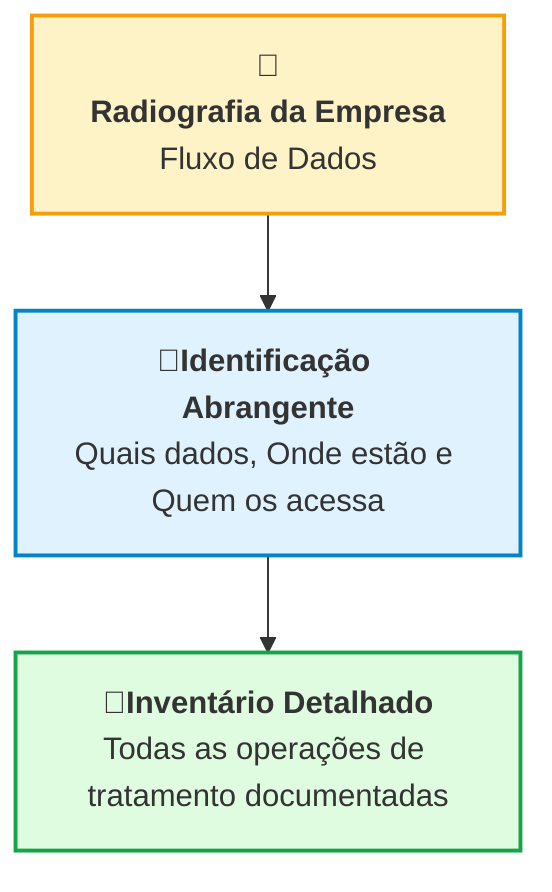
```mermaid
flowchart TB
    A[🔺<br><strong>Radiografia da Empresa</strong><br>Fluxo de Dados] --> B[📍<strong>Identificação Abrangente</strong><br>Quais dados, Onde estão e Quem os acessa]
    B --> C[📄<strong>Inventário Detalhado</strong><br>Todas as operações de tratamento documentadas]

    style A fill:#fef3c7,stroke:#f59e0b,stroke-width:2px
    style B fill:#e0f2fe,stroke:#0284c7,stroke-width:2px
    style C fill:#e0fce0,stroke:#16a34a,stroke-width:2px
```

- [ ] A velocidade da entrega de software também mudou com metodologias como DevOps e a adoção de microserviços, que exigem mais autonomia, comunicação aberta e equipes multifuncionais.
- [ ] A proliferação de microserviços aumenta a complexidade e a necessidade de controlar melhor os dados.
- [ ] Preocupações com privacidade e segurança também se tornaram prioridade máxima devido ao volume e variedade crescentes de dados e à regulamentação mais rigorosa (Lei Geral de Proteção de Dados(LGPD), General Data Protection Regulation (GDPR) , Lei de Privacidade do Consumidor da Califórnia (CCPA)).

Pontos de Reflexão:

- [ ] A complexidade da regulamentação e da ética de dados contrasta com a necessidade de desenvolvimento de software rápido?
- [ ] Empresas precisam de visibilidade e controle sobre dados pessoais, independentemente de onde estejam armazenados, isso exige governança interna mais forte e um ponto de vista mais defensivo sobre a gestão de dados?
- [ ] Como as empresas devem começar a pensar sobre gerenciamento dados e ético de dados?
- [ ] Quais medidas elas podem colocar em prática para garantir que estejam usando dados de consumidores, pacientes, RH, instalações e outras formas de dados apropriadamente em toda a cadeia de valor — da coleta à análise e insights?
- [ ] Embora considerações de privacidade e ética sejam essenciais sempre que as empresas usam dados (incluindo aplicativos de inteligência artificial e aprendizado de máquina), elas geralmente não são a principal preocupação de alguns executivos.
- [ ] Como  projetar uma arquiteturas e definir limites para determinar a propriedade?


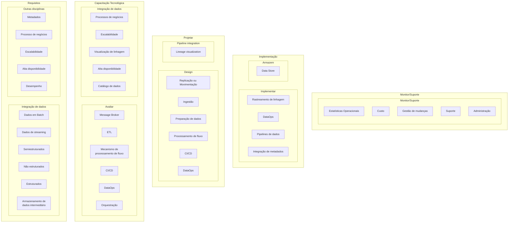
```mermaid
graph TD
subgraph 05 ["Monitor/Suporte"]
  subgraph ms01 ["Monitor/Suporte"]
    ms01id01["Estatísticas Operacionais"]
    ms01id02["Custo"]
    ms01id03["Gestão de mudanças"]
    ms01id04["Suporte"]
    ms01id05["Administração"]
  end
end
subgraph 04 ["Implementação"]
  subgraph imp01 ["Implementar"]
    direction LR
    imp01id01["Rastreamento de linhagem"]
    imp01id02["DataOps"]
    imp01id03["Pipelines de dados"]
    imp01id04["Integração de metadados"]
  end
  subgraph imp02 ["Armazem"]
    direction LR
    imp02id01["Data Store"]
  end
end
subgraph 03 ["Projetar"]
  subgraph dsg01 ["Design"]
    direction LR
    dsg01id01["Replicação ou Movimentação"]
    dsg01id02["Ingestão"]
    dsg01id03["Preparação de dados"]
    dsg01id04["Processamento de fluxo"]
    dsg01id05["CI/CD"]
    dsg01id06["Transformação"]
    dsg01id06["Orquestração"]
    dsg01id06["ETL"]
    dsg01id06["DataOps"]
  end
  subgraph dsg02 ["Pipeline integration"]
    direction LR
    dsg02id01["Lineage visualization"]
  end
end

subgraph 02 ["Capacitação Tecnológica"]
  subgraph ct01 ["Avaliar"]
   direction LR
   ct01id01["Message Broker"]
   ct01id02["ETL"]
   ct01id03["Mecanismo de</br>processamento de fluxo"]
   ct01id04["CI/CD"]
   ct01id05["DataOps"]
   ct01id06["Orquestração"]
  end
  subgraph ct02 ["Integração de dados"]
    direction LR
    ct02id01["Processos de negócios"]
    ct02id02["Escalabilidade"]
    ct02id03["Visualização de linhagem"]
    ct02id04["Alta disponibilidade"]
    ct02id05["Recuperação de desastres"]
    ct02id05["Catálogo de dados"]
  end
end
subgraph 01 ["Requisitos"]
  direction LR
  subgraph req01 ["Integração de dados"]
     direction LR
     req01id01[Dados em Batch]
     req01id02[Dados de streaming]
     req01id03[Semiestruturados]
     req01id04[Não estruturados]
     req01id05[Estruturados]
     req01id06[Armazenamento de</br> dados intermediário]
  end
  subgraph req02 ["Outras disciplinas"]
    direction LR
    req02id01[Metadados]
    req02id02[Processo de negócios]
    req02id03[Escalabilidade]
    req02id04[Alta disponibilidade]
    req02id05[Desempenho]
  end
end
```

## Associações e seus Frameworks

- [ ] **DAMA-DMBoK**  : _Define o modelo para gerenciamento de ativos de dados alinhando-o com a estratégia organizacional para estabelecer requisitos de dados estratégicos e projetos para atender a esses requisitos_
- [ ] **TOGAF** :_Uma descrição da estrutura e interação dos principais tipos e fontes de dados da empresa, ativos de dados lógicos, ativos de dados físicos e recursos de gerenciamento de dados._

### DAMA
Data Management Association é uma organização internacional voltada para o avanço das melhores práticas em gestão de dados.

DMBOK (Data Management Body of Knowledge) é o guia produzido pela DAMA que consolida essas melhores práticas. Ele serve como um “framework” para gestão de dados, contendo áreas de conhecimento como:

- [ ] Governança de Dados;
- [ ] Qualidade de Dados;
- [ ] Arquitetura de Dados;
- [ ] Segurança de Dados;
- [ ] Integração de Dados;
- [ ] Armazenamento e Recuperação;
- [ ] Gerenciamento de Metadados;
- [ ] Gerenciamento de Dados Mestres e de Referência.

O foco do DMBOK é garantir que os dados da organização sejam gerenciados como um ativo estratégico.

![[../img/dama-data-governance.png]]{width="400" height="400" style="display: block; margin: 0 auto" }

### TOGAF e The Open Group
The Open Group — um consórcio que promove padrões tecnológicos abertos.

TOGAF (The Open Group Architecture Framework) é um framework para arquitetura corporativa, desenvolvido pelo

TOGAF cobre:

- [ ] Arquitetura de Negócio;
- [ ] Arquitetura de Aplicações;
- [ ] Arquitetura de Dados;
- [ ] Arquitetura Tecnológica;
- [ ] Ciclo de Desenvolvimento de Arquitetura (ADM – Architecture Development Method);
- [ ] Governança de Arquitetura;

TOGAF oferece uma abordagem estruturada para projetar, planejar, implementar e governar a arquitetura corporativa.

![[../img/togaf-data-governance.png]]{width="600" height="450" style="display: block; margin: 0 auto" }

A comparação entre o **DMBOK (Data Management Body of Knowledge)** e o **TOGAF (The Open Group Architecture Framework)** no que tange à **Arquitetura de Dados** envolve entender como cada framework trata o tema, seus enfoques, escopos e aplicabilidades. Abaixo está uma análise comparativa:

### Unificando a visão

| Aspecto            | **DMBOK**                                 | **TOGAF**                                                        |
| ------------------ | ----------------------------------------- | ---------------------------------------------------------------- |
| **Foco Principal** | Governança e gestão de dados corporativos | Arquitetura Corporativa (Negócio, Dados, Aplicações, Tecnologia) |
| **Área Central**   | Gestão de dados como ativo estratégico    | Integração de domínios arquiteturais para suporte ao negócio     |
| **Público-alvo**   | Profissionais de gestão de dados          | Arquitetos corporativos e de TI                                  |

#### **Arquitetura de Dados**

| Critério                               | **DMBOK**                                                                                | **TOGAF**                                                                                        |
| -------------------------------------- | ---------------------------------------------------------------------------------------- | ------------------------------------------------------------------------------------------------ |
| **Objetivo com Dados**                 | Promover boas práticas em governança, qualidade, integração e arquitetura de dados       | Projetar a arquitetura de dados alinhada às necessidades do negócio e da TI                      |
| **Definição de Arquitetura de Dados**  | Estrutura de alto nível para armazenar, gerenciar e integrar dados corporativos          | Modelos, princípios e padrões que descrevem a estrutura dos ativos de dados                      |
| **Escopo da Arquitetura de Dados**     | Estrutura de governança, metadados, qualidade, segurança, modelagem, integração etc.     | Modelagem de dados de alto nível (conceitual e lógica), definição de entidades e relacionamentos |
| **Detalhamento Técnico**               | Foca mais em práticas e funções de gestão (ex: modelagem de dados, MDM, glossário, etc.) | Envolve fases detalhadas no ADM (Architecture Development Method), especialmente a Fase C        |
| **Relacionamento com Outros Domínios** | Interação com governança, qualidade, segurança, metadados e arquitetura corporativa      | A Arquitetura de Dados é uma das quatro principais (junto de Negócios, Aplicações e Tecnologia)  |

#### **Processo de Desenvolvimento da Arquitetura de Dados**

| Etapa / Atividade          | **DMBOK**                                                                            | **TOGAF (Fase C – Data Architecture)**                                                |
| -------------------------- | ------------------------------------------------------------------------------------ | ------------------------------------------------------------------------------------- |
| Levantamento de requisitos | Análise de domínios de dados, glossários, necessidades de governança                 | Requisitos de negócio identificados na Fase B (Business Architecture)                 |
| Modelagem de Dados         | Modelagem conceitual, lógica e física, centrada na qualidade e usabilidade           | Modelos conceitual e lógico são desenvolvidos, integrando visão de negócio            |
| Integração com aplicações  | Discussão sobre interoperabilidade e integração via MDM, ETL, e Data Warehousing     | A integração é realizada nas fases posteriores (Fase D – Application Architecture)    |
| Governança de Dados        | Um dos pilares centrais do DMBOK – políticas, papéis, processos e métricas definidos | Endereçado de forma mais ampla no TOGAF, mas não com o nível de profundidade do DMBOK |
| Ferramentas e padrões      | Recomendação de uso de padrões como DAMA-DMBOK, CMMI-DMM, DCAM, etc.                 | Sugestão do uso de metamodelos, frameworks como ArchiMate, e ferramentas de modelagem |

#### **Nível de Profundidade e Aplicabilidade**

|Aspecto|**DMBOK**|**TOGAF**|
|---|---|---|
|**Profundidade na Gestão de Dados**|Alta – foco detalhado em domínios e práticas de dados|Moderada – foco em dados dentro do contexto corporativo|
|**Abordagem Prática**|Descritiva e orientada a processos de gestão|Metodológica e orientada a fases e desenvolvimento arquitetural|
|**Aplicabilidade Organizacional**|Recomendado para organizações com maturidade em gestão de dados|Recomendado para organizações com visão integrada de arquitetura|

#  **Identificação do Problema**
Registros com informações faltantes, duplicação de dados, risco de exposição de informações sensíveis, especialmente em conformidade com regulamentações como a LGPD, ausência de controles de acesso adequados, permitindo que usuários não autorizados acessem informações confidenciais, silos de dados (dificuldade em integrar dados de diferentes fontes, resultando em visões fragmentadas das informações), entre outros.

Essa fragmentação de informações causa inconsistências com a análise de dados de atendimento, financeiro e administrativo, dificultando a comunicação com os fornecedores (prestadores de serviço, parceiros) e compromete a eficácia no atendimento ao cliente.

- [ ] Os dados são compartilhados e usados por muitos, para muitos propósitos diferentes. **Então, quem é o dono deles**?
- [ ] Quem toma decisões sobre eles e é responsável quando os dados estão “errados”?
- [ ] Inexistência de fluxo padrão para o cadastro dos principais dados mestres;
- [ ] Ausência de padronização descritiva, gerando produtos duplicados ou incompletos;
- [ ] Ausência da definição de papéis e responsabilidades;
- [ ] Falta de documentação clara sobre políticas e procedimentos pode levar a erros.
- [ ] Dificuldades em manter a central em conformidade com leis e regulamentos de proteção de dados.
- [ ] Dificuldade em gerar relatórios úteis e insights a partir dos dados armazenados.
- [ ] Várias bases de dados Analíticas e acesso a informações que não refletem a realidade atual da organização.

### Problemas Diversos

- [ ] Chamados negados e sem transparencia para o Cliente (Ocorre principalmente no início de cada mes);

```
Problema na identificacao da Instancia do Bem do CONTRATO: XXXXX.XXXX e AGENCIA/SAG: 9999.XX. NAO localizado instancia válida com parametros:
Favor, cadastrar/corrigir a instancia no modulo XXX do XXXXXXXXXXXXX.
```

- [ ] Notas Fiscais Denegadas;

```
A Inscrição Estadual do XXXXX foi desativada pela SEFAZ (XXXX atuando para regularização), não podemos emitir NFe do XXXX e contra o XXX, são todas denegadas.
```

- [ ] Consultoria exige a PDM (Padronização da Descrição do Material)

```
Necessidade em se Padronizar a Descrição de Material
Necessidade em se adotar critérios para o cadastramento de NCM
```

- [ ] Erros logísticos e/ou financeiros (pesos indevidos, endereços desatualizados);
- [ ] Autuação Fiscal;
	- [ ] Falta de Escrituração;
	- [ ] Escrituração em Duplicidade;
- [ ] Calculo Incorreto de Impostos.

#### Padronização da Descrição do Material
Definir as políticas e regras relacionadas à manutenção do cadastro de materiais. Centralização do cadastramento, abrangência, incorporações, homologação, saneamento dos estoques, gerenciamento de requisitos, processos para controle e auditoria, bem como responsabilidades funcionais.

Em termos da identificação, o princípio mais importante que costumamos destacar no manual PDM é que “a finalidade do código é identificar, e não catalogar”, pois temos constatado que o equivoco mais usual é codificar os materiais por aplicação, no entanto aprendemos que “diferentes aplicações não determinam diferentes códigos”.

Enfim, para identificar corretamente, o código deve possuir os seguintes atributos:

<div class="mdx-columns2" markdown>
- [ ] Unicidade: Apenas um código para cada SKU (Stock Keeping Units, ou unidades distintas mantidas em estoque);
- [ ] Simplicidade: Deve ser fácil de compreender e utilizar;
- [ ] Formato: Deve ser estruturado, de preferência com uma numeração sequencial automatizada;
- [ ] Conciso: Deve ser sucinto e objetivo;
- [ ] Expansividade: Deve suportar o crescimento da empresa;
- [ ] Operacionalidade: Deve ser prático e robusto;
- [ ]  Versatilidade: Deve prever suas diversas aplicações;
- [ ] Estabilidade: Deve ser perene;
- [ ] Confiabilidade: Deve assegurar a identificação esperada.
- [ ] Classificação UNSPSC (Universal Standard Products and Services Classification): Classifica os itens dentro de ramificações, seguindo uma hierarquia de importância numa árvore baseada na natureza dos materiais.
- [ ] Classificação NCM (Nomenclatura Comum do Mercosul): Baseada no "Sistema Harmonizado de Designação e Codificação de Mercadorias" para facilitar as transações entre Brasil, Argentina, Paraguai e Uruguai, estabelecendo tarifas comuns. No Brasil a NCM está conjugada com a tabela de incidência de impostos sobre produtos industrializados (IPI).
</div>

Mapear os dados de uma organização requer uma compreensão profunda do cenário do sistema e do processo de manutenção dos dados. O mapeamento de dados abrange:

<div class="mdx-columns2" markdown>
- [ ] Identificação de ativos de dados e seus repositórios;
- [ ] Identificar e definir os atuais proprietários dos dados;
- [ ] Descrever os fluxos de dados e as regras de distribuição de dados;
- [ ] Descrever os padrões de dados atuais, incluindo regras de validação;
</div>

# Por que achamos de suma importância?
Tem que ser um espécie de protocolo de comunicação que traz diversos benefícios e oportunidades, como seguem:
## Melhoria do Processo

- [ ] Prover dados relevantes e confiáveis para o negócio;
- [ ] Construir uma Base única de verdade;
- [ ] Melhorar o COMPLIANCE da Organização;
- [ ] Apoiar o desenvolvimento de modelos de IA modernizando as suas capacidades de dados.

# **Governado**
O propósito de executar a Governança de Dados é mover dados de um **estado não governado para um estado governado**

Dados governados são dados que são confiáveis e compreendidos e pelo qual, alguém é responsável por ambos os dados em si e para abordar questões sobre os dados.

{width="600" height="450" style="display: block; margin: 0 auto" }
## Catalogoção de Dados Empresariais
A promessa de inovação e criação de valor, no entanto, que havia sido o argumento inicial a favor de investimentos massivos nas infraestruturas das organizações, mal havia dado frutos, além de alguns casos de uso impulsionados por equipes pioneiras e entusiasmadas. Estas falhas possivelmente estariam vindo de diversas fontes de dados,

- [ ] Pântanos de dados com enormes espaços de armazenamento contendo dados cujo conteúdo e origem eram desconhecidos de todos e que ninguém sabia como usar;as organizações começaram a migrar (ou criar) suas infraestruturas analíticas;
- [ ] Instituições migrando para a nuvem e a repensar a melhor forma de gerenciar volumes de dados que precisavam explorar;
## **Visão Acadêmica**
Quem nunca ouviu uma área de negócio reclamar que precisa analisar alguma informação importante, mas que a devs/areas de desenvolvimento estão demorando muito pra entregar.

- [ ] **Falta dos responsáveis pelos dados**: Quem são os responsáveis pelos dados?
- [ ] **Problemas de Qualidade dos dados**: O time de infraestrutura é responsável pela qualidade, mas não conhece os dados tão bem, pois não estão intimamente ligados com o time de negócio.
- [ ] **Escalabilidade Organizacional**: O time centralizado de ETL se torna o gargalo na democratização dos dados na empresa.
### Como ?
- [ ] O que as pessoas estão procurando?
- [ ] O que um cientista de dados estaria procurando?
- [ ] Gestor de proteção de dados?
- [ ] Gestor de segurança da informação?

![[google.png]]{width="600" height="450" style="display: block; margin: 0 auto" }

No fim das contas, todos nós estamos em busca de algo. E buscamos o tempo todo. O problema é que, no trabalho, é muito difícil procurar o que estamos tentando encontrar. E tomamos isso como verdade, como algo que devemos simplesmente aceitar.

### Catálogo de Dados
Em essência, um catálogo de dados é um inventário organizado dos dados da sua empresa. Fornece uma visão geral apenas no nível de metadados e, portanto, nenhum valor.
de dados real é exposto. Então, podemos definir que um catálogo de dados é basicamente um banco de dados com metadados que foram obtidos ou enviados de fontes de dados no ambiente de TI de uma determinada empresa.

O catálogo de dados são organizados em domínios que contêm ativos. Os ativos são representações de metadados de dados em sistemas de origem.

Um catálogo de dados é uma ferramenta colaborativa. Ele só terá sucesso se muitas pessoas o utilizarem ativamente e de forma federada.

|                        |                                                                                                                                                       |
| ---------------------- | ----------------------------------------------------------------------------------------------------------------------------------------------------- |
| Visão geral do cenário | Fontes de dados nele contidas, além de listar as<br>pessoas ou funções associadas                                                                     |
| Organizar dados        | Ativo é uma entidade de dados que existe em seu ambiente de TI.                                                                                       |
|                        | Fonte de dados refere-se à origem dos dados que<br>estão sendo expostos em nível de metadados no catálogo de dados                                    |
|                        | domínio é um grupo de ativos que logicamente pertencem um ao outro                                                                                    |
|                        | A linhagem de dados descreve como os dados trafegam de um sistema<br>para outro e, idealmente, como os dados são transformados durante o trajeto.     |
| Descoberta de dados    | Permite que todos os funcionários pesquisem todos os dados da empresa.                                                                                |
|                        | Análise de dados<br>                                                                                                                                  |
|                        | Governança de dados: Capacidade de classificar todos os dados em seu ambiente de TI, tanto em termos de sensibilidade<br>quanto de confidencialidade. |

### Funções e responsabilidades do usuário final
Os usuários finais de um catálogo de dados se enquadram em três categorias:

- [ ] Usuários finais de análise de dados;
- [ ] Usuários finais de governança;
- [ ] Usuários finais do dia a dia;

Todos os usuários finais têm uma ou mais das seguintes funções e responsabilidades no catálogo de dados:

| Quem                           | O que?                                                                                                                           |
| ------------------------------ | -------------------------------------------------------------------------------------------------------------------------------- |
| Proprietário da fonte de dados | Proprietário do sistema ou guardião dos dados no gerenciamento de dados tradicional.                                             |
| Proprietário do domínio        | Define quais ativos pertencem ao domínio e quem deve ter as diferentes funções no domínio                                        |
| Administrador de domínio       | Conduz entrevistas com futuros proprietários de fontes de dados, gerenciar a arquitetura de domínio e fornecer acesso aos dados. |
| Proprietário do ativo          | Proprietário dos dados na fonte de dados                                                                                         |

### Organizando Domínios no Catálogo de Dados
Um domínio agrupa ativos que logicamente pertencem juntos, cabendo aos proprietários dos domínios definir quais ativos serão incluídos em seus domínios.


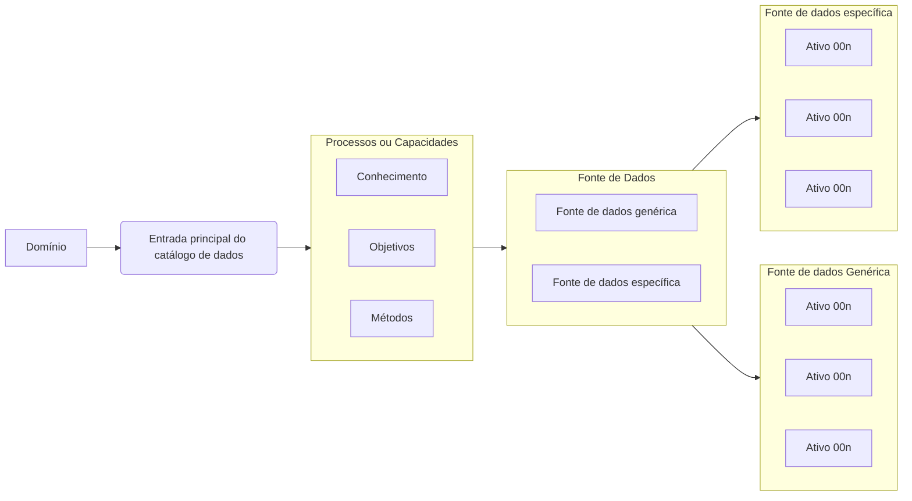
```mermaid
flowchart LR
    A[Domínio] -->B(Entrada principal do catálogo de dados)
    subgraph id01["Processos ou Capacidades"]
       direction LR
       id0101[Conhecimento]
       id0102[Objetivos]
       id0103[Métodos]
    end
    B --> id01
    subgraph id02["Fonte de Dados"]
      direction LR
     id0201[Fonte de dados genérica]
     id0202[Fonte de dados específica]
    end
    id01 --> id02
    subgraph id03["Fonte de dados específica"]
       direction LR
       id0301[Ativo 00n]
       id0302[Ativo 00n]
       id0303[Ativo 00n]
    end
    subgraph id04["Fonte de dados Genérica"]
       direction LR
       id0401[Ativo 00n]
       id0402[Ativo 00n]
       id0403[Ativo 00n]
    end
    id02 --> id03 & id04
```


|                                               |                                                                                                                                                                                                                                                                                                                                  |
| --------------------------------------------- | -------------------------------------------------------------------------------------------------------------------------------------------------------------------------------------------------------------------------------------------------------------------------------------------------------------------------------- |
| Processos ou Capacidade                       | Organizando os dados em uma estrutura que representa a empresa na qual os dados são criados. As capacidades consistem em pessoas, processos e tecnologia.                                                                                                                                                                        |
|                                               | Um domínio de processo é definido com base em como as coisas são feitas.                                                                                                                                                                                                                                                         |
|                                               | Capacidade descreve quais tarefas uma empresa executa — do que a empresa é capaz.                                                                                                                                                                                                                                                |
| Fontes de dados                               | A fonte de dados genérica é um componente tecnológico. Essas tecnologias podem ser bancos de dados, data lakes ou data warehouses e aplicativos reais. Se refere ao componente de software, como Tableau, Qlik Sense,  Power BI e etc.                                                                                           |
|                                               | Uma fonte de dados específica significa simplesmente que se trata de uma instância específica da fonte de dados genérica. Nesse caso, trata-se de uma assinatura específica do Power BI.                                                                                                                                         |
| Metadados de ativos                           |                                                                                                                                                                                                                                                                                                                                  |
| Metadados derivados da fonte de dados         | Metadados técnicos: Informam exatamente em qual fonte de dados o ativo está armazenado, quem o criou, quando o ativo foi criado, o formato do arquivo, etc.                                                                                                                                                                      |
|                                               | Metadados de negócios: Descrevem o ativo em linguagem humana, por exemplo, nomes de tabelas e colunas, descrições e definições de tipos de dados, etc.                                                                                                                                                                           |
| Metadados adicionados ao catálogo<br>de dados | Descrições, pessoas e termos do glossário, aos ativos do seu catálogo de dados. As descrições devem conter o uso primário e secundário. O uso primário é uma breve explicação sobre a finalidade do ativo na fonte de dados de onde foi extraído/enviado. No uso secundário, a  sugestões do provedor de dados aos consumidores. |
|                                               |                                                                                                                                                                                                                                                                                                                                  |

#### Processos e Capacidades
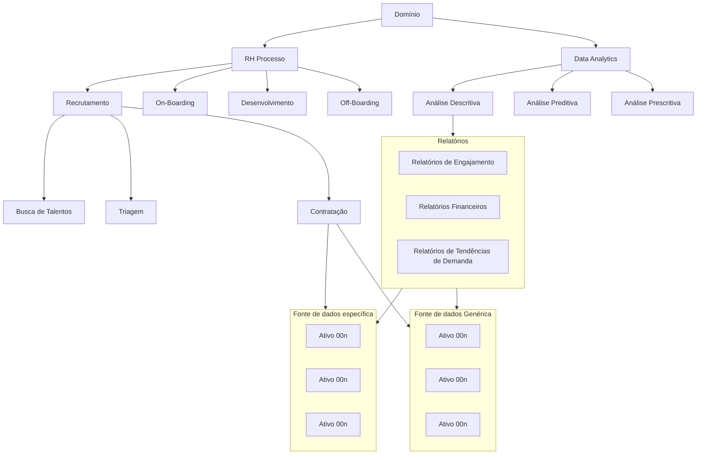
```mermaid
flowchart TD
    A[Domínio] -->B["RH Processo"]
    B --> B0[Recrutamento] & B1[On-Boarding] & B2[Desenvolvimento] & B3[Off-Boarding]
    B0 --> B001[Busca de Talentos] & B002[Triagem] & B003[Contratação]
    A --> C[Data Analytics]
    C --> C00[Análise Descritiva] & C01[Análise Preditiva] & C02[Análise Prescritiva]
    subgraph id01 [Relatórios]

      id0101[Relatórios de Engajamento]
      id0102[Relatórios Financeiros]
      id0103[Relatórios de Tendências de Demanda]
    end
    subgraph id03["Fonte de dados específica"]
       id0301[Ativo 00n]
       id0302[Ativo 00n]
       id0303[Ativo 00n]
    end
    subgraph id04["Fonte de dados Genérica"]

       id0401[Ativo 00n]
       id0402[Ativo 00n]
       id0403[Ativo 00n]
    end
    C00 --> id01 --> id03 & id04
    B003 --> id03 & id04
```

**Observação**: Não caia na tentação de construir seus domínios diretamente com base em sua Estrutura Organizacional. Nossa organização muda o tempo todo: equipes são fundidas, divididas, terceirizadas, recriadas e reorganizadas constantemente — e você acaba mantendo uma arquitetura de domínio em constante mudança em vez de atender à descoberta de dados.
Não li, mas vi que tinha uma matéria sobre [Enciclopédia da Organização do Conhecimento](https://www.isko.org/cyclo/knowledge_organization)
#### Glossários
Os glossários são listas de palavras que descrevem sua empresa e são controlados em vários graus, por uma equipe de glossário de domínio ou por uma equipe de glossário global centralizada.

|                      |                                                                                                                                                        |
| -------------------- | ------------------------------------------------------------------------------------------------------------------------------------------------------ |
| Glossário gratuito   | O glossário gratuito é uma folksonomia. Folksonomias são glossários gerados por usuários que organizam ativos por meio de tags.                        |
| Glossário de domínio | Um glossário de domínio é uma taxonomia. Taxonomias têm uma hierarquia.                                                                                |
| Glossário global     | O glossário global é um dicionário de sinônimos. É uma estrutura que se afasta do pensamento hierárquico e caminha em direção ao pensamento de cluster |

#### Classificação Segurança e Privacidade
A classificação de dados sob a perspectiva do CISO (**Chief Information Security Officer**) e do DPO (**Data Protection Officer**), estamos nos referindo principalmente ao risco, à proteção legal e à privacidade dos dados.

| Critério         | CISO (Segurança)                      | DPO (Privacidade)                               |
| ---------------- | ------------------------------------- | ----------------------------------------------- |
| Foco principal   | Confidencialidade e integridade       | Privacidade e conformidade legal                |
| Base legal       | Normas de segurança (ISO 27001, etc.) | LGPD / GDPR                                     |
| Dados analisados | Todos os tipos de dados da empresa    | Apenas dados pessoais e sensíveis               |
| Medidas comuns   | Controle de acesso, criptografia      | Consentimento, base legal, relatório de impacto |
| Objetivo         | Proteger a informação                 | Proteger o titular de dados                     |

Na perspectiva do DPO, podemos classificar os dados com foco em **privacidade, consentimento, base legal e direitos do titular** e pelo CISO

| Tipo                    | Entenda                                                                          | Exemplo                                                               |
| ----------------------- | -------------------------------------------------------------------------------- | --------------------------------------------------------------------- |
| Pessoais                | Qualquer dado que identifique ou possa identificar um indivíduo.                 | nome, CPF, e-mail, endereço IP.                                       |
| Pessoais Sensíveis      | Dado pessoal que, se tratado indevidamente, pode causar discriminação.           | origem racial, religião, opinião política, dados de saúde, biometria. |
| Anonimizados            | Não identificam a pessoa, de forma irreversível.                                 |                                                                       |
| Pseudonimizados         | Identificação removida, mas ainda reversível.                                    | Exige cuidados e pode ainda ser considerado dado pessoal.             |
| Crianças e Adolescentes | Exigem consentimento específico dos pais/responsáveis.                           | Sujeitos a regras especiais de tratamento.                            |
|                         |                                                                                  |                                                                       |
| Públicos                | Sem restrições de acesso.                                                        |                                                                       |
| Internos                | Uso restrito aos funcionários, mas sem causar grandes danos se vazados.          |                                                                       |
| Confidenciais           | Vazamento pode causar impacto à operação, à reputação ou gerar sanções.          | contratos, informações financeiras.                                   |
| Restritos / Sigilosos   | Críticos para a organização; requerem criptografia, controle de acesso rigoroso. | senhas, estratégias de segurança, P&D.                                |

Podemos utilizar o conceito de  **Personally Identifiable Information (PII - Informações Pessoais Identificáveis)**, para qualquer dado que possa identificar direta ou indiretamente uma pessoa física viva.

Uma das tarefas mais importantes ao projetar arquiteturas é **definir limites para determinar a propriedade**.

Uma metodologia comum é o Domain-Driven Design (DDD),  em contextos Limitados (Bounded Contexts) são usados para definir limites lógicos que ajudam a gerenciar a complexidade, garantindo que as equipes saibam quais aspectos podem mudar de forma independente e quais são dependências compartilhadas que exigem coordenação.

| **Categoria de Dados**  | **Tipo de Dado Pessoal (PII)**           | **Titular**       | **Finalidade do Tratamento**       | **Base Legal (LGPD)**              | **Onde está armazenado?**               | **Quem tem acesso?**      | **Prazo de Retenção**   | **Compartilhado com Terceiros?** | **Autorização do Titular?**     |
| ----------------------- | ---------------------------------------- | ----------------- | ---------------------------------- | ---------------------------------- | --------------------------------------- | ------------------------- | ----------------------- | -------------------------------- | ------------------------------- |
| Dados de clientes       | Nome, CPF, e-mail, telefone              | Cliente           | Cadastro e emissão de nota fiscal  | Execução de contrato               | Sistema ERP / Banco de dados / PaaS     | Financeiro, Atendimento   | Verificar temporalidade | Sim – Contabilidade externa      | Não aplicável                   |
| Dados de funcionários   | RG, endereço, CTPS, salário              | Colaborador       | Registro trabalhista               | Obrigação legal                    | LG / SaaS                               | RH, Contabilidade         | Verificar temporalidade | Sim – Governo, eSocial           | Não aplicável (obrigação legal) |
| Dados de candidatos     | Currículo, e-mail, telefone              | Candidato a vaga  | Processo seletivo                  | Consentimento                      | Plataforma de Recrutamento              | RH                        | Verificar temporalidade | Não                              | Sim (via formulário)            |
| Dados de navegação      | IP, cookies, localização                 | Visitante do site | Analytics, remarketing             | Legítimo interesse / Consentimento | Google Analytics / CRM                  | Marketing, TI             | Verificar temporalidade | Sim – Ferramentas de análise     | Sim                             |
| **Dados de benefícios** | Nome, CPF, matrícula, e-mail corporativo | Colaborador       | Ativação de convênio com TotalPass | Consentimento explícito            | Plataforma de RH / Gestão de Benefícios | RH, Parceiros autorizados | Verificar temporalidade | **Sim – Empresas de Convenios**  | **Sim (formulário de adesão)**  |

Objetivando a criação de uma classificação simples, podemos pensar em formular perguntas simples do tipo:

- [ ] Se os dados fossem divulgados acidentalmente, qual seria o dano causado?
- [ ] Todos os seus ativos têm um nível de sensibilidade?
- [ ] As fontes de dados são extraídas e enviadas para um catálogo de dados, usando rastreadores prontos para uso do catálogo de dados, armazenamentos de dados somente leitura (RDSs), APIs e streaming?
- [ ] A estrutura de domínio tem três camadas que consistem em processos ou capacidades, fontes de dados e ativos?

## Pesquisa em dados versus Pesquisa de dados
- [ ] Pesquisar em dados é quando buscamos algo que queremos saber nos dados reais.
	- [ ] Quantas pessoas visualizaram meu perfil no Linkedin? 100.
- [ ] Pesquisar dados é quando procuramos as fontes que contêm os dados que precisamos.
	- [ ] Onde podemos encontrar dados sobre o tráfego em nosso site?

Fontes que devem ser olhadas:

- [ ] [Data Management Body of Knowledge (DAMA-DMBOK)](https://dama.org/learning-resources/dama-data-management-body-of-knowledge-dmbok/)
- [ ] [Introdução à Biblioteconomia e Ciência da Informação](https://csi.pressbooks.pub/lis/)


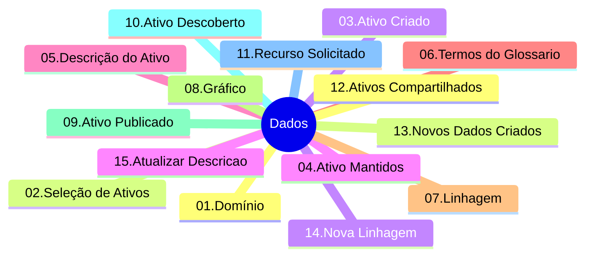
```mermaid
mindmap
  root((Dados))
    01.Domínio
    02.Seleção de Ativos
    03.Ativo Criado
    04.Ativo Mantidos
    05.Descrição do Ativo
    06.Termos do Glossario
    07.Linhagem
    08.Gráfico
    09.Ativo Publicado
    10.Ativo Descoberto
    11.Recurso Solicitado
    12.Ativos Compartilhados
    13.Novos Dados Criados
    14.Nova Linhagem
    15.Atualizar Descricao
```


### Produtos de Catálogo de Dados
Ao escolher seu catálogo de dados, você deve primeiro considerar os recursos específicos da arquitetura corporativa, pois eles são mais permanentes do que a tecnologia que o executa.

|                                                         |                                                                                                                                                                                                                                                                   |                                                                                                                                                                                                                                                                                                                                                                                                                        |
| ------------------------------------------------------- | ----------------------------------------------------------------------------------------------------------------------------------------------------------------------------------------------------------------------------------------------------------------- | ---------------------------------------------------------------------------------------------------------------------------------------------------------------------------------------------------------------------------------------------------------------------------------------------------------------------------------------------------------------------------------------------------------------------- |
| Linhagem de dados                                       | Mapa sempre atualizado e preciso de como os dados realmente se movem                                                                                                                                                                                              | https://www.octopai.com/ e                                                                                                                                                                                                                                                                                                                                                                                             |
| Compartilhamento de dados                               | Os contratos de dados e a qualidade dos dados compartilhados podem ser medidos para indicar em que medida os dados fornecidos pelo provedor de dados atendem às  demandas do consumidor de dados.                                                                 | https://github.com/great-expectations/great_expectations                                                                                                                                                                                                                                                                                                                                                               |
| Construção personalizada                                | A construção personalizada também é uma opção — você pode criar seu próprio catálogo de dados.                                                                                                                                                                    | https://www.microsoft.com/pt-br/security/business/risk-management/microsoft-purview-data-governance/#overview ou https://cloud.google.com/data-catalog/docs/concepts/overview?hl=pt-br ou https://docs.aws.amazon.com/glue/latest/dg/catalog-and-crawler.html ou https://www.sap.com/products/technology-platform/data-intelligence/features.html#data-catalog ou https://www.palantir.com/search?query=data%20catalog |
| Inteligência de dados                                   | Caso de uso estratégico para catálogos de dados que exigem um vasto conjunto de componentes para funcionar.                                                                                                                                                       | https://www.collibra.com/ ou https://www.alation.com/lp/br-demo-request/                                                                                                                                                                                                                                                                                                                                               |
| Governança de dados                                     | Concentra na governança de dados como sua principal capacidade deve monitorar e espelhar os requisitos apresentados  em padrões e regulamentações para governança de dados, por exemplo, a série ISO 27000 e LGPD.                                                | https://www.onetrust.com/solutions/data-use-governance/                                                                                                                                                                                                                                                                                                                                                                |
| Catálogos de dados baseados em gráficos de conhecimento | gráficos de conhecimento permitem uma metamodelagem flexível, este  tipo de catálogo de dados permite modelar o universo de conhecimento da sua empresa em uma ontologia (**estudo ou conhecimento do ser**)                                                      | https://zeenea.com/ ou https://data.world/                                                                                                                                                                                                                                                                                                                                                                             |
| Observabilidade de dados                                | Realizada com uma abordagem baseada em streaming para catálogos de dados, que permite aos usuários observar os dados em tempo real.                                                                                                                               | https://datahub.com/ ou https://www.acryldata.io/company ou https://www.acceldata.io/ ou https://www.anomalo.com/ ou https://www.ataccama.com/ ou https://www.bigeye.com/ ou https://www.kensu.io/ ou https://www.montecarlodata.com/ ou                                                                                                                                                                               |
| Catálogo de catálogos                                   | Um catálogo que se sobrepõe a outros catálogos e expõe o conteúdo de todos eles. (Implementações isoladas e passadas de catálogos de dados ou Híbridos de catálogos de dados multicloud e locais ou  Recursos distintos e poderosos de vários catálogos de Dados) |                                                                                                                                                                                                                                                                                                                                                                                                                        |

## Responsabilidades sobre os Dados - Federar Responsabilidades-Chave
É a **pessoa ou função responsável por garantir a qualidade, integridade, segurança e uso adequado dos dados mestres** em uma organização. O **Data Owner** não é apenas "dono" no sentido de posse, mas sim **responsável por decisões e políticas** relacionadas a esses dados. Suas funções incluem:

| Responsabilidade           | Descrição                                                                               |
| -------------------------- | --------------------------------------------------------------------------------------- |
| **Qualidade do dado**      | Garante que o dado mestre esteja correto, completo e atualizado.                        |
| **Segurança e acesso**     | Define quem pode visualizar, editar ou excluir o dado.                                  |
| **Ciclo de vida**          | Controla a criação, alteração, inativação e exclusão dos dados (Temporalidade).         |
| **Conformidade**           | Assegura que os dados estejam em conformidade com normas (GPDR, PCI DSS, LGPD e HIPAA). |
| **Integração entre áreas** | Atua como ponte entre áreas de negócio e TI, promovendo uso consistente do dado.        |

| Aspecto                        | **Data Owner**                                                                | **Data Steward**                                             |
| ------------------------------ | ----------------------------------------------------------------------------- | ------------------------------------------------------------ |
| **Responsabilidade principal** | Propriedade, políticas e decisões estratégicas sobre o dado                   | Garantia da qualidade, consistência e integridade dos dados  |
| **Foco**                       | **Governança e conformidade**                                                 | **Operacionalização e manutenção**                           |
| **Autoridade**                 | Tem autoridade para aprovar uso, acesso e mudanças                            | Atua sob orientação do Data Owner                            |
| **Exemplo de decisões**        | - Quem pode acessar o dado?- Que regras se aplicam?- O que é "dado válido"?   | - Corrigir dados incompletos- Monitorar regras de qualidade  |
| **Papel no ciclo de vida**     | Define políticas para criação, atualização e arquivamento de dados            | Executa atividades de criação, manutenção e limpeza de dados |
| **Exemplos de funções**        | - Diretor Financeiro (dados contábeis)- Gerente de RH (dados de funcionários) | - Analista de Dados- Analista de Cadastro                    |
| **Relação com a TI**           | Trabalha com áreas de negócio, toma decisões de alto nível                    | Trabalha com TI para aplicar regras de dados                 |

## Contextos Limitados
Limites lógicos no espaço de solução, focados no design de sistemas e aplicações, pode ser uma desde que sejam únicas, mutuamente exclusivas e coletivamente exaustivas. O conjunto dessas aplicações dentro dos limites da instância de capacidade forma um contexto limitado.

Os domínios podem ser classificados com base nas características de distribuição e uso de dados:

- [ ] Domínios alinhados a sistemas fonte - onde os dados se originam, tipicamente transacionais/operacionais;
- [ ] Domínios alinhados a consumidores - que consomem e usam dados de outros domínios para casos de uso específicos;
- [ ] Domínios agregados - combinam dados de diferentes domínios para si mesmos e outros;
- [ ] Domínios construtores - criam novos dados com insights de negócio;

## Master Data Management (MDM)
O MDM é essencial em ambiente distribuído para consistência e confiança, focando em detectar e resolver inconsistencias, gerenciar governança, melhorar qualidade no hub.

- [ ] Identificar dados únicos/confiáveis nas aplicações/sistemas (**golden source**), entendo o contexto, regras de negócio, formatos de cada fonte.
- [ ] Projetar solução que harmonize/torne consistente
- [ ] MDM: coletar, linkar, limpar, integrar, match, enriquecer, distribuir; remover duplicados, corrigir inconsistências; foco em entity consolidation, cluster reduction.

Passos de design:

- [ ] Identificar dados mestres/referência,
- [ ] Escopo,
- [ ] identificar fontes,
- [ ] Definir modelo de dados (entidades, atributos, relações),
- [ ] Definir regras de qualidade, distribuição de melhorias de volta à fonte, propriedade de dados criados, aprovação de mudanças,
- [ ] Definições mestras no catálogo
## Classificação dos Dados

- [ ] **Dados Mestres (Master Data)**: Descrevem locais (estabelecimentos), entidades (pessoas (funcionários, parentescos, prestadores de serviço, temporários), clientes, fornecedores, instituição) e coisas que fazem parte de um contexto empresarial.

<div class="mdx-columns2" markdown>
- [ ] Business Partner (Customer, Vendor)
- [ ] Material Master
- [ ] Chart of Accounts / G/L Account Master
- [ ] Cost Center / Profit Center
- [ ] Work Center / Routing / BOM
- [ ] Asset Master
- [ ] Bank Master Data
- [ ] Plant / Storage Location / Company Code
- [ ] Pricing Conditions
- [ ] Project Definitions / WBS Elements
- [ ] Viagens / Projetos
- [ ] Meios de pagamento (Cartões corporativos - CONCUR)
- [ ] Empregados (Estagiário, Prestador de Serviço, Funcionário Concursado, Cedido e outros)
</div>

- [ ] **Dados de Referência (Reference Data)**: São um conjunto de valores ou esquemas de classificação que servem de apoio a um dado mestre; Isso parece contradizer Data Mesh, mas é necessário para conformação regulatória.

<div class="mdx-columns2" markdown>
- [ ] Unit of Measure
- [ ] Currencies
- [ ] Country / Region / Tax codes
- [ ] Material Groups / Product Hierarchy
- [ ] Payment Terms / Incoterms / Shipping Conditions
- [ ] Document Types
- [ ] Posting Periods / Fiscal Year Variants
- [ ]  Códigos de despesa (Expense Types)
- [ ] Regras de política de viagem e despesas
- [ ] Supplier Profile / SLP
- [ ] ategorias de produtos (UNSPSC)
- [ ] Códigos fiscais
- [ ] Tipos de serviço
- [ ] Posições / Cargos
- [ ] Estrutura Organizacional
- [ ] Unidades de Negócio / Departamentos
- [ ] Benefícios / Registros de compensação
</div>

- [ ] **Dados de referência externos**: APIs conectam os dados de referência a autoridades regulatórias externas, como agências governamentais ou conversores de moeda. Os dados recebidos são classificados e selecionados para se alinharem com os dados mestres estabelecidos.

	- [ ]  **Tabela de Background-Check**
		- [ ] A identificação de uma fonte segura para Dados Mestres/Referência e/ou a criação de estruturas de codificação faladas são fundamentais, para a iniciação de um processo de adaptação antes da migração de um sistema de Gestão. Estruturamos o levantamento das informações em QUATRO etapas:
		- [ ] Em um cenário empresarial em constante evolução, a gestão eficaz de informações tornou-se um fator crucial para o sucesso das organizações. No centro dessa transformação,  que visa otimizar o relacionamento com padrões, responsáveis, interagir fornecedores e aprimorar o atendimento ao cliente.
		- [ ] Não obstante a esta central e com a combinação do Master Data Management/Governance (MDM/MDG) e Inteligência Artificial (IA), poderíamos automatizar o processo de detecção e correção de erros de dados, recomendações de itens duplicados, identificar e mitigar potenciais riscos de conformidade.

| **Fase**                             | **Objetivo**                                                                                                                                                                                                              |
| ------------------------------------ | ------------------------------------------------------------------------------------------------------------------------------------------------------------------------------------------------------------------------- |
| **Levantamento de Dados Existentes** | Mapeamento das fontes atuais de dados dentro da organização;                                                                                                                                                              |
| **Definir Gestores de Dados**        | Estabelecer uma área responsável para a Análise da Qualidade, Definição de Critérios, Designação de um Líder de Dados e a elaboração de um processo de Monitoramento e Revisão para assegurar a continuidade da operação. |
| **Análise de Qualidade de Dados**    | Avaliar a precisão, completude e consistência dos dados coletados. Isso ajuda a identificar quais informações são confiáveis e quais precisam ser ajustadas ou eliminadas.                                                |
| **Definição de Critérios**           | Estabelecer critérios claros para a seleção de dados que serão considerados como fontes seguras, levando em conta fatores como frequência de atualização, legitimidade da origem e relevância para a operação.            |

- [ ] **Dados de referência interna**: As definições e categorias permanecem relevantes para os processos de negócios atuais e atendem às necessidades de todas as disciplinas de negócios. Garanta que os administradores de dados permaneçam consistentes na criação e no gerenciamento de dados de referência.
- [ ] **Dados transacionais**: São as informações operacionais cotidianas em seus bancos de dados de CRM, ERP e HCM. Como por exemplo: Notas Fiscais, Ordens de Compra, Lançamentos Financeiros e etc.

<div class="mdx-columns2" markdown>
- [ ] Contratos (Sourcing, Buying)
- [ ]  Materiais / Catálogos
- [ ] Regras de política de viagem e despesas
- [ ] Requisições / Ordens de Compra
</div>
- [ ] **Dados não estruturados**: São dados de postagens em mídias sociais, e-mails, white papers ou chats de ajuda que são difíceis de categorizar.

## Pontos Chaves

<div class="mdx-columns2" markdown>
- [ ] Modelo de Dados;
- [ ] Qualidade dos Dados;
- [ ] Integração;
- [ ] Escalabilidade;
- [ ] Auditoria;
- [ ] Controle de Metadados;
- [ ] Workflow;
</div>


# **CSC(Centro de Serviço Compartilhado) para uma CC(Central de Cadastro)**

| **Função**                  | **Central de Cadastros**                                                                                                                                          | **Centro de Serviço Compartilhado (CSC)**                                                                                                                                   |
| --------------------------- | ----------------------------------------------------------------------------------------------------------------------------------------------------------------- | --------------------------------------------------------------------------------------------------------------------------------------------------------------------------- |
| **Principal**               | Centraliza e gerencia informações cadastrais de clientes, fornecedores, produtos, entre outros. É responsável por manter os dados atualizados e acessíveis.       | Centraliza e padroniza serviços de apoio, como finanças, recursos humanos, entre outros, para várias unidades de uma empresa.                                               |
| **Foco**                    | Dados e informações. A central de cadastros garante que todas as informações necessárias estejam corretas e disponíveis para diferentes departamentos da empresa. | Processos e serviços. O CSC busca otimizar a eficiência operacional e reduzir custos ao unificar serviços que seriam realizados separadamente por diferentes departamentos. |
| **Precisão e Consistência** | Reduz erros e duplicidades nos dados.                                                                                                                             | Melhora a produtividade e a qualidade dos serviços.                                                                                                                         |
|                             | Facilita a obtenção de informações precisas e atualizadas.                                                                                                        | Economiza recursos ao evitar duplicação de esforços                                                                                                                         |
|                             | Ajuda a empresa a cumprir regulamentações e normas de proteção de dados.                                                                                          | Garante que os processos sejam realizados de maneira uniforme e consistente.                                                                                                |
| **Similaridades**           |                                                                                                                                                                   |                                                                                                                                                                             |
| **Centralização**           | Ambos centralizam funções importantes para a empresa, seja de dados ou serviços.                                                                                  |                                                                                                                                                                             |
|                             | Visam aumentar a eficiência e reduzir custos operacionais.                                                                                                        |                                                                                                                                                                             |
|                             | Servem como suporte para outras áreas da empresa, permitindo que estas se concentrem em suas atividades principais.                                               |                                                                                                                                                                             |

## Estilos de implementação do Master Data Management (MDM)

| Estilo           | Entenda                                                                                                                             |
| ---------------- | ----------------------------------------------------------------------------------------------------------------------------------- |
| **Centralizado** | Em um estilo centralizado, os ERPs/CRMs e outros sistemas criam os dados mestres e os dissemina para outros sistemas ou aplicações. |
| **Consolidação** | Criação de um **golden records**, os sistemas de origem alimentam dados em um hub central para golden records.                      |
| **Coexistência** | Cria um hub de dados consolidado que então alimenta registros atualizados de volta para as fontes.                                  |

### Provedores de Dados e Consumidores de Dados
Todos os usuários que expõem seus dados em nível de metadados em um catálogo de dados são considerados provedores de dados: eles podem fornecer determinados dados mediante solicitação.


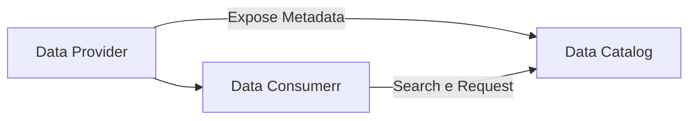
```mermaid
flowchart LR
id02["Data Provider"] --> |Expose Metadata| id01["Data Catalog"]
id03["Data Consumerr"] -->|Search e Request| id01
id02 --> id03
```


| Abordagem | Entenda                                      | Descrição                                                                                                                                                                                                                                                                                        |
| --------- | -------------------------------------------- | ------------------------------------------------------------------------------------------------------------------------------------------------------------------------------------------------------------------------------------------------------------------------------------------------ |
| ETL       | Extrair, Transformar e Carregar              | Os dados são extraídos de várias fontes, transformados de acordo com regras e lógica predefinidas e carregados em um destino de destino                                                                                                                                                          |
| ELT       | Extrair, Carregar e Transformar              | Os dados são extraídos de várias fontes, carregados em um destino de destino sem qualquer transformação e transformados sob demanda usando o poder de processamento do destino.                                                                                                                  |
| ETLT      | Extrair, Transformar, Carregar e Transformar | É uma abordagem híbrida de integração de dados, onde os dados são extraídos de várias fontes, transformados parcialmente de acordo com algumas regras básicas e lógicas, carregados em um destino de destino e transformados ainda mais sob demanda usando o poder de processamento do destino.  |

- [ ] SAP Business Data Cloud

#### Centralizado
A abordagem centralizada utiliza um data warehouse ou um data lake para toda a empresa, tornando os dados consumíveis. O papel do catálogo de dados nessa configuração é atuar como uma camada de
experiência para pesquisa sobre essa solução única e aprimorar a governança. Fontes de dados de toda a empresa são enviadas ou recebidas no catálogo de dados e, portanto, expostas em um nível de metadados no catálogo de dados.
O que significa que os dados devem ser extraídos dos sistemas de origem através de um processo de ETL ou ELT ou ETLT.

#### Descentralizada
Utiliza diversos RDSs (Relational Database Services), APIs (Application Programming Interfaces) e tecnologias de streaming em cada domínio da empresa para tornar os dados consumíveis.
As fontes de dados são expostas em um único catálogo global de dados, assim como na abordagem centralizada. Mas, na abordagem descentralizada, essas fontes de dados são disponibilizadas por meio das diversas tecnologias utilizadas pelos domínios. Isso significa que não há uma unidade de negócios centralizada nem uma tecnologia na qual os dados devam ser armazenados para que possam ser utilizados pelos usuários que os encontram no catálogo.

- [ ] Data Mesh: Delivering Data-Driven Value at Scale por Zhamak Dehghani;
- [ ] Data Management at Scale: Modern Data Architecture with Data Mesh and Data Fabric por Piethein Strengholt;


O conceito de malha de dados é idealista e voltado para o futuro - Não encontrei  tecnologia consegue, ainda, atender completamente à ambição de uma malha de dados, embora seu núcleo seja previsto para se basear no compartilhamento de dados via APIs.

#### Abordagem combinada
É uma abordagem parcialmente centralizada e parcialmente descentralizada. Isso significa que certos domínios usam a solução centralizada para expor e compartilhar seus dados, enquanto outros dependem de suas próprias soluções.

# **Ideia Central: Centralização dos Cadastros**
O tema de **GERENCIAMENTO DE DADOS – CENTRAL DE CADASTRO**, sendo uma estratégia crucial, para reconhecermos que a eficácia desse processo, não depende apenas de ferramentas e tecnologias, mas sim da colaboração ativa de todos os envolvidos.

- [ ] Gerenciar dados de forma eficiente exige um esforço conjunto, onde cada pessoa traz sua expertise, insights e experiências para enriquecer nossas estratégias;
- [ ] O cenário atual nos desafia a sermos não apenas gestores, mas também inovadores, capazes de transformar dados em um ativo estratégico que impulsione nossas decisões e fortaleça nossa competitividade no mercado;
- [ ] Cada um de nós lida com diferentes aspectos dos dados em nosso dia a dia – veja o ciclo de vida.
- [ ] Essa diversidade de perspectivas é o que nos permitirá construir um sistema de GERENCIAMENTO DE DADOS, que seja robusto, flexível e capaz de atender às diversas demandas.
- [ ] Por isso, convido todos a se engajarem nessa análise prepositiva, compartilhando suas experiências e ideias sobre como podemos aprimorar nossos processos de Gerenciamento de Dados.
- [ ] Queremos ouvir suas sugestões sobre como garantir a qualidade dos dados, melhorar nossa governança e explorar novas formas de integrar e utilizar as informações de maneira eficaz.
- [ ] Juntos, podemos construir uma abordagem inovadora, onde cada voz contribui para o fortalecimento do nosso gerenciamento de dados, resultando em melhores resultados.
- [ ] Junte-se a Modernização de Dados Mestres interseção do MDM/MDG (Master Data Management/Governance) com  Retrieval-Augmented Generation (RAG).

# ODTA-C
Como gostamos de acrônimos, elaboramos o **ODAT-C**, como uma forma de engajar nossos colaboradores de forma mais assertiva e colaborativa.

| **Letra** | **Objeto**                             | **Razão**                                                       |
| --------- | -------------------------------------- | --------------------------------------------------------------- |
| **O**     | **OMNI** (abrangente, total)           | Omnipresença de dados e informações;                            |
| **D**     | **DATA** (informação, análise)         | Dados para fundamentar decisões;                                |
| **T**     | **TRABALHO em CONJUNTO**               | Colaboração no sentido de Equipe;                               |
| **A**     | **Assertividade (confiança, clareza)** | Assertividade na comunicação e na execução de tarefas;          |
| **C**     | **Conexão**                            | Conexão entre todos os elementos para atingir objetivos comuns. |

- [ ] Assim, abre-se um conceito ou abordagem que integra e **unifica dados de diversas fontes e formatos**, proporcionando uma visão holística e abrangente das informações disponíveis.
- [ ] Essa abordagem permite que organizações identifiquem, coletem, analisem e utilizem dados de maneira eficiente, favorecendo uma tomada de decisão mais informada e estratégica.

ODTA-C representa uma abordagem estratégica para a gestão e utilização de dados, visando maximizar o valor das informações disponíveis e impulsionar a eficiência operacional e a inovação nas organizações, aplicando em toda a organização à maneira como os dados são obtidos, rastreados, usados, entregues e descartados.

- [ ] Dados são um ativo estratégico e devem ser gerenciados.
	- [ ] Se os dados não forem gerenciados, eles frequentemente **acabam sendo duplicados, de baixa qualidade e não suportam os insights que são produtos valiosos de bons dados**.
	- [ ] Os dados exigem administração e responsabilização, este princípio exige que indivíduos sejam designados como **administradores e zeladores dos dados**.
	- [ ] A administração de dados consiste nas pessoas, na organização e nos processos necessários para garantir que os administradores devidamente designados sejam responsáveis pela governança.


## Exemplo de Fluxo de Categoria Sensível (Ideia)
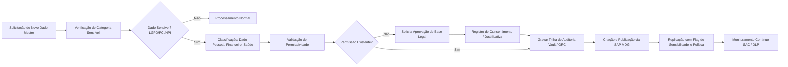
```mermaid
flowchart LR
    A[Solicitação de Novo Dado Mestre] --> B[Verificação de Categoria Sensível]
    B --> C{Dado Sensível? LGPD/PCI/HPI}

    C -- Não --> D[Processamento Normal]

    C -- Sim --> E[Classificação: Dado Pessoal, Financeiro, Saúde]
    E --> F[Validação de Permissividade]
    F --> G{Permissão Existente?}

    G -- Não --> H[Solicita Aprovação de Base Legal]
    H --> I[Registro de Consentimento / Justificativa]
    I --> J[Gravar Trilha de Auditoria Vault / GRC]

    G -- Sim --> J
    J --> K[Criação e Publicação via SAP MDG]
    K --> L[Replicação com Flag de Sensibilidade e Política]
    L --> M[Monitoramento Contínuo SAC / DLP]
```

## Exemplo de Fluxo de Cadastro de Dados (Ideia)


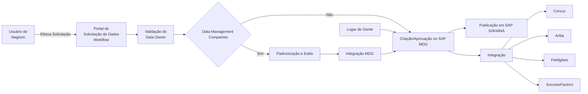
```mermaid
graph LR
    A[Usuário de</br> Negócio] -->|Efetua Solicitação| B[Portal de</br>Solicitação de Dados</br> Workflow]
    B --> C[Validação do</br>Data Owner]
    C --> C1{Data Management Companies}
    C1 --> |Não|D[Criação/Aprovação no SAP MDG]
    C1 --> |Sim|D0[Padronização e Estilo]
    P[Lugar de Gente]  --> D
    D0 --> D1[Integração MDG]
    D1 --> D
    D  --> E[Publicação em SAP S/4HANA]
    D  --> F[Integração]
    F  --> G1[Concur]
    F  --> G2[Ariba]
    F  --> G3[Fieldglass]
    F  --> G4[SuccessFactors]
```

## Exemplo Ciclo de vida do Dado/Informação

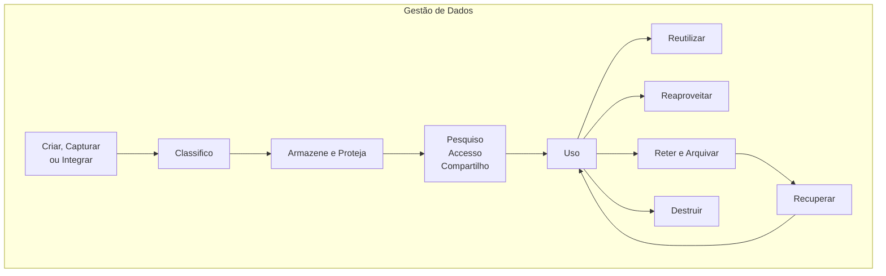
```mermaid
flowchart
subgraph C3["Gestão de Dados"]
A[Criar, Capturar</br> ou Integrar] --> B[Classifico]
B --> C[Armazene e Proteja]
C --> D[Pesquiso</br>Accesso</br>Compartilho]
D --> E[Uso]
E --> F[Reutilizar]
E --> G[Reaproveitar]
E --> I[Reter e Arquivar]
E --> K[Destruir]
I --> J[Recuperar]
J --> E
end
```
## Proposta
A proposta de criação de uma **Central de Cadastro** ou a sua remodelagem, surge como uma solução eficaz para esses desafios.  Este espaço dedicado permitirá a centralização (processos de mudança) e padronização das informações (padrões de dados) e responsabilização (indicadores de acurácia e tempo atendimento).

| **Expectativa**           | **Entenda**                                                                                                                                                               |
| ------------------------- | ------------------------------------------------------------------------------------------------------------------------------------------------------------------------- |
| **Qualidade**             | Auxilia manutenção da qualidade dos dados ao impor padrões, validações e procedimentos de limpeza.                                                                        |
| **Governança de dados**   | Adotar as políticas e procedimentos definidos pelo Data Product Manager.                                                                                                  |
| **Agilidade Aumentada**   | Centralização permite a instituição se adapte rapidamente a mudanças nos requisitos de negócios.                                                                          |
| **Data Flow**             | Fluxo de trabalho definido, registros das mudanças.                                                                                                                       |
| **Análise de Desempenho** | Centralização dos dados possibilitará análises mais robustas sobre o desempenho dos fornecedores, permitindo à empresa escolher parcerias mais estratégicas e eficientes. |
| **Aumento da Eficiência** | Com todos os cadastros em um único local, podemos impor padrões, validações e procedimentos de limpeza.                                                                   |

### Qualidade de Dados
As dimensões de qualidade dos dados são padrões para avaliar a qualidade dos dados, garantindo sua adequação ao uso pretendido.
Embora diferentes especialistas tenham proposto diferentes dimensões de qualidade de dados e não haja padronização para seus nomes ou descrições, quase todas elas incluem alguma versão de precisão, completude, consistência, atualidade, exclusividade e validade.

O Data Quality Operations Center(DQOps) também usa dimensões de qualidade de dados de integridade, disponibilidade e razoabilidade porque elas identificam problemas que afetam dados não estruturados em data lakes.

| Nome da dimensão de qualidade de dados | Definição da dimensão de qualidade de dados                                                                                                                                                                                                                                                                                                   | Possíveis problemas de qualidade de dados                                                                                                                                                                                                                  |
| -------------------------------------- | --------------------------------------------------------------------------------------------------------------------------------------------------------------------------------------------------------------------------------------------------------------------------------------------------------------------------------------------- | ---------------------------------------------------------------------------------------------------------------------------------------------------------------------------------------------------------------------------------------------------------- |
| **Precisão**                           | O grau de proximidade dos valores de dados aos valores reais, geralmente medido pela comparação com uma fonte conhecida de informações corretas (a fonte da verdade).                                                                                                                                                                         | Os dados em uma fonte de dados downstream não correspondem aos dados originais de uma fonte de dados upstream.  <br>Os valores agregados calculados em valores não correspondem a valores semelhantes de uma fonte de dados diferente (dados financeiros). |
| **Disponibilidade**                    | O grau em que a fonte de dados está disponível para uso sem problemas de acesso.                                                                                                                                                                                                                                                              | A tabela está ausente.  <br>As credenciais para a fonte de dados expiraram.  <br>A tabela está fisicamente corrompida devido a uma falha irrecuperável no disco rígido.                                                                                    |
| **Completude**                         | O grau em que todos  <br>os registros necessários no conjunto de dados,  <br>valores de dados  <br>estão presentes sem nenhuma informação faltando.                                                                                                                                                                                           | As colunas obrigatórias estão vazias.  <br>As tabelas estão vazias ou são muito pequenas.  <br>A porcentagem de valores nulos excede um limite aceitável.                                                                                                  |
| **Consistência**                       | O grau em que os valores de dados de dois conjuntos de atributos  <br>— dentro de um registro,  <br>— dentro de um arquivo de dados,  <br>— entre arquivos de dados,  <br>— dentro de um registro em diferentes momentos  <br>cumprem uma regra.  <br>Esta dimensão confirma que a qualidade dos valores é consistente ao longo dos períodos. | Um valor anormal fora dos limites regulares é encontrado usando a detecção de anomalias.  <br>O valor agregado (soma, mínimo, máximo, médio) para um período de tempo difere muito de um período anterior (ontem, mês passado, etc.).                      |
| **Integridade**                        | O grau em que os dados relacionais são estruturalmente corretos.                                                                                                                                                                                                                                                                              | A pesquisa por um valor de chave estrangeira não encontrou um registro correspondente em uma tabela de dimensão ou dicionário.                                                                                                                             |
| **Razoabilidade**                      | O grau em que os valores dos dados são razoáveis ​​e fazem sentido.                                                                                                                                                                                                                                                                           | A soma dos valores em uma coluna agregável está dentro de um intervalo aceitável. Por exemplo, a receita total por dia está dentro de limites razoáveis.                                                                                                   |
| **Pontualidade**                       | O grau em que o período entre o momento da criação do valor real e o momento em que o conjunto de dados está disponível é apropriado (os dados são atualizados).                                                                                                                                                                              | Os dados não estão atualizados. O registro mais recente não é mais antigo que um atraso aceito.                                                                                                                                                            |
| **Singularidade**                      | O grau em que os registros ocorrem apenas uma vez em um conjunto de dados e não são duplicados.                                                                                                                                                                                                                                               | Valores duplicados encontrados em uma coluna-chave que deve conter somente valores exclusivos.                                                                                                                                                             |
| **Validade**                           | O grau em que os valores dos dados estão em conformidade com regras comerciais predefinidas, como formato, padrões, tipo e intervalo. Por exemplo, códigos postais e e-mails.                                                                                                                                                                 | Formato de telefone inválido. Valores que não correspondem aos padrões de expressões regulares.                                                                                                                                                            |

# Definindo um Modelo

- [ ] **Visão Corporativa Consistente dos Dados**;
- [ ] **Vincula a tecnologia e os dados aos processos de negócios**;
- [ ] **Simplifica a Gestão da Integração**;
- [ ] **Estabelece a Estrutura para Domínios de Dados Fundamentais**;
- [ ] **Padroniza a coleta de requisitos downstream**;


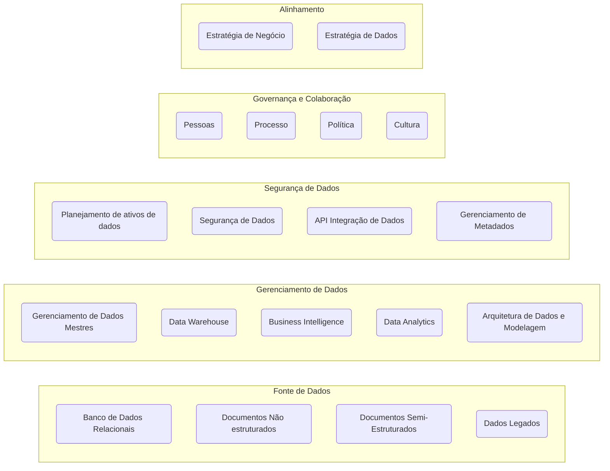
```mermaid
flowchart LR
  subgraph bucket05["Fonte de Dados"]
   id0501(Banco de Dados Relacionais)
   id0502(Documentos Não estruturados)
   id0503(Documentos Semi-Estruturados)
   id0504(Dados Legados)
 end

 subgraph bucket03["Gerenciamento de Dados"]
   id0301(Gerenciamento de Dados Mestres)
   id0302(Data Warehouse)
   id0303(Business Intelligence)
   id0304(Data Analytics)
   id0305(Gerenciamento de Qualidade de Dados)
   id0305(Arquitetura de Dados e Modelagem)
 end
 subgraph bucket04["Segurança de Dados"]
   id0401(Planejamento de ativos de dados)
   id0402(Segurança de Dados)
   id0403(API Integração de Dados)
   id0404(Gerenciamento de Metadados)
 end
 subgraph bucket02["Governança e Colaboração"]
   id0201(Pessoas)
   id0202(Processo)
   id0203(Política)
   id0204(Cultura)
 end
 subgraph bucket01["Alinhamento"]
   id0101(Estratégia de Negócio)
   id0103(Estratégia de Dados)
 end
```


## Exemplo Mapeamento das Aplicações - Dados Mestre, Referencia
Para projetar uma arquitetura,  utilizaremos a  Arquitetura de Negócios (Business Architecture), examinando os espaços de problema estratégicos. A arquitetura de negócios fornece visões multidimensionais de capacidades, entrega de valor, informação e estrutura organizacional.

Um bloco de construção fundamental na arquitetura de negócios é a Capacidade de Negócios (Business Capability), que descreve o que a empresa faz para gerar valor para os clientes (ex: pagar funcionário, enviar produto).

Modelos de capacidade de negócios fornecem uma visão holística e estruturada dos objetivos e atividades estratégicas da organização. Uma boa prática é que capacidades de negócios sejam únicas, mutuamente exclusivas e coletivamente exaustivas. A chave é alinhar capacidades de negócios, contextos limitados e aplicações.

Princípios para Gestão de Dados Distribuída e Orientada a Domínios: Para garantir o sucesso da estratégia de dados distribuídos, alguns princípios são cruciais.

| **Tipo de Dado Mestre**                        | **S/4HANA**         | **Concur** | **Ariba**    | **Fieldglass** | **Lugar de Gente** | OneSource     | Projurid | SGPS          |
| ---------------------------------------------- | ------------------- | ---------- | ------------ | -------------- | ------------------ | ------------- | -------- | ------------- |
| **Business Partner (Clientes / Fornecedores)** | ✅(Principal)        | ✅          | ✅            | ✅              | ❌                  | ✅             | ✅        | ✅             |
| **Pessoa**                                     | ✅                   | ✅          | ✅            | ✅\*            | ✅ (Principal)      | ✅\*           | ✅\*      | ✅ (Principal) |
| **Centros de Custo**                           | ✅                   | ✅          | ✅            | ✅              | ✅(Principal)       | ✅             | ✅        | ✅(Principal)  |
| **Projetos / WBS**                             | ✅(Principal)        | ✅          | ✅            | ✅              | ❌                  | ✅             | ✅        | ❌             |
| **Material / Serviços**                        | ✅ (Material Master) | ❌          | ✅ (Catálogo) | ✅ (Job Class)  | ❌                  | ✅ (Job Class) | ✅        | ❌             |
| **Posições / Cargos**                          | ❌(Avaliar)          | ❌          | ❌(Avaliar)   | ✅              | ✅ (Estrutura)      | ✅             | ✅        | ❌             |
| **Contratos**                                  | ✅                   | ❌          | ✅            | ✅              | ❌                  | ✅             | ✅        | ✅             |
| **Planos de Contas / G/L**                     | ✅(Principal)        | ✅\*        | ✅\*          | ✅\*            | ❌                  | ✅\*           | ✅\*      | ❌             |
| **Locais / Plantas / Sites**                   | ✅(Principal)        | ✅          | ✅            | ✅              | ✅                  | ✅             | ✅        | ❌             |
| **Moeda / País / Região**                      | ✅(Principal)        | ✅          | ✅            | ✅              | ✅                  | ✅             | ✅        | ❌             |
| **Unidade de Medida / Taxas**                  | ✅(Principal)        | ✅          | ✅            | ✅              | ✅                  | ✅             | ✅        | ❌             |
| **Classificações / Códigos fiscais**           | ✅(Principal)        | ✅          | ✅            | ✅              | ✅                  | ✅             | ✅        | ❌             |
| **Feriados**                                   | ✅(Principal)        | ✅          | ✅            | ✅              | ❌                  | ✅             | ✅        | ❌             |
| **Calendário de Impostos**                     | ✅(Principal)        | ❌          | ❌            | ❌              | ❌                  | ❌             | ❌        | ❌             |

✅* = Requer integração/sincronização
❌ = Não aplicável diretamente ao sistema
✅ = Nativamente gerenciado ou requerido pelo sistema

# Possível Arquitetura de Sistemas e Fontes Originais



```mermaid
flowchart TD
    BB[Instituição]
    subgraph Business_Layer ["Camada de Negócio"]
        B1[Visão Estratégica]
        B3[Governança Corporativa]
    end

    subgraph Technology_Layer [Camada de Tecnologia]
        direction LR
        subgraph plataform [Plataformas]
          T1[On-premise Infra]
          T2[Cloud Platform IaaS/PaaS]
          T5[Bucket Storadge]
        end
        T3[Automação e DevOps]
        T4[Segurança e Observabilidade]
        T4 <--> plataform
        T3 <--> T2
    end

    subgraph Application_Layer ["Camada de Aplicações"]
        A1[Aplicações Legadas]
        A2[Microserviços]
        A3[Camada de Visualização]
        A4[SaaS / Cloud-Native Apps]
    end

    subgraph Data_Layer [Camada de Dados]
        D1[RDBMS]
        D2[Data Lake]
        D3[Data Lakehouse]
        D4[Non Relational]
    end

    subgraph Data_Products ["Produto de Dados"]
        direction LR
        DP1[Dados Mestres]
        DP2[Dados de Referência]
        DP3[HUB de Dados Externo]
        DP1  <--> DP2  <--> DP3
    end

    subgraph SAAS_Products ["Single Source of Truth"]
      subgraph legado ["Legado"]
        direction LR
        pass01[(e-Business Suite)]
        pass02[(Peoplesoftware)]
        pass03[(Outros Bancos)]
      end
        subgraph lg ["Lugar de Gente"]
           lg01[("Pessoais</br>Funcionario</br>Contratuais</br>Regra de Ausência</br>Competências</br>Treinamentos</br>UOR</br>Estrutura Organizacional</br>Estrutura Posicional</br>Integração Pagamento</br>Contábil")]
        end
        subgraph fiscal ["Obrigações Fiscais"]
            fiscal01[("Federais</br>SPED,ECF,DIRF,EFDREINF</br>EFD Contribuições</br>Estaduais</br>EFD-ICMS/IPI,GIA,DIME,NF-e,DAPI-MG></br>Municipais</br>DIEF,NFS-e")]
        end
        subgraph mdgmm ["Mestre Materiais"]
           direction LR
           mdgmm01[("Materiais/Serviços</br>Classificação</br>Unidade de Medida</br>Base</br>Derivada</br>Categorias</br>Planta</br>Almoxarifado</br>Armazém</br>Endereço</br>Listas Produção</br>Lista de Manutenção</br>Lista de Material")]
        end
        subgraph mdgsd ["Mestre CNPJ"]
          mdgsd01[("CNPJ</br>CPF</br>Estabelecimentos</br>Score Crédito</br>Pendências Financeiras</br>Participações em Empresas</br>Relacionamentos Financeiros</br>Cadastro Positivo")]
        end
        subgraph mdgrf ["Referencia"]
          direction LR
          mdgrf01[("Bancos</br>Agencia</br>Instalação</br>Pais</br>Estado</br>Município</br>TipLogradouro</br>Logradouro</br>Rastreamento</br>Geolocalização</br>Moedas</br>CFOP</br>NBM</br>Serviços")]
        end

        subgraph mdgoutros ["ERP"]
          mdgoutros01[("Financeiro</br>Plano de contas</br>Classes impostos</br>Serviços</br>Parque Contratado</br>Tipo ordem</br>Prioridade</br>Contratos</br>Garantias</br>Roteirização")]
        end

		subgraph mdgtransa ["Transacionais"]
		   direction LR
           mdgtransa01[("Diário</br>Taxa de Cambio</br>Pedidos</br>Mov.Estoque</br>Vendas</br>Ped.Venda</br>Entregas</br>Faturas</br>Condições Preços</br>Chamados</br>ANS</br>Base conhecimento</br>NPS</br>Rel de Despesas</br>Reservas</br>Pol de Viagem</br>Tickets</br>SLAs</br>Ordens Serviço</br>Hist. do cliente</br>Ordens de Manutenção</br>Planos de manutenção</br>Contadores</br>Falhas")]
        end

        subgraph calendario ["Calendário Corporativo"]
          cal01[("Feriados/Datas comemorativas</br>Nacional</br>Estadual</br>Municipal</br>Bancário</br>Eventos internos</br>Atividades Administrativas</br>Planejamento estratégico")]
        end
        subgraph eficiencia ["BPMS"]
          sv01[("Fluxos</br>Fluxos de Aprovação CESEC</br>Comunicação entre departamentos</br>onboarding")]
        end
        subgraph bancodobrasil ["Banco do Brasil"]
          bancodobrasil01[("Dados do Mestre")]
          bancodobrasil02[("Parque Contratado")]
          bancodobrasil03[("Feriados Bancários")]
          bancodobrasil04[("Pagamentos")]
          bancodobrasil05[("Recebíveis")]
        end

    end

     BB                <--> Business_Layer
     Business_Layer    <--> Technology_Layer
     Technology_Layer  <--> Application_Layer
     Application_Layer <--> Data_Layer
     Data_Layer        <--> Data_Products
     Data_Products     <--> SAAS_Products


```


# Possível Arquitetura  Cloud e Sistemas


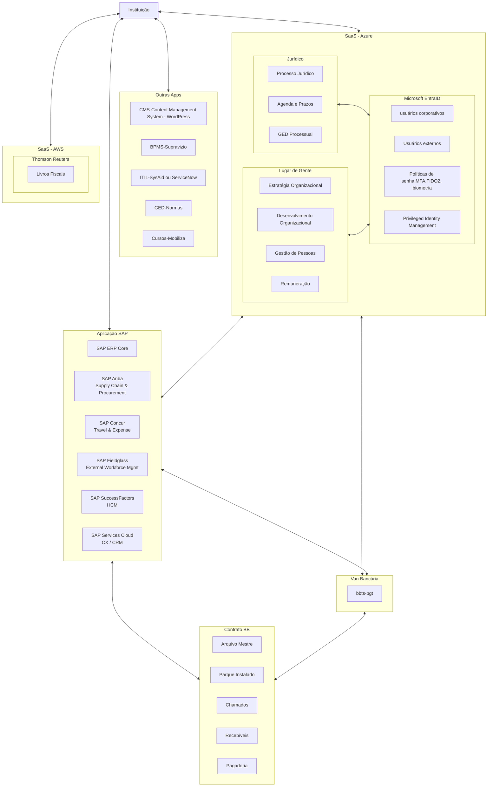
```mermaid
flowchart TD
    BB[Instituição]
    subgraph outras ["Outras Apps"]
         direction LR
        outras01["CMS-Content Management System - WordPress"]
        outras02["BPMS-Supravizio"]
        outras03["ITIL-SysAid ou ServiceNow"]
        outras04["GED-Normas"]
        outras05["Cursos-Mobiliza"]
    end
    subgraph saasaz ["SaaS - Azure"]
       subgraph projurid ["Jurídico"]
        direction LR
        projurid01["Processo Jurídico"]
        projurid02["Agenda e Prazos"]
        projurid03["GED Processual"]
      end
      subgraph lgsaas ["Lugar de Gente"]
        direction LR
        lgsaas01["Estratégia Organizacional"]
        lgsaas02["Desenvolvimento Organizacional"]
        lgsaas03["Gestão de Pessoas"]
        lgsaas04["Remuneração"]
      end
      subgraph msc ["Microsoft EntraID"]
        direction LR
        msc01["usuários corporativos"]
        msc02["Usuários externos"]
        msc03["Políticas de senha,MFA,FIDO2, biometria"]
        msc04["Privileged Identity Management"]
      end
    end
      subgraph lgsaas ["Lugar de Gente"]
        lgsaas01["Estratégia Organizacional"]
        lgsaas02["Desenvolvimento Organizacional"]
        lgsaas03["Gestão de Pessoas"]
        lgsaas04["Remuneração"]
      end
    subgraph saas ["SaaS - AWS"]
      subgraph onesource ["Thomson Reuters"]
         direction LR
         onesource01["Livros Fiscais"]
      end
    end

    subgraph sapapp ["Aplicação SAP"]
      direction LR
      ERP[SAP ERP Core]
      ARIBA[SAP Ariba<br/>Supply Chain & Procurement]
      CONCUR[SAP Concur<br/>Travel & Expense]
      FIELDGLASS[SAP Fieldglass<br/>External Workforce Mgmt]
      SUCCESS[SAP SuccessFactors<br/>HCM]
      SERVICES[SAP Services Cloud<br/>CX / CRM]
    end
    subgraph bancobrasil ["Contrato BB"]
      Mestre01["Arquivo Mestre"]
      Mestre02["Parque Instalado"]
      Mestre03["Chamados"]
      Mestre04["Recebíveis"]
      Mestre05["Pagadoria"]
    end
    subgraph vanbbts ["Van Bancária"]
       vanbbts01["bbts-pgt"]
    end
    projurid <--> msc
    lgsaas <--> msc
    BB <--> outras & saas & sapapp & saasaz
    saasaz  <--> vanbbts
    saasaz <--> sapapp
    sapapp <-->  bancobrasil
    sapapp <--> vanbbts <-->  bancobrasil
```

**Observação**: Para melhor compreensão deverá se medir o consumo de dados pela especificação **FOCUS**.

# Possível Equipe de Arquitetura (e nova tecnologia - Analytics)

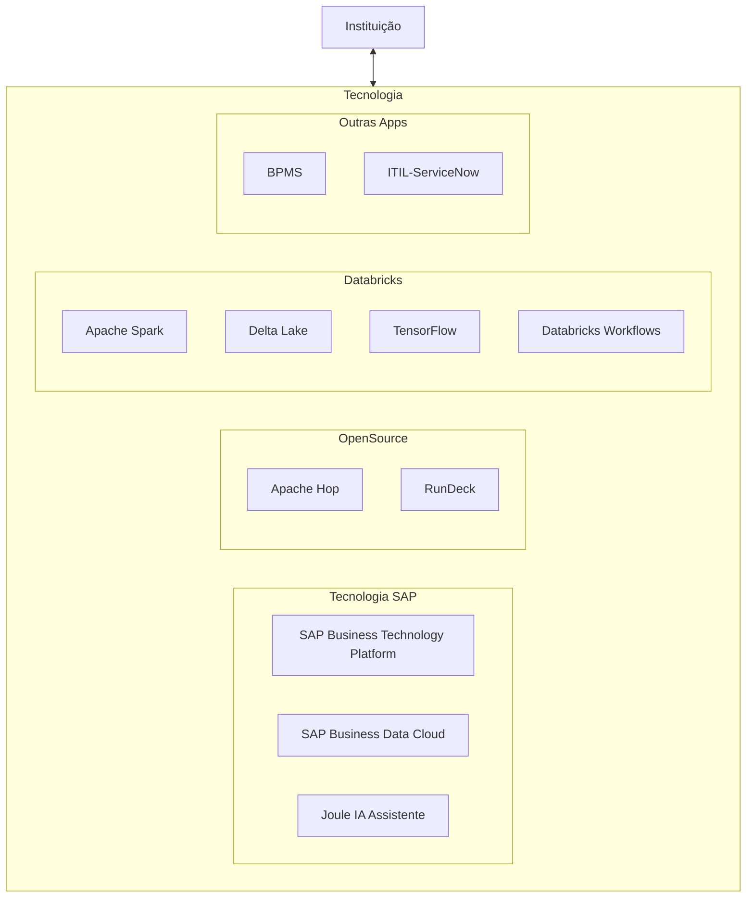
```mermaid
flowchart TD
    BB[Instituição]
    subgraph bbtech ["Tecnologia"]
      subgraph saptec ["Tecnologia SAP"]
        direction LR
        BTP[SAP Business Technology Platform]
        BDC[SAP Business Data Cloud]
        JOULE[Joule IA Assistente]
      end
      subgraph osstec ["OpenSource"]
        osstecc01["Apache Hop"]
        osstecc02["RunDeck"]
      end
      subgraph dtbrickstec ["Databricks"]
        dtbrickstec01["Apache Spark"]
        dtbrickstec02["Delta Lake"]
        dtbrickstec03["TensorFlow"]
        dtbrickstec04["Databricks Workflows"]
      end
      subgraph outras ["Outras Apps"]
        outras02["BPMS"]
        outras03["ITIL-ServiceNow"]
      end
   end
   BB	  <--> bbtech
```

## **Plano de Ação**
A implementação de um plano de ação de Governança de Dados estruturado ajudará a sua organização a gerenciar dados de forma eficaz, garantindo qualidade, segurança e conformidade. Identificação dos processos de cadastros, responsabilização e autorização em dados Mestres/Referência e Transacional.

| **Avaliação dos**                  | **Cadastros – Processos**                                                                                                                                                                                                                                                |
| ---------------------------------- | ------------------------------------------------------------------------------------------------------------------------------------------------------------------------------------------------------------------------------------------------------------------------ |
| **Diagnóstico**                    | Identificamos os principais problemas encontrados durante à análise dos processos atuais e os cadastros.                                                                                                                                                                 |
| **Mapeamento AS-IS/TO-BE e TO-DO** | Os fluxos atuais de cadastros, identificando os principais problemas ou ocorrências.<br><br>Elaborar os novos fluxos otimizados (TO-BE).                                                                                                                                 |
| **Papéis e Responsabilidades**     | O fluxo cadastral e suas responsabilidades e quais áreas devem assumir RACI, também quais novas posições devem ser criadas no organograma empresarial.(Treinar ou Agrupar)                                                                                               |
| **Desenvolver KPI**                | Definir quais serão os indicadores que serão usados para mensurar o novo processo de cadastro.                                                                                                                                                                           |
| **Desenvolver SLA**                | Definir qual o prazo adequado para a conclusão do processo cadastral, checklist e o workflow.                                                                                                                                                                            |
| **Ciclo de Vida**                  | Definir quando/como os dados mestres devem ser inativados ou atualizados.                                                                                                                                                                                                |
| **Regras de Padronização**         | Definição de quais as técnicas de padronização serão adotadas. (NBR, ISO e etc).                                                                                                                                                                                         |
| **Background-Check**               | Quais as fontes públicas e privadas, que serão utilizadas.                                                                                                                                                                                                               |
| **Ética e Compliance**             | Componentes essenciais da governança de dados e IA, garantem que as práticas relacionadas à coleta, uso e gestão de dados, bem como ao desenvolvimento e aplicação de sistemas de IA, sejam realizadas de maneira responsável e de acordo com as leis e normas vigentes. |

## Indicadores
Os indicadores de uma Central de Cadastro, geralmente, são estipulados pelos pilares (SUGESTÃO):

| **Indicadores Base**        |                                                                                                                                                                                  |
| --------------------------- | -------------------------------------------------------------------------------------------------------------------------------------------------------------------------------- |
| **Tempo médio**             | Tempo utilizado para inclusão, alteração ou exclusão de um dado mestre ou referência.                                                                                            |
| **Validade e Conformidade** | Determinar se o valor preenchido corresponde ao padrão do campo, caso não haja o bloqueio Sistemico e/ou Relatório de Exceção.                                                   |
| **Completude**              | Expresso em percentual, e indica o quão nosso cadastro está completo para as nossas necessidades, através de Relatório de Exceção, caso não haja como efetuar a obrigatoriedade. |
| **Acurácia e Precisão**     | Avaliação de qualidade de dados, para determinar se aquele dado corresponde a uma entidade real, indicadores pelos usuários NÃO responsáveis pelo PRODUTO.                       |

## Background-Check
Este processo visa acelerar e padronizar a origem das informações a serem inseridas nos sistemas corporativos através de busca e integração com os órgãos ou entidades da administração pública direta ou indireta ou pessoa jurídica de direito privado, que sejam reconhecidamente, detentores "Serviços de Assessoramento” de informações, tais como:

<div class="mdx-columns2" markdown>
- [ ] Produtos;
- [ ] Dados de Referência;
- [ ] Fiscais;
- [ ] Financeiros;
- [ ] Comerciais.
­</div>

A tabela Background-Check visa indicar alguns órgãos, para a automatização da central de cadastro, cabendo uma revisão e análise qual seria a melhor fonte de dados, quais os documentos e validações necessárias e o tempo de atualização cadastral de forma automática e a emissão de relatórios de exceção.

| **Grupo**                   | **Site**                                                                                                                                                  | **Monetizado**                                                                                                                                                               |
| --------------------------- | --------------------------------------------------------------------------------------------------------------------------------------------------------- | ---------------------------------------------------------------------------------------------------------------------------------------------------------------------------- |
| **Financeiros**             | [Serasa Experian](https://www.serasaexperian.com.br/)                                                                                                     | Sim                                                                                                                                                                          |
|                             | [Loja Serpro](https://loja.serpro.gov.br/)                                                                                                                | Sim                                                                                                                                                                          |
|                             | [Taxas Diárias](%20https:/olinda.bcb.gov.br/olinda/servico/PTAX/versao/v1/odata)                                                                          | Não                                                                                                                                                                          |
|                             | [Moedas](https://olinda.bcb.gov.br/olinda/servico/PTAX/versao/v1/aplicacao#!/recursos/Moedas)                                                             | Não                                                                                                                                                                          |
|                             | [ReceitaWS](https://receitaws.com.br/)                                                                                                                    | Volume                                                                                                                                                                       |
|                             | [Loja CNPJ](https://www.cnpj.ws/)                                                                                                                         | Volume                                                                                                                                                                       |
|                             | [Risco de Crédito](https://cloud.gic.quod.com.br/credito-pf)                                                                                              | Sim                                                                                                                                                                          |
|                             | [Risco Boa Vista SCPC](https://www.boavistaservicos.com.br/planos/)                                                                                       | Sim                                                                                                                                                                          |
|                             |                                                                                                                                                           |                                                                                                                                                                              |
|                             | SICAF ([NÃO encontrei a API](https://www3.comprasnet.gov.br/sicaf-web/private/index.jsf))                                                                 |                                                                                                                                                                              |
|                             | [Plataforma PNCP](https://www.gov.br/pncp/pt-br/pncp/integre-se-ao-pncp)                                                                                  | Credenciamento                                                                                                                                                               |
|                             | [Tribunal de Contas da União](https://portal.tcu.gov.br/webservices-tcu/)                                                                                 | Sim                                                                                                                                                                          |
|                             |                                                                                                                                                           |                                                                                                                                                                              |
|                             | Banco do Brasil (INTEGRAÇÃO SERVICENOW)                                                                                                                   |                                                                                                                                                                              |
|                             | [IBRACEM](https://ibracem.org.br/)                                                                                                                        |                                                                                                                                                                              |
|                             |                                                                                                                                                           |                                                                                                                                                                              |
| **Geolocalização**          | [OpenStreetMap](https://nominatim.openstreetmap.org/ui/search.html)                                                                                       | Volume                                                                                                                                                                       |
|                             | [Google Maps](https://developers.google.com/maps/documentation/urls/get-started?hl=pt-br)                                                                 | Volume                                                                                                                                                                       |
|                             |                                                                                                                                                           |                                                                                                                                                                              |
| **Referência**              | [Dados Abertos](https://dados.gov.br/home)                                                                                                                | Não                                                                                                                                                                          |
|                             | [Codigo Endereço Postal](http://viacep.com.br/)(ViaCep)                                                                                                   | Sim                                                                                                                                                                          |
|                             | [Código Endereço Postal (ECT)](https://www.correios.com.br/atendimento/developers)                                                                        | Sim                                                                                                                                                                          |
|                             | [ECT-Coleta](https://www.correios.com.br/atendimento/developers/apicoleta)                                                                                | Sim                                                                                                                                                                          |
|                             | [Rastreio de Objetos](https://cas.correios.com.br/)                                                                                                       | Sim                                                                                                                                                                          |
|                             | [Classificação Nacional de Atividades Econômicas](https://servicodados.ibge.gov.br/api/docs/CNAE?versao=2)                                                | Não                                                                                                                                                                          |
|                             | [Código Municípios](https://servicodados.ibge.gov.br/api/docs/localidades)                                                                                | Não                                                                                                                                                                          |
|                             | [Código de UF](https://servicodados.ibge.gov.br/api/docs/localidades#api-Mesorregioes-estadosUFMesorregioesGet)                                           | Não                                                                                                                                                                          |
|                             | [Código País](https://servicodados.ibge.gov.br/api/docs/localidades#api-Paises-paisesGet)                                                                 | Não                                                                                                                                                                          |
|                             | [Código Fiscal de Operações e. Prestação(CFOP)](https://www.gov.br/receitafederal/pt-br/acesso-a-informacao/acoes-e-programas/facilitacao/anexo-ecf-cfop) | Web Scraping[https://www.nfe.fazenda.gov.br/portal/exibirArquivo.aspx?conteudo=ZCj/PlYFSRQ=](https://www.nfe.fazenda.gov.br/portal/exibirArquivo.aspx?conteudo=ZCj/PlYFSRQ=) |
|                             | [Tipo e Espécie de Veículo](https://www.nfe.fazenda.gov.br/portal/exibirArquivo.aspx?conteudo=nt7Q2CXVChI=)                                               | PDF                                                                                                                                                                          |
|                             | [Quod](https://www.quod.com.br/)                                                                                                                          | Sim                                                                                                                                                                          |
|                             | [Moedas](https://olinda.bcb.gov.br/olinda/servico/PTAX/versao/v1/odata/Moedas?$top=100&$format=json)                                                      | Não                                                                                                                                                                          |
|                             |                                                                                                                                                           |                                                                                                                                                                              |
| **Itens**                   | [Itens de Serviço](http://sped.rfb.gov.br/pagina/show/1601)                                                                                               | Não                                                                                                                                                                          |
|                             | [Global de Item Comercial (GTIN)](https://www.gs1br.org/codigos-e-padroes/padroes-de-identificacao/gtin)                                                  | Sim                                                                                                                                                                          |
|                             | [Cadastro Nacional de Produtos](https://cnp.gs1br.org/login?redirect=/)                                                                                   | Sim                                                                                                                                                                          |
|                             | Endereçamento de Estoque                                                                                                                                  |                                                                                                                                                                              |
|                             |                                                                                                                                                           |                                                                                                                                                                              |
| **Pessoal**                 | [Boa Vista SCPC](https://www.boavistaservicos.com.br/)                                                                                                    | Sim                                                                                                                                                                          |
|                             |                                                                                                                                                           |                                                                                                                                                                              |
| **Experimental**            | [Brasil API](https://brasilapi.com.br/)                                                                                                                   | Experimental                                                                                                                                                                 |
|                             | ·       CEP                                                                                                                                               |                                                                                                                                                                              |
|                             | ·       DDD                                                                                                                                               |                                                                                                                                                                              |
|                             | ·       Bank                                                                                                                                              |                                                                                                                                                                              |
|                             | ·       CNPJ                                                                                                                                              |                                                                                                                                                                              |
|                             | ·       IBGE                                                                                                                                              |                                                                                                                                                                              |
|                             | ·       Feriados Nacionais                                                                                                                                |                                                                                                                                                                              |
|                             | ·       Tabela FIPE                                                                                                                                       |                                                                                                                                                                              |
|                             | ·       ISBN                                                                                                                                              |                                                                                                                                                                              |
|                             | ·       Registros de domínio br                                                                                                                           |                                                                                                                                                                              |
|                             | ·       Taxas                                                                                                                                             |                                                                                                                                                                              |
|                             |                                                                                                                                                           |                                                                                                                                                                              |
| **Inteligência Artificial** | Não visto.                                                                                                                                                |                                                                                                                                                                              |

## Compliance

| **Objeto**                        |                                                                                                                                                                             |
| --------------------------------- | --------------------------------------------------------------------------------------------------------------------------------------------------------------------------- |
| **Direito/Jurídico**              | Validação como o Jurídico de normativos necessários (Base Legal sobre TEMPORALIDADE GRANULAR).                                                                              |
|                                   | Entender as variáveis que podem ser utilizadas e quais não devem ser usadas na criação de modelos.<br>Necessidade em documentar e restringir no catálogo.                   |
| **Responsabilidade**              | Assegurar que as ações e decisões tomadas com base em dados e IA, sejam responsáveis e que haja mecanismos para corrigir erros ou injustiças.                               |
| **Treinamento e Conscientização** | Treinar, Treinar e Treinar objetivando que todos os colaboradores e partes envolvidas estejam cientes das políticas e regulamentos relacionados à governança de dados e IA. |

## Temporalidade de Dados
A informação deve ser considerada como patrimônio pela empresa, até porque é um ativo de informação a ser protegido, lembrando que os dados pertencem aos titulares.

Deve ter garantida a confidencialidade, disponibilidade e integridade da informação, como pilares da segurança da informação.

A temporalidade dos dados é crucial para a gestão eficaz de dados, especialmente quando se considera a distinção entre dados correntes, intermediários e permanentes. (Análise com o Jurídico).

A Tabela de Temporalidade Documental (TTD) tem por finalidade estabelecer informações sobre o ciclo de vida,  prazo de conservação, frequência de utilização e destinação final de documentos.

A partir da consulta à tabela de temporalidade é possível evitar a eliminação incorreta de documentos e o armazenamento de arquivos que não sejam mais  necessários à organização.

|                   | **Correntes**                           | **Intermediários**                                                                        | **Permanentes**                                                                                |
| ----------------- | --------------------------------------- | ----------------------------------------------------------------------------------------- | ---------------------------------------------------------------------------------------------- |
| **Transacionais** | Recentes e frequentemente acessados.    | Que não são mais usados diariamente, mas ainda são necessários para consultas periódicas. | Dados de transações históricas que precisam ser preservados por razões legais ou de auditoria. |
| **Referência**    | Frequentemente atualizados e acessados. | Que não são mais atualizados frequentemente, mas ainda são necessários para consultas.    | Históricos que precisam ser preservados.                                                       |
| **Mestres**       | Frequentemente atualizados e acessados. | Que não são mais atualizados frequentemente, mas ainda são necessários para consultas.    | Históricos que precisam ser preservados.                                                       |

Usou-se a conceituação de dados vivos, sendo aqueles que estão em uso ativo – **Alta frequência de utilização**, geralmente acessados e modificados frequentemente, por outro lado, são dados que não estão sendo ativamente usados ou modificados, mas ainda precisam ser armazenados para consultas futuras ou conformidade regulatória, mas em ambos os casos necessitam ser protegidos, antes do descarte.

Cabe ressaltar que esta diferença se faz necessária pois envolvem custos de soluções de armazenamento, tempo de guarda longo prazo e/ou discos de baixo custo.

Em suas operações ou processos comerciais diários as EMPRESAS coletam e armazenam registros de vários tipos e em vários formatos diferentes.

A importância relativa à sensibilidade desses registros também altera e está sujeita ao regime de classificação de segurança de dados da organização.

É importante que esses registros sejam protegidos contra perda, destruição, falsificação, acesso não autorizado e liberação não autorizada, e uma variedade de controles são usados para garantir isso, incluindo backups, controle de acesso e criptografia.

Entretanto, considerando a existência de inúmeras legislações setoriais, bem  como de frequentes alterações na legislação e em normas que regulam a  guarda de documentos,  ao lado da consideração e necessidade de avaliação do prazo de  tempo   de   guarda sob   inúmeros   fatores,   como   por   exemplo:   trabalhista,  previdenciário,  fiscal,  tributário,  além  de  regulamentos  aplicáveis  somente  a determinados  setores,  demonstra-se neste documento e NÃO se fecha o contexto, que o guia abaixo deva ser apenas ORIENTATIVO  e em hipótese alguma servir de amparo para justificar a guarda e/ou a eliminação de documentos.

- [ ]  Instituto Nacional de Proteção de Dados, através do [Guia de Temporalidade e Conservação de Documentos](https://www.inpd.com.br/guia-temporalidade)
- [ ] Deverá ser estabelecido critérios de retenção de dados transacionais objetivando a migração para um Data Lakehouse, possivelmente de baixo custo.
- [ ] Normalmente os provedores de nuvem, utilizam modelo de preços, **pay-as-you-go**, onde você paga pelo uso real dos recursos, tipos de armazenamento (objetos ,arquivos etc), volume de dados, redundância/backup e transferência.
- [ ] Implementar práticas de otimização, como a exclusão de dados não utilizados e a escolha de tipos de armazenamento mais econômicos para dados menos acessados, podem reduzir **significativamente os custos** de armazenamento.
- [ ] Defina políticas claras de retenção de dados para eliminar dados desnecessários ou obsoletos. Isso ajuda a reduzir o volume de dados armazenados e, consequentemente, os custos.
## Anonimização
A anonimização tem como objetivo a eliminação ou redução significativa dos riscos de reidentificação dos dados anonimizados, mas sempre preservando a veracidade dos resultados do seu tratamento.
O processo de anonimização, além de evitar a identificação do titular de dados pessoais, deve garantir que o tratamento realizado após a anonimização não implique em uma distorção dos dados reais.

## Ética de Dados
Podemos definir como práticas relacionadas a dados que buscam preservar a confiança de usuários, funcionários/colaboradores e clientes, bem como abrange as obrigações morais de coletar, proteger. A ética é domínio de todos, não apenas o pessoal da TI ou de equipes jurídicas e de conformidade.  Os funcionários de toda a organização precisarão levantar, responder e pensar em várias questões éticas envolvendo dados.

À medida que as organizações geram mais dados, adotam novas ferramentas e tecnologias para coletar e analisar dados e encontram novas maneiras de aplicar insights de dados, novos desafios e complicações de privacidade e ética surgirão.

Devemos criar uma estrutura de uso de dados que reflita uma visão e missão compartilhadas para o uso de dados pela instituição. Depois de estabelecer regras comuns de uso de dados, é importante comunicá-las efetivamente dentro e fora da organização.


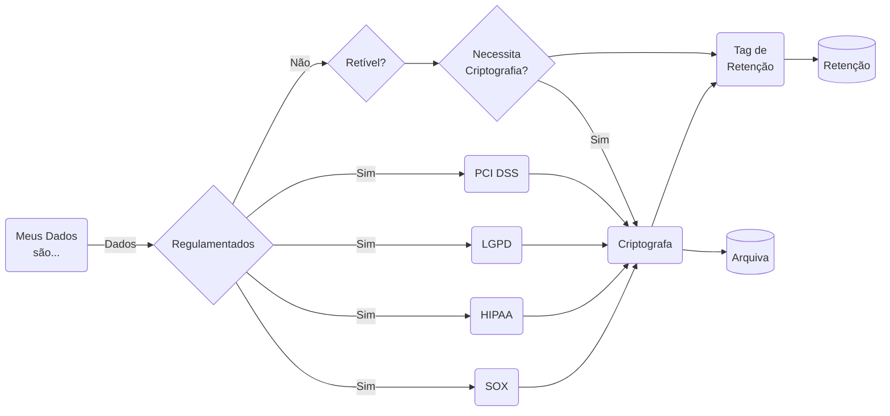
```mermaid
flowchart LR
A(Meus Dados</br>são...) -->|Dados| B{Regulamentados}
B --> |Sim| C(PCI DSS) & D(LGPD) & E(HIPAA) & F(SOX)
B --> |Não| G{Retível?}
G --> H{Necessita</br>Criptografia?}
H --> |Sim| H0(Criptografa)
H --> H1(Tag de</br>Retenção)
H0 --> H1 --> RETER[(Retenção)]
C --> H0 --> ARQUIVA[(Arquiva)]
D --> H0
E --> H0
F --> H0
```

## De onde vieram os dados?

- [ ] Este fornecedor pode garantir que os sujeitos dos dados deram seu consentimento informado para uso por terceiros?

| **Campo**                    | **Exemplo**                    |
| ---------------------------- | ------------------------------ |
| Tipo de Dado Sensível        | Dado Pessoal, Cartão, Saúde    |
| Base Legal (LGPD art. 7)     | Consentimento, Obrigação legal |
| Consentimento Obtido?        | Sim / Não                      |
| Data/Hora do Consentimento   | 2025-05-27 14:22               |
| Retenção prevista (em meses) | 60                             |
| Destinação de Arquivamento   | SAP ILM / Vault / External DLP |
| Políticas de acesso          | Apenas usuários com perfil XYZ |

- [ ] Devemos criar uma estrutura de uso de dados que reflita uma visão e missão compartilhadas para o uso de dados pela instituição.
- [ ] Depois de estabelecer regras comuns de uso de dados, é importante comunicá-las efetivamente dentro e fora da organização.
- [ ] Podemos nos concentrar em transparência e protocolos opt-in/opt-out.
- [ ] Devem ter uma variedade de gêneros, raças, etnias, classes e assim por diante: uma organização terá mais probabilidade de identificar problemas logo no início quando pessoas com uma variedade de origens e experiências diferentes se sentam ao redor da mesa.
- [ ] Uma coisa é definir o que constitui o uso ético de dados e definir regras de uso de dados; outra é integrar essas regras às operações em toda a organização.

## Princípios de Ética de Dados

| Princípio     | Descrição                                                                                                                                                                               |
| ------------- | --------------------------------------------------------------------------------------------------------------------------------------------------------------------------------------- |
| Propriedade   | Um indivíduo tem propriedade sobre suas informações pessoais é ilegal e antiético coletar dados pessoais de alguém sem seu consentimento.                                               |
| Transparência | Titulares dos dados têm o direito de saber como você planeja coletá-las, armazená-las e usá-las. Ao coletar dados, exercite a transparência.                                            |
| Privacidade   | Garantir a privacidade dos titulares dos dados. Os informações pessoalmente identificáveis ​​(PII) deve estar declarada e declaradas.                                                   |
| Intenção      | As intenções importam, por isso, antes de coletar dados, pergunte a si mesmo por que você precisa deles, o que você ganhará com eles e quais mudanças você poderá fazer após a análise. |
| Resultados    | Quando as intenções são boas, o resultado da análise de dados pode causar danos inadvertidos a indivíduos ou grupos de pessoas.                                                         |

# Padronização
A padronização de dados elimina a semântica da complexidade envolvendo a coleta, harmonização e compilação de dados.

| **Regras**     | **Entenda**                                                                                                        |
| -------------- | ------------------------------------------------------------------------------------------------------------------ |
| **Taxonomia**  | Regras mapeiam colunas e valores de dados do parceiro com dados da empresa.                                        |
| **Modelagem**  | Regras especificam como agrupar elementos de dados e distribuí-los no sistema organizacional.                      |
| **Semânticas** | Regras estabelecem o significado dos elementos de dados e como são usados pela empresa para descrever seu domínio. |

## Definindo padrões de dados
Bons padrões de dados estão no centro de uma solução MDM que funciona perfeitamente. Eles são essenciais para sua capacidade de colaborar e trocar dados dentro da organização, bem como externamente.

O primeiro passo para garantir uma alta qualidade de dados é aplicar lógica aos seus padrões de dados, como usar formatos unificados para endereços e descrições de produtos. Você precisa definir quais tipos de dados podem ser inseridos como valores de atributos. Certifique-se de que cada atributo só possa conter dados em um formato especificado, por exemplo:

| Tipo de dados      | Formatos especificados                                                |
| ------------------ | --------------------------------------------------------------------- |
| Texto numérico     | `^[A-Z]{1,60}$`                                                       |
| Número             | `1.25 OR 3 OR -4.5`                                                   |
| CPF                | `\b\d{3}\.\d{3}\.\d{3}-\d{2}\b`                                       |
| CNPJ               | `\b\d{2}\.\d{3}\.\d{3}/\d{4}-\d{2}\b`                                 |
| NCM                | `\b\d{8}\b`                                                           |
| Tipo de Logradouro | `Rua, Avenida, Praça, Travessa, Alameda, Estrada, Beco, Largo, Viela` |

## Controle de Acesso aos Dados

- [ ] O operador é toda pessoa física ou jurídica, de direito público ou privado, que realiza o tratamento de dados em nome do controlador (a quem competem as decisões sobre o tratamento de dados).
- [ ] O controle de acesso é fundamental da segurança da informação, proporcionando mecanismos e políticas para garantir que apenas indivíduos e sistemas autorizados possam acessar e manipular recursos empresariais.
- [ ] Cada equipe de domínio, definida na RACI, trata os dados que produz como um PRODUTO, com um proprietário de PRODUTO, um ciclo de vida definido e um foco na entrega de valor para os consumidores desses dados.

## Desburocratização e Utilização de Dados
A obtenção de dados de fontes governamentais, como Banco do Brasil, Banco Central do Brasil (BACEN) e Instituto Brasileiro de Geografia e Estatística (IBGE), bem como de empresas renomadas como GS1 e Serasa, é fundamental para a criação de critérios eletrônicos padronizados e que aumentam significativamente a transparência e a confiança.

- [ ] Fontes governamentais fornecem dados confiáveis e abrangentes que são essenciais para a construção de modelos de análise de crédito robustos.
- [ ] Como exemplo poderíamos retornar a utilização do BACEN, com as informações de fechamento do cambio.
- [ ] O IBGE contribui com dados demográficos e econômicos que ajudam a contextualizar as análises de crédito.
- [ ] A Loja do Serpro é outra ferramenta valiosa nesse contexto. Ela oferece serviços completos de consulta de CNPJ, permitindo acesso a informações públicas do Cadastro Nacional de Pessoas Jurídicas.
- [ ] A Serasa, por sua vez, é uma das principais fontes de informações de crédito no Brasil, oferecendo dados detalhados sobre o histórico de crédito dos consumidores.
- [ ] A padronização dos critérios eletrônicos baseados nesses dados aumenta a transparência, podendo reduzir a subjetividade, erros humanos na impostação de informações no sistema corporativo.

Em resumo, a integração de dados de fontes confiáveis em um sistema de MDM/G e uma central de cadastro, com critérios eletrônicos padronizados, traz inúmeros benefícios, aumenta a transparência, fortalece a confiança, simplifica processos e torna a análise de crédito mais eficiente.

## Intregração com Parceiros
A criação de um Registro de Decisão de Arquitetura (ADR) é essencial para documentar e justificar as decisões arquitetônicas tomadas durante o desenvolvimento de sistemas, especialmente quando se trata de integração com aplicações SaaS e parceiros tecnológicos.

Aqui está um exemplo de como um ADR pode ser estruturado para estabelecer critérios de integração:

|                                                 | **Registro de Decisão de Arquitetura (ADR)**                                                                                                                                                                                                                                                                                  |
| ----------------------------------------------- | ----------------------------------------------------------------------------------------------------------------------------------------------------------------------------------------------------------------------------------------------------------------------------------------------------------------------------- |
| **Título**                                      | Comunicação Segura entre Duas Empresas (B2B/B2C) para Troca de Informações de Cadastro de Pessoas                                                                                                                                                                                                                             |
| **Contexto e Problema**                         | As empresas precisam estabelecer um canal de comunicação seguro para trocar informações de cadastros. Esta troca deve garantir a privacidade dos dados, manter a governança e os protocolos de autorização, e ser protegida por um Acordo de Confidencialidade (Non Disclosure Agreement - NDA) assinado por ambas as partes. |
| **Fatores de Decisão**                          |                                                                                                                                                                                                                                                                                                                               |
| **Privacidade dos Dados**                       | Conformidade com regulamentações de proteção de dados (e.g., GDPR, LGPD).                                                                                                                                                                                                                                                     |
| **Segurança**                                   | Garantir que os dados sejam transmitidos e armazenados de forma segura, com perfis de acesso e controlados por tempo;                                                                                                                                                                                                         |
| **Governança**                                  | Políticas e procedimentos claros para o manuseio dos dados.                                                                                                                                                                                                                                                                   |
| **Autorização**                                 | Somente pessoal autorizado pode acessar os dados. A instituição poderá solicitar a qualquer tempo, quem acessa e por qual finalidade.                                                                                                                                                                                         |
| **Proteção Legal**                              | NDA para vincular legalmente ambas as partes à confidencialidade.                                                                                                                                                                                                                                                             |
| **Opções Consideradas**                         |                                                                                                                                                                                                                                                                                                                               |
|                                                 |                                                                                                                                                                                                                                                                                                                               |
| **Integração Direta via API REST (Sincrona)**   | Troca de dados em tempo real, alto controle sobre o fluxo de dados. Limitada a x registros.                                                                                                                                                                                                                                   |
| **Integração Direta via API REST (Assíncrona)** | Maior flexibilidade e escalabilidade, permite processamento em segundo plano.                                                                                                                                                                                                                                                 |
| **Detalhes da Implementação**                   |                                                                                                                                                                                                                                                                                                                               |
| **Criptografia**                                | Uso de TLS/SSL para dados em trânsito.                                                                                                                                                                                                                                                                                        |
| **Autenticação**                                | Implementação de OAuth 2.0 para autenticação segura.                                                                                                                                                                                                                                                                          |
| **Autorização**                                 | Controle de acesso baseado em funções (RBAC) para garantir que apenas pessoal autorizado possa acessar a API.                                                                                                                                                                                                                 |
| **Governança de Dados**                         |                                                                                                                                                                                                                                                                                                                               |
| **Classificação de Dados**                      | Classificar os dados para determinar a sensibilidade e os requisitos de manuseio.                                                                                                                                                                                                                                             |
| **Logs de Auditoria**                           | Manter logs de todos os acessos e transações de dados para fins de auditoria.                                                                                                                                                                                                                                                 |
| **Política de Retenção de Dados**               | Definir e aplicar políticas de retenção de dados.                                                                                                                                                                                                                                                                             |
| **Monitoramento e Conformidade**                |                                                                                                                                                                                                                                                                                                                               |
| **Auditorias Regulares**                        | Poderá ser realizada auditorias de segurança regulares para garantir conformidade com as regulamentações de proteção de dados.                                                                                                                                                                                                |
| **Plano de Resposta a Incidentes**              | Não foi escopo deste trabalho desenvolver um plano de Resposta a Incidentes, por isso, para cada integração, deverá ser desenvolvido e mantido com uma periodicidade não superior a 1(um) ano, um plano de resposta a incidentes para lidar com possíveis violações de dados.                                                 |

# Advanced Analytics (MLOps)
Aprendizado de máquina, inteligência artificial e computação cognitiva são palavras da moda. Todas se sobrepõem e se complementam. Inteligência artificial é o termo genérico para quando as máquinas trabalham de forma "inteligente" e realizam tarefas que normalmente são realizadas por humanos.

Um resumo muito abreviado do sistema ASL é o seguinte:

- ASL-1 se refere a sistemas que não representam nenhum risco catastrófico significativo, por exemplo, um LLM de 2018 ou um sistema de IA que só joga xadrez.
- ASL-2 refere-se a sistemas que apresentam sinais precoces de capacidades perigosas – por exemplo, a capacidade de fornecer instruções sobre como construir armas biológicas – mas cujas informações ainda não são úteis devido à confiabilidade insuficiente ou à falta de informações que, por exemplo, um mecanismo de busca não conseguiria. Os LLMs atuais, incluindo Claude, parecem ser ASL-2.
- ASL-3 se refere a sistemas que aumentam substancialmente o risco de uso indevido catastrófico em comparação com linhas de base não baseadas em IA (por exemplo, mecanismos de busca ou livros didáticos) OU que mostram capacidades autônomas de baixo nível.
- ASL-4 e superior (ASL-5+) ainda não foram definidos, pois estão muito distantes dos sistemas atuais, mas provavelmente envolverão escalonamentos qualitativos no potencial de uso indevido catastrófico e na autonomia.
# Dados Analíticos - Conceitos

- [ ]  Quais métricas de negócios específicas (por exemplo, receita, retenção de clientes) melhoraram devido a iniciativas de dados nos últimos 12 meses e quanto?
- [ ]  Quais decisões de negócios foram melhoradas de forma mensurável por nossos investimentos em dados?
- [ ] Qual é o custo real da baixa qualidade dos dados (por exemplo, erros, oportunidades perdidas) no último ano fiscal?
- [ ] Quantos projetos de dados entregaram os resultados de negócios prometidos?
- [ ]  Onde estamos desperdiçando dinheiro em armazenamento de dados não utilizado ou ferramentas redundantes?
- [ ] Quais fornecedores de dados terceirizados fornecem valor mensurável em comparação com aqueles que drenam orçamentos?
- [ ] Como o ROI dos investimentos em dados se compara a outras iniciativas estratégicas (por exemplo, marketing, P&D)?
- [ ] Quanto tempo os analistas gastam limpando dados versus gerando insights?
- [ ] Quais sistemas legados estão bloqueando a integração e qual é o cronograma de substituição?
- [ ] Quantas fontes de dados conflitantes existem para a mesma métrica (por exemplo, números de vendas)?

## Big Data vs. Small Data

| **Critério**        | **Big Data**                                                                                                                      | **Small Data**                                                                       |
| ------------------- | --------------------------------------------------------------------------------------------------------------------------------- | ------------------------------------------------------------------------------------ |
| **Definição**       | Conjuntos de dados extremamente grandes e complexos, que exigem tecnologias específicas para processamento.                       | Conjuntos de dados pequenos, compreensíveis por humanos e ferramentas tradicionais.  |
| **Volume**          | Terabytes a petabytes ou mais.                                                                                                    | Kilobytes a gigabytes.                                                               |
| **Velocidade**      | Dados gerados e processados em tempo real ou próximo disso.                                                                       | Geração e análise geralmente esporádicas ou periódicas.                              |
| **Variedade**       | Dados estruturados, semi-estruturados e não estruturados (texto, vídeo, sensores etc.).                                           | Geralmente estruturados ou simples tabelas/planilhas.                                |
| **Tecnologia**      | Hadoop, Spark, Kafka, NoSQL, Data Lakes, Machine Learning.                                                                        | Excel, SQL, BI Tools tradicionais (Power BI, Tableau).                               |
| **Análise**         | Analítica avançada: preditiva, prescritiva, IA/ML.                                                                                | Análise descritiva ou diagnóstica básica.                                            |
| **Objetivo**        | Descobrir padrões ocultos, prever comportamentos, decisões baseadas em IA.                                                        | Responder perguntas específicas, gerar relatórios e insights rápidos.                |
| **Infraestrutura**  | Necessita de infraestrutura distribuída e escalável (cloud, clusters).                                                            | Pode rodar em máquinas locais ou servidores convencionais.                           |
| **Custo**           | Alto investimento em armazenamento, processamento e equipe especializada.                                                         | Custo relativamente baixo.                                                           |
| **Privacidade**     | Mais desafios com segurança e conformidade (LGPD, GDPR etc.).                                                                     | Menor risco, mais fácil de gerenciar.                                                |
| **Exemplos de uso** | - Análise de comportamento de consumidores em tempo real- Previsão de falhas em máquinas IoT- Detecção de fraudes em larga escala | - Relatório de vendas mensais- Pesquisa de satisfação de clientes- Tabela de estoque |

## Banco de Dados vs. Data Warehouse vs. Data Lake vs. Data Lakehouse

| Recurso                               | Banco de Dados                                                      | Data Warehouse                                       | Data Lake                                                                      | Data Lakehouse                                                        |
| ------------------------------------- | ------------------------------------------------------------------- | ---------------------------------------------------- | ------------------------------------------------------------------------------ | --------------------------------------------------------------------- |
| Tipo de Dados                         | Estruturado                                                         | Estruturado                                          | Estruturado, Semiestruturado, Não Estruturado                                  | Estruturado, Semiestruturado, Não Estruturado                         |
| Caso de Uso                           | Transacional                                                        | Analítico, Relatórios                                | Armazenamento, Exploração, Análise                                             | Armazenamento Híbrido e Análise                                       |
| Esquema                               | Definido                                                            | Definido                                             | Esquema na Leitura                                                             | Esquema na Leitura e Esquema na Gravação (híbrido)                    |
| Complexidade da Consulta              | Simples                                                             | Complexo                                             | Variado                                                                        | Complexo                                                              |
| Conformidade com ACID                 | Forte                                                               | Limitado                                             | Normalmente Nenhum                                                             | Fornecido por tecnologias como Delta Lake                             |
| Ferramentas de Processamento de Dados | Limitado                                                            | Ferramentas de Business Intelligence                 | Ferramentas de Big Data (ex.: Spark, Hadoop)                                   | Abordagem Híbrida com Ferramentas de Big Data                         |
| Escalabilidade                        | Escalabilidade limitada para Análises                               | Escalável para análises                              | Altamente Escalável                                                            | Escalável, mas pode exigir uma Arquitetura robusta                    |
| Ferramentas de Exemplo                | MSSQL, MySQL, PostgreSQL, Oracle                                    | Snowflake, Redshift, BigQuery                        | Amazon S3, Azure Data Lake Storage, Hadoop                                     | Delta Lake, Databricks, AWS Glue                                      |
| Integração de Dados                   | ETL (Extração, Transformação, Carregamento) para dados estruturados | Processos ETL e ELT (Extrair, Carregar, Transformar) | Frequentemente utiliza ETL/ELT, suporta dados de diversas fontes               | ETL e ELT para dados estruturados e brutos                            |
| Casos de Uso Comuns                   | Dados de CRM, Inventário, Registros Financeiros                     | Análise de Histórico de Vendas, Relatórios           | Armazenamento de dados brutos, dados de sensores, conteúdo gerado pelo usuário | Dados de Saúde, Dados de IoT, Dados Financeiros                       |
| Eficiência de Armazenamento           | Otimizado para armazenamento de dados estruturados                  | Otimizado para desempenho de consultas               | Armazenamento de baixo custo para diversos tipos de dados                      | A eficiência do armazenamento pode variar de acordo com a arquitetura |

## Arquiteturas de dados single-hop
Os dados são copiados apenas uma vez, por exemplo, de um sistema de origem para um data lake/warehouse onde os cientistas de dados podem acessá-los.

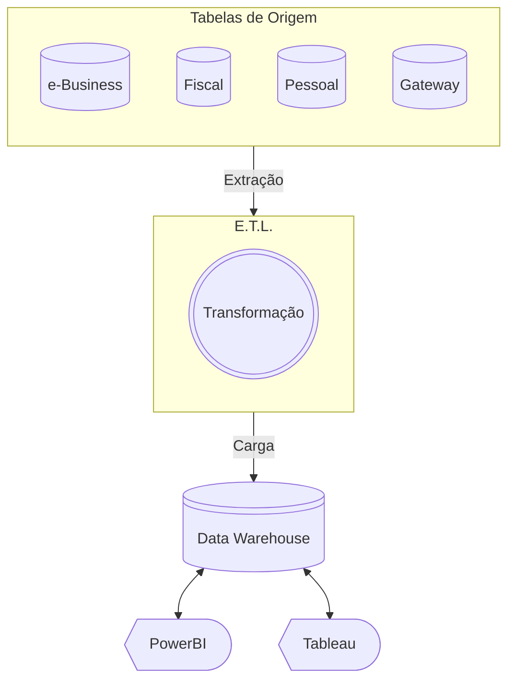
```mermaid
graph TB
subgraph grp01 [Tabelas de Origem]
direction TB
id01[(e-Business)]
id02[(Fiscal)]
id03[(Pessoal)]
id04[(Gateway)]
end
subgraph grp02 [E.T.L.]
  grp0202@{ shape: dbl-circ, label: "Transformação" }
end
grp01 -->|Extração| grp02 --> |Carga| DWETLELT@{ shape: lin-cyl, label: "Data Warehouse"}
dsp01@{ shape: curv-trap, label: "PowerBI" }
dsp02@{ shape: curv-trap, label: "Tableau" }
DWETLELT <--> dsp01 & dsp02
```

- [ ] Lado Operacional, caracterizado por aplicativos e serviços otimizados para transações de baixa latência.
- [ ] Lado Analítico, caracterizado por consultas grandes e de alta latência ocorrem regularmente, mas dependem de técnicas de otimização inovadas especialmente para análise.

Historicamente, os data warehouses eram o local onde você carregava todos os seus dados limpos e estruturados para fins analíticos — segmentando os dados para responder a consultas.

- [ ] **Star Schema** (Tabelas de fatos no centro conectadas diretamente às tabelas de dimensão);
- [ ] **Snowflake Schema** (Dimensões divididas em tabelas adicionais - normalizadas);
## Arquiteturas de dados multi-hop
Utilizado para arquiteturas em que os dados são processados e copiados diversas vezes antes de finalmente atingirem um nível de qualidade e organização que possa impulsionar um caso de uso comercial específico.

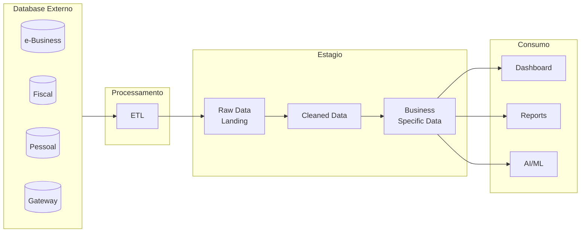
```mermaid
flowchart LR
    subgraph Source["Database Externo"]
direction LR
id01[(e-Business)]
id02[(Fiscal)]
id03[(Pessoal)]
id04[(Gateway)]

    end

    subgraph Processamento
        B[ETL]
    end

    subgraph Estagio
        C1[Raw Data</br>Landing]
        C2[Cleaned Data]
        C3[Business</br>Specific Data]
    end

    subgraph Consumo
        D1[Dashboard]
        D2[Reports]
        D3[AI/ML]
    end

    Source --> B
    B --> C1
    C1 --> C2
    C2 --> C3
    C3 --> D1
    C3 --> D2
    C3 --> D3
```

- [ ] _Zona de pouso ou preparação_:  _Esses dados normalmente vêm de um sistema externo como parte de um_ ETL, uma cópia direta de arquivo ou outro mecanismo de ingestão.
- [ ] Dados básicos limpos: Aplicar filtragem, remodelação e aplicação da qualidade dos dados para converter os dados do estágio 1 para o estágio 2.
- [ ] Dados empresariais selecionados: consistem em conjuntos de dados empresariais específicos criados a partir de dados obtidos no estágio 2.
## Arquitetura Medallion
A arquitetura medalhão é um padrão de design usado por profissionais de dados para organizar e delinear conjuntos de dados. Ela é dividida em três classificações ou camadas de medalhão diferentes, de acordo com o padrão da Medalha Olímpica:

- [ ] **Bronze, Prata e Ouro**.


|                      | BRONZE                                                                                       | PRATA                                                                                                                        | OURO                                                                                                                        |
| -------------------- | -------------------------------------------------------------------------------------------- | ---------------------------------------------------------------------------------------------------------------------------- | --------------------------------------------------------------------------------------------------------------------------- |
| TESTES DE ENGENHARIA | Alterações de Esquema: O esquema dos dados brutos recebidos foi alterado inesperadamente?    | Confiabilidade: Os pipelines de dados relataram falhas ou erros?                                                             | Temporalidade: Há atrasos ou anomalias inesperadas na atualização dos conjuntos de dados curados?                           |
|                      | Disponibilidade: A fonte de dados brutos está disponível e acessível no momento?             | Valores Aceitos: Todas as colunas categóricas contêm apenas valores válidos predefinidos (por exemplo, para status)?<br>     | Disponibilidade:Os conjuntos de dados publicados e curados estão acessíveis e utilizáveis ​​pelos usuários finais?          |
|                      | Atualidade: Os novos dados brutos chegaram conforme o esperado dentro do prazo definido?     | Integridade: Todos os valores de chave estrangeira referenciam corretamente os registros existentes em suas tabelas pai?<br> | Responsividade:As consultas são processadas dentro de um limite de tempo de desempenho aceitável?                           |
| TESTES FUNCIONAIS    | Completude: Há algum valor ausente nas colunas que são obrigatórias?                         | Consistência: Todos os valores correspondentes são representados usando o mesmo formato?                                     | Consistência:Os dados agregados correspondem aos dados de referência de outras fontes de dados?                             |
|                      | Validade:Os valores nos dados brutos podem ser convertidos para os tipos de dados esperados? | Outliers: Há algum valor significativamente diferente do padrão?                                                             | Privacidade de Dados:Há algum dado sensível (PII) exposto involuntariamente nos conjuntos de dados públicos da camada Gold? |
|                      | Unicidade: Há algum registro duplicado com base na(s) chave(s) primária(s) definida(s)?      | Unicidade:Há algum registro duplicado com base na(s) chave(s) de negócios definida(s)?                                       | Validade:Consultas de BI conhecidas e frequentemente utilizadas retornam resultados razoáveis?                              |

Cada uma das três camadas representa qualidade, confiabilidade e garantias progressivamente maiores sendo o bronze o mais fraco e o ouro o mais forte. Medallion é a adaptação mais recente e popular, e por um bom motivo: faz muito sentido da perspectiva de um profissional de dados que recebe pouca ou nenhuma ajuda das equipes que criam e mantêm os modelos de dados de origem.


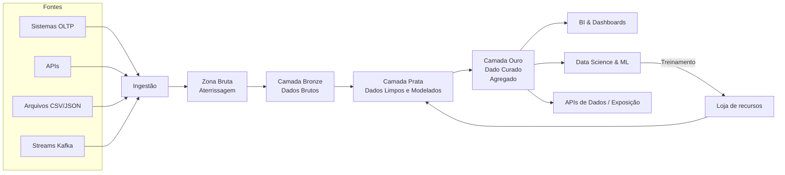
```mermaid
flowchart LR
    subgraph Fontes
        A1[Sistemas OLTP]
        A2[APIs]
        A3[Arquivos CSV/JSON]
        A4[Streams Kafka]
    end
    A1 --> B[Ingestão]
    A2 --> B
    A3 --> B
    A4 --> B
    B --> C[Zona Bruta</br>Aterrissagem]
    C --> D[Camada Bronze</br>Dados Brutos]
    D --> E[Camada Prata</br> Dados Limpos e Modelados]
    E --> F[Camada Ouro</br> Dado Curado</br>Agregado]
    F --> G1[BI & Dashboards]
    F --> G2[Data Science & ML]
    F --> G3[APIs de Dados / Exposição]
    G2 -->|Treinamento| H[Loja de recursos]
    H --> E
```

- [ ] A desvantagem da arquitetura Medallion é que todo o trabalho que você faz para deixar os dados limpos, confiáveis e bem formatados (a camada prateada) fica bloqueado no data lake ou no data warehouse.
	- [ ] Mover esses dados de prata para a esquerda  significa que podemos publicá-los como um **produto de dados** de primeira classe e fornecê-los a todos os consumidores, operacionais, analíticos ou intermediários;
	- [ ] Arquitetura Medallion é cara?
		- [ ] Cada etapa incorre em custos — carregamento de dados;
		- [ ] Encontrar conjuntos de dados semelhantes para reutilização pode ser difícil, pois a abordagem ad hoc para acessar dados tende a gerar silos e descobertas fragmentadas;
		- [ ] ETL falha, todos os trabalhos subsequentes devem ser pausados até que o ETL seja corrigido;
		- [ ] Transfere os dados do seu sistema para o seu data lake por meio de ETL/ELT, você precisa desnormalizá-los, reestruturá-los, padronizá-los, remodelá-los e dar sentido a eles — sem cometer erros;
		- [ ] Dados incorretos farão com que seus clientes percam a confiança;


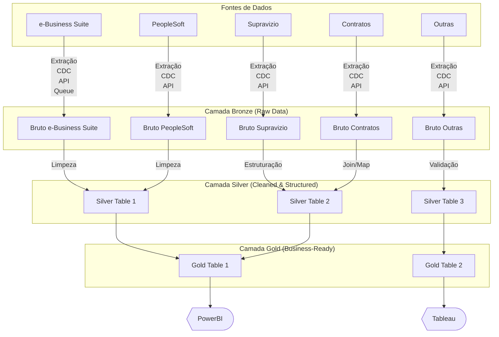
```mermaid
flowchart TD
    subgraph Fontes de Dados
        DB1[e-Business Suite]
        DB2[PeopleSoft]
        DB3[Supravizio]
        DB4[Contratos]
        DB5[Outras]
    end
    subgraph Bronze["Camada Bronze (Raw Data)"]
        Bronze1[Bruto e-Business Suite]
        Bronze2[Bruto PeopleSoft]
        Bronze3[Bruto Supravizio]
        Bronze4[Bruto Contratos]
        Bronze5[Bruto Outras]
    end
    subgraph Silver["Camada Silver (Cleaned & Structured)"]
        Silver1[Silver Table 1]
        Silver2[Silver Table 2]
        Silver3[Silver Table 3]
    end
    subgraph Gold["Camada Gold (Business-Ready)"]
        Gold1[Gold Table 1]
        Gold2[Gold Table 2]
    end
    DB1 -->|Extração</br>CDC</br>API</br>Queue| Bronze1
    DB2 -->|Extração</br>CDC</br>API| Bronze2
    DB3 -->|Extração</br>CDC</br>API| Bronze3
    DB4 -->|Extração</br>CDC</br>API| Bronze4
    DB5 -->|Extração</br>CDC</br>API| Bronze5

    dsp01@{ shape: curv-trap, label: "PowerBI" }
    dsp02@{ shape: curv-trap, label: "Tableau" }

    Bronze1 -->|Limpeza| Silver1
    Bronze2 -->|Limpeza| Silver1
    Bronze3 -->|Estruturação| Silver2
    Bronze4 -->|Join/Map| Silver2
    Bronze5 -->|Validação| Silver3
    Silver1 --> Gold1 --> dsp01
    Silver2 --> Gold1
    Silver3 --> Gold2 --> dsp02
```

- [ ] **Ingestão**: O processo de coletar dados de diferentes fontes e trazê-los para o ambiente de dados;
- [ ] **Zona de Bruta**: A primeira área de armazenamento após a ingestão, onde os dados são armazenados **exatamente como recebidos**, sem tratamento;
- [ ] **Camada Bronze**: Camada onde os dados são **organizados minimamente** para uso posterior, mantendo ainda sua forma bruta;
- [ ] **Camada Prata**: Camada intermediária com dados **limpos, estruturados, normalizados** e integrados (Correção de dados, tratamento de nulos, deduplicação, Envolve **joins**, **regras de negócio** e **validações** );
- [ ] **Camada final**: com dados **prontos para consumo analítico** ou operacional;
- [ ] **Loja de Recursos**: Promove a **reutilização e padronização** entre equipes.

## Os microsserviços são projetados como aplicativos pequenos, autocontidos e independentes.
Eles seguem a filosofia UNIX de fazer uma única coisa e fazê-la bem. Aplicativos mais complexos são criados conectando vários microsserviços entre
si, que se comunicam apenas por meio de interfaces padronizadas, como conexões HTTP RESTful.

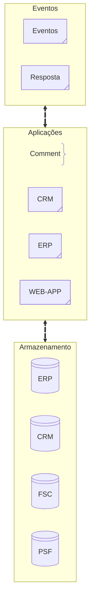
```mermaid
flowchart TD
 subgraph id00 ["Eventos"]
    E01@{ shape: tag-rect, label: "Eventos"  }
    E02@{ shape: tag-rect, label: "Resposta" }
 end
 subgraph id01 ["Aplicações"]
   A01@{ shape: brace-r, label: "Comment" }
   A02@{ shape: tag-rect, label: "CRM" }
   A03@{ shape: tag-rect, label: "ERP" }
   A04@{ shape: tag-rect, label: "WEB-APP" }
end
subgraph id02 ["Armazenamento"]
  AR01@{ shape: lin-cyl, label: "ERP" }
  AR02@{ shape: lin-cyl, label: "CRM" }
  AR03@{ shape: lin-cyl, label: "FSC" }
  AR04@{ shape: lin-cyl, label: "PSF" }
end
id00 L1@<==> id01
id01 L2@<==> id02
L1@{ animate: true }
L2@{ animate: true }
```


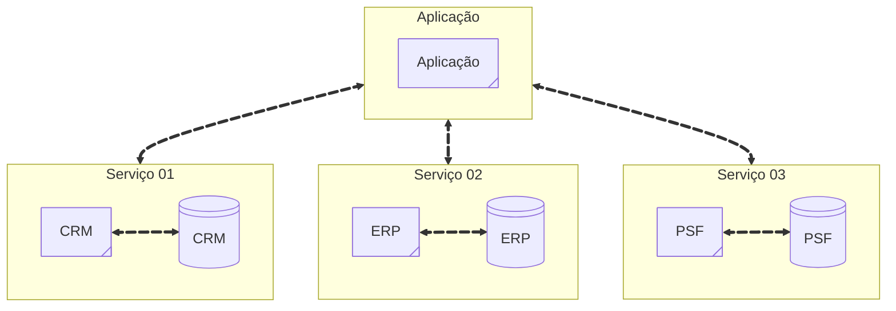
```mermaid
flowchart TD
 subgraph id01 ["Serviço 01"]
    SVA01@{ shape: tag-rect, label: "CRM" }
    DBA01@{ shape: lin-cyl, label: "CRM" }
    SVA01  Lid01@<==>  DBA01
    Lid01@{ animate: true }
 end
 subgraph id02 ["Serviço 02"]
    SVA02@{ shape: tag-rect, label: "ERP" }
    DBA02@{ shape: lin-cyl, label: "ERP" }
    SVA02  Lid02@<==>  DBA02
    Lid02@{ animate: true }
end
subgraph id03 ["Serviço 03"]
    SVA03@{ shape: tag-rect, label: "PSF" }
    DBA03@{ shape: lin-cyl, label: "PSF" }
    SVA03  Lid03@<==>  DBA03
    Lid03@{ animate: true }
end
subgraph id04 ["Aplicação"]
 APP01@{ shape: tag-rect, label: "Aplicação" }
end
id04 Lid05@<==> id01
id04 Lid06@<==> id02
id04 Lid07@<==> id03
Lid05@{ animate: true }
Lid06@{ animate: true }
Lid07@{ animate: true }
```


# Estudo

## Algumas Ferramentas

| OSS           | Azure                        | Uso                                                  |
| ------------- | ---------------------------- | ---------------------------------------------------- |
| OPEN METADATA | **Databricks Unity Catalog** | **Governança e Segurança**                           |
| AIRFLOW       | Databricks Workflows         | Orquestração                                         |
| MINIO         | Azure BlobStorage            | Armazenamento                                        |
| TRINO         | Apache Spark                 | Motor de consulta SQL                                |
| JUPYTER       | Databricks Notebook          | Data Science criação, compartilhamento de documentos |

## Apache Flink
É um processador de fluxo robusto e robusto, amplamente utilizado em aplicações exigentes como essas.

Seu desempenho e robustez são o resultado de alguns princípios básicos de design, incluindo uma arquitetura "share-nothing" com estado local, processamento em tempo de evento e snapshots de estado (para recuperação).
### Arquitetura Share-Nothing
Em sistemas distribuídos, esta é uma arquitetura onde cada nó é completamente independente de outros nós no sistema. A estrutura de processamento do Hadoop usa o armazenamento HDFS distribuído.

```mermaid
graph TD
    subgraph Nó 1
        DB1[(Banco de Dados 1)]
        App1[Aplicação 1]
        App1 --> DB1
    end

    subgraph Nó 2
        DB2[(Banco de Dados 2)]
        App2[Aplicação 2]
        App2 --> DB2
    end

    subgraph Nó 3
        DB3[(Banco de Dados 3)]
        App3[Aplicação 3]
        App3 --> DB3
    end

    Client[Cliente]
    Client --> App1
    Client --> App2
    Client --> App3
```
Essas arquiteturas também são tolerantes a falhas: cada nó é independente, portanto não há pontos únicos de falha, e o sistema pode se recuperar rapidamente de uma falha de um nó individual.
## Pipelines de Dados de Streaming


```mermaid
flowchart TD
    subgraph "Camada de Origem"
        EBS[Oracle e-Business Suite]
        EBS -->|Conexão JDBC/API| Hop
    end

    subgraph "Camada de Orquestração e Transformação"
        Hop[Apache Hop]
        Hop -->|Geração de Pipeline| Beam[Apache Beam]
    end

    subgraph "Motores de Execução Distribuída"
        Flink[Apache Flink]
        Spark[Apache Spark]
        Dataflow[Google Dataflow]
        Beam -->|Executa em| Flink
        Beam --> Spark
        Beam --> Dataflow
    end

    subgraph "Camada de Destino"
        DW[(Data Warehouse)]
        Lake[(Data Lake)]
        BI[Ferramentas de BI e Analytics]
        Flink --> DW
        Spark --> Lake
        Dataflow --> BI
    end

    classDef cloud fill:#e6f7ff,stroke:#1890ff,stroke-width:1px;
    classDef db fill:#fffbe6,stroke:#faad14,stroke-width:1px;
    classDef processing fill:#f6ffed,stroke:#52c41a,stroke-width:1px;

    class EBS db
    class Hop,Beam processing
    class Flink,Spark,Dataflow cloud
    class DW,Lake,BI db

```


```mermaid
flowchart TD
    subgraph "Camada de Origem"
        ERP[ERP / Banco de Dados Oracle, SAP]
        CRM[CRM / SaaS]
        Files[Arquivos CSV, JSON, XML]
    end

    subgraph "Ingestão com Azure Data Factory"
        ADF[Azure Data Factory]
        ERP -->|Copy Activity| ADF
        CRM -->|Copy Activity| ADF
        Files -->|Copy Activity| ADF
    end

    subgraph "Data Lake - Multi-Hop"
        Bronze[Bronze Layer Raw Data]
        Silver[Silver Layer Cleansed _ Joined]
        Gold[Gold Layer Business-ready Data]
        ADF --> Bronze
        Bronze -->|Transformações com ADF/Databricks| Silver
        Silver -->|Modelagem e Agregações| Gold
    end

    subgraph "Camada de Consumo"
        PowerBI[Power BI]
        SQLDB[Azure Synapse / SQL DB]
        ML[Modelos de Machine Learning]
        Gold --> PowerBI
        Gold --> SQLDB
        Gold --> ML
    end

    classDef ingest fill:#e6f7ff,stroke:#1890ff,stroke-width:1px;
    classDef lake fill:#fffbe6,stroke:#faad14,stroke-width:1px;
    classDef consume fill:#f6ffed,stroke:#52c41a,stroke-width:1px;

    class ADF ingest
    class Bronze,Silver,Gold lake
    class PowerBI,SQLDB,ML consume

```

# Exemplo - Plano de Governança de Dados Mestres
## Resumo Executivo
Este plano descreve a estrutura de governança de dados mestres para assegurar consistência, integridade, conformidade regulatória e valor dos dados mestres em todo o ecossistema SAP da organização.

## Objetivos

- [ ] Garantir dados mestres de alta qualidade
- [ ] Estabelecer papéis claros de responsabilidade
- [ ] Assegurar conformidade com LGPD, PCI, HPI e demais regulações
- [ ] Promover integração eficaz entre sistemas SAP

## Escopo
- [ ] Dados abrangidos: Fornecedores, Clientes, Materiais, Funcionários, Contas Contábeis, Localizações
- [ ] Sistemas envolvidos: S/4HANA, Concur, Ariba, LG, OneSource e SGPS
- [ ] Regiões cobertas: [ex: Brasil]

## Papéis e Responsabilidades (RACI)
| **Função**                | **Responsável (R)** | **Aprovador (A)**  | **Consultado (C)**      | **Informado (I)** |
| ------------------------- | ------------------- | ------------------ | ----------------------- | ----------------- |
| Criação de Fornecedor     | Área de Suprimentos | GRC / Compliance   | TI / Jurídico           | Controladoria     |
| Criação de Funcionário    | RH                  | Business Partner   | Jurídico                | Fiscal            |
| Integração entre sistemas | TI                  | Arquiteto de Dados | Segurança da Informação | GRC               |

## Ciclo de Vida dos Dados

Solicitação → Validação → Aprovação → Publicação → Sincronização → Arquivamento/Obsolescência

## Ferramentas e Tecnologias

- [ ] SAP MDG – Governança central;
- [ ] SAP Integration Suite (CPI) – Replicação entre sistemas;
- [ ] SAP BTP Data Catalog – Repositório de metadados;
- [ ] SAP Business Data Cloud;
- [ ] Data Bricks;
- [ ] Apache HOP;

## Políticas e Padrões
- [ ] Naming convention;
- [ ] Validação de duplicidade automatizada;
- [ ] Códigos de classificação padronizados (UNSPSC, NCM, CNAE);
- [ ] Campos obrigatórios por tipo de dado;
- [ ] Regras de segmentação por país (GPDR, PCI DSS, LGPD e HIPAA);
## Monitoramento e Qualidade
- [ ] KPIs: % de duplicidade, % de preenchimento, tempo médio de aprovação;
 - [ ] Auditorias:  Mensal, Trimestrais, Semestral ou  [Anual;
- [ ] Indicadores de conformidade (PCI, LGPD, etc.);
## Rascunho de Como Iniciar
- [ ] Realize uma auditoria de dados: Classifique fontes, problemas de qualidade e duplicação.
- [ ] Mude da tomada de decisão em silos para a federada: Defina uma propriedade clara para iniciativas digitais, unidades de negócios e operações.
- [ ] Capacite os proprietários de produtos: substitua as cadeias de aprovação hierárquicas por governança ágil para experimentação rápida (por exemplo, lançamentos de MVP).
- [ ]  Implemente ferramentas de metadados e linhagem (por exemplo, Collibra, Atlan, Ferramentas de Metadados/Apache Atlas) para transparência e rastreabilidade.
- [ ] Alinhe os orçamentos com modelos de assinatura de nuvem e sprints ágeis (por exemplo, ciclos de financiamento trimestrais versus anuais).
	- [ ] Integração FinOps: Controle os gastos com nuvem com equipes multifuncionais para evitar custos excessivos. On-premise ou Full Cloud?
- [ ] Organize um workshop de 1 hora para priorizar os 3 principais pontos problemáticos (por exemplo, lacunas de conformidade, fluxos de trabalho quebrados).
	- [ ] Mapeie domínios de dados críticos (Cliente, Finanças) e sistemas (CRM, ERP).
	- [ ] Mapa de calor de risco de dados destacando áreas urgentes;
 - [ ] Governança de API e regras de residência de dados.
	- [ ] Segurança (Autenticação e Autorização padronizadas, **Rate limiting & throttling** para evitar abusos, **Criptografia** (HTTPS, TLS))
	- [ ] Design e Padronização (Uso consistente de **REST, GraphQL**),  Convenções(Versionamento, nomeação, verbos, estrutura de respostas e padronização de mensagens  de erro)
	- [ ] Documentação (APIs **autodocumentadas** (OpenAPI/Swagger, Postman, etc.), Portal de desenvolvedores (Exemplos de uso, playground)
	- [ ] Monitoramento e Observabilidade (Logs detalhados de chamada, Métricas de uso e performance (ex: tempo de resposta, erros) )
	- [ ] Qualidade (contratuais, Linters e validadores de esquema (Spectral  (https://github.com/stoplightio/spectral))
	- [ ] Gestão de Ciclo de Vida (Publicação, Versionamento, deprecation strategy)
	- [ ] Reusabilidade e Descobrimento (Registro central de APIs disponíveis)
	- [ ] Compliance e Conformidade (Aderência a LGPD, GDPR e outras regulações, Políticas de privacidade de dados em APIs públicas e internas)
	- [ ] Governança Organizacional (API Owners, Product Managers, Times consumidores e provedores) e Comitê de Arquitetura ou API Guild para orientar e aprovar
	- [ ] Portais e gateways com gestão centralizada (Kong, Apigee, AWS API Gateway, etc.)
- [ ] Mapeie domínios de dados críticos (Clientes, Itens) e sistemas (CRM, ERP e demais sistemas internos);
    - [ ]  Estabeleça fontes de ouro e hubs de dados mestres para domínios críticos;
- [ ] Automatize a criação de perfis de dados, a limpeza e o monitoramento de qualidade;
- [ ] Implemente ferramentas de metadados e linhagem para transparência e rastreabilidade.
- [ ] Definição Legal da Temporalidade de Dados.(**Quanto mais dados mais desperdícios e este é um processo Lean**) .

### Exemplo: Questionário Básico para Fonte de Dados/Origem
- [ ] Qual o provedor público que a solução encontra-se hospedada?
	- [ ] Amazon Web Services (AWS)
	- [ ] Microsoft Azure
	- [ ] Google Cloud Platform (GCP)
	- [ ] IBM Cloud
	- [ ] Oracle Cloud

- [ ] Tipos de integração SaaS vs SaaS ou SaaS vs On-premise?
	- [ ] Application Programming Interface (RESTful APIs, Webhooks)
	- [ ] Integração via Middleware / iPaaS (Integration Platform as a Service)
	- [ ] Integração via Troca de Arquivos (File-based Integration)
	- [ ] Integração via Conectores Nativos (**plug-and-play**)
	- [ ] Integração via RPA (Robotic Process Automation)
	- [ ] ETL / ELT (Extração, Transformação e Carga de Dados)
- [ ] Segurança
	- [ ] Como é feito o controle de autenticação/autorização das APIs?
		- [ ] ABAC — Attribute-Based Access Control
		- [ ] Scopes no OAuth 2.0
		- [ ] ABAC + OAuth 2.0 Scopes
- [ ] Como os logs de acesso são monitorados e auditados?
- [ ] Existem limites de rate limiting ou throttling do lado SaaS?
- [ ] Existe segregação de ambientes (dev, hml/qa e prd)?
- [ ] Qual a frequência de sincronização dos dados?
	- [ ] Instantânea (segundos) (Webhooks, APIs com push, sockets, streaming (Kafka, WebSockets))
	- [ ] A cada 1 a 15 minutos (Cron jobs, tarefas agendadas, polling via API)
	- [ ] Horária (Cron jobs, tarefas agendadas, polling via API)
	- [ ] Diária (Cron jobs, tarefas agendadas, polling via API)
	- [ ] Semanal
	- [ ] Mensal
- [ ] Indique para Cada Sincronização de Dados: Criticidade dos dados, Volume/Custos e Capacidade técnica em realizar de forma instantânea.
- [ ] Como será feita a integração com cada ambiente (API, conectores, ETL, CDC)?
- [ ] Quais são as particularidades de cada ambiente (por exemplo, limites de API, taxas de transferência, etc.)?

- [ ] Monitoramento
	- [ ] Como é feito o monitoramento da integração?
		- [ ] Há dashboards, alertas, health checks?
		- [ ] Existem relatórios de sucesso/falha por operação? Há trilha de auditoria para dados lidos/enviados?

	- [ ] O que acontece se a comunicação SaaS  e on-Premise ou SaaS, tiver algum tipo de falha, há mecanismos de retry automático, fallback? Há logs de falhas de integração e como eles são acessados?
	- [ ] Existe mecanismo de **fila** ou **buffer** para eventos/dados não processados?
	- [ ] Como os custos de transferência e processamento de dados serão gerenciados pela BBTS/Fornecedor SaaS?
	- [ ] Há limites de largura de banda ou consumo que precisam ser respeitados?
- [ ] Volumetria
	- [ ] Qual o volume estimado de dados a ser consumido? (Pessoais, Funcionario, Contratuais, Regra de Ausência, Competências , Treinamentos, UOR, Estrutura Organizacional, Estrutura Posicional, Integração Pagamento, Integração Contábil);
	- [ ] Quais formatos de dados serão tratados (JSON,XML, Parquet, etc.)?
	- [ ] Como os dados serão criptografados em trânsito ?

# Fear of Missing Out (F.o.M.O.)


# Resumo

# Alguns Exemplos

##  Autorização para Compartilhamento de Dados Pessoais

|                                                   |                                                 |
| ------------------------------------------------- | ----------------------------------------------- |
| Dados coletados:                                  | nome, CPF, matrícula, e-mail corporativo        |
| Base legal:                                       | Consentimento do colaborador                    |
| Terceiro autorizado:                              | CNPJ, Nome da Empresa, Contrato Assinado e etc. |
| Registro do consentimento:                        | Formulário de adesão assinado digitalmente      |
| Contrato com cláusula de proteção de dados (NDA): | Sim                                             |
| Periodicidade de revisão                          |                                                 |
| Período de Consentimento:                         | 99/99/9999 a 99/99/9999                         |
| Ciencia da                                        |                                                 |
## Revogação de Consentimento

**Nome da Empresa]**
**CNPJ:** [CNPJ da Empresa]
**Endereço:** [Endereço da Empresa]
**E-mail do DPO (Encarregado de Dados):** [e-mail de contato oficial]
### **IDENTIFICAÇÃO DO TITULAR DOS DADOS**

**Nome completo:** __________________________________________
**CPF:** ________________________
**E-mail:** __________________________________________
**Telefone de contato:** ____________________________________
### **OBJETO DA REVOGAÇÃO**
Eu, [nome do titular], **revogo, de forma livre, informada e inequívoca**, o **consentimento anteriormente concedido** para o tratamento dos meus dados pessoais pela empresa [Nome da Empresa], conforme descrito no termo de consentimento assinado em [data do consentimento original]. Essa revogação refere-se ao tratamento dos seguintes dados (Relacionar aos dados concedidos e movimentaçoes)

☐ Dado 1
☐ Dado n
☐ Outros (especificar): ____________________________________

### **JUSTIFICATIVA (opcional)**

### **CONSEQUÊNCIAS DA REVOGAÇÃO**
Declaro estar ciente de que a **revogação do consentimento** poderá implicar na **impossibilidade de continuidade de determinados serviços ou benefícios**, caso esses dependam exclusivamente da base legal do consentimento, como:


### **DESTINO DOS DADOS**

☐ Solicito a exclusão completa dos dados tratados com base no consentimento.
☐ Solicito apenas a interrupção do uso, mantendo os dados armazenados conforme prazos legais.
☐ Outro (especificar): ___________________________________________

### **ASSINATURA DO TITULAR DOS DADOS**

**Cidade:** _________________________
**Data:** _****/****_/________

**Assinatura:** ___________________________________________
### **RECEBIMENTO PELA EMPRESA**

**Recebido por:** ___________________________________________
**Cargo:** _________________________________________________
**Data do recebimento:** _****/****_/________


# Querido Diário

```mermaid
flowchart TD
id1[[Diário Oficial]] --> spider@{ shape: procs, label: "Spiders/Raspadores"}
spider --> meta@{ shape: cyl, label: "Metadados" }
meta --> mt@{ shape: cyl, label: "Index </br>Motor Busca" }
spider --> jornal@{ shape: docs, label: "Arquivo Bruto"}
jornal --> processo@{ shape: dbl-circ, label: "Proc" }
processo --> texto@{ shape: docs, label: "Texto Bruto"}
texto --> mt
dscenso@{ shape: cyl, label: "Dados do Censo" }
dscenso --> api@{ shape: dbl-circ, label: "API" }
mt --> api
api --> input@{ shape: lean-r, label: "Plataforma</br>Visualização" }
input --> usuario@{ shape: rect, label: "Usuário" }
```


### A Explosão de Dados e o Crescimento de Aplicações de Dados
A quantidade de dados criados anualmente está crescendo exponencialmente, impulsionando o desenvolvimento de **"aplicações de dados"** que utilizam esses dados para gerar valor para os clientes.
Trabalhar com grandes volumes de dados requer plataformas especializadas para coleta, organização e exibição.
Aplicações de dados agregam valor ao aproveitar a incrível quantidade e variedade de dados disponíveis para impulsionar oportunidades de negócios novas e existentes.
### Importância de uma Plataforma de Dados Robusta
Uma plataforma de dados bem projetada permite que desenvolvedores de aplicativos se concentrem na criação de novas experiências de usuário e recursos.

Recursos importantes de uma plataforma de dados incluem suporte a diferentes tipos e estruturas de dados, interoperabilidade com ferramentas externas e fontes de dados, e escalabilidade eficiente.
### Ambientes de Nuvem e suas Vantagens
Ambientes de nuvem oferecem vantagens significativas em relação a soluções locais em termos de velocidade, escalabilidade, custo e manutenção.

- [ ] **Elasticidade da Nuvem**: Permite dimensionar recursos para atender à demanda por um custo menor do que expandir um data center, e reduzir recursos quando a carga diminui, oferecendo economia.
- [ ] **Modelos de Nuvem**
	- [ ] **Hospedado na Nuvem**: Executa software projetado para sistemas locais na nuvem. É preferível ao modelo local, mas ainda acarreta manutenção significativa e limita o aproveitamento dos recursos da nuvem.
	- [ ] **Priorizado na Nuvem**: Software desenvolvido especificamente para aproveitar os benefícios da nuvem, como escalabilidade e elasticidade. O provedor assume a responsabilidade pela operação da pilha e pelo dimensionamento automático de recursos. Este modelo é considerado superior.

Ambientes que priorizam a nuvem maximizam os benefícios da nuvem, como a redução de uma parcela significativa da carga de manutenção na criação e operação de aplicativos de dados.

A disponibilidade em múltiplas regiões geográficas pode ser construída de forma mais eficaz em ambientes priorizados na nuvem, com migração automática em caso de problemas em uma região.
### Suporte a Bancos de Dados Relacionais e NoSQL
Bancos de dados relacionais (com suporte a SQL e garantias ACID) continuam sendo componentes críticos para suportar ferramentas de BI embarcadas, visualização e usuários analíticos.

O SQL se beneficia de décadas de desenvolvimento, possui milhões de usuários e um ecossistema robusto.

Dados semiestruturados (como JSON ou Parquet), cuja prevalência cresceu exponencialmente, demandaram o surgimento de bancos de dados NoSQL, que se destacam em gravações rápidas e de alto volume.
No entanto, bancos de dados relacionais evoluíram para incluir suporte a dados semiestruturados e mantêm a vantagem na expressão de consultas analíticas através do SQL.
Bancos de dados NoSQL geralmente requerem o aprendizado de linguagens de programação ou linguagens específicas, o que pode limitar o uso por programadores.
### Separação de Armazenamento e Computação
Historicamente acoplados, a separação de armazenamento e computação em plataformas de dados modernas oferece maior confiabilidade, escalabilidade e redução de custos.
Permite escalar recursos independentemente de acordo com a demanda (mais poder computacional em picos, mais armazenamento com o crescimento dos dados).
Evita custos adicionais por recursos desnecessários que seriam provisionados juntos em sistemas acoplados.
Protege contra perda de dados em caso de falhas na instância de computação.
### Isolamento de Carga de Trabalho em Ambientes Multilocatários:
Em aplicações de dados com múltiplos clientes (locatários), é crucial isolar as cargas de trabalho de ingestão, analíticas e as cargas de trabalho de diferentes clientes uns dos outros para evitar a degradação do desempenho.
Existe uma disputa inerente por recursos em sistemas de dados, tornando o isolamento essencial.
### Extensibilidade da Plataforma de Dados
A capacidade de utilizar recursos de terceiros e código personalizado (User-Defined Functions - UDFs e Stored Procedures) é importante.
UDFs permitem encapsular código (em SQL, Python, Java) para reutilização em consultas SQL.
Stored Procedures são sub-rotinas SQL armazenadas em bancos de dados relacionais, úteis para gerar SQL dinamicamente ou executar operações CRUD.
A integração com sistemas externos para obter dados adicionais ou realizar análises é uma necessidade frequente.
### Escalabilidade em Aplicações de Dados
Escalabilidade é um requisito fundamental para o sucesso de aplicações de dados, permitindo integrar novos clientes rapidamente, executar novas cargas de trabalho sem impactar outros e aproveitar a elasticidade da nuvem para controlar custos.

- [ ] **Escalabilidade Vertical**: Fornecer recursos mais poderosos para executar uma tarefa.
- [ ] **Escalabilidade Horizontal**: Adicionar mais nós (instâncias) para lidar com o aumento da demanda. Plataformas priorizadas na nuvem geralmente gerenciam esse processo automaticamente.

Warehouses virtuais (como no Snowflake) e warehouses multicluster são mencionados como mecanismos para fornecer escalabilidade e isolamento de recursos computacionais para diferentes locatários e níveis de serviço.
### Padrões de Design para Armazenamento em Ambientes Multilocatários
Diferentes métodos para isolar dados entre locatários:
- [ ] **Tabelas Multilocatário**: Todos os locatários compartilham as mesmas tabelas, com segurança aplicada no nível da linha ou coluna. Requer consideração para garantir o desempenho.
- [ ] **Objeto por Locatário**: Locatários possuem seus próprios bancos de dados, esquemas e tabelas, agrupados em uma única instância de banco de dados, com controle de acesso baseado em função (RBAC). Pode se tornar difícil de gerenciar com muitos clientes.
- [ ] **Conta por Locatário**: Cada locatário possui uma instância de banco de dados dedicada associada à sua conta. Oferece maior isolamento, mas aumenta a sobrecarga administrativa e de manutenção.
### Padrões de Design para Segurança em Ambientes Multilocatários
A segurança dos dados é uma preocupação fundamental dos clientes.
Mecanismos de segurança devem incluir garantias para requisitos regulatórios e contratuais, bem como gerenciamento de acesso a dados e recursos computacionais.
- [ ] **Controle de Acesso Baseado em Função (RBAC)**: Agrupa privilégios em funções que são atribuídas aos usuários.
- [ ] **Controle de Acesso Discricionário (DAC)**: Proprietários de objetos podem conceder acesso a outros usuários a seu critério. O Snowflake combina esses modelos, com proprietários concedendo acesso por meio de funções atribuídas aos usuários.
É recomendável minimizar a distribuição de privilégios de um objeto entre várias funções e utilizar uma hierarquia de funções para criar combinações de privilégios.
A capacidade de auditar alterações nos controles de acesso é crucial.
Outras considerações de segurança incluem autenticação, gerenciamento de criptografia e design de rede segura.
### Processamento de Dados (ETL vs ELT):
- [ ] **Data Warehouses**: Armazenam apenas dados conformados (transformados em um esquema definido durante a ingestão).
- [ ] **Data Lakes**: Contêm dados em seu formato bruto, com a transformação ocorrendo sob demanda (esquema na leitura).
A decisão sobre o que conformar e o que deixar em estado bruto depende de como os dados serão usados.
- [ ] **ETL (Extract, Transform, Load)**: Dados são transformados antes de serem carregados no data warehouse.
- [ ] **ELT (Extract, Load, Transform)**: Dados brutos são carregados primeiro e a transformação ocorre quando necessário para análise (esquema na leitura). O ELT é facilitado por plataformas de nuvem com poder computacional elástico.
O esquema na leitura (ELT) é preferido por fornecedores de dados, pois reduz a carga de lidar com alterações na fonte de dados.

O tipo de dado VARIANT do Snowflake permite o esquema na leitura para dados semiestruturados.

- [ ] **Processamento em Lote (Batch Processing)**: Processa grandes volumes de dados em intervalos definidos.
- [ ] **Processamento de Streaming**: Opera continuamente em eventos individuais ou microlotes.
### Compartilhamento de Dados
A capacidade de compartilhar dados com segurança e em tempo real é essencial para aplicações de dados.

- [ ] **Compartilhamento por Cópia**: Abordagem legada que envolve a criação e transferência de cópias de dados, gerando custos de armazenamento, sobrecarga de manutenção e problemas de versionamento e atualização.
- [ ] **Compartilhamento por Referência**: Abordagem moderna onde os dados permanecem fixos e o acesso é concedido por meio de referências, eliminando a necessidade de cópia e permitindo o compartilhamento imediato e revogação de acesso.

O Snowflake Secure Data Sharing permite que consumidores e provedores acessem a mesma cópia dos dados, aproveitando a arquitetura de dados compartilhados e multicluster. O acesso é controlado pela camada de serviços e metadados, permitindo concessão e revogação instantâneas.

- [ ] **Snowflake Data Marketplace**: Permite que provedores de dados monetizem seus dados e que consumidores descubram e acessem dados de diversas fontes sem a complexidade da cópia.

O compartilhamento de dados por referência quebra silos de dados, facilita um ciclo de feedback entre provedores e consumidores e mantém custos e carga de manutenção sob controle.
### Principais Recursos de uma Plataforma de Dados Moderna (implícito)

- [ ] Separação de armazenamento e computação.
- [ ] Suporte nativo para dados semi-estruturados.
- [ ] Suporte para SQL padrão.
- [ ] Isolamento de carga de trabalho em ambientes multilocatários.
- [ ] Escalabilidade elástica para corresponder à demanda.
- [ ] Recursos de compartilhamento de dados seguros e eficientes.


###  **Arquitetura Integração de Dados**
As arquiteturas de integração de dados tornam-se canais para coletar e fornecer insights sobre processos e dados de negócios.
### **Arquitetura Integração de Dados**
A economia digital colocou mais demanda por serviços de dados dentro de uma organização, sobrecarregando a TI para fornecer esses serviços, acarretando uma proliferação de integrações não governadas na verdade piora na entrega e manutenção da mesma.

Arquiteturas de integração de dados consistem em múltiplas tecnologias que também podem ser alinhadas a outras áreas, como gerenciamento de dados ou governança de dados.
As arquiteturas de integração de dados tornam-se canais para coletar e fornecer insights sobre processos e dados de negócios.
A integração de dados geralmente é uma tarefa dentro de um projeto maior, sendo um método que fornece dados que podem suportar algum conjunto de requisitos de negócios, objetivando uma melhorara na eficiência geral das organizações comerciais e técnicas, validando efetivamente seus pipelines e resultados de dados e análises.
Uma arquitetura de integração auxuliará a organizar as integrações em um ambiente coerente e estruturado.
Para podermos iniciar o trabalho, foi necessário efetuar um mapeamento dos dados mestres e referêmcia, propondo uma higienização durante o processo de implantação de um novo sistema de Gestão Empresarial. Nosso objetivo foi a promoção da higienização, designação do gestor, background check e seus metadados.
Foram identificados neste trabalho, ciclos viciosos de desenvolvimento em uma arquitetura acidental, que não garantiam a qualidade dos dados, aumentavam as dívida técnica e de processo.
Eventualmente, surgem perguntas sobre como os resultados foram derivados, a qualidade dos dados, a fonte dos dados e por que as mesmas métricas têm resultados diferentes em diferentes operações de negócios.

Uma arquitetura de integração de dados consiste nas tecnologias, dados e padrões, processos de negócios, necessidades de armazenamento e requisitos operacionais que permitem a entrega da integração de dados.

| Requisitos             | Tecnologia   | Design              | Implementação       | Monitoramento |
| ---------------------- | ------------ | ------------------- | ------------------- | ------------- |
| Dados Estruturados     | Mensageria   | Replicação          | Data Pipeline       | Custo         |
| Dados Não Estruturados | ETL/ELT/ETLT | Preparação          | Integração Metadata | Adminitração  |
| Processos de Negócio   | Orquestração | Transformação       | Armazenagem         | Suporte       |
| Metadata               | DatOps       | Orquestraçãp        |                     |               |
| Temporalidade          | Catalogação  | ETL/ELT/ETLT        |                     |               |
| Performance            |              | Pipeline Integração |                     |               |

## **Base de governança de dados e gerenciamento de informações**

Crie uma base de governança de dados e gerenciamento de informações para dar suporte ao gerenciamento de dados mestres e gerenciamento de metadados para dar suporte a casos de uso de governança de dados e análises; desenvolva novas habilidades e práticas recomendadas; e estabeleça segurança, privacidade e conformidade no gerenciamento de dados.

## **Arquitetura e modernização de gerenciamento de dados**
Implante uma infraestrutura de gerenciamento de dados escalável e confiável e arquitete a arquitetura de dados moderna mais adequada, incluindo gerenciamento de dados local, nativo da nuvem e híbrido para oferecer suporte a volume, velocidade e variedade de dados extremos.
## Princípios e implantações de gerenciamento de dados
Selecione, projete, implante e operacionalize sistemas de gerenciamento de dados usando tendências emergentes em armazenamentos de dados para fins especiais, como armazenamentos não relacionais, gráficos e de objetos, e migre bancos de dados para executar cargas de trabalho híbridas, multicloud e de borda.
## Integração de dados de última geração
Desenvolva as melhores práticas e arquitetura para integração de dados, aproveitando os princípios de engenharia de dados e as tecnologias de virtualização de dados para oferecer suporte a casos de uso de streaming em lote e em tempo real.
## Design de integrações usando métodos apropriados
O design de uma arquitetura de integração pega os processos de negócios definidos e os traduz em pipelines de integração. As fontes de dados e processos se tornam o pipeline de integração; o uso de dados e os tipos de dados se tornam os métodos de integração e transformações; e a usabilidade e o acesso aos dados se torna Insights sobre formatos de dados, uso dos dados, métodos de armazenamento, podem determinar o método de integração.
#### **Processos de negócios e regras de transformação**
As perguntas a serem respondidas pelos requisitos do processo incluem:

| Perguntas                                                | Perguntas                                              |
| -------------------------------------------------------- | ------------------------------------------------------ |
| Qual é a fonte dos dados ?                               | Existe algum Orgão regulador? Há contratos?            |
| Quem criará os dados?                                    | Quem poderá ler, consultar ou manter?                  |
| Dados históricos deverão ser mantidos, por quanto tempo? | Dados históricos precisarão ser modificados?           |
| Quais os tipos de validações, serão necessárias?         | Como os dados serão usados?                            |
| Que tipo de metadados devem ser capturados?              | Como os usuários consumirão/acessarão os dados finais? |

Os metadados contêm as informações necessárias para fornecer informações sobre definições de dados ou dicionários, linhagem de dados, pipelines de dados para usuários corporativos e desenvolvedores.

Esses tipos incluem metadados operacionais (relacionados a operações da arquitetura de integração, como tempos de execução de pipeline, número de falhas, transformações, agregações e junções executadas em dados) e metadados de negócios (como dicionários de dados e linhagem).
## Métodos de integração
Existem vários métodos de integração de dados, dependendo do formato, caso de uso e volume. Há plataformas de integração que fornecem recursos que vão além de apenas extrair, transformar e carregar (ETL/ELT/ETLT), como catálogos de dados, recursos de IA, governança de dados e suporte a DataOps, integração de fluxo ou virtualização.

| Técnica de Integração  | Descrição                                                                                                                                                                                                       |
| ---------------------- | --------------------------------------------------------------------------------------------------------------------------------------------------------------------------------------------------------------- |
| Replicação             | Pode ser considerada a forma mais básica de integração, pois envolve a cópia direta de dados de um sistema para outro.                                                                                          |
| Virtualização          | Executa consultas em várias fontes de dados para criar visualizações virtuais integradas de dados sob demanda.                                                                                                  |
| ETL/ELT                | Os dados de origem são extraídos e podem ser gravados como um arquivo em lote ou processados em trânsito, aproveitando uma ferramenta ou plataforma de integração de dados.                                     |
| ETLT                   | Mesmos conceitos fundamentais de ETL, porem, o processo de integração envolve várias etapas de extração, transformação e carga, e também pode incluir etapas adicionais de carregamento e transformação.        |
| Stream Data Processing | É um método para ingerir, integrar e processar dados em tempo real assim que são produzidos. A latência entre a criação e o processamento de dados é extremamente baixa em comparação ao processamento em lote. |
## Plataformas de integração
As plataformas de integração visam ser uma plataforma única para recursos de dados.
Com as permissões e acesso adequados, os usuários podem acessar dicionários de dados, entender a precisão e a qualidade dos dados, integrar dados mestres, visualizar a linhagem de dados e ver transformações, validações e quaisquer consolidações de dados até a fonte.
## Scheduler e Workflow Manager
O agendamento de pipeline de integração e o gerenciamento de fluxo de trabalho, como execução de frequência de trabalhos, alertas e automação são padrão, definidas nestas plataformas.
## Catálogos de dados
Os catálogos de dados armazenam metadados, tanto operacionais quanto comerciais, que complementam as transformações de dados ou análises para visualizar a jornada de dados.

- [ ] CI/CD, DataOps, Orquestração: Orquestração é o processo de criação de uma unidade lógica de pipelines de dados relacionados, fluxos de trabalho e componentes associados que produzem os conjuntos de dados desejados, incluindo seus artefatos (por exemplo, metadados, dicionário de dados, qualidade de dados e estatísticas de validação).
- [ ] HA, DR, Escalabilidade: O foco principal em alta disponibilidade (HA) e recuperação de desastres (DR) é manter o sistema operacional o tempo todo. No entanto, a principal diferença é que a HA aborda o problema enquanto o sistema é executado, enquanto a DR entra depois que ele falha.

Independentemente de quão altamente disponível um sistema seja, qualquer aplicativo de produção precisa ter planos de recuperação de desastres, pois alta disponibilidade e recuperação de desastres não são mutuamente exclusivas.
## Integração
A implementação dependerá das funções e recursos da ferramenta, que deveriam ter sido avaliados.

- [ ] Qual a melhor forma de implementar o CDC e onde?
- [ ] Como lidamos com dados atrasados/duplicados?
- [ ] Em caso de falha do pipeline, o processo deve ser executado novamente ou precisa continuar de onde falhou? Quais verificações de integridade de dados são necessárias?
- [ ] Como acompanhamos as métricas e monitoramos os pipelines de qualidade de dados (DQ)/SLAs?
- [ ] Como maximizamos o desempenho — taxa de transferência ou latência?
- [ ] Como orquestramos pipelines de dados de ponta a ponta?
- [ ] Como podemos depurar a lógica de transformação em um ambiente altamente distribuído?
- [ ] Como o sistema lida com a propagação de alterações upstream?
- [ ] Como gerenciamos a configuração e o estado do pipeline?
- [ ] Como a reutilização será gerenciada/integrada às equipes de desenvolvimento?
- [ ] Qual é o processo de implantação?
- [ ] O que é o ambiente de desenvolvimento?
- [ ] Como o aterro será realizado?
- [ ] Como implementamos pipelines de dados orientados por metadados?

| Tipo                 | Descricao                                                                                                                                                                                                                                                                                                                                                                                                                                                          |
| -------------------- | ------------------------------------------------------------------------------------------------------------------------------------------------------------------------------------------------------------------------------------------------------------------------------------------------------------------------------------------------------------------------------------------------------------------------------------------------------------------ |
| Microlotes           | Divide o conjunto de dados resultante em lotes menores, agendando as extrações várias vezes ao longo do dia e da noite.                                                                                                                                                                                                                                                                                                                                            |
| Integração em lote   | Método tradicional, onde o processo começa assim que todos os dados a serem integrados são identificados, seja de um arquivo ou consultando o sistema de origem.                                                                                                                                                                                                                                                                                                   |
| Streaming de eventos | Fluxos de eventos de alta frequência que precisam ser processados dentro de SLAs muito rígidos – por exemplo, na detecção de fraudes, monitoramento de rede, consistência transacional ou monitoramento da cadeia de suprimentos – podem aproveitar o streaming de eventos. À medida que os eventos são processados no pipeline do fluxo de eventos, eles podem ser mesclados/atualizados/adicionados aos dados históricos armazenados para análise em tempo real. |
| Virtualização        | Método eficaz para combinar fontes de dados diferentes em uma única camada de acesso sem precisar mover dados fisicamente.                                                                                                                                                                                                                                                                                                                                         |
| Replicação           | Método que pega os dados da origem e os copia diretamente para o destino especificado.                                                                                                                                                                                                                                                                                                                                                                             |
## Armazenamentos de dados e modelos de dados
Do ponto de vista da integração de dados, os armazenamentos de dados podem servir a várias finalidades. Eles podem ser uma área central que armazena todos os dados de origem em vários formatos, armazenamentos intermediários para dados processados, armazenamentos temporários para integrações e agregações temporárias ou o produto de dados final em que os dados estão prontos para serem consumidos pelos usuários finais.

- [ ] Os dados residirão em uma tabela existente ou em uma nova tabela?
- [ ] Como os dados serão usados?
- [ ] Existem preocupações com a segurança dos dados/informações de identificação pessoal (LGPF, GPDR, HIPAA)?
- [ ] A quais dimensões os dados serão associados se empregar um esquema em estrela?

## Fluxo de trabalho de agendamento e integração
Os pipelines de integração precisarão de alguma forma de agendamento para serem executados em um agendamento ou janela designada. Alguns pipelines de integração também terão dependências de outros pipelines antes de serem executados.
O desenvolvimento da ingestão de dados é a base para a extração de dados de sistemas de dados de origem e orquestração de diferentes métodos de integração de gerenciamento de dados.
## Monitorar/Suporte
Métricas bem definidas podem ser aproveitadas para avaliar a qualidade dos dados. Métricas operacionais sobre tempo de atividade, tempo defuncionamento, tempo para resolver problemas e monitoramento proativo de possíveis problemas também podem ser coletadas.
Os aspectos de administração podem exigir a integração de novas administrações e suporte ao conhecimento de novas ferramentas de integração e metodologias de desenvolvimento, como implantação rápida. Existem duas áreas distintas de administração de suporte: a administração de infraestrutura, operações e aplicativos e a administração dos pipelines de integração e aplicativos relacionados.

```mermaid
flowchart LR
DS[(Data Source)] & newLines["`Data
Sources`"] --> |Pull/Push| id1(Ferramentas</br>Ingestão)
id1 --> id2(Processamento</br>de dados)
id2 --> id3(Armazenamento</br>de dados)
id3 --> id4(Consumo</br>de dados)
```

## Plataforma de Dados
Implantar a plataforma de dados significa abrir as válvulas para permitir a entrada dos dados (lote/streaming).
Essa deve ser a última etapa da implantação e deve ser feita no final do provisionamento da plataforma de processamento/ingestão.

- [ ] Verifique se o armazenamento de dados é provisionado com políticas de capacidade/acesso a dados.
- [ ] Verifique se um agente de streaming está provisionado e pronto.
- [ ] Verifique as qualidade dos dados são implantadas;
- [ ] Orquestração de dados seja provisionada;
- [ ] Ferramentas de gerenciamento e controle de versão do ciclo de vida dos dados estejam implantadas e prontas.
- [ ] Ferramentas de detecção de descompasso de dados estejam em vigor e ativas.
- [ ] Defina métricas a serem monitoradas em cada camada.
- [ ] Defina o intervalo normal de métricas.
- [ ] Armazene métricas em um repositório de configuração.
- [ ] Selecione ferramentas para monitoramento e observabilidade de dados — não há uma ferramenta única
- [ ] Obtenha respostas para estas perguntas no sistema de monitoramento:
- [ ] O processamento/ingestão de dados está ocorrendo na taxa/latência esperada?
- [ ] Existem problemas de qualidade de dados na ingestão, postagem, pré-processamento e pós-processamento?
- [ ] As variáveis de ambiente/sistema/aplicativo são otimizadas para o fluxo e o processamento de dados?
- [ ] Realize o monitoramento de esquema.
- [ ] Realize o monitoramento da qualidade dos dados.
- [ ] Taxas de transferência;
- [ ] Taxas de erro;
- [ ] Tempo de execução por estágio;
- [ ] Erros de estrutura;
- [ ] Detecção de informações de identificação pessoal (PII);
- [ ] Alertas de desvio de esquema;
- [ ] Alertas de desvio semântico;
- [ ] Métricas de execução de trabalho e metadados correspondentes;
- [ ] O tempo para iterar representa a capacidade de entender, monitorar e depurar pipelines existentes e criar novos
- [ ] Hora de implantar;
- [ ] Hora de resolver problemas;
- [ ] Frequência de implantação;
- [ ] Tempo médio de restauração (MTTR);
- [ ] Prazo de entrega para alterações;
- [ ] Hora de restaurar os serviços;
- [ ] Taxa de falha de alteração

# Data Mesh (Zhamak Dehghani)
<p align="justify">O gerenciamento é conduzido no nível da unidade, onde os indivíduos mais familiarizados com os dados em suas respectivas áreas determinam os métodos de processamento ideais. Sua proximidade com os dados e familiaridade com os requisitos permitem que eles garantam sua qualidade.</p>
Responsabilidade das unidades individuais que produzem os dados.
<p align="justify">Capacitar equipes de domínio para assumir a responsabilidade por seus próprios produtos de dados e garantir que os princípios de governança, como qualidade e segurança de dados, sejam respeitados.</p>
  <p align="justify">A organização precisa dar suporte a uma mudança cultural em que as equipes de domínio sejam capacitadas para assumir a propriedade de seus pipelines de dados e entregar dados como um produto.</p><p align="justify">Uma infraestrutura robusta de ferramentas de dados de autoatendimento é essencial, permitindo que as unidades de negócios consumam, analisem e obtenham insights de dados de forma independente.</p>
<p align="justify">O Data Mesh oferece um novo paradigma para cumprir o valor prometido dos dados. Ela rejeita padrões de longa data arquiteturas de dados centralizadas, como o `data lake` e o `data warehouse` e seus associados equipes centralizadas. Em vez disso, ele descentraliza tanto a propriedade dos dados quanto os dados em si, transferindo-os para os domínios funcionais que criam e usam dados para administrar seus negócios.</p>
Seus quatro pilares:

- [ ] **Propriedade de domínio**: Uma equipe de domínio está próxima dos principais processos de negócios, conhece os dados que o domínio produz e as análises que seus stakeholders precisam para resolver problemas e capitalizar oportunidades.
- [ ] **Dados como um produto**: Os produtos de dados consistem em mais do que apenas dados. Eles incluem código para coletar e transformar dados e habilitar acesso gerenciado por meio de APIs. Eles incluem metadados que descrevem o produto, como esquema, semântica e métricas de qualidade.
- [ ] **Plataforma de dados self-service**: As equipes de domínio precisam de uma plataforma de autoatendimento para entregar e gerenciar dados produtos. Eles precisam provisionar infraestrutura de armazenamento e computação, construir, implantar e gerenciar versões de produtos de dados, limpar e transformar dados, fornecer acesso seguro a dados e cumprir políticas e regulamentações.
- [ ] **Governança computacional Federada**: Órgão federado composto por representantes de equipes de domínio e aqueles com responsabilidades globais de dados, como conformidade regulatória e gerenciamento de qualidade. Preocupações comuns, como o que constitui qualidade,classificações de dados e como lidar com diferentes níveis de sensibilidade, modelagem de dados que abrangem domínios e padrões para metadados de produtos de dados.

A malha de dados (Data Mesh) aborda essas dimensões, fundadas em quatro princípios:

- [ ] **Arquitetura de dados descentralizada orientada ao domínio**:
	- [ ] Os diferentes domínios de negocios (produtores de dados) sao responsaveis ​​por curar, validar, publicar, manter e gerenciar o ciclo de vida dos dados que possuem.
	- [ ] Data lakes que são gerenciados centralmente pela TI;
- [ ] **Dados disponibilizados como produto**:
	- [ ] Em um data lake típico, o data lake e os pipelines de dados são o produto. Em uma malha de dados, os dados e o domínio e a expertise do produtor que reúne e publica os dados são o produto.
	- [ ] Cada domínio deve ter um proprietário do produto de dados, responsável por garantir que os dados sejam entregues como um produto.
	- [ ] Qualidade de dados, menor tempo de espera de consumo de dados e, em geral, satisfação do usuário de dados.
	- [ ] Quem são os usuários dos dados;
- [ ] **Infraestrutura para disponibilizar os dados como self-service**: (Plataforma de dados self-service)
	- [ ] Armazenamento de dados escalável;
	- [ ] Esquema de produtos de dados;
	- [ ] Construção e orquestração de pipeline de dados;
	- [ ] Linhagem de dados;
- [ ] **Controle de acesso granular e escalável**
	- [ ] Os produtores especificam políticas de acesso, governança e retenção e quaisquer políticas de acesso personalizadas com base na granularidade dos dados.
	- [ ] Interoperabilidade por meio de padronização global,
	- [ ] Topologia dinâmica;
## Quais ferramentas:

- [ ] Dataflow:
- [ ] Google Cloud Dataflow
- [ ] AWS Data Pipeline/AWS Glue/Amazon Kinesis Data Streams
- [ ] Azure Data Factory/Azure Stream Analytics
- [ ] Oracle Cloud Data Flow
- [ ] Snowflake Data Cloud
- [ ] Apache Kafka
- [ ] Apache Nifi
- [ ] Apache Airflow e porque não Rundeck.
- [ ] Data Catalog:
- [ ] [Google Cloud Data Catalog](https://cloud.google.com/data-catalog/docs/concepts/overview?hl=pt-br)
- [ ] [Microsoft Azure Purview](https://learn.microsoft.com/pt-br/purview/purview)
- [ ] [DataHub](https://datahubproject.io/)
- [ ] [Metacat](https://github.com/Netflix/metacat)
- [ ] [Egeria](https://egeria-project.org/)
## Por onde começar?

- [ ] Mapeie os domínios da sua organização;
- [ ] Avalie os impulsionadores do negócio e comece pequeno;
- [ ] Defina padrões de produtos de dados;
- [ ] Atribuir proprietários de produtos de dados;
- [ ] Crie a plataforma de dados de autoatendimento;
## Definida onde queremos

- [ ] Defina uma estratégia de dados;
- [ ] Qual é a natureza dos dados?
- [ ] Diferenciar informações sensíveis (como dados de clientes ou funcionários) de informações não sensíveis (como informações de produtos).
- [ ] Quando os dados foram criados ou alterados?
- [ ] Quem realizou operações nos dados?
- [ ] Por que esses dados estão sendo armazenados? (Dados pessoais devem ser armazenados apenas para um propósito comercial legítimo.)
- [ ] Quanto tempo esses dados estão sendo armazenados?
- [ ] Como esses dados estão sendo usados?
- [ ] Descrever todos os aplicativos que têm dependência desses dados.
- [ ] Desenvolver um modelo de governança;
- [ ] Avalie a maturidade do Agile e do DevOps;
- [ ] Plataformas de design e padrões técnicos.
# Gerenciamento de Dados
<p align="justify">É uma estratégia usada por organizações para tornar os dados seguros, eficientes e disponíveis para quaisquer propósitos comerciais relevantes.</p>
<p align="justify">Gerenciamento de dados se refere tanto a processos quanto a tecnologia. Processos são geralmente definidos pela estrutura de governança de dados da organização, e cada um desses processos é implementado com as ferramentas de software relevantes.</p>
## Classificação dos Dados

- [ ] Dados Mestres (Master Data): Descrevem locais (estabelecimentos), entidades (pessoas (funcionários, parentescos, prestadores de serviço, temporários), clientes, fornecedores, instituição) e coisas que fazem parte de um contexto empresarial.

| Tipo         | Exemplo                                                     |
| ------------ | ----------------------------------------------------------- |
| Cliente      | Dados do Cliente                                            |
| Financeiro   | Grupos contábeis, Ativos, Hierarquias de contas             |
| Governança   | Dados que dão suporte à privacidade, Regulamentações        |
| Instituição  | Dados da Instituição, estruturação                          |
| Funcionários | Dados sobre o funcionário , salários, funções e hierarquia. |
| Produto      | Descrições de produtos, Part-Number e etc.                  |

- [ ] **Dados de Referência (Reference Data)**: São um conjunto de valores ou esquemas de classificação que servem de apoio a um dado mestre.
- [ ] **Dados de referência externos**: APIs conectam os dados de referência a autoridades regulatórias externas, como agências governamentais ou conversores de moeda. Os dados recebidos são classificados e selecionados para se alinharem com os dados mestres estabelecidos.
- [ ] **Dados de referência interna**: As definições e categorias permanecem relevantes para os processos de negócios atuais e atendem às necessidades de todas as disciplinas de negócios. Garanta que os administradores de dados permaneçam consistentes na criação e no gerenciamento de dados de referência.
- [ ] **Dados transacionais**: São as informações operacionais cotidianas em seus bancos de dados de CRM, ERP e HCM. Como por exemplo: Notas Fiscais, Ordens de Compra, Lançamentos Financeiros e etc.
- [ ] **Dados não estruturados**: São dados de postagens em mídias sociais, e-mails, white papers ou chats de ajuda que são difíceis de categorizar.

## Algumas definições

| Definição         | Entenda                                                                                                                                                                                                                                                    |
| ----------------- | ---------------------------------------------------------------------------------------------------------------------------------------------------------------------------------------------------------------------------------------------------------- |
| Elemento de Dados | É uma unidade de dados, que possui significado preciso ou semântica precisa. Por definição, um elemento de dados é indivisível. Número de conta, um nome, data de nascimento e etc.                                                                        |
| Domínio de Dados  | Definido pelo usuário que representa o significado funcional de uma coluna com base nos dados da coluna ou no nome da coluna. Exemplos: número de Previdência Social, número do cartão de crédito e ID de e-mail. (Atributos, Relacionamento e Hirarquia). |
| Metadados         | São dados que fornecem informações sobre outros dados.                                                                                                                                                                                                     |
### Pontos Chaves

- [ ] Modelo de Dados
- [ ] Qualidade dos Dados
- [ ] Integração
- [ ] Escalabilidade
- [ ] Auditoria
- [ ] Controle de Metadados
- [ ] Workflow

## Estratégia de Gerenciamento de Dados

### Definição

- [ ] Resumo da estratégia corporativa e de negócios;
- [ ] Níveis de maturidade atuais e desejados da análise de dados;
- [ ] Visão, missão e valores da análise de dados;
- [ ] Objetivos estratégicos e KPIs para atingir nossa visão;
- [ ] Equipe e orçamento;
- [ ] Princípios orientadores.
### Maturidade

- [ ] Gerenciamento e infraestrutura de dados;
- [ ] Qual/is as fontes e aquisição de dados?
- [ ] Como avalio a qualidade e limpeza de dados?
- [ ] Como são as soluções de armazenamento e processamento de dados?
- [ ] Como faço a Integração, Transformação e Disponibilização?
- [ ] Como faço a escalabilidade e desempenho da infraestrutura de dados?
- [ ] Quais são as Tecnologias em gestão e infraestrutura de dados?
- [ ] Como posso avaliar se a implementações foi/esta bem-sucedida?
- [ ] Governança e conformidade de dados
- [ ] Como a governança de dados permite que uma organização se torne orientada por dados?
- [ ] Como DIVIDIR, os dados e dividir a responsabilidade da governação de dados?
- [ ] Como tratar a questão da privacidade e segurança de dados?
- [ ] Como gerir a conformidade de dados?
- [ ] Como estabelecer a definição de ética de dados e seu uso responsável?
- [ ] Como implementar a governança e conformidade de dados?
- [ ] Ferramentas e técnicas de análise;
- [ ] Como padronizar e estabelecer o uso de ferramentas e técnicas de visualização de dados?
- [ ] Como padronizar e estabelecer o uso de modelos e técnicas de análise estatística?
- [ ] Como padronizar e estabelecer o uso de Ferramentas e técnicas de Machine learning?
- [ ] Como padronizar e estabelecer o uso de Ferramentas e técnicas de big data?
- [ ] Como padronizar e estabelecer o uso de Ferramentas e técnicas de preparação de dados?
- [ ] Como padronizar e estabelecer o uso de Matriz de seleção de ferramentas analíticas?
- [ ] Organização orientada a dados
- [ ] Como posso afirmar, que a organização ESTÁ orientada À dados?
- [ ] Como posso construindo uma cultura baseada em dados na organização?
- [ ] Como podemos criar uma infraestrutura de dados fácil de usar, consumir e distribuir?
- [ ] Como podemos fomentar a experimentação e a inovação, com os Dados?

| Dimensão                                | Emergente - Nível 1 | Pré-Adoção Nível 2 | Areas - Nível 3 | Corporativa- (Nível 4) | Maduro - (Nível 5) |
| --------------------------------------- | ------------------- | ------------------ | --------------- | ---------------------- | ------------------ |
| Governança e conformidade de dados      |                     |                    |                 |                        |                    |
| Gerenciamento e infraestrutura de dados |                     |                    |                 |                        |                    |
| Ferramentas e técnicas de análise       |                     |                    |                 |                        |                    |
| Organização orientada a dados           |                     |                    |                 |                        |                    |
#### Estratégia de Dados

| Estratégia   | Entenda                                                                                                                                                                                                                                                                                                                                                          |
| ------------ | ---------------------------------------------------------------------------------------------------------------------------------------------------------------------------------------------------------------------------------------------------------------------------------------------------------------------------------------------------------------- |
| Ingestão     | Os dados devem ser adquiridos de fontes confiáveis, como bancos de dados de produção ou terceiros confiáveis.                                                                                                                                                                                                                                                    |
| Data Lineage | Linhagem de dados é o nome de um tipo específico de metadados que contém o histórico completo de seu assunto. Metadados de linhagem descrevem a origem dos dados aos quais se referem e fornecem detalhes de quaisquer operações desde o início. A linhagem de dados funciona como um tipo de changelog para esses dados, registrando cada operação que ocorreu. |
| Acesso       | Supervisionar a criação de funções de usuário e garantir que cada usuário receba acesso de leitura e gravação apropriados.                                                                                                                                                                                                                                       |
| Integração   | Processo de pegar dados de várias fontes diferentes e agrupá-los em um único local. Processos: ETL, ELT, ETLT.                                                                                                                                                                                                                                                   |
|              | Validação : verificar a precisão dos dados comparando-os a um esquema.                                                                                                                                                                                                                                                                                           |
|              | Consolidação : centralizar o armazenamento de dados para melhorar a eficiência ou armazenar big data de forma mais econômica.                                                                                                                                                                                                                                    |
|              | Habilitação de processo: novo processo que só é possível com uma fonte de dados integrada.                                                                                                                                                                                                                                                                       |
|              | Gerenciamento de dados mestres (MDM) : técnicas de integração para produzir dados mestres.                                                                                                                                                                                                                                                                       |
|              | Análise e inteligência empresarial (BI) : fonte de dados unificada para fins de análise, bem como outras aplicações de BI.                                                                                                                                                                                                                                       |
| Metadados    | Reunir e indexar metadados relevantes, e que esses metadados estejam disponíveis quando necessário.                                                                                                                                                                                                                                                              |
| Conformidade | Gerenciamento de dados deve refletir todos os requisitos regulatórios e garantir que a organização permaneça no lado certo da lei. (LGPD (Regulamento Geral de Proteção de Dados), PCI DSS (Padrão de Segurança de Dados do Setor de Cartões de Pagamento), HIPAA (Portabilidade e Responsabilidade de Seguro Saúde)) e SOX (Sarbanes-Oxley)                     |
| Análise      | análises para impulsionar suas tomadas de decisão. uporte aos esforços do tempo de análise e garantir que os dados disponíveis sejam oportunos, relevantes e completos.                                                                                                                                                                                          |
| Segurança    | Gerente de dados é responsável por trazer problemas de segurança à tona e também por organizar auditorias e testes regulares.                                                                                                                                                                                                                                    |
| Arquivamento | Recomendará soluções preferenciais para que a organização tenha uma abordagem unificada para armazenamento de dados de longo prazo.                                                                                                                                                                                                                              |
| Eficiência   | Revisar regularmente sua estratégia de gerenciamento de dados para perguntar se a abordagem atual é econômica e sustentável.                                                                                                                                                                                                                                     |
| Escala       | gerenciamento de dados deve planejar escalar facilmente quando necessário.(ex."IoT,Logs)                                                                                                                                                                                                                                                                         |


## Data Mesh vs. Data Fabric

- [ ] Data Fabric é uma solução centralizada e orientada por tecnologia, que visa criar uma plataforma unificada para gerenciar e acessar dados onde quer que eles residam.
- [ ] Data Mesh, por outro lado, descentraliza os dados e sua propriedade.
- [ ] Em um data mesh equipes individuais ou unidades de negocios sao responsaveis ​​por seus próprios dados e sao encarregadas de criar produtos de dados, para seu proprio consumo e presumivelmente o consumo de outros na organizacao.

## Dados Links
### Linhagem de Dados

<div class="mdx-columns2" markdown>
- [x] [SAS](https://www.sas.com/)
- [x] [Informática](https://www.informatica.com/)
- [x] [Octopai](https://www.octopai.com/) Adquirida recentemente pela [Cloudera](https://www.cloudera.com/about/news-and-blogs/press-releases/2024-11-14-cloudera-to-acquire-octopais-platform.html)
- [x] [Datahub](http://datahub.io/)
</div>

### Dados Abertos

<div class="mdx-columns2" markdown>

- [x] [Microdados ENEM](http://portal.inep.gov.br/microdados)

- [x] [Portal Brasileiro de Dados Abertos](http://dados.gov.br/)

- [x] [NASA](http://data.nasa.gov/)

- [x] [The World Bank](http://data.worldbank.org/)

- [x] [United States Government](http://www.data.gov/)

</div>


# Conceitos

## Fundamentais

- [ ] Modularidade: Deve ser construída com componentes independentes que se integram facilmente, promovendo flexibilidade e escalabilidade.
- [ ] Data as a Product: Cada conjunto de dados é tratado como um produto, com “donos” responsáveis, SLAs definidos e interfaces claras para consumo.
- [ ] Interoperabilidade: Capaz de suportar diferentes tecnologias e padrão para facilitar integração.
- [ ] Replicabilidade: Processos como ingestão de dados, transformação e monitoramento devem ser automatizados para reduzir erros e aumentar a eficiência.
- [ ] Segurança e Governança: Proteção de dados, rastreabilidade e conformidade regulatória são fundamentais e não podem ficar de fora.
## Componentes Importantes

- [ ] Sources: Pontos de origem dos dados, como bancos de dados transacionais, APIs, logs.
- [ ] Ingestion: Ferramentas para capturar e transferir dados de fontes para ambiente de armazenamento.
- [ ] Storage: Foco em armazenamento de dados em formatos brutos e também estruturado e otimizado para análises.
- [ ] Processing: Processamento em lote (batch) e em tempo real (streaming).
- [ ] Transformation (ETL/ELT): Preparação e transformação e limpeza dos dados usando pipelines.
- [ ] Governance & Metadata Management: Controle de qualidade, catálogo de dados e gerenciamento de metadados.
- [ ] Orchestration: Coordenação de workflows de dados.
- [ ] Consumption: Interfaces e ferramentas para acessar dados em dashboards.
- [ ] Monitoring & Observability: Rastreamento de desempenho, latência e falhas.
- [ ] Security & Compliance: Criptografia, autenticação (IAM) e controle de acessos.

## Lakehouse: A convergência de data warehousing, Ciência de Dados e Governança de Dados

Os formatos de arquivo abertos subjacentes, como Parquet e Avro , e as estratégias de otimização de dados em data lakehouses podem fornecer às organizações uma vantagem competitiva em governança de dados, análise de dados e ciência de dados.

- [ ] Data Warehouse é projetado para armazenar dados refinados, estruturados e relacionais com um esquema projetado no início. Onde os dados são armazenados em um formato estruturado.
- [ ] Data lake é projetada para armazenar dados não estruturados, não refinados e não relacionais com um esquema projetado no final. Usado principalmente para ciência de dados e análises avançadas para aprendizado de máquina e IA, pois permite a conexão de vários tipos de dados de diversas fontes.


{width="650" height="950" style="display: block; margin: 0 auto"}


	- [ ] Arquiteturas de data lakehouse podem atingir a conformidade com ACID ( atômica, consistente, isolamento e durabilidade ) na presença de leitores e escritores simultâneos, aproveitando formatos de arquivo como [ORC , Parquet e Avro](https://www.astera.com/pt/type/blog/avro-vs-parquet-is-one-better-than-the-other/).
- [ ] ORC e ​​Parquet usam um formato de armazenamento em colunas, permitindo acesso e modificação eficientes de colunas específicas, mantendo a integridade dos dados por meio de arquivos de metadados.
- [ ] vro é um formato popular de serialização de dados que pode ser usado para definir a estrutura de dados armazenada em um formato em colunas , como Parquet ou ORC , permitindo armazenamento e recuperação de dados mais eficientes.
- [ ] Os data-frames oferecem uma abstração de tabela com vários operadores de transformação, muitos dos quais são mapeados para álgebra relacional.
- [ ] Os data lakehouse é sua conformidade com o ACID , que complementa a governança de dados e os regulamentos de privacidade (por exemplo, gerenciamento de dados mestres (MDM), GDPR) ao fornecer uma maneira confiável e eficiente de atualizações e exclusões em nível de registro.

A arquitetura do data lakehouse difere dos sistemas tradicionais de data lake e warehouse porque inclui metadados, cache e camadas de indexação sobre o armazenamento de dados.
Da perspectiva comercial, Delta Lake, Iceberg e Hudi(Hadoop Upsert/Delete/Increment) são três tecnologias populares de data lakehouse que oferecem vários benefícios para armazenamento e processamento de dados.

O Hive LLAP ( Low Latency Analytical Processing ) também pode ser usado como um data lakehouse armazenando dados em um sistema de armazenamento baseado em nuvem ou Hadoop e criando tabelas no Hive que mapeiam os dados.


## Data Warehouse x Data Lake x Data Lakehouse: Visão Geral


| **Característica**     | **Data Warehouse**                                                     | **Data Lake**                                                           | **Data Mesh**                                                            |
| :--------------------- | :--------------------------------------------------------------------- | :---------------------------------------------------------------------- | :----------------------------------------------------------------------- |
| **Tipo de Dados**      | Dados estruturados                                                     | Dados estruturados e não estruturados                                   | Dados distribuídos, por domínio                                          |
| **Processamento**      | ETL (Extração, Transformação e Carga antes do armazenamento)           | ELT (Extração, Carga e Transformação após o armazenamento)              | Processamento descentralizado por cada domínio                           |
| **Objetivo Principal** | Análises de Business Intelligence (BI) e relatórios                    | Armazenamento de grandes volumes de dados brutos para análise posterior | Escalabilidade e autonomia na gestão de dados por domínio                |
| **Exemplo de Uso**     | Relatórios financeiros, dashboards e KPIs                              | Análises de dados não estruturados, machine learning, logs              | Grandes organizações com múltiplos departamentos e sistemas distribuídos |
| **Escalabilidade**     | Limitada, pois depende de uma estrutura centralizada                   | Alta, permite armazenamento de dados em grande escala                   | Muito alta, cada domínio pode escalar independentemente                  |
| **Governança**         | Centralizada, controlada por uma equipe de TI                          | Menos rigorosa, exige boas práticas de governança                       | Descentralizada, cada domínio gerencia seus próprios dados               |
| **Vantagens**          | Consultas rápidas, alta performance para BI                            | Flexibilidade no armazenamento de dados e baixo custo                   | Autonomia, escalabilidade e alinhamento com as necessidades de negócios  |
| **Desvantagens**       | Rigidez na estrutura de dados, dificuldades com dados não estruturados | Governança e consultas podem ser mais difíceis de gerenciar             | Complexidade de gestão e padronização entre os domínios                  |
| **Tecnologias Comuns** | Google BigQuery, Amazon Redshift, Snowflake, Microsoft SQL Server      | Hadoop, Apache Spark, AWS S3, Azure Data Lake, Google Cloud Storage     | Arquitetura distribuída, com ferramentas como Kubernetes, Kafka, etc.    |


| Tipo de solução                           | Data warehouse                                                     | Data lake                                                      | Data lakehouse                                                        |
| ----------------------------------------- | ------------------------------------------------------------------ | -------------------------------------------------------------- | --------------------------------------------------------------------- |
| Tipo de dados                             | Dados estruturados                                                 | Estruturado, semiestruturado, não estruturado                  | Estruturado, semiestruturado, não estruturado                         |
| Qualidade dos dados                       | Dados altamente selecionados e confiáveis, segurança de alto nível | Dados brutos, baixa qualidade                                  | Dados brutos e estruturados, alta qualidade e alto nível de segurança |
| Em processamento                          | ETL — extrair, carregar, transformar                               | ELT – extrair, transformar, carregar                           | Tanto ETL quanto ELT                                                  |
| Política de preços                        | O armazenamento é caro                                             | O armazenamento é econômico e facilmente escalonável           | O armazenamento é econômico e facilmente escalonável                  |
| Conformidade com ACID Compatível com ACID | Não compatível com ACID                                            | Compatível com ACID                                            |                                                                       |
| Análise                                   | BI, relatórios                                                     | Análise avançada – aprendizado de máquina, análise de big data | Análise avançada, BI e outros tipos de fluxos de trabalho analíticos  |
| Usuários                                  | Equipes de BI, relatórios e dados                                  | Cientistas de dados e engenheiros de dados                     | Cientistas de dados e engenheiros de dados                            |


# Change Data Capture (CDC)

Para tirar vantagem, as organizações de TI precisam primeiro reinventar a forma como movem, armazenam, processam e analisam dados.

E os desafios são reais.
Os trabalhos de replicação em lote e os procedimentos manuais de script de extração, transformação e carregamento (ETL) são lentos e ineficientes.

As alterações feitas em um registro específico em um banco de dados e permitem que os consumidores de eventos tomem medidas com base nessas informações, permitindo uma ampla gama de casos de uso , como ETL em tempo real (propagando os dados atualizados em armazenamentos de dados downstream, como data warehouses, bancos de dados analíticos ou índices de pesquisa de texto completo), troca de dados de microsserviços ou registro de auditoria.


| Evento                   | Entenda                                                                                                                                                 |
| ------------------------ | ------------------------------------------------------------------------------------------------------------------------------------------------------- |
| Completos                | Sempre que algo muda em um registro em um armazenamento de dados de origem, esse evento de alteração conterá o estado completo desse registro.          |
| Delta                    | Eles não contêm o estado completo do registro representado, mas apenas aquelas colunas ou campos cujo valor realmente mudou, bem como o id do registro. |
| Somente de identificação | Eles apenas descrevem qual registro no banco de dados de origem foi afetado por uma alteração.                                                          |

Observação: as ferramentas CDC emitem eventos de alteração de forma assíncrona, o que significa que, no momento em que você executa uma consulta para obter o estado completo da linha, essa linha pode já ter sido mutada novamente.


  ## Metadados do Evento
- [ ] O tipo de uma alteração (inserir, atualizar, excluir)
- [ ] Carimbo de data e hora em que o evento ocorreu
- [ ] Nome do banco de dados, esquema e tabela de origem
- [ ] ID da transação
- [ ] Posição do evento no log de transações do banco de dados de origem
- [ ] A consulta que desencadeia uma alteração

# Testes de Migração de Dados
É um esforço que garante uma transição perfeita de um sistema legado para um novo com interrupção mínima e sem perda ou corrupção de dados. Ele verifica se os dados atuais, bem como os novos dados, serão manipulados corretamente pelos aspectos funcionais e não funcionais do seu aplicativo. Portanto, você deve garantir que:

- [ ]  Os dados existentes chegam à nova estrutura sem perda ou corrupção;
- [ ] Os aplicativos legados e novos estão funcionando corretamente em relação à "nova" estrutura do banco de dados (assumindo que os aplicativos legados estarão em uso na produção após a migração, o que é provável);
- [ ] Cumpra as leis aplicáveis ​​sobre privacidade e proteção de dados (GPDR/LGPD): Consulte seu gerente de produto ou stakeholders e, se necessário, a equipe DPO da organização para determinar se a migração de dados envolve quaisquer dados de usuário regulamentados e se etapas adicionais precisam ser tomadas.
- [ ] Os usuários devem conseguir acessar todos os recursos do software sem problemas após a conclusão da migração.
- [ ] Você quer evitar qualquer inconveniência para os usuários do sistema, sejam eles clientes B2C ou funcionários de organizações que usam o sistema.


## Desafios da migração de dados

- [ ] Manipulando grandes conjuntos de dados
- [ ] Garantindo a consistência dos dados
- [ ] Abordando possíveis bugs que surgem durante a migração do sistema
- [ ] Dados em mais de um conjunto de caracteres
- [ ] Migrando dados e introduzindo novos recursos ao mesmo tempo
- [ ] Ofuscação adequada de dados de identificação pessoal do usuário
- [ ] "Mobilidade" de um conjunto de dados que contém dados de usuário e IDs de usuário ofuscados

## Estratégia de teste de migração de dados

- [ ] Auditoria Pré-migração: **Examine** os dados em sistemas legados e tabelas de banco de dados para identificar problemas como inconsistências, duplicatas, corrupção ou incompletude. Isso pode evitar complicações durante a migração real na produção e ajuda a preparar dados de teste realistas.
- [ ] Teste de compatibilidade : **Garanta** a compatibilidade com dados e recursos existentes;
- [ ] Teste de reversão : **Valide** a capacidade de reverter para o banco de dados legado, se necessário;
- [ ] Validação de dados pós-migração : **Confirme** se todos os dados foram migrados, estão no formato esperado e funcionam conforme o esperado no novo ambiente;
- [ ] Verifique se os recursos e sistemas funcionam com os dados migrados conforme o esperado.
- [ ] Teste as interfaces entre os dados migrados em aplicativos e outros serviços com os quais eles interagem.
- [ ] Teste o desempenho para garantir que ele esteja no mesmo nível (ou seja, mais rápido que) o do sistema legad
- [ ] **Execute** testes estáticos e funcionais em cada ambiente de teste;
- [ ] **Verifique** se os dados parecem bons, se tudo funciona e se não há travamentos em cada preparação separadamente.

## Governança de IA

Nesse contexto, tanto a regulamentação europeia (EU AI Act) quanto o Projeto de lei brasileiro (PL 2338/23) compartilham princípios comuns ao tratar da governança de IA, com foco na transparência, privacidade, uso ético, combate à discriminação e mitigação de vieses.

O objetivo vai além de simplesmente garantir o cumprimento das leis: trata-se de alinhar a IA aos valores da organização, promovendo uma cultura de responsabilidade no uso desses sistemas.

- [ ] A ética, nesse contexto, é indispensável, abrangendo desde a análise crítica dos resultados gerados pela IA até o combate a vieses que possam estar incorporados nos algoritmos.
- [ ] A transparência, mesmo que a empresa não seja responsável pelo desenvolvimento dos sistemas de IA que utiliza, é imperativo que seus operadores compreendam como essas ferramentas funcionam e como devem ser utilizadas de maneira adequada.
- [ ] A segurança dos sistemas de IA é igualmente crucial os dados inseridos nesses sistemas podem afetar diretamente a segurança da informação, expondo segredos comerciais, informações financeiras e outros dados sensíveis.
- [ ] A privacidade é um princípio essencial da governança de IA, especialmente quando o uso da tecnologia envolve dados pessoais de clientes, colaboradores ou parceiros.

### Estrutura Programa de Governança de IA
- [ ] **Organização**: Compor uma área por representantes das áreas de privacidade, compliance, segurança da informação, TI, desenvolvimento e inovação.
- [ ] **Diagnóstico**: É mapear o uso de IA na empresa e identificar possíveis lacunas ou riscos. O resultado dessa fase é um relatório detalhado, que lista os gaps identificados, como a ausência de políticas adequadas, o uso de dados sem autorização ou a falta de explicabilidade nos modelos de IA.
- [ ] **Adequação**: é essencial garantir que os sistemas adquiridos estejam em conformidade com as normas vigentes e não apresentem riscos para a organização.
- [ ] **Melhoria contínua**: Envolve a revisão periódica das políticas e práticas, além da implementação de ações corretivas ou preventivas sempre que necessário.
## Modelo de Privilégio Mínimo
É uma prática recomendada de segurança que exige que as permissões de acesso sejam concedidas estritamente com base na necessidade de saber. Com muita frequência, dados confidenciais são acessados por grandes grupos de usuários em clara violação do princípio do menor privilégio.


## Data Warehouse x Data Lake x Data Lakehouse: Visão Geral

| Tipo de solução                           | Data warehouse                                                     | Data lake                                                      | Data lakehouse                                                        |
| ----------------------------------------- | ------------------------------------------------------------------ | -------------------------------------------------------------- | --------------------------------------------------------------------- |
| Tipo de dados                             | Dados estruturados                                                 | Estruturado, semiestruturado, não estruturado                  | Estruturado, semiestruturado, não estruturado                         |
| Qualidade dos dados                       | Dados altamente selecionados e confiáveis, segurança de alto nível | Dados brutos, baixa qualidade                                  | Dados brutos e estruturados, alta qualidade e alto nível de segurança |
| Em processamento                          | ETL — extrair, carregar, transformar                               | ELT – extrair, transformar, carregar                           | Tanto ETL quanto ELT                                                  |
| Política de preços                        | O armazenamento é caro                                             | O armazenamento é econômico e facilmente escalonável           | O armazenamento é econômico e facilmente escalonável                  |
| Conformidade com ACID Compatível com ACID | Não compatível com ACID                                            | Compatível com ACID                                            |                                                                       |
| Análise                                   | BI, relatórios                                                     | Análise avançada – aprendizado de máquina, análise de big data | Análise avançada, BI e outros tipos de fluxos de trabalho analíticos  |
| Usuários                                  | Equipes de BI, relatórios e dados                                  | Cientistas de dados e engenheiros de dados                     | Cientistas de dados e engenheiros de dados                            |
## Change Data Capture (CDC)
Para tirar vantagem, as organizações de TI precisam primeiro reinventar a forma como movem, armazenam, processam e analisam dados.

- [ ] Os trabalhos de replicação em lote e os procedimentos manuais de script de extração, transformação e carregamento (ETL) são lentos e ineficientes.
- [ ] As alterações feitas em um registro específico em um banco de dados e permitem que os consumidores de eventos tomem medidas com base nessas informações, permitindo uma ampla gama de casos de uso , como ETL em tempo real (propagando os dados atualizados em armazenamentos de dados downstream, como data warehouses, bancos de dados analíticos ou índices de pesquisa de texto completo), troca de dados de microsserviços ou registro de auditoria.

| Evento                   | Entenda                                                                                                                                                 |
| ------------------------ | ------------------------------------------------------------------------------------------------------------------------------------------------------- |
| Completos                | Sempre que algo muda em um registro em um armazenamento de dados de origem, esse evento de alteração conterá o estado completo desse registro.          |
| Delta                    | Eles não contêm o estado completo do registro representado, mas apenas aquelas colunas ou campos cujo valor realmente mudou, bem como o id do registro. |
| Somente de identificação | Eles apenas descrevem qual registro no banco de dados de origem foi afetado por uma alteração.                                                          |

Observação: as ferramentas CDC emitem eventos de alteração de forma assíncrona, o que significa que, no momento em que você executa uma consulta para obter o estado completo da linha, essa linha pode já ter sido mutada novamente.


## Metadados do Evento

- [ ] O tipo de uma alteração (inserir, atualizar, excluir)
- [ ] Carimbo de data e hora em que o evento ocorreu
- [ ] Nome do banco de dados, esquema e tabela de origem
- [ ]  ID da transação
- [ ] Posição do evento no log de transações do banco de dados de origem
- [ ] A consulta que desencadeia uma alteração

# Plataforma de integração como serviço (iPaaS)
É um modelo de software baseado em nuvem para integrar dados de várias aplicações em uma única solução. Atualmente, a maioria das organizações tem diversas aplicações que lidam com vários aspectos dos processos de negócios e operações de TI.

O objetivo da ferramenta é facilitar a comunicação entre as diversas soluções que uma empresa utiliza, com o fim de eliminar a necessidade de desenvolver códigos complexos ou contratar serviços especializados.

Uma plataforma de integração pode servir para diversos propósitos, como:

- [ ] Facilitar a interoperabilidade;
- [ ] Viabilizar a automatização de processos e fluxos de trabalho;
- [ ] Facilitar a transferência e sincronização de dados entre sistemas;
- [ ] Suportar a integração de aplicativos e serviços baseados em nuvem;
- [ ] Fornecer uma interface centralizada para gerenciar e monitorar as integrações;
- [ ] Conectar sistemas, aplicativos e serviços, independentemente de sua localização ou arquitetura tecnológica.

| Status              | [apipass](https://apipass.com.br/?gad_source=1&gclid=EAIaIQobChMIgeP5s-b-hgMVhUFIAB3s2QJNEAAYASAAEgKu2_D_BwE) | [_zapier](https://zapier.com/) | [make](https://www.make.com/en/product) | [n8n](https://n8n.io/) | [BuildShip](https://buildship.com/integrations) | [IBM](https://www.ibm.com/br-pt/ipaas?utm_content=SRCWW&p1=Search&p4=43700079774631172&p5=p&p9=58700008688205171&gad_source=1&gclid=CjwKCAjwvvmzBhA2EiwAtHVrb9aMsF3VEnuYk5esv4CvLeU6ArLy64ssHx01l3qFMgpkOwfVx9-kTxoCKzQQAvD_BwE&gclsrc=aw.ds) | [Softwareag](https://www.softwareag.com/pt_br/platform/integration-apis/application-integration.html) |
| ------------------- | ------------------------------------------------------------------------------------------------------------- | ------------------------------ | --------------------------------------- | ---------------------- | ----------------------------------------------- | --------------------------------------------------------------------------------------------------------------------------------------------------------------------------------------------------------------------------------------------- | ----------------------------------------------------------------------------------------------------- |
| Integrações Prontas | ***                                                                                                           | ***                            | **                                      | **                     | **                                              | ***                                                                                                                                                                                                                                           |                                                                                                       |
| Facilidade de Uso   | ***                                                                                                           | ***                            | **                                      | **                     | **                                              |                                                                                                                                                                                                                                               |                                                                                                       |
| Flexibilidade       | ***                                                                                                           | *                              | **                                      | ***                    | **                                              |                                                                                                                                                                                                                                               |                                                                                                       |
| Valores             | ***                                                                                                           | ***                            | **                                      | **                     | **                                              |                                                                                                                                                                                                                                               |                                                                                                       |
# Testes de Migração de Dados
É um esforço que garante uma transição perfeita de um sistema legado para um novo com interrupção mínima e sem perda ou corrupção de dados. Ele verifica se os dados atuais, bem como os novos dados, serão manipulados corretamente pelos aspectos funcionais e não funcionais do seu aplicativo. Portanto, você deve garantir que:

- [ ]  Os dados existentes chegam à nova estrutura sem perda ou corrupção;
- [ ] Os aplicativos legados e novos estão funcionando corretamente em relação à "nova" estrutura do banco de dados (assumindo que os aplicativos legados estarão em uso na produção após a migração, o que é provável);
- [ ] Cumpra as leis aplicáveis ​​sobre privacidade e proteção de dados (GPDR/LGPD): Consulte seu gerente de produto ou stakeholders e, se necessário, a equipe DPO da organização para determinar se a migração de dados envolve quaisquer dados de usuário regulamentados e se etapas adicionais precisam ser tomadas.
- [ ] Os usuários devem conseguir acessar todos os recursos do software sem problemas após a conclusão da migração.
- [ ] Você quer evitar qualquer inconveniência para os usuários do sistema, sejam eles clientes B2C ou funcionários de organizações que usam o sistema.

## Desafios da migração de dados

- [ ] Manipulando grandes conjuntos de dados
- [ ] Garantindo a consistência dos dados
- [ ] Abordando possíveis bugs que surgem durante a migração do sistema
- [ ] Dados em mais de um conjunto de caracteres
- [ ] Migrando dados e introduzindo novos recursos ao mesmo tempo
- [ ] Ofuscação adequada de dados de identificação pessoal do usuário
- [ ] "Mobilidade" de um conjunto de dados que contém dados de usuário e IDs de usuário ofuscados

## Estratégia de teste de migração de dados

- [ ] Auditoria Pré-migração: **Examine** os dados em sistemas legados e tabelas de banco de dados para identificar problemas como inconsistências, duplicatas, corrupção ou incompletude. Isso pode evitar complicações durante a migração real na produção e ajuda a preparar dados de teste realistas.
- [ ] Teste de compatibilidade : **Garanta** a compatibilidade com dados e recursos existentes;
- [ ] Teste de reversão : **Valide** a capacidade de reverter para o banco de dados legado, se necessário;
- [ ] Validação de dados pós-migração : **Confirme** se todos os dados foram migrados, estão no formato esperado e funcionam conforme o esperado no novo ambiente;
- [ ] Verifique se os recursos e sistemas funcionam com os dados migrados conforme o esperado.
- [ ] Teste as interfaces entre os dados migrados em aplicativos e outros serviços com os quais eles interagem.
- [ ] Teste o desempenho para garantir que ele esteja no mesmo nível (ou seja, mais rápido que) o do sistema legad
- [ ] **Execute** testes estáticos e funcionais em cada ambiente de teste;
- [ ] **Verifique** se os dados parecem bons, se tudo funciona e se não há travamentos em cada preparação separadamente.
