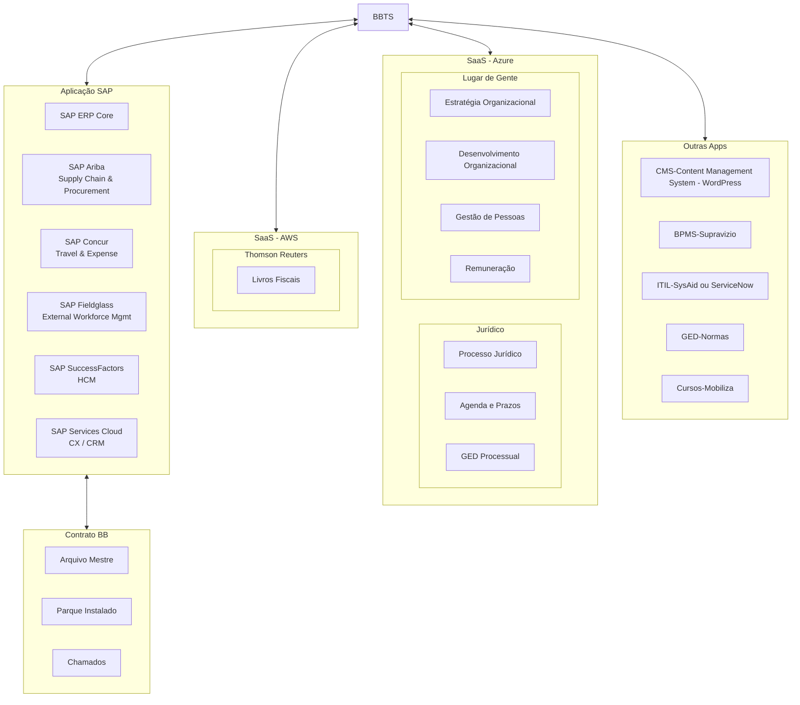
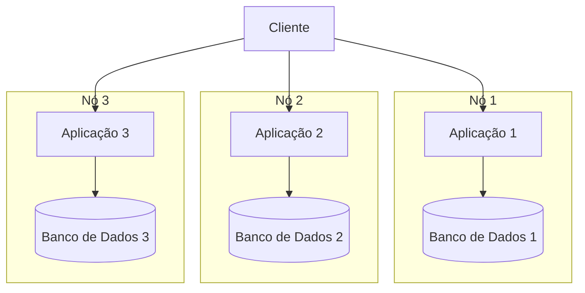
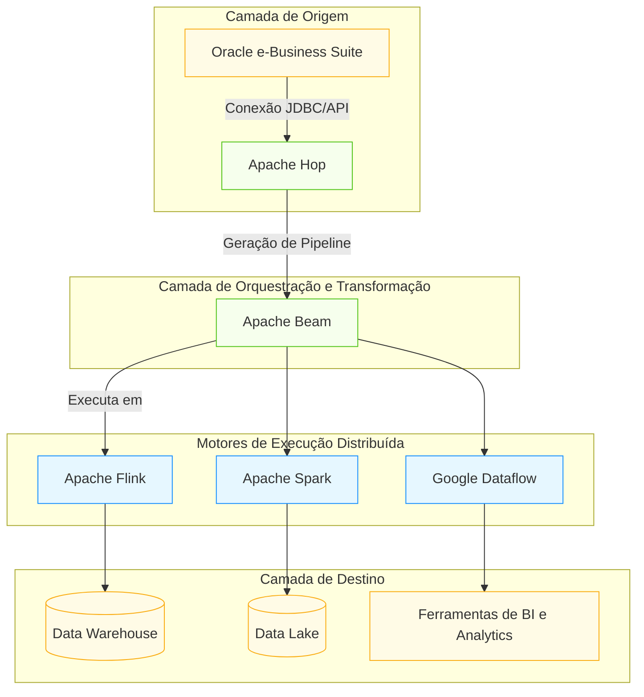

Na última década, assistimos a um crescimento exponencial do volume de dados, impulsionado por avanços na conectividade sem fio, nuvem, proliferação de dispositivos de Internet das Coisas (IoT) e Inteligência Artificial.

Os dados impulsionam partes significativas de nossas vidas, desde recomendações até sistemas de inteligência artificial que identificam tratamentos médicos mais eficazes.

O mesmo se aplica aos negócios, que estão se tornando cada vez mais **orientados por dados** na busca do aprimoramento de serviços ou venda de produtos ou operações.
## Revolução Industrial

{width="600" height="450" style="display: block; margin: 0 auto" }

| Revolução Industrial | Motivo                                                                                                                                                                                     | Resumo                    |
| -------------------- | ------------------------------------------------------------------------------------------------------------------------------------------------------------------------------------------ | ------------------------- |
| Primeira             | Novas relações de trabalho, energia produzida pelo homem por energias como a vapor, eólica e hidráulica;                                                                                   | Mecanização               |
| Segunda              | Aumentaram ainda mais a produtividade e, consequentemente, os lucros das indústrias, Uso do petróleo como fonte de energia, utilizado na nova invenção: o motor à combustão, eletricidade. | Escalação                 |
| Terceira             | Desenvolvimento de infraestrutura das telecomunicações e transporte; integração entre economia e política;                                                                                 | Automatização             |
| Quarta               | Tecnologias para automação e troca de dados – ela se caracteriza, por um conjunto de tecnologias que permitem a fusão do mundo físico, digital e biológico.                                | Personalizando a Produção |

{width="600" height="450" style="display: block; margin: 0 auto" }

  “Com cada revolução industrial, houve uma revolução de aprendizagem correspondente que na época, parecia proibitivamente cara. No entanto, o custo de manter o status quo no passado era o custo da oportunidade perdida que, em muitos casos, era uma fortuna.” — Jesse Martin
## Dado é o novo Petróleo?

- [ ] **Toda empresa é uma empresa de dados**..
- [ ] A famosa frase do matemático britânico Clive Humby: "Dados são o novo petróleo" (Data is the new oil).
	- [ ] Um dos maiores desafios no caso do Petróleo, é localizar as **boas reservas naturais** que são subterrâneas, com dados é diferente, o **desafio é qualificar e cruzar informações**  criando visões de cenários específicos para a realidade das empresas, a partir de uma grande massa de dados disponível através da utilização de sistemas de gestão empresarial.
	- [ ] Mas, se não for refinado, não pode ser usado, portanto, os dados devem ser divididos, analisados para que tenham valor, ou seja, assim como o petróleo deve ser refinado, os dados precisam receber um tratamento correto para estarem prontos para sua utilização em seu total potencial.
	- [ ] Podemos até lembrar do Pré-sal.
- [ ] A publicação da The Economist: "O recurso mais valioso do mundo não é mais o petróleo, mas dados" (The world’s most valuable resource is no longer oil, but data) tem sido muito citadas pelo mercado e executivos mundo afora, apontando que aqueles que possuírem dados terão um recurso muito valioso e mãos.

| Definição  | Petróleo                                                                                                                                                                                                                  | Dados                                                                                                                                                                                                                   |
| ---------- | ------------------------------------------------------------------------------------------------------------------------------------------------------------------------------------------------------------------------- | ----------------------------------------------------------------------------------------------------------------------------------------------------------------------------------------------------------------------- |
| Upstream   | Atividades de busca, identificação e localização das fontes de óleo, e ainda o transporte deste óleo extraído até as refinarias, onde será processado. Resumindo, são as atividades de exploração, perfuração e produção. | Coleta e geração de dados. Isso inclui a captura de dados de várias fontes, como sensores, dispositivos IoT, transações de clientes, redes sociais, etc.                                                                |
| Midstream  | São as matérias-primas (hidrocarbonetos) são transformadas em produtos prontos para uso específico (gasolina, diesel, querosene, GLP, nafta, óleo lubrificante, …). São as atividades de refino.                          | Transporte, armazenamento e processamento inicial. Isso pode incluir a transferência de dados para data centers, armazenamento em nuvem, e o processamento inicial para limpeza e organização dos dados.                |
| Downstream | O transporte dos produtos da refinaria até os locais de consumo. Resume-se no transporte, distribuição e comercialização dos derivados do petróleo.                                                                       | Análise, refino e distribuição dos dados. Isso inclui a análise de dados para obter insights, a criação de relatórios, dashboards, e a distribuição desses insights para as partes interessadas para tomada de decisão. |

## Negócio e suas queixas - Uma análise

<div class="mdx-columns2" markdown>

- [x] Times de Dados vs Times de Negócio;

- [x] Dificuldade na obtenção de informações;

- [x] Dados descentralizados;

- [x] Negócio e suas queixas;

- [x] Demora nas entregas da TI;

</div>

## Times de Dados e suas queixas

<div class="mdx-columns2" markdown>

- [x] Falta de clareza nas definições;

- [x] Falta de engajamento das áreas;

- [x] Falta de governança nas Pontas;

- [x] Falta mindset analítico nas ponta;

</div>

## Fala-se de Tecnologia?

### Big Data/Analytics sem maturidade de dados = Caos com volume
#### **Sem**

- [ ] Governança de dados;
- [ ] Arquitetura clara;
- [ ] Papéis definidos (Data Owner, Steward, etc.);
- [ ] Objetivos analíticos reais;
- [ ] … o Big Data vira custo alto sem retorno;

Muitas vezes, empresas investem em Big Data/Analytics por pressão de mercado ou tendência, sem ter clareza sobre:

- [ ] Qual problema real será resolvido?
- [ ] Qual o ROI (retorno sobre investimento)?
- [ ] Se os dados que elas já possuem, sequer são confiáveis.
- [ ] Nesses casos, o "Big Data" vira **buzzword**, não solução.
- [ ] Ou seja: Comprar um data lake sem saber o que vai nadar nele é desperdício.

{width="600" height="450" style="display: block; margin: 0 auto" }

### Por fim…
Big Data **não é uma ferramenta**, é um **conceito** que envolve lidar com grandes volumes, velocidades e variedades de dados — os famosos "5 Vs":

| V              | Descrição                                                      |
| -------------- | -------------------------------------------------------------- |
| **Volume**     | Grandes quantidades de dados                                   |
| **Velocidade** | Dados gerados em tempo real                                    |
| **Variedade**  | Dados estruturados e não estruturados (texto, vídeo, IoT etc.) |
| **Veracidade** | Qualidade e confiabilidade dos dados                           |
| **Valor**      | Capacidade de gerar insights úteis                             |

## Quanto mais...

- [ ] **Quanto mais dados mais desperdícios e este é um processo Lean**.
- [ ] **Combustível é refinado - O petróleo é o DADO.. A informação é o COMBUSTÍVEL**;
- [ ] Se os dados são mal geridos, não importa o tamanho — **é só confusão em escala**.
	- [ ]  **Mais importante do que ter Big Data é ter um "Big Insight".**
# **Data Mess** (Bagunça de Dados)
É um termo usado informalmente para descrever uma situação onde os dados de uma organização estão em **estado caótico ou bagunçados** — ou seja, desorganizados, mal gerenciados e difíceis de usar de forma eficiente, sem uma fonte única da verdade, ou seja, WSSOT - Without a Single Source of Truth (WSSOT).
### **Características de um Data mess e uma Possível Solução**

| Características                            | Consequências                                                                                                                                                                                                                                                        | Vamos Resolver?                                                                           |
| ------------------------------------------ | -------------------------------------------------------------------------------------------------------------------------------------------------------------------------------------------------------------------------------------------------------------------- | ----------------------------------------------------------------------------------------- |
| Múltiplas versões da verdade               | Decisões erradas por causa de dados ruins                                                                                                                                                                                                                            | Definir responsáveis, padrões de qualidade e políticas de atualização.                    |
| Dados duplicados e redundantes             | Perda de tempo e dinheiro                                                                                                                                                                                                                                            | Usar ferramentas como **ETL** (_Extract, Transform, Load_) ou plataformas de integração.  |
| Ausência  de padronização                  | Dificuldade para implementar BI, IA ou automação                                                                                                                                                                                                                     | Identificar e remover duplicatas, corrigir inconsistências e preencher lacunas.           |
| Dados incompletos ou desatualizados        | Problemas de compliance (ex: GPDR(**General Data Protection Regulation** (Europa)), PCI DSS (Payment Card Industry Data Security Standard), LGPD(**Lei Geral de Proteção de Dados** (Brasil)), HIPAA (**Health Insurance Portability and Accountability Act** (EUA)) | Centralizar dados críticos, Mestres e de Referencia  em uma fonte única de verdade (SSOT) |
| Silos de dados                             |                                                                                                                                                                                                                                                                      | Usar validações automáticas e workflows para evitar erros humanos.                        |
| Falta de governança de dados               |                                                                                                                                                                                                                                                                      | CENTRAL DE CADASTRO: Treinar colaboradores em boas práticas de entrada e gestão de dados. |
| Falta de ferramentas e processos adequados |                                                                                                                                                                                                                                                                      | Monitorar a qualidade dos dados e ajustar estratégias conforme necessário.                |

- [ ] Ao desenvolver soluções de dados e análises, um fator determinante para o seu sucesso é o **patrocinador do negócio** e o trabalho que você está realizando para atender às suas necessidades.
- [ ] **Sem entender o verdadeiro destino**, você não pode ter certeza de que o incremento em que está trabalhando o está levando na direção certa.
- [ ] Para aprimorar seus programas de dados e análises, você precisa garantir que haja uma:
	- [ ] Para seus programas de dados e análises, todas as partes interessadas têm uma visão compartilhada sobre o que você está tentando alcançar?
	- [ ] Essa visão é definida de forma a servir como uma bússola para a iniciativa geral?
	- [ ] Você definiu claramente o patrocínio com alguém que é apaixonado pelo resultado da iniciativa?
	- [ ] Requer combinação de **Tecnologia**, **Processos bem definidos** e **Pessoas capacitadas**.

# Estruturando a Ideia
Porem cada vez menos empresas consideraram sistematicamente e começaram a abordar os aspectos éticos do gerenciamento de dados, o que pode ter amplas ramificações e responsabilidades.

- [ ] Como as empresas devem começar a pensar sobre gerenciamento dados e ético de dados?
- [ ] Quais medidas elas podem colocar em prática para garantir que estejam usando dados de consumidores, pacientes, RH, instalações e outras formas de dados apropriadamente em toda a cadeia de valor — da coleta à análise e insights?
- [ ] Embora considerações de privacidade e ética sejam essenciais sempre que as empresas usam dados (incluindo aplicativos de inteligência artificial e aprendizado de máquina), elas geralmente não são a principal preocupação de alguns executivos.
- [ ] Há bastante dados distorcidos ou tendenciosos durante a ingestão de dados, aumentando o tempo de disponibilização de análises?


## Associações e seus Frameworks

- [ ] **DAMA-DMBoK**  : _Define o modelo para gerenciamento de ativos de dados alinhando-o com a estratégia organizacional para estabelecer requisitos de dados estratégicos e projetos para atender a esses requisitos_
- [ ] **TOGAF** :_Uma descrição da estrutura e interação dos principais tipos e fontes de dados da empresa, ativos de dados lógicos, ativos de dados físicos e recursos de gerenciamento de dados._

### DAMA
Data Management Association é uma organização internacional voltada para o avanço das melhores práticas em gestão de dados.

DMBOK (Data Management Body of Knowledge) é o guia produzido pela DAMA que consolida essas melhores práticas. Ele serve como um “framework” para gestão de dados, contendo áreas de conhecimento como:

- [ ] Governança de Dados;
- [ ] Qualidade de Dados;
- [ ] Arquitetura de Dados;
- [ ] Segurança de Dados;
- [ ] Integração de Dados;
- [ ] Armazenamento e Recuperação;
- [ ] Gerenciamento de Metadados;
- [ ] Gerenciamento de Dados Mestres e de Referência.

O foco do DMBOK é garantir que os dados da organização sejam gerenciados como um ativo estratégico.

![[../img/dama-data-governance.png]]{width="400" height="400" style="display: block; margin: 0 auto" }
### TOGAF e The Open Group
The Open Group — um consórcio que promove padrões tecnológicos abertos.

TOGAF (The Open Group Architecture Framework) é um framework para arquitetura corporativa, desenvolvido pelo

TOGAF cobre:

- [ ] Arquitetura de Negócio;
- [ ] Arquitetura de Aplicações;
- [ ] Arquitetura de Dados;
- [ ] Arquitetura Tecnológica;
- [ ] Ciclo de Desenvolvimento de Arquitetura (ADM – Architecture Development Method);
- [ ] Governança de Arquitetura;

TOGAF oferece uma abordagem estruturada para projetar, planejar, implementar e governar a arquitetura corporativa.

![[../img/togaf-data-governance.png]]{width="600" height="450" style="display: block; margin: 0 auto" }


A comparação entre o **DMBOK (Data Management Body of Knowledge)** e o **TOGAF (The Open Group Architecture Framework)** no que tange à **Arquitetura de Dados** envolve entender como cada framework trata o tema, seus enfoques, escopos e aplicabilidades. Abaixo está uma análise comparativa:

#### Visão Geral de Cada Framework

| Aspecto            | **DMBOK**                                 | **TOGAF**                                                        |
| ------------------ | ----------------------------------------- | ---------------------------------------------------------------- |
| **Foco Principal** | Governança e gestão de dados corporativos | Arquitetura Corporativa (Negócio, Dados, Aplicações, Tecnologia) |
| **Área Central**   | Gestão de dados como ativo estratégico    | Integração de domínios arquiteturais para suporte ao negócio     |
| **Público-alvo**   | Profissionais de gestão de dados          | Arquitetos corporativos e de TI                                  |

#### **Arquitetura de Dados**

| Critério                               | **DMBOK**                                                                                | **TOGAF**                                                                                        |
| -------------------------------------- | ---------------------------------------------------------------------------------------- | ------------------------------------------------------------------------------------------------ |
| **Objetivo com Dados**                 | Promover boas práticas em governança, qualidade, integração e arquitetura de dados       | Projetar a arquitetura de dados alinhada às necessidades do negócio e da TI                      |
| **Definição de Arquitetura de Dados**  | Estrutura de alto nível para armazenar, gerenciar e integrar dados corporativos          | Modelos, princípios e padrões que descrevem a estrutura dos ativos de dados                      |
| **Escopo da Arquitetura de Dados**     | Estrutura de governança, metadados, qualidade, segurança, modelagem, integração etc.     | Modelagem de dados de alto nível (conceitual e lógica), definição de entidades e relacionamentos |
| **Detalhamento Técnico**               | Foca mais em práticas e funções de gestão (ex: modelagem de dados, MDM, glossário, etc.) | Envolve fases detalhadas no ADM (Architecture Development Method), especialmente a Fase C        |
| **Relacionamento com Outros Domínios** | Interação com governança, qualidade, segurança, metadados e arquitetura corporativa      | A Arquitetura de Dados é uma das quatro principais (junto de Negócios, Aplicações e Tecnologia)  |

#### **Processo de Desenvolvimento da Arquitetura de Dados**

| Etapa / Atividade          | **DMBOK**                                                                            | **TOGAF (Fase C – Data Architecture)**                                                |
| -------------------------- | ------------------------------------------------------------------------------------ | ------------------------------------------------------------------------------------- |
| Levantamento de requisitos | Análise de domínios de dados, glossários, necessidades de governança                 | Requisitos de negócio identificados na Fase B (Business Architecture)                 |
| Modelagem de Dados         | Modelagem conceitual, lógica e física, centrada na qualidade e usabilidade           | Modelos conceitual e lógico são desenvolvidos, integrando visão de negócio            |
| Integração com aplicações  | Discussão sobre interoperabilidade e integração via MDM, ETL, e Data Warehousing     | A integração é realizada nas fases posteriores (Fase D – Application Architecture)    |
| Governança de Dados        | Um dos pilares centrais do DMBOK – políticas, papéis, processos e métricas definidos | Endereçado de forma mais ampla no TOGAF, mas não com o nível de profundidade do DMBOK |
| Ferramentas e padrões      | Recomendação de uso de padrões como DAMA-DMBOK, CMMI-DMM, DCAM, etc.                 | Sugestão do uso de metamodelos, frameworks como ArchiMate, e ferramentas de modelagem |

#### **Nível de Profundidade e Aplicabilidade**

|Aspecto|**DMBOK**|**TOGAF**|
|---|---|---|
|**Profundidade na Gestão de Dados**|Alta – foco detalhado em domínios e práticas de dados|Moderada – foco em dados dentro do contexto corporativo|
|**Abordagem Prática**|Descritiva e orientada a processos de gestão|Metodológica e orientada a fases e desenvolvimento arquitetural|
|**Aplicabilidade Organizacional**|Recomendado para organizações com maturidade em gestão de dados|Recomendado para organizações com visão integrada de arquitetura|

# **Ideia Central: Centralização dos Cadastros**
O tema de **GERENCIAMENTO DE DADOS – CENTRAL DE CADASTRO**, sendo uma estratégia crucial, para reconhecermos que a eficácia desse processo, não depende apenas de ferramentas e tecnologias, mas sim da colaboração ativa de todos os envolvidos.

- [ ] Gerenciar dados de forma eficiente exige um esforço conjunto, onde cada pessoa traz sua expertise, insights e experiências para enriquecer nossas estratégias.
- [ ] O cenário atual nos desafia a sermos não apenas gestores, mas também inovadores, capazes de transformar dados em um ativo estratégico que impulsione nossas decisões e fortaleça nossa competitividade no mercado.
- [ ] Cada um de nós lida com diferentes aspectos dos dados em nosso dia a dia – veja o ciclo de vida.
- [ ] Essa diversidade de perspectivas é o que nos permitirá construir um sistema de GERENCIAMENTO DE DADOS, que seja robusto, flexível e capaz de atender às diversas demandas.
- [ ] Por isso, convido todos a se engajarem nessa análise prepositiva, compartilhando suas experiências e ideias sobre como podemos aprimorar nossos processos de Gerenciamento de Dados.
- [ ] Queremos ouvir suas sugestões sobre como garantir a qualidade dos dados, melhorar nossa governança e explorar novas formas de integrar e utilizar as informações de maneira eficaz.
- [ ] Juntos, podemos construir uma abordagem inovadora, onde cada voz contribui para o fortalecimento do nosso gerenciamento de dados, resultando em melhores resultados.
- [ ] Junte-se a Modernização de Dados Mestres interseção do MDM/MDG (Master Data Management/Governance) com  Retrieval-Augmented Generation (RAG).

# ODTA-C
Como gostamos de acrônimos, elaboramos o **ODAT-C**, como uma forma de engajar nossos colaboradores de forma mais assertiva e colaborativa.

| **Letra** | **Objeto**                             | **Razão**                                                       |
| --------- | -------------------------------------- | --------------------------------------------------------------- |
| **O**     | **OMNI** (abrangente, total)           | Omnipresença de dados e informações;                            |
| **D**     | **DATA** (informação, análise)         | Dados para fundamentar decisões;                                |
| **T**     | **TRABALHO em CONJUNTO**               | Colaboração no sentido de Equipe;                               |
| **A**     | **Assertividade (confiança, clareza)** | Assertividade na comunicação e na execução de tarefas;          |
| **C**     | **Conexão**                            | Conexão entre todos os elementos para atingir objetivos comuns. |

- [ ] Assim, abre-se um conceito ou abordagem que integra e **unifica dados de diversas fontes e formatos**, proporcionando uma visão holística e abrangente das informações disponíveis.
- [ ] Essa abordagem permite que organizações identifiquem, coletem, analisem e utilizem dados de maneira eficiente, favorecendo uma tomada de decisão mais informada e estratégica.

ODTA-C representa uma abordagem estratégica para a gestão e utilização de dados, visando maximizar o valor das informações disponíveis e impulsionar a eficiência operacional e a inovação nas organizações, aplicando em toda a organização à maneira como os dados são obtidos, rastreados, usados, entregues e descartados.

- [ ] Dados são um ativo estratégico e devem ser gerenciados.
	- [ ] Se os dados não forem gerenciados, eles frequentemente **acabam sendo duplicados, de baixa qualidade e não suportam os insights que são produtos valiosos de bons dados**.
	- [ ] Os dados exigem administração e responsabilização, este princípio exige que indivíduos sejam designados como **administradores e zeladores dos dados**.
	- [ ] A administração de dados consiste nas pessoas, na organização e nos processos necessários para garantir que os administradores devidamente designados sejam responsáveis pela governança.

## **Governado**
O propósito de executar a Governança de Dados é mover dados de um **estado não governado para um estado governado**

Dados governados são dados que são confiáveis e compreendidos e pelo qual, alguém é responsável por ambos os dados em si e para abordar questões sobre os dados.

{width="600" height="450" style="display: block; margin: 0 auto" }
## **Identificação do Problema**
Registros com informações faltantes, duplicação de dados, risco de exposição de informações sensíveis, especialmente em conformidade com regulamentações como a LGPD, ausência de controles de acesso adequados, permitindo que usuários não autorizados acessem informações confidenciais, silos de dados (dificuldade em integrar dados de diferentes fontes, resultando em visões fragmentadas das informações), entre outros.

Essa fragmentação de informações causa inconsistências com a análise de dados de atendimento, financeiro e administrativo, dificultando a comunicação com os fornecedores (prestadores de serviço, parceiros) e compromete a eficácia no atendimento ao cliente.

- [ ] Os dados são compartilhados e usados por muitos, para muitos propósitos diferentes. **Então, quem é o dono deles**?
- [ ] Quem toma decisões sobre eles e é responsável quando os dados estão “errados”?
- [ ] Inexistência de fluxo padrão para o cadastro dos principais dados mestres;
- [ ] Ausência de padronização descritiva, gerando produtos duplicados ou incompletos;
- [ ] Ausência da definição de papéis e responsabilidades;
- [ ] Falta de documentação clara sobre políticas e procedimentos pode levar a erros.
- [ ] Dificuldades em manter a central em conformidade com leis e regulamentos de proteção de dados.
- [ ] Dificuldade em gerar relatórios úteis e insights a partir dos dados armazenados.
- [ ] Várias bases de dados Analíticas e acesso a informações que não refletem a realidade atual da organização.

### Problemas Diversos

- [ ] Chamados negados e sem transparencia para o Cliente (Ocorre principalmente no início de cada mes);

```
Problema na identificacao da Instancia do Bem do CONTRATO: XXXXX.XXXX e AGENCIA/SAG: 9999.XX. NAO localizado instancia válida com parametros:
Favor, cadastrar/corrigir a instancia no modulo XXX do XXXXXXXXXXXXX.
```

- [ ] Notas Fiscais Denegadas;

```
A Inscrição Estadual do XXXXX foi desativada pela SEFAZ (XXXX atuando para regularização), não podemos emitir NFe do XXXX e contra o XXX, são todas denegadas.
```

- [ ] Consultoria exige a PDM (Padronização da Descrição do Material)

```
Necessidade em se Padronizar a Descrição de Material
Necessidade em se adotar critérios para o cadastramento de NCM
```

- [ ] Erros logísticos e/ou financeiros (pesos indevidos, endereços desatualizados);
- [ ] Autuação Fiscal;
	- [ ] Falta de Escrituração;
	- [ ] Escrituração em Duplicidade;
- [ ] Calculo Incorreto de Impostos.

#### Padronização da Descrição do Material
Definir as políticas e regras relacionadas à manutenção do cadastro de materiais. Centralização do cadastramento, abrangência, incorporações, homologação, saneamento dos estoques, gerenciamento de requisitos, processos para controle e auditoria, bem como responsabilidades funcionais.

Em termos da identificação, o princípio mais importante que costumamos destacar no manual PDM é que “a finalidade do código é identificar, e não catalogar”, pois temos constatado que o equivoco mais usual é codificar os materiais por aplicação, no entanto aprendemos que “diferentes aplicações não determinam diferentes códigos”.

Enfim, para identificar corretamente, o código deve possuir os seguintes atributos:

<div class="mdx-columns2" markdown>
- [ ] Unicidade: Apenas um código para cada SKU (Stock Keeping Units, ou unidades distintas mantidas em estoque);
- [ ] Simplicidade: Deve ser fácil de compreender e utilizar;
- [ ] Formato: Deve ser estruturado, de preferência com uma numeração sequencial automatizada;
- [ ] Conciso: Deve ser sucinto e objetivo;
- [ ] Expansividade: Deve suportar o crescimento da empresa;
- [ ] Operacionalidade: Deve ser prático e robusto;
- [ ]  Versatilidade: Deve prever suas diversas aplicações;
- [ ] Estabilidade: Deve ser perene;
- [ ] Confiabilidade: Deve assegurar a identificação esperada.
- [ ] Classificação UNSPSC (Universal Standard Products and Services Classification): Classifica os itens dentro de ramificações, seguindo uma hierarquia de importância numa árvore baseada na natureza dos materiais.
- [ ] Classificação NCM (Nomenclatura Comum do Mercosul): Baseada no "Sistema Harmonizado de Designação e Codificação de Mercadorias" para facilitar as transações entre Brasil, Argentina, Paraguai e Uruguai, estabelecendo tarifas comuns. No Brasil a NCM está conjugada com a tabela de incidência de impostos sobre produtos industrializados (IPI).
</div>

Mapear os dados de uma organização requer uma compreensão profunda do cenário do sistema e do processo de manutenção dos dados. O mapeamento de dados abrange:

<div class="mdx-columns2" markdown>
- [ ] Identificação de ativos de dados e seus repositórios;
- [ ] Identificar e definir os atuais proprietários dos dados;
- [ ] Descrever os fluxos de dados e as regras de distribuição de dados;
- [ ] Descrever os padrões de dados atuais, incluindo regras de validação;
</div>

# Por que achamos de suma importância?
Tem que ser um espécie de protocolo de comunicação que traz diversos benefícios e oportunidades, como seguem:
## Melhoria do Processo

- [ ] Prover dados relevantes e confiáveis para o negócio;
- [ ] Construir uma Base única de verdade;
- [ ] Melhorar o COMPLIANCE da Organização;
- [ ] Apoiar o desenvolvimento de modelos de IA modernizando as suas capacidades de dados.

## Catalogoção de Dados Empresariais
A arquitetura técnica estava pronta. A promessa de inovação e criação de valor, no entanto, que havia sido o argumento inicial a favor de investimentos massivos nas infraestruturas das organizações, mal havia dado frutos, além de alguns casos de uso impulsionados por equipes pioneiras e entusiasmadas. Estas falhas possivelmente estariam vindo de diversas fontes de dados,

- [ ] Pântanos de dados com enormes espaços de armazenamento contendo dados cujo conteúdo e origem eram desconhecidos de todos e que ninguém sabia como usar;as organizações começaram a migrar (ou criar) suas infraestruturas analíticas;
- [ ] Instituições migrando para a nuvem e a repensar a melhor forma de gerenciar volumes de dados que precisavam explorar;
### Como ?
- [ ] O que as pessoas estão procurando?
- [ ] O que um cientista de dados estaria procurando?
- [ ] Um diretor de proteção de dados?
- [ ] Um diretor de segurança da informação?

![[google.png]]{width="600" height="450" style="display: block; margin: 0 auto" }

No fim das contas, todos nós estamos em busca de algo. E buscamos o tempo todo. O problema é que, no trabalho, é muito difícil procurar o que estamos tentando encontrar. E tomamos isso comoverdade, como algo que devemos simplesmente aceitar.

### Catálogo de Dados
Em essência, um catálogo de dados é um inventário organizado dos dados da sua empresa. Fornece uma visão geral apenas no nível de metadados e, portanto, nenhum valor.
de dados real é exposto. Então, podemos definir que um catálogo de dados é basicamente um banco de dados com metadados que foram obtidos ou enviados de fontes de dados no ambiente de TI de uma determinada empresa.

O catálogo de dados são organizados em domínios que contêm ativos. Os ativos são representações de metadados de dados em sistemas de origem.

|                        |                                                                                                                                                       |
| ---------------------- | ----------------------------------------------------------------------------------------------------------------------------------------------------- |
| Visão geral do cenário | Fontes de dados nele contidas, além de listar as<br>pessoas ou funções associadas                                                                     |
| Organizar dados        | Ativo é uma entidade de dados que existe em seu ambiente de TI.                                                                                       |
|                        | Fonte de dados refere-se à origem dos dados que<br>estão sendo expostos em nível de metadados no catálogo de dados                                    |
|                        | domínio é um grupo de ativos que logicamente pertencem um ao outro                                                                                    |
|                        | A linhagem de dados descreve como os dados trafegam de um sistema<br>para outro e, idealmente, como os dados são transformados durante o trajeto.     |
| Descoberta de dados    | Permite que todos os funcionários pesquisem todos os dados da empresa.                                                                                |
|                        | Análise de dados<br>                                                                                                                                  |
|                        | Governança de dados: Capacidade de classificar todos os dados em seu ambiente de TI, tanto em termos de sensibilidade<br>quanto de confidencialidade. |
### Funções e responsabilidades do usuário final
Os usuários finais de um catálogo de dados se enquadram em três categorias:

- [ ] Usuários finais de análise de dados;
- [ ] Usuários finais de governança;
- [ ] Usuários finais do dia a dia;

Todos os usuários finais têm uma ou mais das seguintes funções e responsabilidades no catálogo de dados:

|                                |                                                                                                                                  |
| ------------------------------ | -------------------------------------------------------------------------------------------------------------------------------- |
| Proprietário da fonte de dados | Proprietário do sistema ou guardião dos dados no gerenciamento de dados tradicional.                                             |
| Proprietário do domínio        | Define quais ativos pertencem ao domínio e quem deve ter as diferentes funções no domínio                                        |
| Administrador de domínio       | Conduz entrevistas com futuros proprietários de fontes de dados, gerenciar a arquitetura de domínio e fornecer acesso aos dados. |
| Proprietário do ativo          | Proprietário dos dados na fonte de dados                                                                                         |
|                                |                                                                                                                                  |
### Organizando Domínios no Catálogo de Dados
Um domínio agrupa ativos que logicamente pertencem juntos, cabendo aos proprietários dos domínios definir quais ativos serão incluídos em seus domínios.


|                                               |                                                                                                                                                                                                                                                                                                                                  |
| --------------------------------------------- | -------------------------------------------------------------------------------------------------------------------------------------------------------------------------------------------------------------------------------------------------------------------------------------------------------------------------------- |
| Processos ou Capacidade                       | Organizando os dados em uma estrutura que representa a empresa na qual os dados são criados. As capacidades consistem em pessoas, processos e tecnologia.                                                                                                                                                                        |
|                                               | Um domínio de processo é definido com base em como as coisas são feitas.                                                                                                                                                                                                                                                         |
|                                               | Capacidade descreve quais tarefas uma empresa executa — do que a empresa é capaz.                                                                                                                                                                                                                                                |
| Fontes de dados                               | A fonte de dados genérica é um componente tecnológico. Essas tecnologias podem ser bancos de dados, data lakes ou data warehouses e aplicativos reais. Se refere ao componente de software, como Tableau, Qlik Sense,  Power BI e etc.                                                                                           |
|                                               | Uma fonte de dados específica significa simplesmente que se trata de uma instância específica da fonte de dados genérica. Nesse caso, trata-se de uma assinatura específica do Power BI.                                                                                                                                         |
| Metadados de ativos                           |                                                                                                                                                                                                                                                                                                                                  |
| Metadados derivados da fonte de dados         | Metadados técnicos: Informam exatamente em qual fonte de dados o ativo está armazenado, quem o criou, quando o ativo foi criado, o formato do arquivo, etc.                                                                                                                                                                      |
|                                               | Metadados de negócios: Descrevem o ativo em linguagem humana, por exemplo, nomes de tabelas e colunas, descrições e definições de tipos de dados, etc.                                                                                                                                                                           |
| Metadados adicionados ao catálogo<br>de dados | Descrições, pessoas e termos do glossário, aos ativos do seu catálogo de dados. As descrições devem conter o uso primário e secundário. O uso primário é uma breve explicação sobre a finalidade do ativo na fonte de dados de onde foi extraído/enviado. No uso secundário, a  sugestões do provedor de dados aos consumidores. |
|                                               |                                                                                                                                                                                                                                                                                                                                  |

#### Processos e Capacidades


**Observação**: Não caia na tentação de construir seus domínios diretamente com base em sua Estrutura Organizacional. Nossa organização muda o tempo todo: equipes são fundidas, divididas, terceirizadas, recriadas e reorganizadas constantemente — e você acaba mantendo uma arquitetura de domínio em constante mudança em vez de atender à descoberta de dados.
Não li, mas vi que tinha uma matéria sobre [Enciclopédia da Organização do Conhecimento](https://www.isko.org/cyclo/knowledge_organization)
#### Glossários
Os glossários são listas de palavras que descrevem sua empresa e são controlados em vários graus, por uma equipe de glossário de domínio ou por uma equipe de glossário global centralizada.

|                      |                                                                                                                                                        |
| -------------------- | ------------------------------------------------------------------------------------------------------------------------------------------------------ |
| Glossário gratuito   | O glossário gratuito é uma folksonomia. Folksonomias são glossários gerados por usuários que organizam ativos por meio de tags.                        |
| Glossário de domínio | Um glossário de domínio é uma taxonomia. Taxonomias têm uma hierarquia.                                                                                |
| Glossário global     | O glossário global é um dicionário de sinônimos. É uma estrutura que se afasta do pensamento hierárquico e caminha em direção ao pensamento de cluster |

#### Classificação Segurança e Privacidade
A classificação de dados sob a perspectiva do CISO (**Chief Information Security Officer**) e do DPO (**Data Protection Officer**), estamos nos referindo principalmente ao risco, à proteção legal e à privacidade dos dados.

| Critério         | CISO (Segurança)                      | DPO (Privacidade)                               |
| ---------------- | ------------------------------------- | ----------------------------------------------- |
| Foco principal   | Confidencialidade e integridade       | Privacidade e conformidade legal                |
| Base legal       | Normas de segurança (ISO 27001, etc.) | LGPD / GDPR                                     |
| Dados analisados | Todos os tipos de dados da empresa    | Apenas dados pessoais e sensíveis               |
| Medidas comuns   | Controle de acesso, criptografia      | Consentimento, base legal, relatório de impacto |
| Objetivo         | Proteger a informação                 | Proteger o titular de dados                     |
Na perspectiva do DPO, podemos classificar os dados com foco em **privacidade, consentimento, base legal e direitos do titular** e pelo CISO

| Tipo                    | Entenda                                                                          | Exemplo                                                               |
| ----------------------- | -------------------------------------------------------------------------------- | --------------------------------------------------------------------- |
| Pessoais                | Qualquer dado que identifique ou possa identificar um indivíduo.                 | nome, CPF, e-mail, endereço IP.                                       |
| Pessoais Sensíveis      | Dado pessoal que, se tratado indevidamente, pode causar discriminação.           | origem racial, religião, opinião política, dados de saúde, biometria. |
| Anonimizados            | Não identificam a pessoa, de forma irreversível.                                 |                                                                       |
| Pseudonimizados         | Identificação removida, mas ainda reversível.                                    | Exige cuidados e pode ainda ser considerado dado pessoal.             |
| Crianças e Adolescentes | Exigem consentimento específico dos pais/responsáveis.                           | Sujeitos a regras especiais de tratamento.                            |
|                         |                                                                                  |                                                                       |
| Públicos                | Sem restrições de acesso.                                                        |                                                                       |
| Internos                | Uso restrito aos funcionários, mas sem causar grandes danos se vazados.          |                                                                       |
| Confidenciais           | Vazamento pode causar impacto à operação, à reputação ou gerar sanções.          | contratos, informações financeiras.                                   |
| Restritos / Sigilosos   | Críticos para a organização; requerem criptografia, controle de acesso rigoroso. | senhas, estratégias de segurança, P&D.                                |
Podemos utilizar o conceito de  **Personally Identifiable Information (PII - Informações Pessoais Identificáveis)**, para qualquer dado que possa identificar direta ou indiretamente uma pessoa física viva.

| **Categoria de Dados**  | **Tipo de Dado Pessoal (PII)**           | **Titular**       | **Finalidade do Tratamento**       | **Base Legal (LGPD)**              | **Onde está armazenado?**               | **Quem tem acesso?**      | **Prazo de Retenção**   | **Compartilhado com Terceiros?** | **Autorização do Titular?**     |
| ----------------------- | ---------------------------------------- | ----------------- | ---------------------------------- | ---------------------------------- | --------------------------------------- | ------------------------- | ----------------------- | -------------------------------- | ------------------------------- |
| Dados de clientes       | Nome, CPF, e-mail, telefone              | Cliente           | Cadastro e emissão de nota fiscal  | Execução de contrato               | Sistema ERP / Banco de dados / PaaS     | Financeiro, Atendimento   | Verificar temporalidade | Sim – Contabilidade externa      | Não aplicável                   |
| Dados de funcionários   | RG, endereço, CTPS, salário              | Colaborador       | Registro trabalhista               | Obrigação legal                    | LG / SaaS                               | RH, Contabilidade         | Verificar temporalidade | Sim – Governo, eSocial           | Não aplicável (obrigação legal) |
| Dados de candidatos     | Currículo, e-mail, telefone              | Candidato a vaga  | Processo seletivo                  | Consentimento                      | Plataforma de Recrutamento              | RH                        | Verificar temporalidade | Não                              | Sim (via formulário)            |
| Dados de navegação      | IP, cookies, localização                 | Visitante do site | Analytics, remarketing             | Legítimo interesse / Consentimento | Google Analytics / CRM                  | Marketing, TI             | Verificar temporalidade | Sim – Ferramentas de análise     | Sim                             |
| **Dados de benefícios** | Nome, CPF, matrícula, e-mail corporativo | Colaborador       | Ativação de convênio com TotalPass | Consentimento explícito            | Plataforma de RH / Gestão de Benefícios | RH, Parceiros autorizados | Verificar temporalidade | **Sim – Empresas de Convenios**  | **Sim (formulário de adesão)**  |


Objetivando a criação de uma classificação simples, podemos pensar em formular perguntas simples do tipo:
- [ ] Se os dados fossem divulgados acidentalmente, qual seria o dano causado?
- [ ] Todos os seus ativos têm um nível de sensibilidade.
- [ ] As fontes de dados são extraídas e enviadas para um catálogo de dados, usando rastreadores prontos para uso do catálogo de dados, armazenamentos de dados somente leitura (RDSs), APIs e streaming.
- [ ] A estrutura de domínio tem três camadas que consistem em processos ou capacidades, fontes de dados e ativos.


## Pesquisa em dados versus Pesquisa de dados
- [ ] Pesquisar em dados é quando buscamos algo que queremos saber nos dados reais.
	- [ ] Quantas pessoas visualizaram meu perfil no Linkedin? 100.
- [ ] Pesquisar dados é quando procuramos as fontes que contêm os dados que precisamos.
	- [ ] Onde podemos encontrar dados sobre o tráfego em nosso site?

Fontes que devem ser olhadas:
- [ ] [Data Management Body of Knowledge (DAMA-DMBOK)](https://dama.org/learning-resources/dama-data-management-body-of-knowledge-dmbok/)
- [ ] [Introdução à Biblioteconomia e Ciência da Informação](https://csi.pressbooks.pub/lis/)


## Responsabilidades sobre os Dados
É a **pessoa ou função responsável por garantir a qualidade, integridade, segurança e uso adequado dos dados mestres** em uma organização. O **Data Owner** não é apenas "dono" no sentido de posse, mas sim **responsável por decisões e políticas** relacionadas a esses dados. Suas funções incluem:

| Responsabilidade           | Descrição                                                                               |
| -------------------------- | --------------------------------------------------------------------------------------- |
| **Qualidade do dado**      | Garante que o dado mestre esteja correto, completo e atualizado.                        |
| **Segurança e acesso**     | Define quem pode visualizar, editar ou excluir o dado.                                  |
| **Ciclo de vida**          | Controla a criação, alteração, inativação e exclusão dos dados (Temporalidade).         |
| **Conformidade**           | Assegura que os dados estejam em conformidade com normas (GPDR, PCI DSS, LGPD e HIPAA). |
| **Integração entre áreas** | Atua como ponte entre áreas de negócio e TI, promovendo uso consistente do dado.        |

| Aspecto                        | **Data Owner**                                                                | **Data Steward**                                             |
| ------------------------------ | ----------------------------------------------------------------------------- | ------------------------------------------------------------ |
| **Responsabilidade principal** | Propriedade, políticas e decisões estratégicas sobre o dado                   | Garantia da qualidade, consistência e integridade dos dados  |
| **Foco**                       | **Governança e conformidade**                                                 | **Operacionalização e manutenção**                           |
| **Autoridade**                 | Tem autoridade para aprovar uso, acesso e mudanças                            | Atua sob orientação do Data Owner                            |
| **Exemplo de decisões**        | - Quem pode acessar o dado?- Que regras se aplicam?- O que é "dado válido"?   | - Corrigir dados incompletos- Monitorar regras de qualidade  |
| **Papel no ciclo de vida**     | Define políticas para criação, atualização e arquivamento de dados            | Executa atividades de criação, manutenção e limpeza de dados |
| **Exemplos de funções**        | - Diretor Financeiro (dados contábeis)- Gerente de RH (dados de funcionários) | - Analista de Dados- Analista de Cadastro                    |
| **Relação com a TI**           | Trabalha com áreas de negócio, toma decisões de alto nível                    | Trabalha com TI para aplicar regras de dados                 |

## Classificação dos Dados

- [ ] **Dados Mestres (Master Data)**: Descrevem locais (estabelecimentos), entidades (pessoas (funcionários, parentescos, prestadores de serviço, temporários), clientes, fornecedores, instituição) e coisas que fazem parte de um contexto empresarial.

<div class="mdx-columns2" markdown>
	- [ ] Business Partner (Customer, Vendor)
	- [ ] Material Master
	- [ ] Chart of Accounts / G/L Account Master
	- [ ] Cost Center / Profit Center
	- [ ] Work Center / Routing / BOM
	- [ ] Asset Master
	- [ ] Bank Master Data
	- [ ] Plant / Storage Location / Company Code
	- [ ] Pricing Conditions
	- [ ] Project Definitions / WBS Elements
	- [ ] Viagens / Projetos
	- [ ] Meios de pagamento (Cartões corporativos - CONCUR)
	- [ ] Empregados (Estagiário, Prestador de Serviço, Funcionário Concursado, Cedido e outros)
</div>

- [ ] **Dados de Referência (Reference Data)**: São um conjunto de valores ou esquemas de classificação que servem de apoio a um dado mestre;

<div class="mdx-columns2" markdown>
	- [ ] Unit of Measure
	- [ ] Currencies
	- [ ] Country / Region / Tax codes
	- [ ] Material Groups / Product Hierarchy
	- [ ] Payment Terms / Incoterms / Shipping Conditions
	- [ ] Document Types
	- [ ] Posting Periods / Fiscal Year Variants
	- [ ]  Códigos de despesa (Expense Types)
	- [ ] Regras de política de viagem e despesas
	- [ ] Supplier Profile / SLP
	- [ ] ategorias de produtos (UNSPSC)
	- [ ] Códigos fiscais
	- [ ] Tipos de serviço
	- [ ] Posições / Cargos
	- [ ] Estrutura Organizacional
	- [ ] Unidades de Negócio / Departamentos
	- [ ] Benefícios / Registros de compensação
</div>

- [ ] **Dados de referência externos**: APIs conectam os dados de referência a autoridades regulatórias externas, como agências governamentais ou conversores de moeda. Os dados recebidos são classificados e selecionados para se alinharem com os dados mestres estabelecidos.

	- [ ]  **Tabela de Background-Check**
		- [ ] A identificação de uma fonte segura para Dados Mestres/Referência e/ou a criação de estruturas de codificação faladas são fundamentais, para a iniciação de um processo de adaptação antes da migração de um sistema de Gestão. Estruturamos o levantamento das informações em QUATRO etapas:
		- [ ] Em um cenário empresarial em constante evolução, a gestão eficaz de informações tornou-se um fator crucial para o sucesso das organizações. No centro dessa transformação,  que visa otimizar o relacionamento com padrões, responsáveis, interagir fornecedores e aprimorar o atendimento ao cliente.
		- [ ] Não obstante a esta central e com a combinação do Master Data Management/Governance (MDM/MDG) e Inteligência Artificial (IA), poderíamos automatizar o processo de detecção e correção de erros de dados, recomendações de itens duplicados, identificar e mitigar potenciais riscos de conformidade.

| **Fase**                             | **Objetivo**                                                                                                                                                                                                              |
| ------------------------------------ | ------------------------------------------------------------------------------------------------------------------------------------------------------------------------------------------------------------------------- |
| **Levantamento de Dados Existentes** | Mapeamento das fontes atuais de dados dentro da organização;                                                                                                                                                              |
| **Definir Gestores de Dados**        | Estabelecer uma área responsável para a Análise da Qualidade, Definição de Critérios, Designação de um Líder de Dados e a elaboração de um processo de Monitoramento e Revisão para assegurar a continuidade da operação. |
| **Análise de Qualidade de Dados**    | Avaliar a precisão, completude e consistência dos dados coletados. Isso ajuda a identificar quais informações são confiáveis e quais precisam ser ajustadas ou eliminadas.                                                |
| **Definição de Critérios**           | Estabelecer critérios claros para a seleção de dados que serão considerados como fontes seguras, levando em conta fatores como frequência de atualização, legitimidade da origem e relevância para a operação.            |

- [ ] **Dados de referência interna**: As definições e categorias permanecem relevantes para os processos de negócios atuais e atendem às necessidades de todas as disciplinas de negócios. Garanta que os administradores de dados permaneçam consistentes na criação e no gerenciamento de dados de referência.
- [ ] **Dados transacionais**: São as informações operacionais cotidianas em seus bancos de dados de CRM, ERP e HCM. Como por exemplo: Notas Fiscais, Ordens de Compra, Lançamentos Financeiros e etc.

<div class="mdx-columns2" markdown>
	- [ ] Contratos (Sourcing, Buying)
	- [ ]  Materiais / Catálogos
	- [ ] Regras de política de viagem e despesas
	- [ ] Requisições / Ordens de Compra
</div>
- [ ] **Dados não estruturados**: São dados de postagens em mídias sociais, e-mails, white papers ou chats de ajuda que são difíceis de categorizar.

## Pontos Chaves

<div class="mdx-columns2" markdown>
- [ ] Modelo de Dados;
- [ ] Qualidade dos Dados;
- [ ] Integração;
- [ ] Escalabilidade;
- [ ] Auditoria;
- [ ] Controle de Metadados;
- [ ] Workflow;
</div>

# **CSC(Centro de Serviço Compartilhado) para uma CC(Central de Cadastro)**

| **Função**                  | **Central de Cadastros**                                                                                                                                          | **Centro de Serviço Compartilhado (CSC)**                                                                                                                                   |
| --------------------------- | ----------------------------------------------------------------------------------------------------------------------------------------------------------------- | --------------------------------------------------------------------------------------------------------------------------------------------------------------------------- |
| **Principal**               | Centraliza e gerencia informações cadastrais de clientes, fornecedores, produtos, entre outros. É responsável por manter os dados atualizados e acessíveis.       | Centraliza e padroniza serviços de apoio, como finanças, recursos humanos, entre outros, para várias unidades de uma empresa.                                               |
| **Foco**                    | Dados e informações. A central de cadastros garante que todas as informações necessárias estejam corretas e disponíveis para diferentes departamentos da empresa. | Processos e serviços. O CSC busca otimizar a eficiência operacional e reduzir custos ao unificar serviços que seriam realizados separadamente por diferentes departamentos. |
| **Precisão e Consistência** | Reduz erros e duplicidades nos dados.                                                                                                                             | Melhora a produtividade e a qualidade dos serviços.                                                                                                                         |
|                             | Facilita a obtenção de informações precisas e atualizadas.                                                                                                        | Economiza recursos ao evitar duplicação de esforços                                                                                                                         |
|                             | Ajuda a empresa a cumprir regulamentações e normas de proteção de dados.                                                                                          | Garante que os processos sejam realizados de maneira uniforme e consistente.                                                                                                |
| **Similaridades**           |                                                                                                                                                                   |                                                                                                                                                                             |
| **Centralização**           | Ambos centralizam funções importantes para a empresa, seja de dados ou serviços.                                                                                  |                                                                                                                                                                             |
|                             | Visam aumentar a eficiência e reduzir custos operacionais.                                                                                                        |                                                                                                                                                                             |
|                             | Servem como suporte para outras áreas da empresa, permitindo que estas se concentrem em suas atividades principais.                                               |                                                                                                                                                                             |

## Estilos de implementação do Master Data Management (MDM)

| Estilo           | Entenda                                                                                                                             |
| ---------------- | ----------------------------------------------------------------------------------------------------------------------------------- |
| **Centralizado** | Em um estilo centralizado, os ERPs/CRMs e outros sistemas criam os dados mestres e os dissemina para outros sistemas ou aplicações. |
| **Consolidação** | Criação de um **golden records**, os sistemas de origem alimentam dados em um hub central para golden records.                      |
| **Coexistência** | Cria um hub de dados consolidado que então alimenta registros atualizados de volta para as fontes.                                  |

## Exemplo de Fluxo de Categoria Sensível (Ideia)


## Exemplo de Fluxo de Cadastro de Dados (Ideia)


## Exemplo Ciclo de vida do Dado/Informação


## Proposta
A proposta de criação de uma **Central de Cadastro** ou a sua remodelagem, surge como uma solução eficaz para esses desafios.  Este espaço dedicado permitirá a centralização (processos de mudança) e padronização das informações (padrões de dados) e responsabilização (indicadores de acurácia e tempo atendimento).

| **Expectativa**           | **Entenda**                                                                                                                                                               |
| ------------------------- | ------------------------------------------------------------------------------------------------------------------------------------------------------------------------- |
| **Qualidade**             | Auxilia manutenção da qualidade dos dados ao impor padrões, validações e procedimentos de limpeza.                                                                        |
| **Governança de dados**   | Adotar as políticas e procedimentos definidos pelo Data Product Manager.                                                                                                  |
| **Agilidade Aumentada**   | Centralização permite a instituição se adapte rapidamente a mudanças nos requisitos de negócios.                                                                          |
| **Data Flow**             | Fluxo de trabalho definido, registros das mudanças.                                                                                                                       |
| **Análise de Desempenho** | Centralização dos dados possibilitará análises mais robustas sobre o desempenho dos fornecedores, permitindo à empresa escolher parcerias mais estratégicas e eficientes. |
| **Aumento da Eficiência** | Com todos os cadastros em um único local, podemos impor padrões, validações e procedimentos de limpeza.                                                                   |

### Qualidade de Dados
As dimensões de qualidade dos dados são padrões para avaliar a qualidade dos dados, garantindo sua adequação ao uso pretendido.
Embora diferentes especialistas tenham proposto diferentes dimensões de qualidade de dados e não haja padronização para seus nomes ou descrições, quase todas elas incluem alguma versão de precisão, completude, consistência, atualidade, exclusividade e validade.

O Data Quality Operations Center(DQOps) também usa dimensões de qualidade de dados de integridade, disponibilidade e razoabilidade porque elas identificam problemas que afetam dados não estruturados em data lakes.

| Nome da dimensão de qualidade de dados | Definição da dimensão de qualidade de dados                                                                                                                                                                                                                                                                                                   | Possíveis problemas de qualidade de dados                                                                                                                                                                                                                  |
| -------------------------------------- | --------------------------------------------------------------------------------------------------------------------------------------------------------------------------------------------------------------------------------------------------------------------------------------------------------------------------------------------- | ---------------------------------------------------------------------------------------------------------------------------------------------------------------------------------------------------------------------------------------------------------- |
| **Precisão**                           | O grau de proximidade dos valores de dados aos valores reais, geralmente medido pela comparação com uma fonte conhecida de informações corretas (a fonte da verdade).                                                                                                                                                                         | Os dados em uma fonte de dados downstream não correspondem aos dados originais de uma fonte de dados upstream.  <br>Os valores agregados calculados em valores não correspondem a valores semelhantes de uma fonte de dados diferente (dados financeiros). |
| **Disponibilidade**                    | O grau em que a fonte de dados está disponível para uso sem problemas de acesso.                                                                                                                                                                                                                                                              | A tabela está ausente.  <br>As credenciais para a fonte de dados expiraram.  <br>A tabela está fisicamente corrompida devido a uma falha irrecuperável no disco rígido.                                                                                    |
| **Completude**                         | O grau em que todos  <br>os registros necessários no conjunto de dados,  <br>valores de dados  <br>estão presentes sem nenhuma informação faltando.                                                                                                                                                                                           | As colunas obrigatórias estão vazias.  <br>As tabelas estão vazias ou são muito pequenas.  <br>A porcentagem de valores nulos excede um limite aceitável.                                                                                                  |
| **Consistência**                       | O grau em que os valores de dados de dois conjuntos de atributos  <br>— dentro de um registro,  <br>— dentro de um arquivo de dados,  <br>— entre arquivos de dados,  <br>— dentro de um registro em diferentes momentos  <br>cumprem uma regra.  <br>Esta dimensão confirma que a qualidade dos valores é consistente ao longo dos períodos. | Um valor anormal fora dos limites regulares é encontrado usando a detecção de anomalias.  <br>O valor agregado (soma, mínimo, máximo, médio) para um período de tempo difere muito de um período anterior (ontem, mês passado, etc.).                      |
| **Integridade**                        | O grau em que os dados relacionais são estruturalmente corretos.                                                                                                                                                                                                                                                                              | A pesquisa por um valor de chave estrangeira não encontrou um registro correspondente em uma tabela de dimensão ou dicionário.                                                                                                                             |
| **Razoabilidade**                      | O grau em que os valores dos dados são razoáveis ​​e fazem sentido.                                                                                                                                                                                                                                                                           | A soma dos valores em uma coluna agregável está dentro de um intervalo aceitável. Por exemplo, a receita total por dia está dentro de limites razoáveis.                                                                                                   |
| **Pontualidade**                       | O grau em que o período entre o momento da criação do valor real e o momento em que o conjunto de dados está disponível é apropriado (os dados são atualizados).                                                                                                                                                                              | Os dados não estão atualizados. O registro mais recente não é mais antigo que um atraso aceito.                                                                                                                                                            |
| **Singularidade**                      | O grau em que os registros ocorrem apenas uma vez em um conjunto de dados e não são duplicados.                                                                                                                                                                                                                                               | Valores duplicados encontrados em uma coluna-chave que deve conter somente valores exclusivos.                                                                                                                                                             |
| **Validade**                           | O grau em que os valores dos dados estão em conformidade com regras comerciais predefinidas, como formato, padrões, tipo e intervalo. Por exemplo, códigos postais e e-mails.                                                                                                                                                                 | Formato de telefone inválido. Valores que não correspondem aos padrões de expressões regulares.                                                                                                                                                            |

# Definindo um Modelo

- [ ] **Visão Corporativa Consistente dos Dados**;
- [ ] **Vincula a tecnologia e os dados aos processos de negócios**;
- [ ] **Simplifica a Gestão da Integração**;
- [ ] **Estabelece a Estrutura para Domínios de Dados Fundamentais**;
- [ ] **Padroniza a coleta de requisitos downstream**;


# Mapeando das Aplicações SaaS, On-Premise
Mapear as aplicações em um ambiente **SaaS (Software as a Service)** para validar o **consumo de dados** é uma prática crítica, tanto do ponto de vista **estratégico quanto operacional**.

- [ ] Transparência sobre onde e como os dados são usados;
	- [ ] Que dados estão sendo consumidos por cada aplicação?
	- [ ] De onde esses dados vêm (fontes)? Com que frequência e volume?
- [ ] Evitar redundância e desperdício tecnológico
	- [ ] Conectores e integrações que **sobrecarregam APIs** ou bancos de dados.
	- [ ] Soluções "shadow IT" usando dados críticos **sem controle da TI**.
- [ ] Segurança e conformidade (GPDR, PCI DSS, LGPD e HIPAA)
- [ ] Controle de custos e otimização de licenças/API
	- [ ] Volume de chamadas API
	- [ ] Quantidade de dados processados
	- [ ] Licenças de usuários e conectores
- [ ] Facilita projetos de migração, integração ou modernização
	- [ ] Sem mapear os pontos de consumo de dados, qualquer mudança se torna um risco.

## Exemplo Mapeamento das Aplicações

| Nome da Aplicação     | Sigla | Descrição                                                               | Área Gestora (Negócio) | ANS Satisfação | Disponibilidade de Serviço | Níveis de Funcionamento do Serviço  | Datas de Importância                  | Tipo de Arquitetura | Linguagem  | Banco de Dados | Crescimento Anual do Banco (GB) | Tamanho Inicial do Banco (GB) |
| --------------------- | ----- | ----------------------------------------------------------------------- | ---------------------- | -------------- | -------------------------- | ----------------------------------- | ------------------------------------- | ------------------- | ---------- | -------------- | ------------------------------- | ----------------------------- |
| Gestão Corporativa    | GCORP | Aplicação monolítica para controle de processos administrativos         | Administrativo         | >= 85%         | 99,5%                      | Alta prioridade, operação 24x7      | Janeiro, Segunda-feira, 1-5           | Monolítica          | PHP e Java | Oracle         | 10                              | 10                            |
| Serviço de Pagamentos | SPAG  | Microserviços para processamento de pagamentos e conciliação financeira | Financeiro             | >= 90%         | 99,9%                      | Critico, operação 24x7 com failover | Dezembro, Sexta-feira, 10,15,20,25,30 | Microserviços       | Java       | MongoDB        | 10                              | 10                            |

## Exemplo Provisionamento de Aplicações
O provisionamento das aplicações em modelo **SaaS (Software as a Service)** está sendo realizado de forma controlada e supervisionada pela **equipe de TI**, garantindo que o consumo esteja alinhado com os requisitos técnicos, de segurança e de governança definidos pela organização. Esse monitoramento segue os princípios da **especificação FOCUS (FinOps Open Cost and Usage Specification)**, promovendo **transparência, padronização e rastreabilidade dos custos e métricas de uso** das aplicações em nuvem. Através da coleta e análise contínua de dados de consumo, a TI assegura que as decisões de escalabilidade, licenciamento e descontinuidade de serviços estejam embasadas em dados precisos e comparáveis entre provedores.
Buscando o equilíbrio **velocidade, controle e custo** no consumo de SaaS, com foco em **responsabilidade financeira compartilhada** entre áreas técnicas e de negócios.
### Exemplo: PHP

| **Componente**          | **Serviço AWS** | **Configuração**                                   | **Custo Mensal (USD)** | **Custo Anual (USD)** | **Observações**                     |
| ----------------------- | --------------- | -------------------------------------------------- | ---------------------- | --------------------- | ----------------------------------- |
| **Servidor Web (PHP)**  | EC2             | `t3.large` (4 vCPU, 8 GiB RAM) + EBS `gp3` (50 GB) |                        |                       | Auto Scaling para picos de demanda  |
| **Servidor Java (App)** | EC2             | `t3.large` (4 vCPU, 8 GiB RAM)                     |                        |                       | Cluster com 2 instâncias            |
| **Banco de Dados**      | RDS (Oracle)    | `db.t3.medium` (10 GB inicial) + 10 GB/ano         |                        |                       | Backup diário (7 dias retenção)     |
| **Armazenamento**       | S3              | 100 GB (Standard)                                  |                        |                       | Dados estáticos e logs              |
| **Balanceamento**       | ALB             | Application Load Balancer                          |                        |                       | Redirecionamento HTTP/HTTPS         |
| **Monitoramento**       | CloudWatch      | Métricas customizadas + Logs                       |                        |                       | Alertas para latência > 500ms       |
| **Segurança**           | WAF + Shield    | Proteção contra DDoS e vulnerabilidades            |                        |                       | Regras personalizadas para PHP/Java |
| **Total Monolítico**    |                 |                                                    |                        |                       |                                     |

### Exemplo: Java

| **Componente**          | **Serviço AWS**    | **Configuração**                        | **Custo Mensal (USD)** | **Custo Anual (USD)** | **Observações**                     |
| ----------------------- | ------------------ | --------------------------------------- | ---------------------- | --------------------- | ----------------------------------- |
| **Contêineres Java**    | ECS Fargate        | 4 tarefas (2 vCPU, 4 GB RAM cada)       |                        |                       | Escalável horizontalmente           |
| **Banco de Dados**      | MongoDB Atlas      | M10 Cluster (10 GB inicial) + 10 GB/ano |                        |                       | Replicação automática               |
| **API Gateway**         | API Gateway        | 1M requisições/mês                      |                        |                       | Rate limiting e cache               |
| **Monitoramento**       | CloudWatch + X-Ray | Rastreamento de microsserviços          |                        |                       | Análise de desempenho em tempo real |
| **Armazenamento**       | S3                 | 50 GB (Intelligent-Tiering)             |                        |                       | Dados de configuração               |
| **Total Microserviços** |                    |                                         |                        |                       |                                     |

### **Projeção de Crescimento**

| **Ano** | **Tamanho Oracle (GB)** | **Custo Oracle (USD/ano)** | **Tamanho MongoDB (GB)** | **Custo MongoDB (USD/ano)** |
| ------- | ----------------------- | -------------------------- | ------------------------ | --------------------------- |
| 1       | 10                      |                            | 10                       |                             |
| 2       | 20                      |                            | 20                       |                             |
| 3       | 30                      |                            | 30                       |                             |

**Observação**: Previsão de uma taxa de crescimento de 10 GBytes Anuais

## Exemplo Mapeamento das Aplicações - Dados Mestre, Referencia

| **Tipo de Dado Mestre**                        | **S/4HANA**         | **Concur** | **Ariba**    | **Fieldglass** | **Lugar de Gente** | OneSource     | Projurid | SGPS          |
| ---------------------------------------------- | ------------------- | ---------- | ------------ | -------------- | ------------------ | ------------- | -------- | ------------- |
| **Business Partner (Clientes / Fornecedores)** | ✅(Principal)        | ✅          | ✅            | ✅              | ❌                  | ✅             | ✅        | ✅             |
| **Pessoa**                                     | ✅                   | ✅          | ✅            | ✅\*            | ✅ (Principal)      | ✅\*           | ✅\*      | ✅ (Principal) |
| **Centros de Custo**                           | ✅                   | ✅          | ✅            | ✅              | ✅(Principal)       | ✅             | ✅        | ✅(Principal)  |
| **Projetos / WBS**                             | ✅(Principal)        | ✅          | ✅            | ✅              | ❌                  | ✅             | ✅        | ❌             |
| **Material / Serviços**                        | ✅ (Material Master) | ❌          | ✅ (Catálogo) | ✅ (Job Class)  | ❌                  | ✅ (Job Class) | ✅        | ❌             |
| **Posições / Cargos**                          | ❌(Avaliar)          | ❌          | ❌(Avaliar)   | ✅              | ✅ (Estrutura)      | ✅             | ✅        | ❌             |
| **Contratos**                                  | ✅                   | ❌          | ✅            | ✅              | ❌                  | ✅             | ✅        | ✅             |
| **Planos de Contas / G/L**                     | ✅(Principal)        | ✅\*        | ✅\*          | ✅\*            | ❌                  | ✅\*           | ✅\*      | ❌             |
| **Locais / Plantas / Sites**                   | ✅(Principal)        | ✅          | ✅            | ✅              | ✅                  | ✅             | ✅        | ❌             |
| **Moeda / País / Região**                      | ✅(Principal)        | ✅          | ✅            | ✅              | ✅                  | ✅             | ✅        | ❌             |
| **Unidade de Medida / Taxas**                  | ✅(Principal)        | ✅          | ✅            | ✅              | ✅                  | ✅             | ✅        | ❌             |
| **Classificações / Códigos fiscais**           | ✅(Principal)        | ✅          | ✅            | ✅              | ✅                  | ✅             | ✅        | ❌             |
| **Feriados**                                   | ✅(Principal)        | ✅          | ✅            | ✅              | ❌                  | ✅             | ✅        | ❌             |
| **Calendário de Impostos**                     | ✅(Principal)        | ❌          | ❌            | ❌              | ❌                  | ❌             | ❌        | ❌             |

✅* = Requer integração/sincronização
❌ = Não aplicável diretamente ao sistema
✅ = Nativamente gerenciado ou requerido pelo sistema

# Possível Arquitetura de Sistemas e Fontes Originais

```mermaid
flowchart TD
    BB[Instituição]
    subgraph Business_Layer ["Camada de Negócio"]
        B1[Visão Estratégica]
        B3[Governança Corporativa]
    end

    subgraph Technology_Layer [Camada de Tecnologia]
        direction LR
        subgraph plataform [Plataformas]
          T1[On-premise Infra]
          T2[Cloud Platform IaaS/PaaS]
          T5[Bucket Storadge]
        end
        T3[Automação e DevOps]
        T4[Segurança e Observabilidade]
        T4 <--> plataform
        T3 <--> T2
    end

    subgraph Application_Layer ["Camada de Aplicações"]
        A1[Aplicações Legadas]
        A2[Microserviços]
        A3[Camada de Visualização]
        A4[SaaS / Cloud-Native Apps]
    end

    subgraph Data_Layer [Camada de Dados]
        D1[RDBMS]
        D2[Data Lake]
        D3[Data Lakehouse]
        D4[Non Relational]
    end

    subgraph Data_Products ["Produto de Dados"]
        direction LR
        DP1[Dados Mestres]
        DP2[Dados de Referência]
        DP3[HUB de Dados Externo]
        DP1  <--> DP2  <--> DP3
    end

    subgraph SAAS_Products ["Single Source of Truth"]
      subgraph legado ["Legado"]
        direction LR
        pass01[(e-Business Suite)]
        pass02[(Peoplesoftware)]
        pass03[(Outros Bancos)]
      end
        subgraph lg ["Lugar de Gente"]
           lg01[("Pessoais</br>Funcionario</br>Contratuais</br>Regra de Ausência</br>Competências</br>Treinamentos</br>UOR</br>Estrutura Organizacional</br>Estrutura Posicional</br>Integração Pagamento</br>Contábil")]
        end
        subgraph fiscal ["Obrigações Fiscais"]
            fiscal01[("Federais</br>SPED,ECF,DIRF,EFDREINF</br>EFD Contribuições</br>Estaduais</br>EFD-ICMS/IPI,GIA,DIME,NF-e,DAPI-MG></br>Municipais</br>DIEF,NFS-e")]
        end
        subgraph mdgmm ["Mestre Materiais"]
           direction LR
           mdgmm01[("Materiais/Serviços</br>Classificação</br>Unidade de Medida</br>Base</br>Derivada</br>Categorias</br>Planta</br>Almoxarifado</br>Armazém</br>Endereço</br>Listas Produção</br>Lista de Manutenção</br>Lista de Material")]
        end
        subgraph mdgsd ["Mestre CNPJ"]
          mdgsd01[("CNPJ</br>CPF</br>Estabelecimentos</br>Score Crédito</br>Pendências Financeiras</br>Participações em Empresas</br>Relacionamentos Financeiros</br>Cadastro Positivo")]
        end
        subgraph mdgrf ["Referencia"]
          direction LR
          mdgrf01[("Bancos</br>Agencia</br>Instalação</br>Pais</br>Estado</br>Município</br>TipLogradouro</br>Logradouro</br>Rastreamento</br>Geolocalização</br>Moedas</br>CFOP</br>NBM</br>Serviços")]
        end

        subgraph mdgoutros ["ERP"]
          mdgoutros01[("Financeiro</br>Plano de contas</br>Classes impostos</br>Serviços</br>Parque Contratado</br>Tipo ordem</br>Prioridade</br>Contratos</br>Garantias</br>Roteirização")]
        end

		subgraph mdgtransa ["Transacionais"]
		   direction LR
           mdgtransa01[("Diário</br>Taxa de Cambio</br>Pedidos</br>Mov.Estoque</br>Vendas</br>Ped.Venda</br>Entregas</br>Faturas</br>Condições Preços</br>Chamados</br>ANS</br>Base conhecimento</br>NPS</br>Rel de Despesas</br>Reservas</br>Pol de Viagem</br>Tickets</br>SLAs</br>Ordens Serviço</br>Hist. do cliente</br>Ordens de Manutenção</br>Planos de manutenção</br>Contadores</br>Falhas")]
        end

        subgraph calendario ["Calendário Corporativo"]
          cal01[("Feriados/Datas comemorativas</br>Nacional</br>Estadual</br>Municipal</br>Bancário</br>Eventos internos</br>Atividades Administrativas</br>Planejamento estratégico")]
        end
        subgraph eficiencia ["BPMS"]
          sv01[("Fluxos</br>Fluxos de Aprovação CESEC</br>Comunicação entre departamentos</br>onboarding")]
        end
        subgraph bancodobrasil ["Banco do Brasil"]
          bancodobrasil01[("Dados do Mestre")]
          bancodobrasil02[("Parque Contratado")]
          bancodobrasil03[("Feriados Bancários")]
        end
    end


     BB                <--> Business_Layer
     Business_Layer    <--> Technology_Layer
     Technology_Layer  <--> Application_Layer
     Application_Layer <--> Data_Layer
     Data_Layer        <--> Data_Products
     Data_Products     <--> SAAS_Products

```





# Possível Arquitetura  Cloud e Sistemas




**Observação**: Para melhor compreensão deverá se medir o consumo de dados pela especificação **FOCUS**.

# Possível Equipe de Arquitetura (e nova tecnologia - Analytics)


## **Plano de Ação**
A implementação de um plano de ação de Governança de Dados estruturado ajudará a sua organização a gerenciar dados de forma eficaz, garantindo qualidade, segurança e conformidade. Identificação dos processos de cadastros, responsabilização e autorização em dados Mestres/Referência e Transacional.

| **Avaliação dos**                  | **Cadastros – Processos**                                                                                                                                                                                                                                                |
| ---------------------------------- | ------------------------------------------------------------------------------------------------------------------------------------------------------------------------------------------------------------------------------------------------------------------------ |
| **Diagnóstico**                    | Identificamos os principais problemas encontrados durante à análise dos processos atuais e os cadastros.                                                                                                                                                                 |
| **Mapeamento AS-IS/TO-BE e TO-DO** | Os fluxos atuais de cadastros, identificando os principais problemas ou ocorrências.<br><br>Elaborar os novos fluxos otimizados (TO-BE).                                                                                                                                 |
| **Papéis e Responsabilidades**     | O fluxo cadastral e suas responsabilidades e quais áreas devem assumir RACI, também quais novas posições devem ser criadas no organograma empresarial.(Treinar ou Agrupar)                                                                                               |
| **Desenvolver KPI**                | Definir quais serão os indicadores que serão usados para mensurar o novo processo de cadastro.                                                                                                                                                                           |
| **Desenvolver SLA**                | Definir qual o prazo adequado para a conclusão do processo cadastral, checklist e o workflow.                                                                                                                                                                            |
| **Ciclo de Vida**                  | Definir quando/como os dados mestres devem ser inativados ou atualizados.                                                                                                                                                                                                |
| **Regras de Padronização**         | Definição de quais as técnicas de padronização serão adotadas. (NBR, ISO e etc).                                                                                                                                                                                         |
| **Background-Check**               | Quais as fontes públicas e privadas, que serão utilizadas.                                                                                                                                                                                                               |
| **Ética e Compliance**             | Componentes essenciais da governança de dados e IA, garantem que as práticas relacionadas à coleta, uso e gestão de dados, bem como ao desenvolvimento e aplicação de sistemas de IA, sejam realizadas de maneira responsável e de acordo com as leis e normas vigentes. |

## Indicadores
Os indicadores de uma Central de Cadastro, geralmente, são estipulados pelos pilares (SUGESTÃO):

| **Indicadores Base**        |                                                                                                                                                                                  |
| --------------------------- | -------------------------------------------------------------------------------------------------------------------------------------------------------------------------------- |
| **Tempo médio**             | Tempo utilizado para inclusão, alteração ou exclusão de um dado mestre ou referência.                                                                                            |
| **Validade e Conformidade** | Determinar se o valor preenchido corresponde ao padrão do campo, caso não haja o bloqueio Sistemico e/ou Relatório de Exceção.                                                   |
| **Completude**              | Expresso em percentual, e indica o quão nosso cadastro está completo para as nossas necessidades, através de Relatório de Exceção, caso não haja como efetuar a obrigatoriedade. |
| **Acurácia e Precisão**     | Avaliação de qualidade de dados, para determinar se aquele dado corresponde a uma entidade real, indicadores pelos usuários NÃO responsáveis pelo PRODUTO.                       |

## Background-Check
Este processo visa acelerar e padronizar a origem das informações a serem inseridas nos sistemas corporativos através de busca e integração com os órgãos ou entidades da administração pública direta ou indireta ou pessoa jurídica de direito privado, que sejam reconhecidamente, detentores "Serviços de Assessoramento” de informações, tais como:

<div class="mdx-columns2" markdown>
- [ ] Produtos;
- [ ] Dados de Referência;
- [ ] Fiscais;
- [ ] Financeiros;
- [ ] Comerciais.
­</div>

A tabela Background-Check visa indicar alguns órgãos, para a automatização da central de cadastro, cabendo uma revisão e análise qual seria a melhor fonte de dados, quais os documentos e validações necessárias e o tempo de atualização cadastral de forma automática e a emissão de relatórios de exceção.

| **Grupo**                   | **Site**                                                                                                                                                  | **Monetizado**                                                                                                                                                               |
| --------------------------- | --------------------------------------------------------------------------------------------------------------------------------------------------------- | ---------------------------------------------------------------------------------------------------------------------------------------------------------------------------- |
| **Financeiros**             | [Serasa Experian](https://www.serasaexperian.com.br/)                                                                                                     | Sim                                                                                                                                                                          |
|                             | [Loja Serpro](https://loja.serpro.gov.br/)                                                                                                                | Sim                                                                                                                                                                          |
|                             | [Taxas Diárias](%20https:/olinda.bcb.gov.br/olinda/servico/PTAX/versao/v1/odata)                                                                          | Não                                                                                                                                                                          |
|                             | [Moedas](https://olinda.bcb.gov.br/olinda/servico/PTAX/versao/v1/aplicacao#!/recursos/Moedas)                                                             | Não                                                                                                                                                                          |
|                             | [ReceitaWS](https://receitaws.com.br/)                                                                                                                    | Volume                                                                                                                                                                       |
|                             | [Loja CNPJ](https://www.cnpj.ws/)                                                                                                                         | Volume                                                                                                                                                                       |
|                             | [Risco de Crédito](https://cloud.gic.quod.com.br/credito-pf)                                                                                              | Sim                                                                                                                                                                          |
|                             | [Risco Boa Vista SCPC](https://www.boavistaservicos.com.br/planos/)                                                                                       | Sim                                                                                                                                                                          |
|                             |                                                                                                                                                           |                                                                                                                                                                              |
|                             | SICAF ([NÃO encontrei a API](https://www3.comprasnet.gov.br/sicaf-web/private/index.jsf))                                                                 |                                                                                                                                                                              |
|                             | [Plataforma PNCP](https://www.gov.br/pncp/pt-br/pncp/integre-se-ao-pncp)                                                                                  | Credenciamento                                                                                                                                                               |
|                             | [Tribunal de Contas da União](https://portal.tcu.gov.br/webservices-tcu/)                                                                                 | Sim                                                                                                                                                                          |
|                             |                                                                                                                                                           |                                                                                                                                                                              |
|                             | Banco do Brasil (INTEGRAÇÃO SERVICENOW)                                                                                                                   |                                                                                                                                                                              |
|                             | [IBRACEM](https://ibracem.org.br/)                                                                                                                        |                                                                                                                                                                              |
|                             |                                                                                                                                                           |                                                                                                                                                                              |
| **Geolocalização**          | [OpenStreetMap](https://nominatim.openstreetmap.org/ui/search.html)                                                                                       | Volume                                                                                                                                                                       |
|                             | [Google Maps](https://developers.google.com/maps/documentation/urls/get-started?hl=pt-br)                                                                 | Volume                                                                                                                                                                       |
|                             |                                                                                                                                                           |                                                                                                                                                                              |
| **Referência**              | [Dados Abertos](https://dados.gov.br/home)                                                                                                                | Não                                                                                                                                                                          |
|                             | [Codigo Endereço Postal](http://viacep.com.br/)(ViaCep)                                                                                                   | Sim                                                                                                                                                                          |
|                             | [Código Endereço Postal (ECT)](https://www.correios.com.br/atendimento/developers)                                                                        | Sim                                                                                                                                                                          |
|                             | [ECT-Coleta](https://www.correios.com.br/atendimento/developers/apicoleta)                                                                                | Sim                                                                                                                                                                          |
|                             | [Rastreio de Objetos](https://cas.correios.com.br/)                                                                                                       | Sim                                                                                                                                                                          |
|                             | [Classificação Nacional de Atividades Econômicas](https://servicodados.ibge.gov.br/api/docs/CNAE?versao=2)                                                | Não                                                                                                                                                                          |
|                             | [Código Municípios](https://servicodados.ibge.gov.br/api/docs/localidades)                                                                                | Não                                                                                                                                                                          |
|                             | [Código de UF](https://servicodados.ibge.gov.br/api/docs/localidades#api-Mesorregioes-estadosUFMesorregioesGet)                                           | Não                                                                                                                                                                          |
|                             | [Código País](https://servicodados.ibge.gov.br/api/docs/localidades#api-Paises-paisesGet)                                                                 | Não                                                                                                                                                                          |
|                             | [Código Fiscal de Operações e. Prestação(CFOP)](https://www.gov.br/receitafederal/pt-br/acesso-a-informacao/acoes-e-programas/facilitacao/anexo-ecf-cfop) | Web Scraping[https://www.nfe.fazenda.gov.br/portal/exibirArquivo.aspx?conteudo=ZCj/PlYFSRQ=](https://www.nfe.fazenda.gov.br/portal/exibirArquivo.aspx?conteudo=ZCj/PlYFSRQ=) |
|                             | [Tipo e Espécie de Veículo](https://www.nfe.fazenda.gov.br/portal/exibirArquivo.aspx?conteudo=nt7Q2CXVChI=)                                               | PDF                                                                                                                                                                          |
|                             | [Quod](https://www.quod.com.br/)                                                                                                                          | Sim                                                                                                                                                                          |
|                             | [Moedas](https://olinda.bcb.gov.br/olinda/servico/PTAX/versao/v1/odata/Moedas?$top=100&$format=json)                                                      | Não                                                                                                                                                                          |
|                             |                                                                                                                                                           |                                                                                                                                                                              |
| **Itens**                   | [Itens de Serviço](http://sped.rfb.gov.br/pagina/show/1601)                                                                                               | Não                                                                                                                                                                          |
|                             | [Global de Item Comercial (GTIN)](https://www.gs1br.org/codigos-e-padroes/padroes-de-identificacao/gtin)                                                  | Sim                                                                                                                                                                          |
|                             | [Cadastro Nacional de Produtos](https://cnp.gs1br.org/login?redirect=/)                                                                                   | Sim                                                                                                                                                                          |
|                             | Endereçamento de Estoque                                                                                                                                  |                                                                                                                                                                              |
|                             |                                                                                                                                                           |                                                                                                                                                                              |
| **Pessoal**                 | [Boa Vista SCPC](https://www.boavistaservicos.com.br/)                                                                                                    | Sim                                                                                                                                                                          |
|                             |                                                                                                                                                           |                                                                                                                                                                              |
| **Experimental**            | [Brasil API](https://brasilapi.com.br/)                                                                                                                   | Experimental                                                                                                                                                                 |
|                             | ·       CEP                                                                                                                                               |                                                                                                                                                                              |
|                             | ·       DDD                                                                                                                                               |                                                                                                                                                                              |
|                             | ·       Bank                                                                                                                                              |                                                                                                                                                                              |
|                             | ·       CNPJ                                                                                                                                              |                                                                                                                                                                              |
|                             | ·       IBGE                                                                                                                                              |                                                                                                                                                                              |
|                             | ·       Feriados Nacionais                                                                                                                                |                                                                                                                                                                              |
|                             | ·       Tabela FIPE                                                                                                                                       |                                                                                                                                                                              |
|                             | ·       ISBN                                                                                                                                              |                                                                                                                                                                              |
|                             | ·       Registros de domínio br                                                                                                                           |                                                                                                                                                                              |
|                             | ·       Taxas                                                                                                                                             |                                                                                                                                                                              |
|                             |                                                                                                                                                           |                                                                                                                                                                              |
| **Inteligência Artificial** | Não visto.                                                                                                                                                |                                                                                                                                                                              |

## Compliance

| **Objeto**                        |                                                                                                                                                                             |
| --------------------------------- | --------------------------------------------------------------------------------------------------------------------------------------------------------------------------- |
| **Direito/Jurídico**              | Validação como o Jurídico de normativos necessários (Base Legal sobre TEMPORALIDADE GRANULAR).                                                                              |
|                                   | Entender as variáveis que podem ser utilizadas e quais não devem ser usadas na criação de modelos.<br>Necessidade em documentar e restringir no catálogo.                   |
| **Responsabilidade**              | Assegurar que as ações e decisões tomadas com base em dados e IA, sejam responsáveis e que haja mecanismos para corrigir erros ou injustiças.                               |
| **Treinamento e Conscientização** | Treinar, Treinar e Treinar objetivando que todos os colaboradores e partes envolvidas estejam cientes das políticas e regulamentos relacionados à governança de dados e IA. |

## Temporalidade de Dados
A informação deve ser considerada como patrimônio pela empresa, até porque é um ativo de informação a ser protegido, lembrando que os dados pertencem aos titulares.

Deve ter garantida a confidencialidade, disponibilidade e integridade da informação, como pilares da segurança da informação.

A temporalidade dos dados é crucial para a gestão eficaz de dados, especialmente quando se considera a distinção entre dados correntes, intermediários e permanentes. (Análise com o Jurídico).

A Tabela de Temporalidade Documental (TTD) tem por finalidade estabelecer informações sobre o ciclo de vida,  prazo de conservação, frequência de utilização e destinação final de documentos.

A partir da consulta à tabela de temporalidade é possível evitar a eliminação incorreta de documentos e o armazenamento de arquivos que não sejam mais  necessários à organização.

|                   | **Correntes**                           | **Intermediários**                                                                        | **Permanentes**                                                                                |
| ----------------- | --------------------------------------- | ----------------------------------------------------------------------------------------- | ---------------------------------------------------------------------------------------------- |
| **Transacionais** | Recentes e frequentemente acessados.    | Que não são mais usados diariamente, mas ainda são necessários para consultas periódicas. | Dados de transações históricas que precisam ser preservados por razões legais ou de auditoria. |
| **Referência**    | Frequentemente atualizados e acessados. | Que não são mais atualizados frequentemente, mas ainda são necessários para consultas.    | Históricos que precisam ser preservados.                                                       |
| **Mestres**       | Frequentemente atualizados e acessados. | Que não são mais atualizados frequentemente, mas ainda são necessários para consultas.    | Históricos que precisam ser preservados.                                                       |

Usou-se a conceituação de dados vivos, sendo aqueles que estão em uso ativo – **Alta frequência de utilização**, geralmente acessados e modificados frequentemente, por outro lado, são dados que não estão sendo ativamente usados ou modificados, mas ainda precisam ser armazenados para consultas futuras ou conformidade regulatória, mas em ambos os casos necessitam ser protegidos, antes do descarte.

Cabe ressaltar que esta diferença se faz necessária pois envolvem custos de soluções de armazenamento, tempo de guarda longo prazo e/ou discos de baixo custo.

Em suas operações ou processos comerciais diários as EMPRESAS coletam e armazenam registros de vários tipos e em vários formatos diferentes.

A importância relativa à sensibilidade desses registros também altera e está sujeita ao regime de classificação de segurança de dados da organização.

É importante que esses registros sejam protegidos contra perda, destruição, falsificação, acesso não autorizado e liberação não autorizada, e uma variedade de controles são usados para garantir isso, incluindo backups, controle de acesso e criptografia.

Entretanto, considerando a existência de inúmeras legislações setoriais, bem  como de frequentes alterações na legislação e em normas que regulam a  guarda de documentos,  ao lado da consideração e necessidade de avaliação do prazo de  tempo   de   guarda sob   inúmeros   fatores,   como   por   exemplo:   trabalhista,  previdenciário,  fiscal,  tributário,  além  de  regulamentos  aplicáveis  somente  a determinados  setores,  demonstra-se neste documento e NÃO se fecha o contexto, que o guia abaixo deva ser apenas ORIENTATIVO  e em hipótese alguma servir de amparo para justificar a guarda e/ou a eliminação de documentos.

- [ ]  Instituto Nacional de Proteção de Dados, através do [Guia de Temporalidade e Conservação de Documentos](https://www.inpd.com.br/guia-temporalidade)
- [ ] Deverá ser estabelecido critérios de retenção de dados transacionais objetivando a migração para um Data Lakehouse, possivelmente de baixo custo.
- [ ] Normalmente os provedores de nuvem, utilizam modelo de preços, **pay-as-you-go**, onde você paga pelo uso real dos recursos, tipos de armazenamento (objetos ,arquivos etc), volume de dados, redundância/backup e transferência.
- [ ] Implementar práticas de otimização, como a exclusão de dados não utilizados e a escolha de tipos de armazenamento mais econômicos para dados menos acessados, podem reduzir **significativamente os custos** de armazenamento.
- [ ] Defina políticas claras de retenção de dados para eliminar dados desnecessários ou obsoletos. Isso ajuda a reduzir o volume de dados armazenados e, consequentemente, os custos.
## Anonimização
A anonimização tem como objetivo a eliminação ou redução significativa dos riscos de reidentificação dos dados anonimizados, mas sempre preservando a veracidade dos resultados do seu tratamento.
O processo de anonimização, além de evitar a identificação do titular de dados pessoais, deve garantir que o tratamento realizado após a anonimização não implique em uma distorção dos dados reais.

## Ética de Dados
Podemos definir como práticas relacionadas a dados que buscam preservar a confiança de usuários, funcionários/colaboradores e clientes, bem como abrange as obrigações morais de coletar, proteger. A ética é domínio de todos, não apenas o pessoal da TI ou de equipes jurídicas e de conformidade.  Os funcionários de toda a organização precisarão levantar, responder e pensar em várias questões éticas envolvendo dados.

À medida que as organizações geram mais dados, adotam novas ferramentas e tecnologias para coletar e analisar dados e encontram novas maneiras de aplicar insights de dados, novos desafios e complicações de privacidade e ética surgirão.

Devemos criar uma estrutura de uso de dados que reflita uma visão e missão compartilhadas para o uso de dados pela instituição. Depois de estabelecer regras comuns de uso de dados, é importante comunicá-las efetivamente dentro e fora da organização.


## De onde vieram os dados?

- [ ] Este fornecedor pode garantir que os sujeitos dos dados deram seu consentimento informado para uso por terceiros?

| **Campo**                    | **Exemplo**                    |
| ---------------------------- | ------------------------------ |
| Tipo de Dado Sensível        | Dado Pessoal, Cartão, Saúde    |
| Base Legal (LGPD art. 7)     | Consentimento, Obrigação legal |
| Consentimento Obtido?        | Sim / Não                      |
| Data/Hora do Consentimento   | 2025-05-27 14:22               |
| Retenção prevista (em meses) | 60                             |
| Destinação de Arquivamento   | SAP ILM / Vault / External DLP |
| Políticas de acesso          | Apenas usuários com perfil XYZ |

- [ ] Devemos criar uma estrutura de uso de dados que reflita uma visão e missão compartilhadas para o uso de dados pela instituição.
- [ ] Depois de estabelecer regras comuns de uso de dados, é importante comunicá-las efetivamente dentro e fora da organização.
- [ ] Podemos nos concentrar em transparência e protocolos opt-in/opt-out.
- [ ] Devem ter uma variedade de gêneros, raças, etnias, classes e assim por diante: uma organização terá mais probabilidade de identificar problemas logo no início quando pessoas com uma variedade de origens e experiências diferentes se sentam ao redor da mesa.
- [ ] Uma coisa é definir o que constitui o uso ético de dados e definir regras de uso de dados; outra é integrar essas regras às operações em toda a organização.

## Princípios de Ética de Dados

| Princípio     | Descrição                                                                                                                                                                               |
| ------------- | --------------------------------------------------------------------------------------------------------------------------------------------------------------------------------------- |
| Propriedade   | Um indivíduo tem propriedade sobre suas informações pessoais é ilegal e antiético coletar dados pessoais de alguém sem seu consentimento.                                               |
| Transparência | Titulares dos dados têm o direito de saber como você planeja coletá-las, armazená-las e usá-las. Ao coletar dados, exercite a transparência.                                            |
| Privacidade   | Garantir a privacidade dos titulares dos dados. Os informações pessoalmente identificáveis ​​(PII) deve estar declarada e declaradas.                                                   |
| Intenção      | As intenções importam, por isso, antes de coletar dados, pergunte a si mesmo por que você precisa deles, o que você ganhará com eles e quais mudanças você poderá fazer após a análise. |
| Resultados    | Quando as intenções são boas, o resultado da análise de dados pode causar danos inadvertidos a indivíduos ou grupos de pessoas.                                                         |

# Padronização
A padronização de dados elimina a semântica da complexidade envolvendo a coleta, harmonização e compilação de dados.

| **Regras**     | **Entenda**                                                                                                        |
| -------------- | ------------------------------------------------------------------------------------------------------------------ |
| **Taxonomia**  | Regras mapeiam colunas e valores de dados do parceiro com dados da empresa.                                        |
| **Modelagem**  | Regras especificam como agrupar elementos de dados e distribuí-los no sistema organizacional.                      |
| **Semânticas** | Regras estabelecem o significado dos elementos de dados e como são usados pela empresa para descrever seu domínio. |

## Definindo padrões de dados
Bons padrões de dados estão no centro de uma solução MDM que funciona perfeitamente. Eles são essenciais para sua capacidade de colaborar e trocar dados dentro da organização, bem como externamente.

O primeiro passo para garantir uma alta qualidade de dados é aplicar lógica aos seus padrões de dados, como usar formatos unificados para endereços e descrições de produtos. Você precisa definir quais tipos de dados podem ser inseridos como valores de atributos. Certifique-se de que cada atributo só possa conter dados em um formato especificado, por exemplo:

| Tipo de dados      | Formatos especificados                                                |
| ------------------ | --------------------------------------------------------------------- |
| Texto numérico     | `^[A-Z]{1,60}$`                                                       |
| Número             | `1.25 OR 3 OR -4.5`                                                   |
| CPF                | `\b\d{3}\.\d{3}\.\d{3}-\d{2}\b`                                       |
| CNPJ               | `\b\d{2}\.\d{3}\.\d{3}/\d{4}-\d{2}\b`                                 |
| NCM                | `\b\d{8}\b`                                                           |
| Tipo de Logradouro | `Rua, Avenida, Praça, Travessa, Alameda, Estrada, Beco, Largo, Viela` |

## Controle de Acesso aos Dados

- [ ] O operador é toda pessoa física ou jurídica, de direito público ou privado, que realiza o tratamento de dados em nome do controlador (a quem competem as decisões sobre o tratamento de dados).
- [ ] O controle de acesso é fundamental da segurança da informação, proporcionando mecanismos e políticas para garantir que apenas indivíduos e sistemas autorizados possam acessar e manipular recursos empresariais.
- [ ] Cada equipe de domínio, definida na RACI, trata os dados que produz como um PRODUTO, com um proprietário de PRODUTO, um ciclo de vida definido e um foco na entrega de valor para os consumidores desses dados.

## Desburocratização e Utilização de Dados
A obtenção de dados de fontes governamentais, como Banco do Brasil, Banco Central do Brasil (BACEN) e Instituto Brasileiro de Geografia e Estatística (IBGE), bem como de empresas renomadas como GS1 e Serasa, é fundamental para a criação de critérios eletrônicos padronizados e que aumentam significativamente a transparência e a confiança.

- [ ] Fontes governamentais fornecem dados confiáveis e abrangentes que são essenciais para a construção de modelos de análise de crédito robustos.
- [ ] Como exemplo poderíamos retornar a utilização do BACEN, com as informações de fechamento do cambio.
- [ ] O IBGE contribui com dados demográficos e econômicos que ajudam a contextualizar as análises de crédito.
- [ ] A Loja do Serpro é outra ferramenta valiosa nesse contexto. Ela oferece serviços completos de consulta de CNPJ, permitindo acesso a informações públicas do Cadastro Nacional de Pessoas Jurídicas.
- [ ] A Serasa, por sua vez, é uma das principais fontes de informações de crédito no Brasil, oferecendo dados detalhados sobre o histórico de crédito dos consumidores.
- [ ] A padronização dos critérios eletrônicos baseados nesses dados aumenta a transparência, podendo reduzir a subjetividade, erros humanos na impostação de informações no sistema corporativo.

Em resumo, a integração de dados de fontes confiáveis em um sistema de MDM/G e uma central de cadastro, com critérios eletrônicos padronizados, traz inúmeros benefícios, aumenta a transparência, fortalece a confiança, simplifica processos e torna a análise de crédito mais eficiente.

## Intregração com Parceiros
A criação de um Registro de Decisão de Arquitetura (ADR) é essencial para documentar e justificar as decisões arquitetônicas tomadas durante o desenvolvimento de sistemas, especialmente quando se trata de integração com aplicações SaaS e parceiros tecnológicos.

Aqui está um exemplo de como um ADR pode ser estruturado para estabelecer critérios de integração:

|                                                 | **Registro de Decisão de Arquitetura (ADR)**                                                                                                                                                                                                                                                                                  |
| ----------------------------------------------- | ----------------------------------------------------------------------------------------------------------------------------------------------------------------------------------------------------------------------------------------------------------------------------------------------------------------------------- |
| **Título**                                      | Comunicação Segura entre Duas Empresas (B2B/B2C) para Troca de Informações de Cadastro de Pessoas                                                                                                                                                                                                                             |
| **Contexto e Problema**                         | As empresas precisam estabelecer um canal de comunicação seguro para trocar informações de cadastros. Esta troca deve garantir a privacidade dos dados, manter a governança e os protocolos de autorização, e ser protegida por um Acordo de Confidencialidade (Non Disclosure Agreement - NDA) assinado por ambas as partes. |
| **Fatores de Decisão**                          |                                                                                                                                                                                                                                                                                                                               |
| **Privacidade dos Dados**                       | Conformidade com regulamentações de proteção de dados (e.g., GDPR, LGPD).                                                                                                                                                                                                                                                     |
| **Segurança**                                   | Garantir que os dados sejam transmitidos e armazenados de forma segura, com perfis de acesso e controlados por tempo;                                                                                                                                                                                                         |
| **Governança**                                  | Políticas e procedimentos claros para o manuseio dos dados.                                                                                                                                                                                                                                                                   |
| **Autorização**                                 | Somente pessoal autorizado pode acessar os dados. A instituição poderá solicitar a qualquer tempo, quem acessa e por qual finalidade.                                                                                                                                                                                         |
| **Proteção Legal**                              | NDA para vincular legalmente ambas as partes à confidencialidade.                                                                                                                                                                                                                                                             |
| **Opções Consideradas**                         |                                                                                                                                                                                                                                                                                                                               |
|                                                 |                                                                                                                                                                                                                                                                                                                               |
| **Integração Direta via API REST (Sincrona)**   | Troca de dados em tempo real, alto controle sobre o fluxo de dados. Limitada a x registros.                                                                                                                                                                                                                                   |
| **Integração Direta via API REST (Assíncrona)** | Maior flexibilidade e escalabilidade, permite processamento em segundo plano.                                                                                                                                                                                                                                                 |
| **Detalhes da Implementação**                   |                                                                                                                                                                                                                                                                                                                               |
| **Criptografia**                                | Uso de TLS/SSL para dados em trânsito.                                                                                                                                                                                                                                                                                        |
| **Autenticação**                                | Implementação de OAuth 2.0 para autenticação segura.                                                                                                                                                                                                                                                                          |
| **Autorização**                                 | Controle de acesso baseado em funções (RBAC) para garantir que apenas pessoal autorizado possa acessar a API.                                                                                                                                                                                                                 |
| **Governança de Dados**                         |                                                                                                                                                                                                                                                                                                                               |
| **Classificação de Dados**                      | Classificar os dados para determinar a sensibilidade e os requisitos de manuseio.                                                                                                                                                                                                                                             |
| **Logs de Auditoria**                           | Manter logs de todos os acessos e transações de dados para fins de auditoria.                                                                                                                                                                                                                                                 |
| **Política de Retenção de Dados**               | Definir e aplicar políticas de retenção de dados.                                                                                                                                                                                                                                                                             |
| **Monitoramento e Conformidade**                |                                                                                                                                                                                                                                                                                                                               |
| **Auditorias Regulares**                        | Poderá ser realizada auditorias de segurança regulares para garantir conformidade com as regulamentações de proteção de dados.                                                                                                                                                                                                |
| **Plano de Resposta a Incidentes**              | Não foi escopo deste trabalho desenvolver um plano de Resposta a Incidentes, por isso, para cada integração, deverá ser desenvolvido e mantido com uma periodicidade não superior a 1(um) ano, um plano de resposta a incidentes para lidar com possíveis violações de dados.                                                 |

# Dados Analíticos - Conceitos

- [ ]  Quais métricas de negócios específicas (por exemplo, receita, retenção de clientes) melhoraram devido a iniciativas de dados nos últimos 12 meses e quanto?
- [ ]  Quais decisões de negócios foram melhoradas de forma mensurável por nossos investimentos em dados?
- [ ] Qual é o custo real da baixa qualidade dos dados (por exemplo, erros, oportunidades perdidas) no último ano fiscal?
- [ ] Quantos projetos de dados entregaram os resultados de negócios prometidos?
- [ ]  Onde estamos desperdiçando dinheiro em armazenamento de dados não utilizado ou ferramentas redundantes?
- [ ] Quais fornecedores de dados terceirizados fornecem valor mensurável em comparação com aqueles que drenam orçamentos?
- [ ] Como o ROI dos investimentos em dados se compara a outras iniciativas estratégicas (por exemplo, marketing, P&D)?
- [ ] Quanto tempo os analistas gastam limpando dados versus gerando insights?
- [ ] Quais sistemas legados estão bloqueando a integração e qual é o cronograma de substituição?
- [ ] Quantas fontes de dados conflitantes existem para a mesma métrica (por exemplo, números de vendas)?

## Big Data vs. Small Data

| **Critério**        | **Big Data**                                                                                                                      | **Small Data**                                                                       |
| ------------------- | --------------------------------------------------------------------------------------------------------------------------------- | ------------------------------------------------------------------------------------ |
| **Definição**       | Conjuntos de dados extremamente grandes e complexos, que exigem tecnologias específicas para processamento.                       | Conjuntos de dados pequenos, compreensíveis por humanos e ferramentas tradicionais.  |
| **Volume**          | Terabytes a petabytes ou mais.                                                                                                    | Kilobytes a gigabytes.                                                               |
| **Velocidade**      | Dados gerados e processados em tempo real ou próximo disso.                                                                       | Geração e análise geralmente esporádicas ou periódicas.                              |
| **Variedade**       | Dados estruturados, semi-estruturados e não estruturados (texto, vídeo, sensores etc.).                                           | Geralmente estruturados ou simples tabelas/planilhas.                                |
| **Tecnologia**      | Hadoop, Spark, Kafka, NoSQL, Data Lakes, Machine Learning.                                                                        | Excel, SQL, BI Tools tradicionais (Power BI, Tableau).                               |
| **Análise**         | Analítica avançada: preditiva, prescritiva, IA/ML.                                                                                | Análise descritiva ou diagnóstica básica.                                            |
| **Objetivo**        | Descobrir padrões ocultos, prever comportamentos, decisões baseadas em IA.                                                        | Responder perguntas específicas, gerar relatórios e insights rápidos.                |
| **Infraestrutura**  | Necessita de infraestrutura distribuída e escalável (cloud, clusters).                                                            | Pode rodar em máquinas locais ou servidores convencionais.                           |
| **Custo**           | Alto investimento em armazenamento, processamento e equipe especializada.                                                         | Custo relativamente baixo.                                                           |
| **Privacidade**     | Mais desafios com segurança e conformidade (LGPD, GDPR etc.).                                                                     | Menor risco, mais fácil de gerenciar.                                                |
| **Exemplos de uso** | - Análise de comportamento de consumidores em tempo real- Previsão de falhas em máquinas IoT- Detecção de fraudes em larga escala | - Relatório de vendas mensais- Pesquisa de satisfação de clientes- Tabela de estoque |

## Banco de Dados vs. Data Warehouse vs. Data Lake vs. Data Lakehouse

| Recurso                               | Banco de Dados                                                      | Data Warehouse                                       | Data Lake                                                                      | Data Lakehouse                                                        |
| ------------------------------------- | ------------------------------------------------------------------- | ---------------------------------------------------- | ------------------------------------------------------------------------------ | --------------------------------------------------------------------- |
| Tipo de Dados                         | Estruturado                                                         | Estruturado                                          | Estruturado, Semiestruturado, Não Estruturado                                  | Estruturado, Semiestruturado, Não Estruturado                         |
| Caso de Uso                           | Transacional                                                        | Analítico, Relatórios                                | Armazenamento, Exploração, Análise                                             | Armazenamento Híbrido e Análise                                       |
| Esquema                               | Definido                                                            | Definido                                             | Esquema na Leitura                                                             | Esquema na Leitura e Esquema na Gravação (híbrido)                    |
| Complexidade da Consulta              | Simples                                                             | Complexo                                             | Variado                                                                        | Complexo                                                              |
| Conformidade com ACID                 | Forte                                                               | Limitado                                             | Normalmente Nenhum                                                             | Fornecido por tecnologias como Delta Lake                             |
| Ferramentas de Processamento de Dados | Limitado                                                            | Ferramentas de Business Intelligence                 | Ferramentas de Big Data (ex.: Spark, Hadoop)                                   | Abordagem Híbrida com Ferramentas de Big Data                         |
| Escalabilidade                        | Escalabilidade limitada para Análises                               | Escalável para análises                              | Altamente Escalável                                                            | Escalável, mas pode exigir uma Arquitetura robusta                    |
| Ferramentas de Exemplo                | MSSQL, MySQL, PostgreSQL, Oracle                                    | Snowflake, Redshift, BigQuery                        | Amazon S3, Azure Data Lake Storage, Hadoop                                     | Delta Lake, Databricks, AWS Glue                                      |
| Integração de Dados                   | ETL (Extração, Transformação, Carregamento) para dados estruturados | Processos ETL e ELT (Extrair, Carregar, Transformar) | Frequentemente utiliza ETL/ELT, suporta dados de diversas fontes               | ETL e ELT para dados estruturados e brutos                            |
| Casos de Uso Comuns                   | Dados de CRM, Inventário, Registros Financeiros                     | Análise de Histórico de Vendas, Relatórios           | Armazenamento de dados brutos, dados de sensores, conteúdo gerado pelo usuário | Dados de Saúde, Dados de IoT, Dados Financeiros                       |
| Eficiência de Armazenamento           | Otimizado para armazenamento de dados estruturados                  | Otimizado para desempenho de consultas               | Armazenamento de baixo custo para diversos tipos de dados                      | A eficiência do armazenamento pode variar de acordo com a arquitetura |

## Arquiteturas de dados single-hop
Os dados são copiados apenas uma vez, por exemplo, de um sistema de origem para um data lake/warehouse onde os cientistas de dados podem acessá-los.


- [ ] Lado Operacional, caracterizado por aplicativos e serviços otimizados para transações de baixa latência.
- [ ] Lado Analítico, caracterizado por consultas grandes e de alta latência ocorrem regularmente, mas dependem de técnicas de otimização inovadas especialmente para análise.

Historicamente, os data warehouses eram o local onde você carregava todos os seus dados limpos e estruturados para fins analíticos — segmentando os dados para responder a consultas.

- [ ] **Star Schema** (Tabelas de fatos no centro conectadas diretamente às tabelas de dimensão);
- [ ] **Snowflake Schema** (Dimensões divididas em tabelas adicionais - normalizadas);
## Arquiteturas de dados multi-hop
Utilizado para arquiteturas em que os dados são processados e copiados diversas vezes antes de finalmente atingirem um nível de qualidade e organização que possa impulsionar um caso de uso comercial específico.


- [ ] _Zona de pouso ou preparação_:  _Esses dados normalmente vêm de um sistema externo como parte de um_ ETL, uma cópia direta de arquivo ou outro mecanismo de ingestão.
- [ ] Dados básicos limpos: Aplicar filtragem, remodelação e aplicação da qualidade dos dados para converter os dados do estágio 1 para o estágio 2.
- [ ] Dados empresariais selecionados: consistem em conjuntos de dados empresariais específicos criados a partir de dados obtidos no estágio 2.
## Arquitetura Medallion
A arquitetura medalhão é um padrão de design usado por profissionais de dados para organizar e delinear conjuntos de dados. Ela é dividida em três classificações ou camadas de medalhão diferentes, de acordo com o padrão da Medalha Olímpica:

- [ ] **Bronze, Prata e Ouro**.


|                      | BRONZE                                                                                       | PRATA                                                                                                                        | OURO                                                                                                                        |
| -------------------- | -------------------------------------------------------------------------------------------- | ---------------------------------------------------------------------------------------------------------------------------- | --------------------------------------------------------------------------------------------------------------------------- |
| TESTES DE ENGENHARIA | Alterações de Esquema: O esquema dos dados brutos recebidos foi alterado inesperadamente?    | Confiabilidade: Os pipelines de dados relataram falhas ou erros?                                                             | Temporalidade: Há atrasos ou anomalias inesperadas na atualização dos conjuntos de dados curados?                           |
|                      | Disponibilidade: A fonte de dados brutos está disponível e acessível no momento?             | Valores Aceitos: Todas as colunas categóricas contêm apenas valores válidos predefinidos (por exemplo, para status)?<br>     | Disponibilidade:Os conjuntos de dados publicados e curados estão acessíveis e utilizáveis ​​pelos usuários finais?          |
|                      | Atualidade: Os novos dados brutos chegaram conforme o esperado dentro do prazo definido?     | Integridade: Todos os valores de chave estrangeira referenciam corretamente os registros existentes em suas tabelas pai?<br> | Responsividade:As consultas são processadas dentro de um limite de tempo de desempenho aceitável?                           |
| TESTES FUNCIONAIS    | Completude: Há algum valor ausente nas colunas que são obrigatórias?                         | Consistência: Todos os valores correspondentes são representados usando o mesmo formato?                                     | Consistência:Os dados agregados correspondem aos dados de referência de outras fontes de dados?                             |
|                      | Validade:Os valores nos dados brutos podem ser convertidos para os tipos de dados esperados? | Outliers: Há algum valor significativamente diferente do padrão?                                                             | Privacidade de Dados:Há algum dado sensível (PII) exposto involuntariamente nos conjuntos de dados públicos da camada Gold? |
|                      | Unicidade: Há algum registro duplicado com base na(s) chave(s) primária(s) definida(s)?      | Unicidade:Há algum registro duplicado com base na(s) chave(s) de negócios definida(s)?                                       | Validade:Consultas de BI conhecidas e frequentemente utilizadas retornam resultados razoáveis?                              |

Cada uma das três camadas representa qualidade, confiabilidade e garantias progressivamente maiores sendo o bronze o mais fraco e o ouro o mais forte. Medallion é a adaptação mais recente e popular, e por um bom motivo: faz muito sentido da perspectiva de um profissional de dados que recebe pouca ou nenhuma ajuda das equipes que criam e mantêm os modelos de dados de origem.


- [ ] A desvantagem da arquitetura Medallion é que todo o trabalho que você faz para deixar os dados limpos, confiáveis e bem formatados (a camada prateada) fica bloqueado no data lake ou no data warehouse.
	- [ ] Mover esses dados de prata para a esquerda  significa que podemos publicá-los como um **produto de dados** de primeira classe e fornecê-los a todos os consumidores, operacionais, analíticos ou intermediários;
	- [ ] Arquitetura Medallion é cara?
		- [ ] Cada etapa incorre em custos — carregamento de dados;
		- [ ] Encontrar conjuntos de dados semelhantes para reutilização pode ser difícil, pois a abordagem ad hoc para acessar dados tende a gerar silos e descobertas fragmentadas;
		- [ ] ETL falha, todos os trabalhos subsequentes devem ser pausados até que o ETL seja corrigido;
		- [ ] Transfere os dados do seu sistema para o seu data lake por meio de ETL/ELT, você precisa desnormalizá-los, reestruturá-los, padronizá-los, remodelá-los e dar sentido a eles — sem cometer erros;
		- [ ] Dados incorretos farão com que seus clientes percam a confiança;


- [ ] **Ingestão**: O processo de coletar dados de diferentes fontes e trazê-los para o ambiente de dados;
- [ ] **Zona de Bruta**: A primeira área de armazenamento após a ingestão, onde os dados são armazenados **exatamente como recebidos**, sem tratamento;
- [ ] **Camada Bronze**: Camada onde os dados são **organizados minimamente** para uso posterior, mantendo ainda sua forma bruta;
- [ ] **Camada Prata**: Camada intermediária com dados **limpos, estruturados, normalizados** e integrados (Correção de dados, tratamento de nulos, deduplicação, Envolve **joins**, **regras de negócio** e **validações** );
- [ ] **Camada final**: com dados **prontos para consumo analítico** ou operacional;
- [ ] **Loja de Recursos**: Promove a **reutilização e padronização** entre equipes.

## Os microsserviços são projetados como aplicativos pequenos, autocontidos e independentes.
Eles seguem a filosofia UNIX de fazer uma única coisa e fazê-la bem. Aplicativos mais complexos são criados conectando vários microsserviços entre
si, que se comunicam apenas por meio de interfaces padronizadas, como conexões HTTP RESTful.


# Estudo

## Algumas Ferramentas

| OSS           | Azure                        | Uso                                                  |
| ------------- | ---------------------------- | ---------------------------------------------------- |
| OPEN METADATA | **Databricks Unity Catalog** | **Governança e Segurança**                           |
| AIRFLOW       | Databricks Workflows         | Orquestração                                         |
| MINIO         | Azure BlobStorage            | Armazenamento                                        |
| TRINO         | Apache Spark                 | Motor de consulta SQL                                |
| JUPYTER       | Databricks Notebook          | Data Science criação, compartilhamento de documentos |

## Apache Flink
É um processador de fluxo robusto e robusto, amplamente utilizado em aplicações exigentes como essas.

Seu desempenho e robustez são o resultado de alguns princípios básicos de design, incluindo uma arquitetura "share-nothing" com estado local, processamento em tempo de evento e snapshots de estado (para recuperação).
### Arquitetura Share-Nothing
Em sistemas distribuídos, esta é uma arquitetura onde cada nó é completamente independente de outros nós no sistema. A estrutura de processamento do Hadoop usa o armazenamento HDFS distribuído.


Essas arquiteturas também são tolerantes a falhas: cada nó é independente, portanto não há pontos únicos de falha, e o sistema pode se recuperar rapidamente de uma falha de um nó individual.
## Pipelines de Dados de Streaming





```mermaid
flowchart TD
    subgraph "Camada de Origem"
        ERP[ERP / Banco de Dados Oracle, SAP]
        CRM[CRM / SaaS]
        Files[Arquivos CSV, JSON, XML]
    end

    subgraph "Ingestão com Azure Data Factory"
        ADF[Azure Data Factory]
        ERP -->|Copy Activity| ADF
        CRM -->|Copy Activity| ADF
        Files -->|Copy Activity| ADF
    end

    subgraph "Data Lake - Multi-Hop"
        Bronze[Bronze Layer Raw Data]
        Silver[Silver Layer Cleansed _ Joined]
        Gold[Gold Layer Business-ready Data]
        ADF --> Bronze
        Bronze -->|Transformações com ADF/Databricks| Silver
        Silver -->|Modelagem e Agregações| Gold
    end

    subgraph "Camada de Consumo"
        PowerBI[Power BI]
        SQLDB[Azure Synapse / SQL DB]
        ML[Modelos de Machine Learning]
        Gold --> PowerBI
        Gold --> SQLDB
        Gold --> ML
    end

    classDef ingest fill:#e6f7ff,stroke:#1890ff,stroke-width:1px;
    classDef lake fill:#fffbe6,stroke:#faad14,stroke-width:1px;
    classDef consume fill:#f6ffed,stroke:#52c41a,stroke-width:1px;

    class ADF ingest
    class Bronze,Silver,Gold lake
    class PowerBI,SQLDB,ML consume

```

# Exemplo - Plano de Governança de Dados Mestres
## Resumo Executivo
Este plano descreve a estrutura de governança de dados mestres para assegurar consistência, integridade, conformidade regulatória e valor dos dados mestres em todo o ecossistema SAP da organização.

## Objetivos

- [ ] Garantir dados mestres de alta qualidade
- [ ] Estabelecer papéis claros de responsabilidade
- [ ] Assegurar conformidade com LGPD, PCI, HPI e demais regulações
- [ ] Promover integração eficaz entre sistemas SAP

## Escopo
- [ ] Dados abrangidos: Fornecedores, Clientes, Materiais, Funcionários, Contas Contábeis, Localizações
- [ ] Sistemas envolvidos: S/4HANA, Concur, Ariba, LG, OneSource e SGPS
- [ ] Regiões cobertas: [ex: Brasil]

## Papéis e Responsabilidades (RACI)
| **Função**                | **Responsável (R)** | **Aprovador (A)**  | **Consultado (C)**      | **Informado (I)** |
| ------------------------- | ------------------- | ------------------ | ----------------------- | ----------------- |
| Criação de Fornecedor     | Área de Suprimentos | GRC / Compliance   | TI / Jurídico           | Controladoria     |
| Criação de Funcionário    | RH                  | Business Partner   | Jurídico                | Fiscal            |
| Integração entre sistemas | TI                  | Arquiteto de Dados | Segurança da Informação | GRC               |

## Ciclo de Vida dos Dados

Solicitação → Validação → Aprovação → Publicação → Sincronização → Arquivamento/Obsolescência

## Ferramentas e Tecnologias

- [ ] SAP MDG – Governança central;
- [ ] SAP Integration Suite (CPI) – Replicação entre sistemas;
- [ ] SAP BTP Data Catalog – Repositório de metadados;
- [ ] SAP Business Data Cloud;
- [ ] Data Bricks;
- [ ] Apache HOP;

## Políticas e Padrões
- [ ] Naming convention;
- [ ] Validação de duplicidade automatizada;
- [ ] Códigos de classificação padronizados (UNSPSC, NCM, CNAE);
- [ ] Campos obrigatórios por tipo de dado;
- [ ] Regras de segmentação por país (GPDR, PCI DSS, LGPD e HIPAA);
## Monitoramento e Qualidade
- [ ] KPIs: % de duplicidade, % de preenchimento, tempo médio de aprovação;
 - [ ] Auditorias:  Mensal, Trimestrais, Semestral ou  [Anual;
- [ ] Indicadores de conformidade (PCI, LGPD, etc.);
## Rascunho de Como Iniciar
- [ ] Realize uma auditoria de dados: Classifique fontes, problemas de qualidade e duplicação.
- [ ] Mude da tomada de decisão em silos para a federada: Defina uma propriedade clara para iniciativas digitais, unidades de negócios e operações.
- [ ] Capacite os proprietários de produtos: substitua as cadeias de aprovação hierárquicas por governança ágil para experimentação rápida (por exemplo, lançamentos de MVP).
- [ ]  Implemente ferramentas de metadados e linhagem (por exemplo, Collibra, Atlan, Ferramentas de Metadados/Apache Atlas) para transparência e rastreabilidade.
- [ ] Alinhe os orçamentos com modelos de assinatura de nuvem e sprints ágeis (por exemplo, ciclos de financiamento trimestrais versus anuais).
	- [ ] Integração FinOps: Controle os gastos com nuvem com equipes multifuncionais para evitar custos excessivos. On-premise ou Full Cloud?
- [ ] Organize um workshop de 1 hora para priorizar os 3 principais pontos problemáticos (por exemplo, lacunas de conformidade, fluxos de trabalho quebrados).
	- [ ] Mapeie domínios de dados críticos (Cliente, Finanças) e sistemas (CRM, ERP).
	- [ ] Mapa de calor de risco de dados destacando áreas urgentes;
 - [ ] Governança de API e regras de residência de dados.
	- [ ] Segurança (Autenticação e Autorização padronizadas, **Rate limiting & throttling** para evitar abusos, **Criptografia** (HTTPS, TLS))
	- [ ] Design e Padronização (Uso consistente de **REST, GraphQL**),  Convenções(Versionamento, nomeação, verbos, estrutura de respostas e padronização de mensagens  de erro)
	- [ ] Documentação (APIs **autodocumentadas** (OpenAPI/Swagger, Postman, etc.), Portal de desenvolvedores (Exemplos de uso, playground)
	- [ ] Monitoramento e Observabilidade (Logs detalhados de chamada, Métricas de uso e performance (ex: tempo de resposta, erros) )
	- [ ] Qualidade (contratuais, Linters e validadores de esquema (Spectral  (https://github.com/stoplightio/spectral))
	- [ ] Gestão de Ciclo de Vida (Publicação, Versionamento, deprecation strategy)
	- [ ] Reusabilidade e Descobrimento (Registro central de APIs disponíveis)
	- [ ] Compliance e Conformidade (Aderência a LGPD, GDPR e outras regulações, Políticas de privacidade de dados em APIs públicas e internas)
	- [ ] Governança Organizacional (API Owners, Product Managers, Times consumidores e provedores) e Comitê de Arquitetura ou API Guild para orientar e aprovar
	- [ ] Portais e gateways com gestão centralizada (Kong, Apigee, AWS API Gateway, etc.)
- [ ] Mapeie domínios de dados críticos (Clientes, Itens) e sistemas (CRM, ERP e demais sistemas internos);
    - [ ]  Estabeleça fontes de ouro e hubs de dados mestres para domínios críticos;
- [ ] Automatize a criação de perfis de dados, a limpeza e o monitoramento de qualidade;
- [ ] Implemente ferramentas de metadados e linhagem para transparência e rastreabilidade.
- [ ] Definição Legal da Temporalidade de Dados.(**Quanto mais dados mais desperdícios e este é um processo Lean**) .

### Exemplo: Questionário Básico para Fonte de Dados/Origem
- [ ] Qual o provedor público que a solução encontra-se hospedada?
	- [ ] Amazon Web Services (AWS)
	- [ ] Microsoft Azure
	- [ ] Google Cloud Platform (GCP)
	- [ ] IBM Cloud
	- [ ] Oracle Cloud

- [ ] Tipos de integração SaaS vs SaaS ou SaaS vs On-premise?
	- [ ] Application Programming Interface (RESTful APIs, Webhooks)
	- [ ] Integração via Middleware / iPaaS (Integration Platform as a Service)
	- [ ] Integração via Troca de Arquivos (File-based Integration)
	- [ ] Integração via Conectores Nativos (**plug-and-play**)
	- [ ] Integração via RPA (Robotic Process Automation)
	- [ ] ETL / ELT (Extração, Transformação e Carga de Dados)
- [ ] Segurança
	- [ ] Como é feito o controle de autenticação/autorização das APIs?
		- [ ] ABAC — Attribute-Based Access Control
		- [ ] Scopes no OAuth 2.0
		- [ ] ABAC + OAuth 2.0 Scopes
- [ ] Como os logs de acesso são monitorados e auditados?
- [ ] Existem limites de rate limiting ou throttling do lado SaaS?
- [ ] Existe segregação de ambientes (dev, hml/qa e prd)?
- [ ] Qual a frequência de sincronização dos dados?
	- [ ] Instantânea (segundos) (Webhooks, APIs com push, sockets, streaming (Kafka, WebSockets))
	- [ ] A cada 1 a 15 minutos (Cron jobs, tarefas agendadas, polling via API)
	- [ ] Horária (Cron jobs, tarefas agendadas, polling via API)
	- [ ] Diária (Cron jobs, tarefas agendadas, polling via API)
	- [ ] Semanal
	- [ ] Mensal
- [ ] Indique para Cada Sincronização de Dados: Criticidade dos dados, Volume/Custos e Capacidade técnica em realizar de forma instantânea.
- [ ] Como será feita a integração com cada ambiente (API, conectores, ETL, CDC)?
- [ ] Quais são as particularidades de cada ambiente (por exemplo, limites de API, taxas de transferência, etc.)?

- [ ] Monitoramento
	- [ ] Como é feito o monitoramento da integração?
		- [ ] Há dashboards, alertas, health checks?
		- [ ] Existem relatórios de sucesso/falha por operação? Há trilha de auditoria para dados lidos/enviados?

	- [ ] O que acontece se a comunicação SaaS  e on-Premise ou SaaS, tiver algum tipo de falha, há mecanismos de retry automático, fallback? Há logs de falhas de integração e como eles são acessados?
	- [ ] Existe mecanismo de **fila** ou **buffer** para eventos/dados não processados?
	- [ ] Como os custos de transferência e processamento de dados serão gerenciados pela BBTS/Fornecedor SaaS?
	- [ ] Há limites de largura de banda ou consumo que precisam ser respeitados?
- [ ] Volumetria
	- [ ] Qual o volume estimado de dados a ser consumido? (Pessoais, Funcionario, Contratuais, Regra de Ausência, Competências , Treinamentos, UOR, Estrutura Organizacional, Estrutura Posicional, Integração Pagamento, Integração Contábil);
	- [ ] Quais formatos de dados serão tratados (JSON,XML, Parquet, etc.)?
	- [ ] Como os dados serão criptografados em trânsito ?

# Fear of Missing Out (F.o.M.O.)
<<<<<<< HEAD

# Resumo
A falta de governança fez com que os data lakes se transformassem em pântanos de dados — enormes espaços de armazenamento contendo dados cujo conteúdo e origem eram desconhecidos de todos e que ninguém sabia como usar.


||||||| parent of 65849ab (<doc>: Ajustes na formatação.)
=======


# Alguns Exemplos

##  Autorização para Compartilhamento de Dados Pessoais

|                                                   |                                                 |
| ------------------------------------------------- | ----------------------------------------------- |
| Dados coletados:                                  | nome, CPF, matrícula, e-mail corporativo        |
| Base legal:                                       | Consentimento do colaborador                    |
| Terceiro autorizado:                              | CNPJ, Nome da Empresa, Contrato Assinado e etc. |
| Registro do consentimento:                        | Formulário de adesão assinado digitalmente      |
| Contrato com cláusula de proteção de dados (NDA): | Sim                                             |
| Periodicidade de revisão                          |                                                 |
| Período de Consentimento:                         | 99/99/9999 a 99/99/9999                         |
| Ciencia da                                        |                                                 |
## Revogação de Consentimento

**Nome da Empresa]**
**CNPJ:** [CNPJ da Empresa]
**Endereço:** [Endereço da Empresa]
**E-mail do DPO (Encarregado de Dados):** [e-mail de contato oficial]
### **IDENTIFICAÇÃO DO TITULAR DOS DADOS**

**Nome completo:** __________________________________________
**CPF:** ________________________
**E-mail:** __________________________________________
**Telefone de contato:** ____________________________________
### **OBJETO DA REVOGAÇÃO**
Eu, [nome do titular], **revogo, de forma livre, informada e inequívoca**, o **consentimento anteriormente concedido** para o tratamento dos meus dados pessoais pela empresa [Nome da Empresa], conforme descrito no termo de consentimento assinado em [data do consentimento original]. Essa revogação refere-se ao tratamento dos seguintes dados (Relacionar aos dados concedidos e movimentaçoes)

☐ Dado 1
☐ Dado n
☐ Outros (especificar): ____________________________________

### **JUSTIFICATIVA (opcional)**

### **CONSEQUÊNCIAS DA REVOGAÇÃO**
Declaro estar ciente de que a **revogação do consentimento** poderá implicar na **impossibilidade de continuidade de determinados serviços ou benefícios**, caso esses dependam exclusivamente da base legal do consentimento, como:


### **DESTINO DOS DADOS**

☐ Solicito a exclusão completa dos dados tratados com base no consentimento.
☐ Solicito apenas a interrupção do uso, mantendo os dados armazenados conforme prazos legais.
☐ Outro (especificar): ___________________________________________

### **ASSINATURA DO TITULAR DOS DADOS**

**Cidade:** _________________________
**Data:** _****/****_/________

**Assinatura:** ___________________________________________
### **RECEBIMENTO PELA EMPRESA**

**Recebido por:** ___________________________________________
**Cargo:** _________________________________________________
**Data do recebimento:** _****/****_/________
>>>>>>> 65849ab (<doc>: Ajustes na formatação.)
