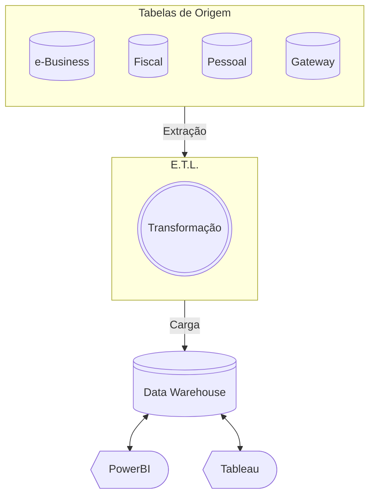
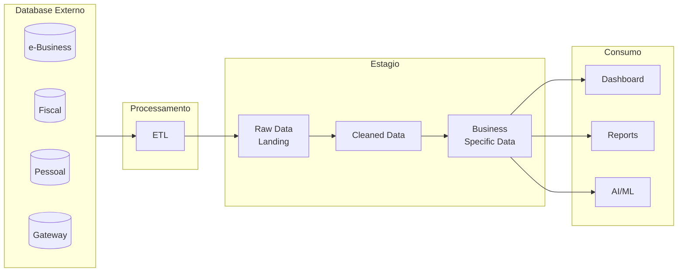
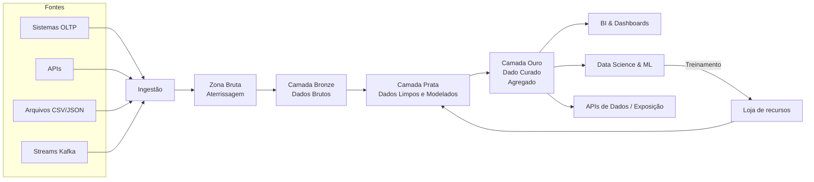
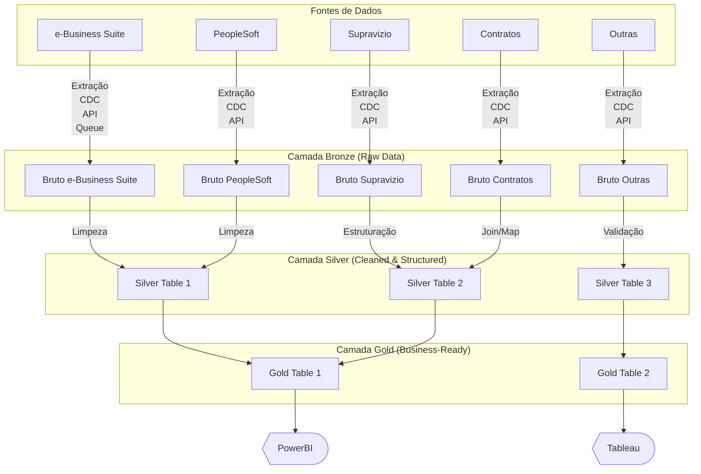
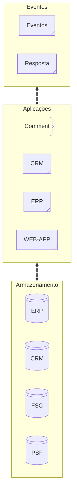
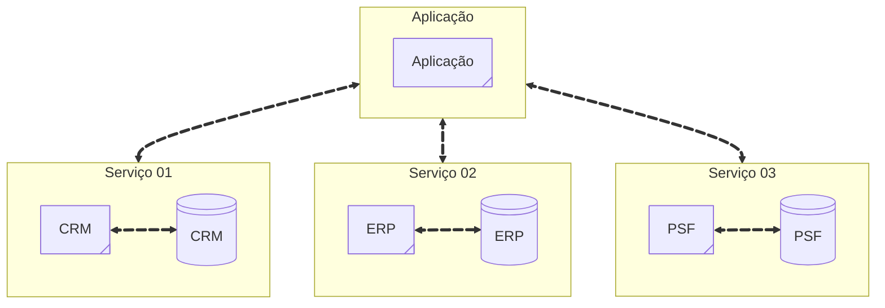

Historicamente existe uma grande divisão entre o **Lado Operacional e o Analítico do negócio**, já que cada equipe acaba trabalhando sozinha para obter, limpar, estruturar e usar os dados.

- [ ] Quanto mais longe da fonte você move, copia e transforma os dados, maior a frequência de quebras, maior a latência, mais complexas as dependências.
- [ ] O objetivo de configurar um pipeline de ETL é obter dados do seu **sistema de origem** para o plano **analítico**, para que você possa realizar análises.
- [ ] As equipes de dados ficam isoladas em sua própria área da empresa — com sua própria liderança, seus próprios objetivos de negócios e seus próprios centros de custo.
	- [ ] Da mesma forma, as equipes operacionais também têm sua própria liderança, objetivos e centros de custo, o que pode tornar a cooperação entre as  equipes um pouco lenta.

## Arquiteturas de dados single-hop
Os dados são copiados apenas uma vez, por exemplo, de um sistema de origem para um data lake/warehouse onde os cientistas de dados podem acessá-los.

- [ ] Lado Operacional, caracterizado por aplicativos e serviços otimizados para transações de baixa latência.
- [ ] Lado Analítico, caracterizado por consultas grandes e de alta latência ocorrem regularmente, mas dependem de técnicas de otimização inovadas especialmente para análise.

Historicamente, os data warehouses eram o local onde você carregava todos os seus dados limpos e estruturados para fins analíticos — segmentando os dados para responder a consultas.

- [ ] **Star Schema**(Tabelas de fatos no centro conectadas diretamente às tabelas de dimensão);
- [ ] **Snowflake Schema** (Dimensões divididas em tabelas adicionais - normalizadas);
## Arquiteturas de dados multi-hop
Utilizado para arquiteturas em que os dados são processados e copiados diversas vezes antes de finalmente atingirem um nível de qualidade e organização que possa impulsionar um caso de uso comercial específico.

- [ ] _Zona de pouso ou preparação_:  _Esses dados normalmente vêm de um sistema externo como parte de um_ ETL, uma cópia direta de arquivo ou outro mecanismo de ingestão.
- [ ] Dados básicos limpos: Aplicar filtragem, remodelação e aplicação da qualidade dos dados para converter os dados do estágio 1 para o estágio 2.
- [ ] Dados empresariais selecionados: consistem em conjuntos de dados empresariais específicos criados a partir de dados obtidos no estágio 2.
## Arquitetura Medallion
A arquitetura medalhão é um padrão de design usado por profissionais de dados para organizar e delinear conjuntos de dados. Ela é dividida em três classificações ou camadas de medalhão diferentes, de acordo com o padrão da Medalha Olímpica: bronze, prata e ouro.

Cada uma das três camadas representa qualidade, confiabilidade e garantias progressivamente maiores sendo o bronze o mais fraco e o ouro o mais forte.

Medallion é a adaptação mais recente e popular, e por um bom motivo: faz muito sentido da perspectiva de um profissional de dados que recebe pouca ou nenhuma ajuda das equipes que criam e mantêm os modelos de dados de origem.

- [ ] A desvantagem da arquitetura Medallion é que todo o trabalho que você faz para deixar os dados limpos, confiáveis e bem formatados (a camada prateada) fica bloqueado no data lake ou no data warehouse.
- [ ] Mover esses dados de prata para a esquerda  significa que podemos publicá-los como um **produto de dados** de primeira classe e fornecê-los a todos os consumidores, operacionais, analíticos ou intermediários;
- [ ] Arquitetura Medallion é cara.
	- [ ] Cada etapa incorre em custos — carregamento de dados;
	- [ ] Encontrar conjuntos de dados semelhantes para reutilização pode ser difícil, pois a abordagem ad hoc para acessar dados tende a gerar silos e descobertas fragmentadas;
	- [ ] ETL falha, todos os trabalhos subsequentes devem ser pausados até que o ETL seja corrigido;
	- [ ] Transfere os dados do seu sistema para o seu data lake por meio de ETL/ELT, você precisa desnormalizá-los, reestruturá-los, padronizá-los, remodelá-los e dar sentido a eles — sem cometer erros;
	- [ ] Dados incorretos farão com que seus clientes percam a confiança;
	- [ ]
OU

- [ ] **Ingestão**: O processo de coletar dados de diferentes fontes e trazê-los para o ambiente de dados;
- [ ] **Zona de Bruta**: A primeira área de armazenamento após a ingestão, onde os dados são armazenados **exatamente como recebidos**, sem tratamento;
- [ ] **Camada Bronze**: Camada onde os dados são **organizados minimamente** para uso posterior, mantendo ainda sua forma bruta;
- [ ] **Camada Prata**: Camada intermediária com dados **limpos, estruturados, normalizados** e integrados (Correção de dados, tratamento de nulos, deduplicação, Envolve **joins**, **regras de negócio** e **validações** );
- [ ] **Camada final**: com dados **prontos para consumo analítico** ou operacional;
- [ ] **Loja de Recursos**: Promove a **reutilização e padronização** entre equipes.

## A "mentalidade de "cada um por si" predominante nas responsabilidades de acesso a dados
Pegue o código de limpeza SQL que você está executando no seu data lake e deslocá-lo para a esquerda, em direção ao sistema de origem que criou os dados originalmente.

Mover a limpeza, a estruturação e a transformação de dados o mais próximo possível da criação dos dados para que todos possam se beneficiar do resultado.

A migração para a esquerda reduz a complexidade e os custos, eliminando pipelines de dados, processamento e armazenamento de dados duplicados. Elimina a necessidade de
manutenção paralela, elimina o trabalho de correção de falhas no pipeline de dados e libera seus engenheiros para trabalhar em tarefas mais valiosas.

## Levando dados do plano operacional para o plano analítico

A mudança para a esquerda — uma seleção e mudança incremental dos conjuntos de dados importantes que sustentam o seu negócio — funciona na prática para que todos possam se beneficiar de um acesso limpo, simples e confiável aos dados.

Sistemas transacionais fazem parte do plano operacional (preenchido por sistemas de processamento de transações on-line ou OLTP) e são extremamente eficientes no atendimento a seus casos de uso comercial específicos. _Mas os requisitos de negócios vão muito além da gestão de transações_? Responder a essas perguntas exige coletar dados de toda a organização e analisá-los em data warehouses, data lakes ou data lakehouses.

Para piorar a situação, o plano analítico não é o único que precisa de acesso a dados corporativos de alta qualidade.

Nesta era de computação em nuvem desacoplada, microsserviços, mecanismos SQL gerenciados e aplicativos de software como serviço (SaaS), a necessidade de dados corporativos de alta qualidade é maior do que nunca em toda a sua empresa, incluindo a camada operacional.

IA generativa (GenAI), impulsionaram um aumento na demanda por acesso a dados em todos os negócios.

![[Pasted image 20250505204631.png]]

##  Arquitetura de dados Headless
Uma arquitetura de dados headless é o produto de dados, com o qual você já deve estar familiarizado com a abordagem de malha de dados .

Na arquitetura de dados headless, um produto de dados é composto por um fluxo com tecnologia Apache Kafka e sua tabela relacionada com tecnologia Apache Iceberg.

Os dados gravados no fluxo são automaticamente anexados à tabela, permitindo que você os acesse como um tópico do Kafka ou como uma tabela Iceberg.

![[Pasted image 20250505204652.png]]

--- Apache Flink
Os microsserviços são projetados como aplicativos pequenos, autocontidos e independentes.

Eles seguem a filosofia UNIX de fazer uma única coisa e fazê-la bem. Aplicativos mais complexos são criados conectando vários microsserviços entre
si, que se comunicam apenas por meio de interfaces padronizadas, como conexões HTTP RESTful.

