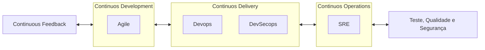

Garantir a segurança dos aplicativos e da cadeia de fornecimento de software nunca foi tão importante.

No cenário de desenvolvimento de software em rápida evolução, a integração de testes contínuos, qualidade, segurança e feedback tornou-se crucial para organizações que buscam alcançar transformações digitais bem-sucedidas.

O Gartner prevê que 45% das organizações globais serão afetadas por um ataque à cadeia de suprimentos até 2025. De acordo com o Relatório de Investigação de Violação de Dados da Verizon de 2022, os aplicativos continuam sendo um vetor de ataque superior e estão no centro de mais de 40% de todas as violações de dados.

## Evolução dos Testes

- [ ] Uma demanda crescente por velocidade e agilidade;
- [ ] Uma mudança de mentalidade de projeto para produto;
- [ ] A complexidade dos sistemas de software modernos;
- [ ] Necessidade de ciclos de lançamento mais rápidos;
- [ ] A ascensão da computação em nuvem e da automação;
- [ ] Crescente importância da segurança;
- [ ] Foco na confiabilidade e na experiência do usuário;
- [ ] Feedback e melhoria contínua;
- [ ] Mudanças culturais e organizacionais;

O advento das práticas Agile, DevOps, DevSecOps, GitOps e SRE exigiu uma evolução significativa nas estratégias de teste, qualidade, segurança e feedback.

O DevSecOps surgiu como uma resposta, enfatizando a colaboração entre desenvolvimento (Dev), qualidade (QA), segurança (Sec) e operações.

### **Definindo Teste Contínuo, Qualidade, Segurança e Feedback**

- [ ] A importância de definições claras para essas práticas contínuas.
   - [ ] **Teste Contínuo:** Definido como "A prática de testar a cada estágio do pipeline de entrega de software." É crucial para ciclos de release mais rápidos e segurança shift-left. "reduzindo o custo, tempo e risco de entrega de mudanças."
   - [ ] **Qualidade Contínua:** Vai além da garantia de qualidade tradicional, focando em garantir que o software atenda ou supere as expectativas do cliente ao longo do tempo. É um "processo contínuo alinhado com as necessidades do cliente e excedendo suas expectativas."
   - [ ] **Segurança Contínua:** Integrar práticas de segurança em todas as etapas do processo de desenvolvimento e entrega, e não como uma reflexão tardia. A segurança deve ser "embutida em cada estágio do pipeline de desenvolvimento e entrega de software."
   - [ ] **Feedback Contínuo:** Coleta e utilização de feedback em tempo real de sistemas e usuários para impulsionar a melhoria contínua. "Sem feedback, você está correndo às cegas."

### **Princípios Orientadores e Pilares:**

- [ ] **Nove Pilares do DevSecOps:** Estes pilares estendem o modelo DevOps integrando segurança em todas as fases. Incluem áreas como colaboração, automação, entrega contínua, segurança, teste contínuo, monitoramento contínuo e feedback contínuo.
- [ ] **Nove Pilares do SRE:** Focam na confiabilidade e operação de sistemas. Alguns pilares mencionados incluem:
   - [ ] **Cultura – shift left wisdom of production:** Incorporar conhecimento operacional no início do ciclo de vida.
   - [ ] **Measurements and observability:** Capacidade de medir e observar o estado interno dos sistemas.
   - [ ] **Anti-fragility, fire drills, chaos engineering, and security defense:** Ir além da resiliência aprendendo com estressores e implementando medidas de segurança proativas.
   - [ ] **Work sharing and incremental technical debt:** Compartilhamento colaborativo de trabalho e gerenciamento incremental de dívida técnica.
   - [ ] **Deployments using blue-green, A/B, and Canary:** Estratégias de implantação para reduzir riscos.
### **Importância da Automação**
- [ ] **Desenvolvimento Incremental e Testes Automatizados:** Testes automatizados para garantir o sucesso dentro de restrições de tempo.
- [ ] **A Realidade do Tempo de Teste:** Experiências no BNR com a qualificação do sistema SL-10 Generic 10 mostraram que o teste manual era ineficiente, levando a um tempo significativamente maior do que o planejado. A experiência destacou a necessidade de melhorias na qualidade antes da entrega.
- [ ] **A Importância das Ferramentas Integradas:** A experiência BERPEX demonstrou que o suporte remoto e a eficiência de comissionamento poderiam ser aprimorados se as ferramentas fossem "projetadas para serem mais integradas com o sistema e entre si".
- [ ] **Feedback como Crítico:** A frase "Sem feedback, você está correndo às cegas" resume a importância de métricas de qualidade, teste e segurança para monitorar e gerenciar o fluxo de mudanças.

### **Metodologias para Descoberta e Benchmarks:**

- [ ] A transformação digital requer uma compreensão do estado atual e a definição de um estado futuro desejado.
- [ ] **Avaliações de Lacunas (Gap Assessments):** O processo envolve definir objetivos, avaliar o estado atual, definir o estado futuro desejado e analisar as lacunas.
- [ ] **Mapeamento do Fluxo de Valor do Estado Atual (CSVSM):** Ajuda a visualizar o fluxo de trabalho, identificar ineficiências e gargalos no pipeline de entrega de software.
- [ ] **Ferramentas de Descoberta:** Incluem pesquisas, entrevistas, workshops e revisão de documentação existente.
- [ ] **O Papel da IA Generativa:** IA generativa pode "acelerar a descoberta e benchmarking" ajudando a coletar insights, automatizar tarefas e aprimorar a tomada de decisões.

### **Definindo Metas de Transformação**

- [ ] O estabelecimento de metas é crucial para orientar as iniciativas de transformação.
- [ ] As metas devem ser **Específicas, Mensuráveis, Atingíveis, Relevantes e com Prazo Definido (SMART)**.
- [ ] As metas podem ser classificadas como estratégicas, de eficiência, de qualidade, de segurança, de estabilidade e de satisfação da equipe.
- [ ] É importante que os diferentes membros da equipe estejam "mais comprometidos com os objetivos do que se os objetivos fossem declarados sem sua participação."
- [ ]  IA chatbots podem auxiliar na determinação de metas de transformação.

1. **Plataformas de Ferramentas e Ferramentas:**

- [ ] Distinção entre plataformas de ferramentas (ecossistemas integrados) e ferramentas (aplicativos específicos). (p. 138-139)
- [ ] Existem opções de código aberto, comerciais (vendor product tools) e construídas internamente (DIY).
- [ ] **Ferramentas de Código Aberto:** Vantagens incluem custo, flexibilidade e transparência. Desvantagens incluem potencial falta de suporte e documentação.
- [ ] **Ferramentas de Produto de Fornecedor:** Vantagens incluem suporte profissional e recursos abrangentes. Desvantagens incluem custo, potencial lock-in e menor customização.
- [ ] **Ferramentas DIY:** Atraentes para organizações com orçamento limitado, mas podem carecer de recursos e sustentabilidade.
- [ ] A seleção de ferramentas deve ser estratégica, alinhando-se com os objetivos e aprimorando o ciclo de vida do desenvolvimento.

### **Roadmaps de Transformação:**

- [ ] A criação de um roadmap é um processo estruturado que envolve várias partes interessadas e aborda pessoas/cultura, processos e tecnologia.
- [ ] O roadmap deve se alinhar com os objetivos estratégicos, ser realista, avaliar alternativas com base em viabilidade, risco e custo-benefício, e ser flexível.
- [ ] Roadmaps dedicados para teste contínuo, qualidade, segurança e feedback são essenciais.
- [ ] O alinhamento do roadmap envolve identificar e mitigar riscos, alocar orçamento e recursos, estabelecer métricas de sucesso e KPIs, e criar um plano de gerenciamento de mudanças.

1. **Padrões de Implementação de Transformação:**

- [ ] Diferentes padrões podem ser usados para implementar transformações.
- [ ] **Equipe de Plataforma Dedicada:** Vantagens incluem foco especializado, mas pode ter desvantagens em termos de silos.
- [ ]  **Equipes Embutidas:** Vantagens incluem colaboração próxima, mas podem ter desvantagens em termos de inconsistência.
- [ ] **Equipes Terceirizadas:** Vantagens incluem acesso a expertise, mas podem ter desvantagens em termos de controle.
- [ ] **Equipes Híbridas Dedicadas/Terceirizadas:** Combina abordagens. (p. 249-251)
- [ ] É crucial entender os diferentes padrões e selecionar aquele que melhor se adapta às necessidades e contexto da organização.

### **Medindo Progresso e Resultados:**

- [ ] As métricas são essenciais para medir o sucesso das transformações.
- [ ] **Métricas de Progresso:** Indicam o status de atividades e processos (por exemplo, Taxa de Aprovação de Scans de Segurança, Tempo Médio para Resolução (MTTR), Idade do Item de Trabalho).
- [ ] **Métricas de Resultado:** Indicam o impacto final em objetivos de negócios (por exemplo, Taxa de Defeitos em Produção, Satisfação do Cliente).
- [ ] **Métricas DORA:** Podem ser aplicadas para medir a performance do pipeline de entrega de software, incluindo lead time, frequência de implantação, MTTR e taxa de falha de mudança.
- [ ] **Métricas de Fluxo:** Como Idade do Item de Trabalho, Eficiência de Fluxo e Limites de Trabalho em Progresso (WIP), ajudam a identificar gargalos e entender o fluxo de trabalho.
- [ ] É crucial identificar métricas alinhadas com objetivos, que sejam mensuráveis e atingíveis, priorizá-las e considerar a opinião das partes interessadas.
- [ ] As implementações de métricas devem ser validadas, versionadas e monitoradas continuamente.

### **Tendências em DevOps, DevSecOps e SRE:**

- [ ] O campo está em constante evolução, impulsionado por avanços tecnológicos e demandas do mercado.
- [ ] **Aumento do Gerenciamento do Fluxo de Valor (VSM):** As organizações buscam otimizar o processo de entrega de software de ponta a ponta para maximizar o valor. (p. 289)
- [ ] **Testabilidade e Observabilidade:** Tendências que focam em facilitar a teste e a compreensão do estado interno dos sistemas. (p. 286-287)
- [ ] **Engenharia de Plataforma:** O foco na construção de plataformas internas para acelerar o desenvolvimento e as operações.
- [ ] **Tendências de IA/ML:** A inteligência artificial e o aprendizado de máquina estão impactando a forma como o teste, a qualidade, a segurança e o feedback são abordados.

1. **A Importância do Aprendizado Contínuo:**

- [ ] O livro destaca a importância de aprender com falhas e abraçar uma cultura sem culpa. "Aprender com o fracasso" é crucial para a melhoria contínua. (p. 300-301)
- [ ] Práticas como fire drills e chaos engineering são usadas para "tornar os sistemas mais robustos" e aprender com falhas intencionais. (p. 33, 299)

### **Pontos Importantes e Fatos**

- [ ] A transição do teste manual para o automatizado na qualificação do SL-10 Generic 10 reduziu significativamente o tempo de validação (de 8 meses para alguns dias para o comissionamento inicial no local).
- [ ] O desenvolvimento de ferramentas de teste integradas, como ISOLT e NTS, foi crucial para a eficiência e escalabilidade.
- [ ] Modelos de maturidade de capacidade (CMMs) para qualidade contínua e segurança contínua são apresentados como estruturas para avaliar e melhorar as práticas.
- [ ] A importância de definir e rastrear Service Level Objectives (SLOs) e Service Level Indicators (SLIs) para governar a qualidade e a confiabilidade é um tema recorrente, derivado da prática SRE.
- [ ] O uso de dados de uso do mundo real em conjunto com simulações pode ajudar os modelos AI/ML a lidar com a incerteza sobre os ambientes do cliente.

### **Implicações**
Os trechos fornecem uma base sólida para entender os princípios e práticas essenciais para organizações que embarcam em transformações DevOps, DevSecOps e SRE. A ênfase do autor em integrar teste, qualidade, segurança e feedback desde o início do ciclo de vida do desenvolvimento, juntamente com a necessidade de automação, métricas e aprendizado contínuo, são cruciais para alcançar entrega de software bem-sucedida em ambientes modernos. As experiências pessoais compartilhadas destacam os desafios práticos e as lições aprendidas ao longo de décadas de evolução tecnológica.

### **Recomendações**

- [ ] Revisar os princípios e pilares de teste contínuo, qualidade, segurança e feedback para garantir uma compreensão completa de cada área.
- [ ] Considerar a aplicação das metodologias de descoberta e avaliação de lacunas (gap assessment) para entender o estado atual da sua organização e identificar áreas para melhoria.
- [ ] Utilizar a estrutura para definir metas de transformação SMART e envolver as partes interessadas no processo de definição de metas.
- [ ] Avaliar as plataformas de ferramentas e ferramentas existentes e futuras com base nos fatores de seleção discutidos.
- [ ] Desenvolver um roadmap de transformação detalhado que se alinhe com os objetivos estratégicos e inclua um plano de gerenciamento de mudanças.
- [ ] Implementar um sistema de métricas robusto, incluindo métricas de progresso e resultados (como DORA e métricas de fluxo), para medir e melhorar continuamente o desempenho.
- [ ] Promover uma cultura de aprendizado a partir de falhas e considerar a integração de práticas como chaos engineering para aumentar a robustez do sistema.
- [ ] Acompanhar as macro tendências em DevOps, DevSecOps e SRE, como VSM, testabilidade, observabilidade, engenharia de plataforma e IA/ML.
