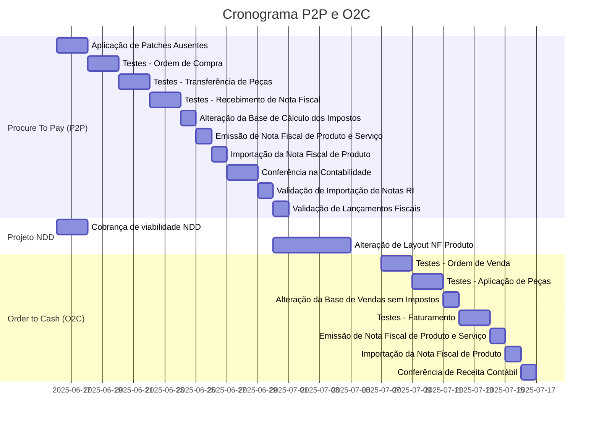

# 3. Reforma tributária

Date: 2024-12-11

A Reforma Tributária é um conjunto de mudanças no sistema de tributos do Brasil, com o objetivo de:

- Simplificar a complexa estrutura atual, particularmente a arrecadação.
- Reduzir a cumulatividade de impostos.
- Promover maior competitividade para as empresas.

## Status

In progress

## Context
- [ ] O Oracle e-Business Suite encontra-se preparado para lidar com ao crédito financeiro (não cumulativo de forma plena)?
- [ ] Os códigos fiscais precisarão ser adaptados para a nova NBM e Serviços?
- [ ] Estamos prontos para lidar com a tributação pelo princípio do destino?
- [ ] Como iremos fazer na integração do Jurídico, com a Contabilidade e Fiscal?

## Contextualizando a Reforma Tributária

- [ ] **Criação do IVA**: A Reforma prevê a criação do IVA (Imposto sobre Valor Agregado), adotado em vários países. No Brasil, será dividido em dois tributos: o Imposto sobre Bens e Serviços (IBS), que substituirá o ICMS e ISS e a Contribuição sobre Bens e Serivços (CBS), no lugar do PIS, COFINS e IPI. Os detalhes das alíquotas ainda estão sendo discutidas, mas estudos da Receita Federal indicam que a carga tributária continuará elevada em comparação com os países da OCDE.
- [ ] **Imposto seletivo**: Produtos como cigarros, bebidas alcoólicas e itens prejudiciais ao meio ambiente terão um Imposto Seletivo (IS) com alíquota extra para desestimular o consumo. As regras detalhadas ainda serão definidas.
- [ ]  **Imposto no local de consumo e compensação**: Para acabar com a guerra fiscal entre estados, que cria dificuldades operacionais para as empresas, o IBS será cobrado no local de consumo, e não mais na origem. Para compensar perdas de arrecadação, será criado o Fundo Nacional de Desenvolvimento Regional (FNDR). As empresas precisarão reavaliar suas estratégias de mercado, logística e incentivos fiscais diante dessas mudanças.
- [ ] **Isenções, “cesta básica” e cashback**: Além da alíquota padrão, haverá alíquotas diferenciadas para setores como saúde e educação, isenção de impostos para produtos da cesta básica (a definir em lei complementar) e um modelo de cashback para devolver parte dos impostos às famílias de baixa renda.
- [ ]  **Teto para o aumento de impostos**: O texto prevê um limite para o aumento da carga tributária, calculado com base na arrecadação média de PIS, COFINS, IPI, ICMS e ISS entre 2012 e 2021, em relação ao PIB.
### Fase de aprovação e planejamento (2023-2024)
Aprovada em dezembro de 2023 por meio da Emenda Constitucional 132/2023, após intensos debates no Congresso.
### Período de transição (2026-2032)
- [ ]  Em janeiro de 2025 foi sancionada a Lei Complementar nº 214/2025.
 - [ ] A partir de 2026, o Brasil começará a substituir seu complexo sistema tributário atual por um modelo de IVA dual. Durante esse período de transição, será implementado um calendário escalonado para a eliminação gradual de tributos existentes, como PIS, COFINS, ICMS e ISS, dando lugar à CBS (Contribuição sobre Bens e Serviços) e ao IBS (Imposto sobre Bens e Serviços) e IS (Imposto Seletivo).
- [ ] 2026 será considerado o período de teste da CBS, com aplicação da alíquota de 0,9%, que entrará plenamente em vigor a partir de 2027, quando substituirá de vez as contribuições PIS e COFINS.
- Em 2027, as alíquotas do IPI serão reduzidas a zero, exceto para os produtos produzidos na Zona Franca de Manaus.
- Entre 2029 e 2032, ocorrerá a transição do ICMS e do ISS para o IBS, com uma redução gradual das alíquotas. Paralelamente, a alíquota do IBS será aumentada progressivamente da seguinte forma: 10% (2029) – 20% (2030) – 30% (2031) – 40% (2032) com a plena implementação do imposto em 2033.
### Implementação completa (2033 em diante)
Em janeiro de 2033, o novo sistema tributário estará completamente implementado. A partir dessa data, os tributos antigos serão eliminados, e a CBS e o IBS passarão a operar plenamente.
### Notas Fiscais Eletrônicas (NF-e e NFC-e)
A partir de janeiro de 2026, notas fiscais eletrônicas (NF-e e NFC-e) que **não incluírem esses impostos serão rejeitadas**, conforme a Nota Técnica 2025.002 v1.01, publicada em 15 de abril de 2025.

- [ ] O cronograma de implementação está previsto para:
 - [ ] Homologação: 07/2025
 - [ ] Produção: 10/2025
- [ ] Produção efetiva com validações completas: **janeiro de 2026**
## Decision
- [ ] Aplicação de Patches e Atualização.
- [ ] Grupos de Trabalho para entendimento da Reforma Tributária;
- [ ] Mapeamento dos impactos tributário com a nova carga tributária proposta;
- [ ] Simulação de tributos (Antes e Depois da RT) e análise de impactos no negócio;
- [ ] Análises de impactos sobre benefícios e/ou regimes especiais;
- [ ] Mapemanto dos impactos financeiros com a chegada da RT;

## Decision da Área de TI

- Mapeamento dos sistemas da companhia impactados pela Reforma Tributária (RT);
  - Em conversa com a Oracle alinhou-se que seria a versão 12.2.6 e o patch do LAD.
  - Aplicação dos patches CLL indicados e seus pré-requisitos:
  - 37617788:R12.CLL.E - R12.2.CLL BRAZILIAN INBOUND FISCAL PROCESSES BRANCH PACK 21
  - 37382457:R12.CLL.E - R12.2.CLL ISV INTEGRATION BRANCH PACK 5
  - 38010120:
- Análises sobre as versões, tecnologias, integrações e customizações dos sistemas;
- Sugestão de Road Map de adequação tecnológica para a RT;
  - 13-01-2025 11:53hs: Solicitação para criação de Ambiente de Projeto;
  - 20-01-2025: Ambiente Liberado para Teste (31 de março – Primeiro patch: RI, EFD Loader e views)
    - RI: novas telas para configuração de impostos e cClassTrib, modificações em “tipo de nota”, validações cruzadas, lógica de cálculo de ICMS/FCP e nova profile para envio ao GL/AP com os novos tributos.
    - Loader: middleware para novas tags XML, telas de visualização, views de integração e profiles para ativação da reforma.
    - Destaque: Conector entre EFD Loader e RI e tratamento de CNPJ alfanumérico;
  - 30-05-2025: Segundo patch: XML + Ajustes complementares;
    - Adaptação da captura do XML fiscal com refinamento das lógicas e novas exceções que surgirem após o primeiro go live;
  - 31-07-2025: Terceiro patch: LTE (Legislação Tributária Estadual), ISS e atributos fiscais;
    - Financials – Latin Tax Engine: novas fórmulas, modelo de dados para cálculo dos tributos, GDFs adaptados;
    - CLL: tratamento específico para ISS e demais ajustes;
    - Importante: Sem alteração na lógica existente do LTE(Legislação Tributária Estadual) — foco está em extensão de atributos e adaptação fiscal;
- [Manual de Orientação ao Contribuinte - MOC - versão 7.0 - NF-e e NFC-e](https://www.nfe.fazenda.gov.br/portal/listaHistorico.aspx?tipoConteudo=i2kAtn%20PCRE=)
- [Municípios Aderentes - 1.289 entes federados.](https://www.gov.br/nfse/pt-br/municipios/municipios-aderentes)
- A adesão de cerca de 70% das capitais e cerca de 65% dos aderentes estão em áreas com mais de 500 mil habitantes.
- Nota fiscal
  - Ajuste da Interface da BBTS com a NDD;
  - Ver data alvo da - mensageria NDD
#### Recebimento Integrado
- Mecanismos e telas internas (entrada, Reversão, cancelamento) com coexistência dos impostos atuais
- CNPJ alfanumérico no RI e EFD Loader
- Interface para recebimentos de origens externas
- Interface do RI com AP, AR e GL
#### EFD Loader
- Validação e adequação dos novos tributos
- Interface entre XML Loader e RI
- Mecanismos do AR/Billing (Id único, fechamento do contas a receber, XML - de cobrança)
- AP/Payments - (id único e XML de payment)
- Pagamentos - Layouts bancários
- Integração com parceiros (emissão das notas e retorno da aprovação)

Com a entrada em vigor das alterações trazidas pela **Reforma Tributária** e a evolução constante da **Nota Fiscal Eletrônica (NF-e)**, as empresas precisam dedicar uma atenção especial às etapas de **configuração tributária** e **testes integrados** dos seus sistemas fiscais, contábeis e operacionais.

## Dúvidas:

- [ ] A definição correta da base de cálculo de impostos;
- [ ] As alíquotas aplicáveis em operações interestaduais, serviços e circulação de bens;
- [ ] As obrigações acessórias e layouts da NF-e e documentos fiscais complementares

Qualquer inconsistência nas parametrizações pode gerar:

- [ ] Recolhimentos indevidos ou insuficientes de tributos;
- [ ]  Penalidades e autuações fiscais;
- [ ] Dificuldade na escrituração contábil e fiscal;
- [ ] Problemas de compliance com Receita Federal, SEFAZ e demais órgãos reguladores.

Por isso, os **cenários de testes** devem contemplar:

- [ ]  Todas as naturezas de operação (compra, venda, transferência, devolução, bonificação, consignação, etc);
- [ ] Emissão e recepção de notas fiscais de produtos e serviços com novos layouts;
- [ ] Validação completa dos lançamentos contábeis e fiscais gerados a partir dos documentos fiscais;
- [ ] Integração entre módulos de ERP - AP, RI, GL, , sistemas de emissão fiscal (como NDD) e repositórios de escrituração - OneSource

A **validação antecipada e rigorosa** permite:

- [ ] Reduzir riscos de inconsistências após a entrada em produção;
- [ ] Garantir a conformidade legal em um ambiente tributário altamente dinâmico;
- [ ] Ajustar processos de negócio impactados pelas mudanças legislativas;
- [ ] Preparar a organização para auditorias e fiscalizações.

## Cronograma

## Consequences

### **Riscos Legais e Fiscais**

- [ ]  **Autuações fiscais** por erros de cálculo, recolhimento incorreto de tributos ou envio de informações inconsistentes aos fiscos.
- [ ]   **Multas** por descumprimento de prazos e regras de validação de documentos fiscais eletrônicos.
- [ ]   **Invalidação de Notas Fiscais** (rejeição automática na SEFAZ por não cumprimento do novo layout ou regras de tributação).
- [ ]   **Paralisação de operações** de venda, compra e faturamento por impossibilidade de emissão ou recebimento de notas fiscais.
- [ ]  **Interrupção em processos logísticos** (expedição, transporte, recebimento de mercadorias e integração com WMS/TMS).
- [ ]  **Perdas de crédito tributário** (ex.: créditos de ICMS, PIS/COFINS mal calculados).
- [ ]  **Diferenças contábeis** e inconsistências nos balanços, exigindo retrabalho e possíveis ajustes fiscais.
- [ ]  **Impactos diretos no fluxo de caixa** pela necessidade de recolher tributos adicionais não planejados.
- [ ]  **Necessidade de desenvolvimento emergencial de sistemas**, com custos elevados e alto risco operacional.
