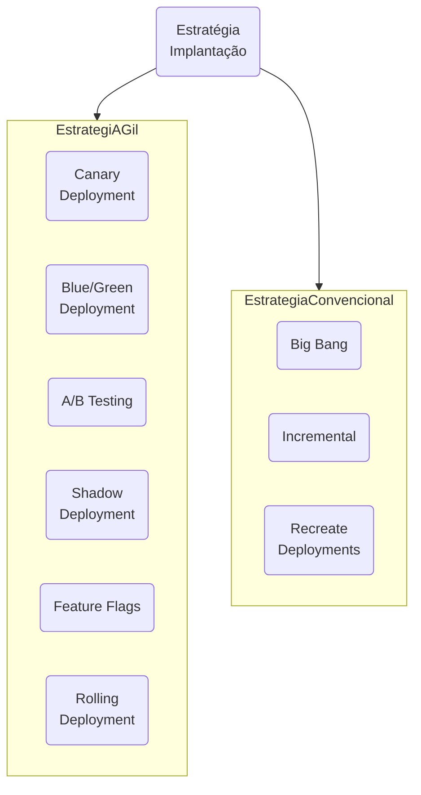

A melhor estratégia de implantação depende de inúmeros fatores, incluindo características do aplicativo, capacidades da equipe e objetivos de implantação.

A grande mudança na forma como pensamos e gerenciamos implantações ocorreu quando conseguimos dissociar implantação de lançamento .

Vamos explorar brevemente o que implantar e lançar significavam tradicionalmente e como essas definições mudaram.

Uma liberação consistia em congelar o código, após ele ter passado por testes e validação no ambiente de preparação , e marcá-lo como **pronto para implantação** em produção.

A implantação do aplicativo era o processo de mover esse código para um ambiente de produção , tornando-o ativo.

Porém, com a  introdução de sinalizadores de recursos, esta verdade não é mais absoluta, podendo a implantação  ocorrer antes do lançamento.

[[Estratégias de branch]], como o desenvolvimento baseado em tronco , em que o código é constantemente mesclado ao branch principal, combinado com integração contínua e entrega contínua (CI/CD) significam que o novo código está constantemente sendo enviado para um ambiente de produção.

No entanto, é somente quando o sinalizador de recurso relevante é habilitado que os novos recursos são realmente lançados.

### Estratégias de implantação

- [ ] **Big Bang**: Implantação big bang, envolve a implantação de todas as alterações de uma só vez, impactando todos os usuários simultaneamente. O aplicativo fica inativo durante a implantação (geralmente em horários de menor movimento) e não retorna ao ar até que a implantação seja concluída.
- [ ] Incrementais/Contínuas: Implementação incremental, na qual as alterações são expostas a uma porcentagem crescente de usuários de forma incremental até o lançamento completo.
- [ ] Recreate Deployments: Implantações de recriação envolvem o encerramento da implantação da versão anterior e a recriação de todo o ambiente com o aplicativo recém-implantado.
- [ ] **Canary**: Implantação Canary é uma estratégia de implementação em fases onde uma nova versão é lançada para um subconjunto de usuários ou servidores antes de ser disponibilizada para todos. Implantações Canary permitem melhor monitoramento de desempenhoImplantação
- [ ] **Blue-green**: Implantação Blue-green é uma estratégia de implementação que utiliza dois ambientes idênticos, um ambiente "azul" e um ambiente "verde" com diferentes versões de um aplicativo ou serviço.
- [ ] **Shadow**: Implantação Shadow é uma prática de implantação de software onde quaisquer alterações em um aplicativo de software são implantadas em um ambiente paralelo que imita o ambiente de produção. A implantação de sombra permite que os engenheiros monitorem o desempenho do sistema e conduzam testes de estabilidade.
- [ ] **Rolling updates**: Uma implantação contínua é uma estratégia de implementação que atualiza instâncias em execução de um aplicativo com a nova versão. O objetivo principal da estratégia de implantação de atualização contínua é minimizar o tempo de inatividade e garantir que os aplicativos permaneçam acessíveis e operacionais, mesmo durante as atualizações.
- [ ] **Feature Flag**: Os sinalizadores de recurso podem ser usados para implementar implementações direcionadas de recursos para um subconjunto específico de seus usuários.
- [ ] **A/B testing**: Em testes A/B, diferentes versões do mesmo serviço são executadas simultaneamente como "experimentos" no mesmo ambiente por um período de tempo.
### Como escolher?

| Tipo                          | Entenda                                                                                                                                                                                                                                                               |
| ----------------------------- | --------------------------------------------------------------------------------------------------------------------------------------------------------------------------------------------------------------------------------------------------------------------- |
| **Tamanho e complexidade**    | Aplicativos mais simples com dependências mínimas podem se beneficiar de estratégias de implantação mais simples, pois normalmente apresentam menor risco de falha.                                                                                                   |
| **Tempo de inatividade**      | Tolerância a tempo de inatividade pode variar drasticamente entre diferentes aplicativos.                                                                                                                                                                             |
| **Riscos**                    | Aplicação com baixa tolerância a tempo de inatividade terá baixa tolerância a riscos, ou vice-versa.                                                                                                                                                                  |
| **Habilidades e experiência** | Uma estratégia complexa pode aumentar o risco se sobrecarregar as capacidades da sua equipe.                                                                                                                                                                          |
| **Recursos**                  | Estratégias complexas que incluem ambientes duplicados, naturalmente exigirão mais mão de obra para criar e manter, além de consumir mais recursos financeiros em termos da infraestrutura necessária.                                                                |
| **Frequência de lançamento**  | O código é enviado para um ambiente de produção com frequência, muitas vezes com implantação múltipla por dia.                                                                                                                                                        |
| **Abordagem de teste**        | Estratégias como implantações canário, azul/verde e sombra permitem testes mais abrangentes em um ambiente de produção e até mesmo, em alguns casos, sob carga de produção, mas esses testes exigem tempo, recursos e experiência adicionais que sua equipe exigiria. |
| **Impacto para o usuário**    | Ninguém gosta de bugs, interrupções ou incidentes que possam impactar a experiência do usuário, mas, sejamos honestos, nem toda aplicação é crítica.                                                                                                                  |
| **Capacidades de reversão**   | Implantações azul/verde e canário permitem uma reversão relativamente rápida para a versão estável anterior, caso surjam problemas.                                                                                                                                   |
| **Implementação gradual**     | Estratégias como implantações contínuas e lançamentos canários podem ajudar a mitigar o tempo de inatividade, limitando o impacto de possíveis problemas a um subconjunto menor de usuários ou servidores.                                                            |
| **Redundância**               | Exstratégias que mantêm vários ambientes (como implantações azul/verde) ajudam a garantir disponibilidade contínua, mesmo se um ambiente apresentar problemas                                                                                                         |
