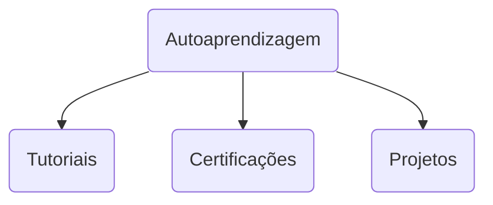
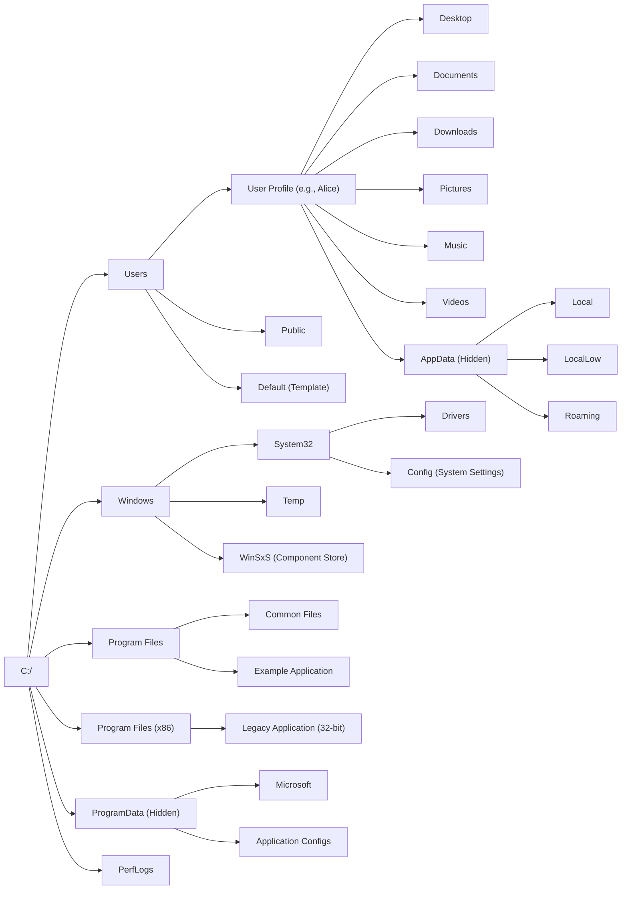
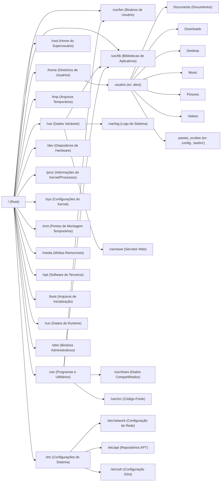
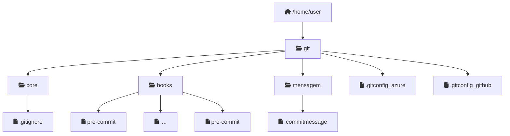
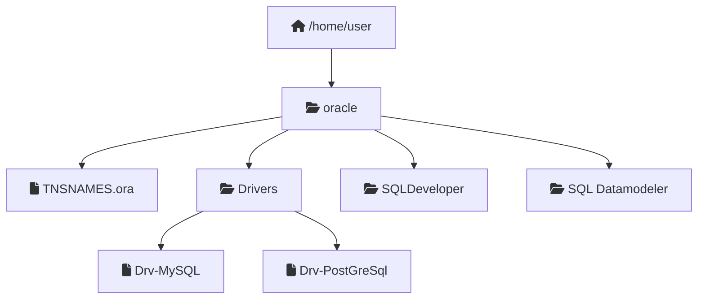
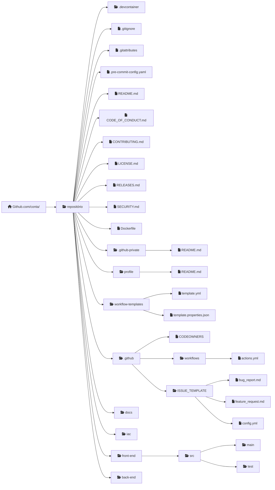

## **Aprendizagem**

```mermaid
flowchart TD
id1(Autoaprendizagem) --> id2(Tutoriais)
id1 --> id3(Certificações)
id1 --> id4(Projetos)
```

### **Estrutura Windows**

```mermaid
graph LR
    Root["C:/"]
    Root --> ProgramFiles["Program Files"]
    Root --> ProgramFilesx86["Program Files (x86)"]
    Root --> Users["Users"]
    Root --> Windows["Windows"]
    Root --> ProgramData["ProgramData (Hidden)"]
    Root --> PerfLogs["PerfLogs"]

    Users --> UserProfile["User Profile (e.g., Alice)"]
    Users --> Public["Public"]
    Users --> Default["Default (Template)"]

    UserProfile --> Desktop["Desktop"]
    UserProfile --> Documents["Documents"]
    UserProfile --> Downloads["Downloads"]
    UserProfile --> Pictures["Pictures"]
    UserProfile --> Music["Music"]
    UserProfile --> Videos["Videos"]
    UserProfile --> AppData["AppData (Hidden)"]

    AppData --> Local["Local"]
    AppData --> LocalLow["LocalLow"]
    AppData --> Roaming["Roaming"]

    Windows --> System32["System32"]
    Windows --> Temp["Temp"]
    Windows --> WinSxS["WinSxS (Component Store)"]

    System32 --> Drivers["Drivers"]
    System32 --> Config["Config (System Settings)"]

    ProgramFiles --> CommonFiles["Common Files"]
    ProgramFiles --> ExampleApp["Example Application"]

    ProgramFilesx86 --> LegacyApp["Legacy Application (32-bit)"]

    ProgramData --> Microsoft["Microsoft"]
    ProgramData --> AppConfigs["Application Configs"]
```
### **Estrutura Linux**

```mermaid
graph LR
    Root["/ (Root)"]
    Root --> bin["/bin (Binários Essenciais)"]
    Root --> etc["/etc (Configurações do Sistema)"]
    Root --> home["/home (Diretórios de Usuários)"]
    Root --> root["/root (Home do Superusuário)"]
    Root --> var["/var (Dados Variáveis)"]
    Root --> tmp["/tmp (Arquivos Temporários)"]
    Root --> usr["/usr (Programas e Utilitários)"]
    Root --> lib["/lib (Bibliotecas do Sistema)"]
    Root --> dev["/dev (Dispositivos de Hardware)"]
    Root --> proc["/proc (Informações do Kernel/Processos)"]
    Root --> sys["/sys (Configurações do Kernel)"]
    Root --> mnt["/mnt (Pontos de Montagem Temporários)"]
    Root --> media["/media (Mídias Removíveis)"]
    Root --> opt["/opt (Software de Terceiros)"]
    Root --> boot["/boot (Arquivos de Inicialização)"]
    Root --> run["/run (Dados de Runtime)"]
    Root --> sbin["/sbin (Binários Administrativos)"]

    home --> UserProfile["usuário (ex: alice)"]
    UserProfile --> Documents["Documents (Documentos)"]
    UserProfile --> Downloads["Downloads"]
    UserProfile --> Desktop["Desktop"]
    UserProfile --> Music["Music"]
    UserProfile --> Pictures["Pictures"]
    UserProfile --> Videos["Videos"]
    UserProfile --> Hidden[".pastas_ocultas (ex: .config, .bashrc)"]

    var --> log["/var/log (Logs do Sistema)"]
    var --> lib["/var/lib (Dados de Aplicativos)"]
    var --> www["/var/www (Servidor Web)"]

    usr --> bin["/usr/bin (Binários de Usuário)"]
    usr --> lib["/usr/lib (Bibliotecas de Aplicativos)"]
    usr --> share["/usr/share (Dados Compartilhados)"]
    usr --> src["/usr/src (Código-Fonte)"]

    etc --> network["/etc/network (Configuração de Rede)"]
    etc --> apt["/etc/apt (Repositórios APT)"]
    etc --> ssh["/etc/ssh (Configuração SSH)"]
```

## **Estrutura Git**

```mermaid
graph TD
 A01[fa:fa-home /home/user] --> C[fa:fa-folder-open git]
 C --> C01[fa:fa-folder-open core] & C02[fa:fa-folder-open hooks] &  C03[fa:fa-folder-open mensagem] & C04[fa:fa-file .gitconfig_azure] & C05[fa:fa-file .gitconfig_github]

C01 --> C0101[fa:fa-file .gitignore]

C02 --> C0201[fa:fa-file pre-commit] & C0202[fa:fa-file ....] & C0203[fa:fa-file pre-commit]

C03 --> C0301[fa:fa-file .commitmessage]
```

## **Estrutura Oracle**

```mermaid
  graph TD
  A00[fa:fa-home /home/user] --> B[fa:fa-folder-open oracle]
  B --> B01[fa:fa-file TNSNAMES.ora] & B02[fa:fa-folder-open Drivers] &     B03[fa:fa-folder-open SQLDeveloper] & B04[fa:fa-folder-open SQL Datamodeler]
  B02 --> B0201[fa:fa-file Drv-MySQL] & B0202[fa:fa-file Drv-PostGreSql]
```

### **Estrutura GitHub**

```mermaid
graph LR
A01[fa:fa-home Github.com/conta/] --> C[fa:fa-folder-open repositório]
C --> C02[fa:fa-folder-open .devcontainer]
C --> C03[fa:fa-file .gitignore] & C04[fa:fa-file .gitattributes]
C --> C05[fa:fa-file .pre-commit-config.yaml]
C --> C10[fa:fa-file README.md]
C --> C11[fa:fa-file CODE_OF_CONDUCT.md]
C --> C12[fa:fa-file CONTRIBUTING.md]
C --> C19[fa:fa-file LICENSE.md]
C --> C13[fa:fa-file RELEASES.md]
C --> C14[fa:fa-file SECURITY.md]
C --> C31[fa:fa-file Dockerfile]
C --> D01[fa:fa-folder-open .github]
C --> D04[fa:fa-folder-open .github-private]
D04 --> SP0401[fa:fa-file README.md]
C --> D02[fa:fa-folder-open profile]
D02 --> SP01[fa:fa-file README.md]
C --> D03[fa:fa-folder-open workflow-templates]
D03 --> SP30[fa:fa-file template.yml] & SP31[fa:fa-file template.properties.json]
D01 --> SP11[fa:fa-file CODEOWNERS]
D01 --> SP12[fa:fa-folder-open workflows]
D01 --> SP13[fa:fa-folder-open ISSUE_TEMPLATE]
SP12 --> SP1201[fa:fa-file actions.yml]
SP13 -->SP1301[fa:fa-file bug_report.md]
SP13 -->SP1302[fa:fa-file feature_request.md]
SP13 -->SP1303[fa:fa-file config.yml]
C --> D10[fa:fa-folder-open docs]
C --> D11[fa:fa-folder-open iac]
C --> D12[fa:fa-folder-open front-end]
C --> D13[fa:fa-folder-open back-end]
D12 --> D1201[fa:fa-folder-open src]
D1201 --> D120101[fa:fa-folder-open main]
D1201 --> D120102[fa:fa-folder-open test]
```
