## **DevOps**

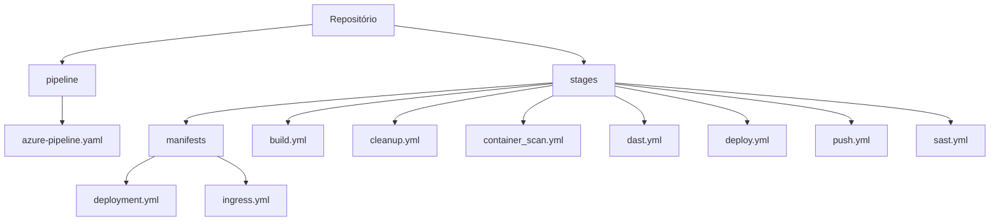

## **Estimativa**

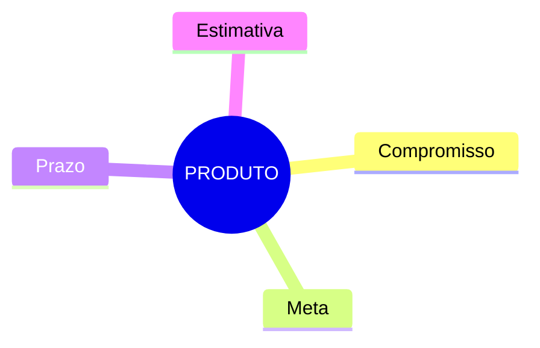

## **Aprendizagem**

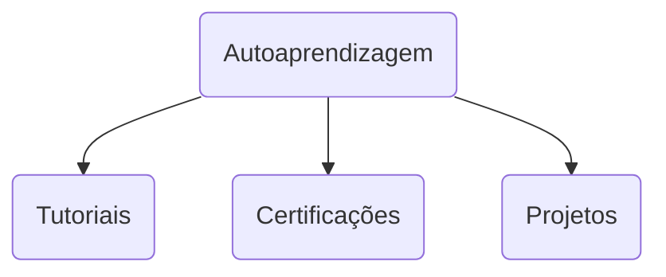

### **Estrutura Windows**

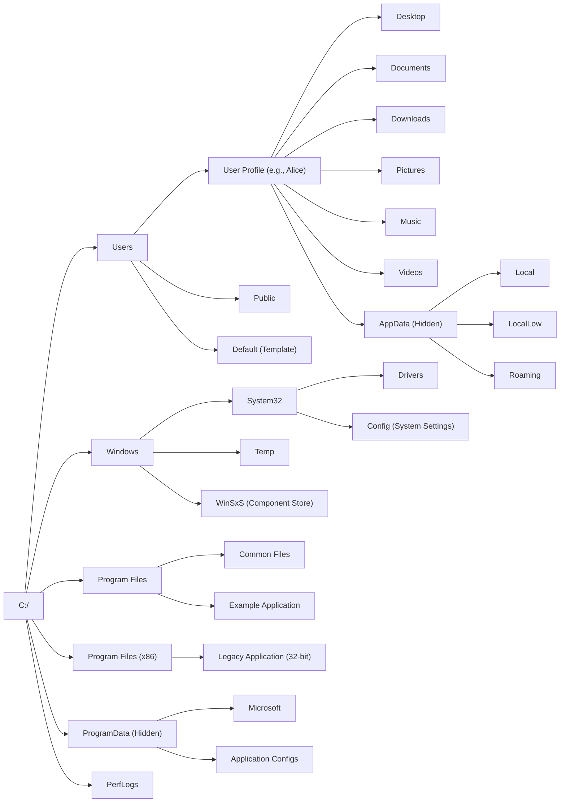
### **Estrutura Linux**

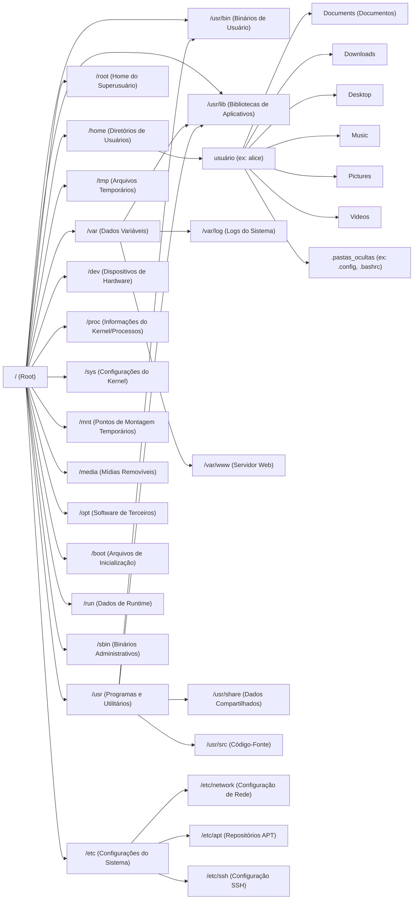

## **Estrutura Git**

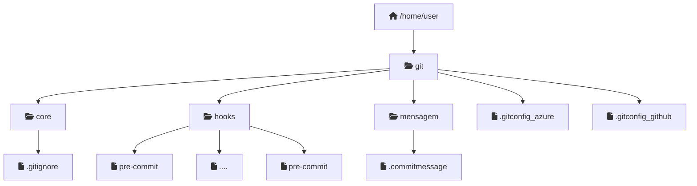

## **Estrutura Oracle**

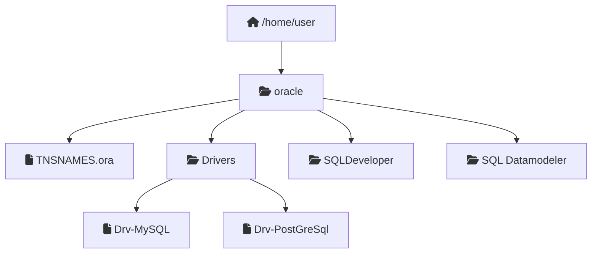

### **Estrutura GitHub**

```mermaid
graph TD
A01[fa:fa-home github.com/conta/] --> C[fa:fa-folder-open repositório]
C --> C02[fa:fa-folder-open .devcontainer]
C --> C03[fa:fa-file .gitignore] & C04[fa:fa-file .gitattributes]
C --> C05[fa:fa-file .pre-commit-config.yaml]
C --> C10[fa:fa-file README.md]
C --> C11[fa:fa-file CODE_OF_CONDUCT.md]
C --> C12[fa:fa-file CONTRIBUTING.md]
C --> C19[fa:fa-file LICENSE.md]
C --> C13[fa:fa-file RELEASES.md]
C --> C14[fa:fa-file SECURITY.md]
C --> C31[fa:fa-file Dockerfile]
C --> D01[fa:fa-folder-open .github]
C --> D04[fa:fa-folder-open .github-private]
D04 --> SP0401[fa:fa-file README.md]
C --> D02[fa:fa-folder-open profile]
D02 --> SP01[fa:fa-file README.md]
C --> D03[fa:fa-folder-open workflow-templates]
D03 --> SP30[fa:fa-file template.yml] & SP31[fa:fa-file template.properties.json]
D01 --> SP11[fa:fa-file CODEOWNERS]
D01 --> SP12[fa:fa-folder-open workflows]
D01 --> SP13[fa:fa-folder-open ISSUE_TEMPLATE]
SP12 --> SP1201[fa:fa-file actions.yml]
SP13 -->SP1301[fa:fa-file bug_report.md]
SP13 -->SP1302[fa:fa-file feature_request.md]
SP13 -->SP1303[fa:fa-file config.yml]
C --> D10[fa:fa-folder-open docs]
C --> D11[fa:fa-folder-open iac]
C --> D12[fa:fa-folder-open front-end]
C --> D13[fa:fa-folder-open back-end]
D12 --> D1201[fa:fa-folder-open src]
D1201 --> D120101[fa:fa-folder-open main]
D1201 --> D120102[fa:fa-folder-open test]
```

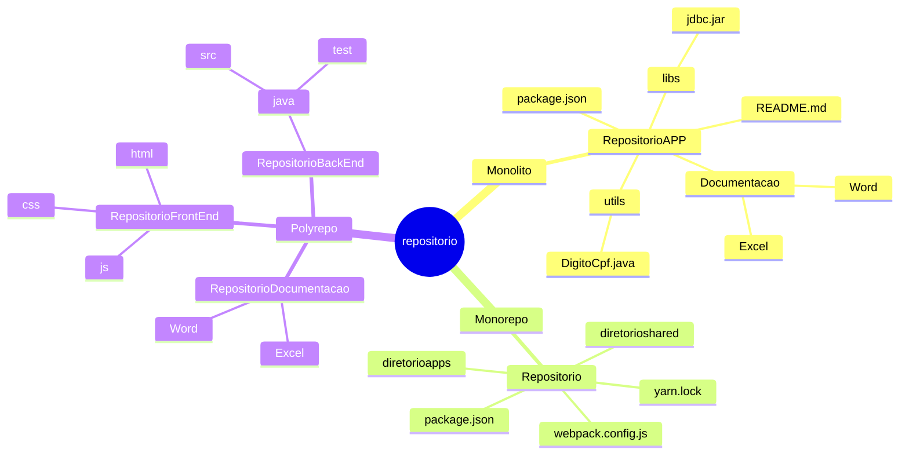

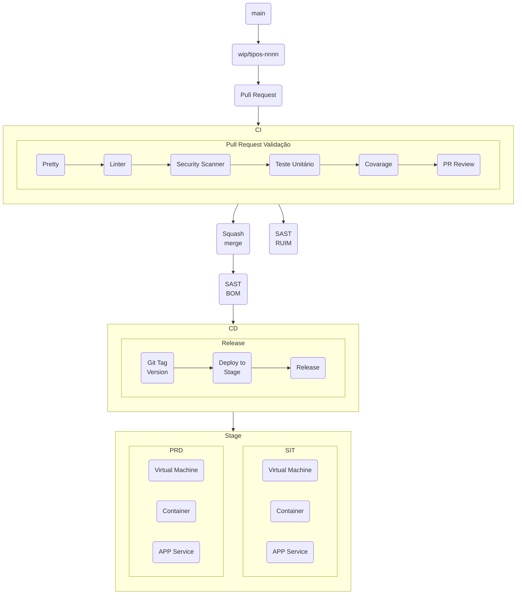

### Centralização de Logs

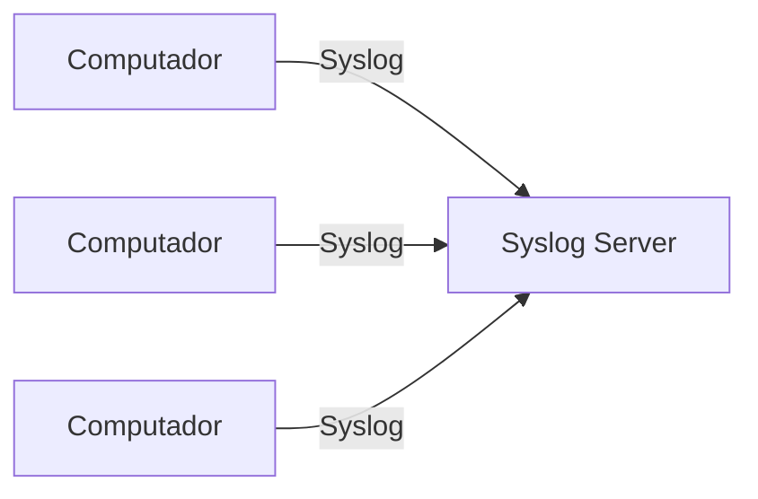

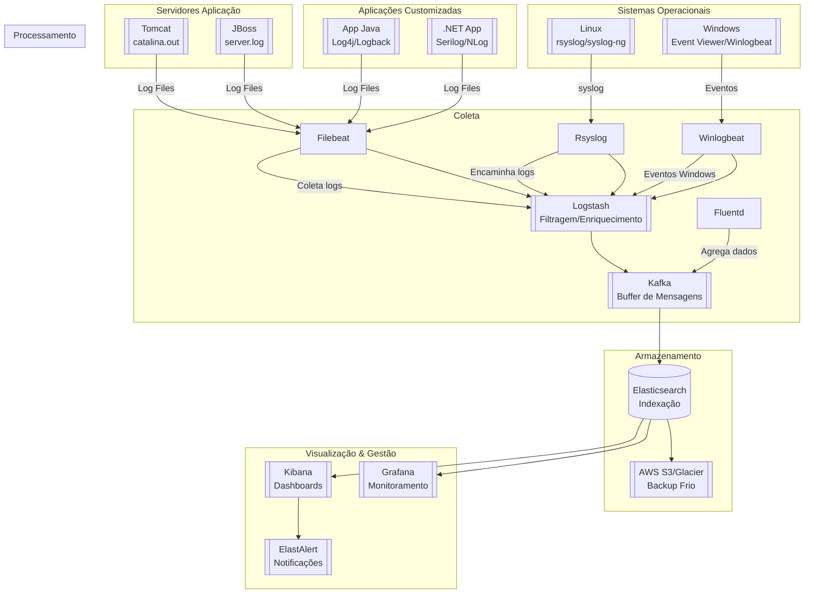

## **maven-archetype-archetype** (Para criar novos archetypes)

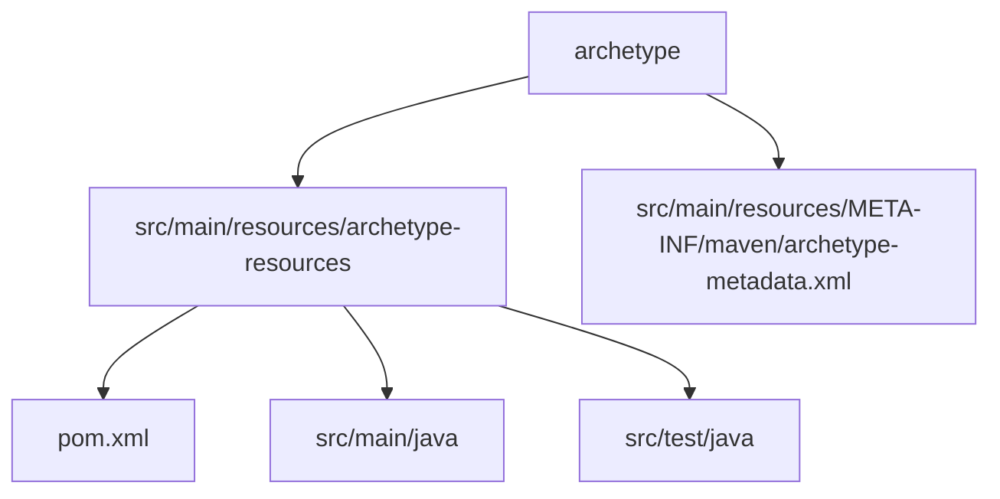

###  **maven-archetype-j2ee-simple** (Projeto J2EE básico)

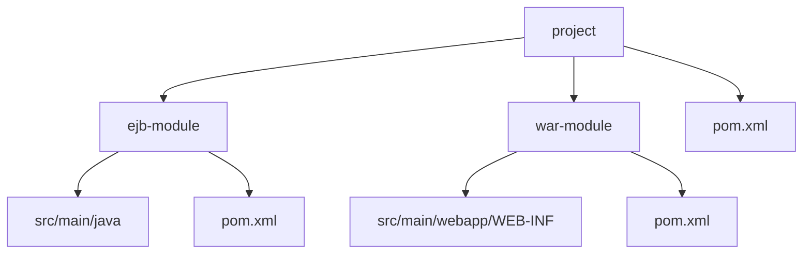

### **maven-archetype-plugin** (Plugin Maven)

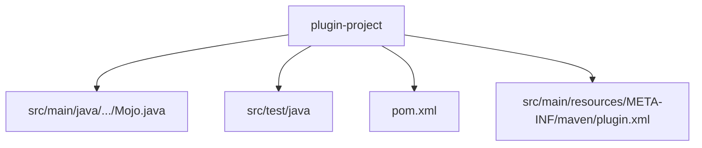

### **maven-archetype-plugin-site** (Site para plugins)

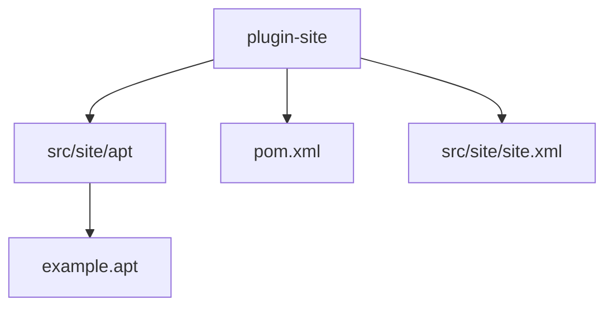

### **maven-archetype-portlet** (Portlet JSR-268)

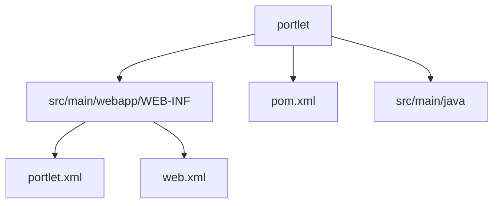

### **maven-archetype-quickstart** (Projeto Java simples)

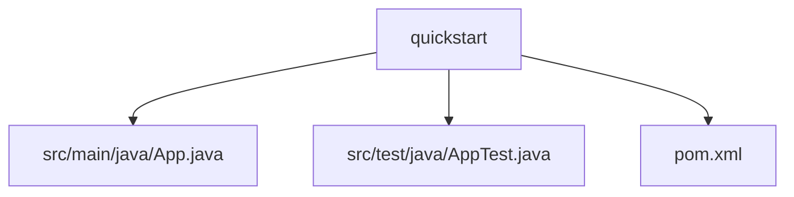

### **maven-archetype-site** (Site documentation)
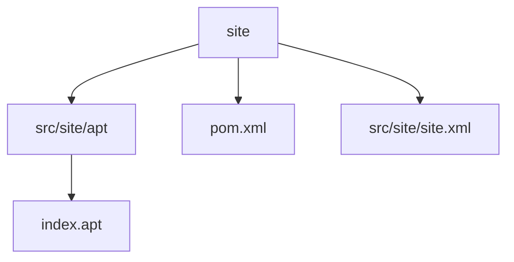

### **maven-archetype-webapp**

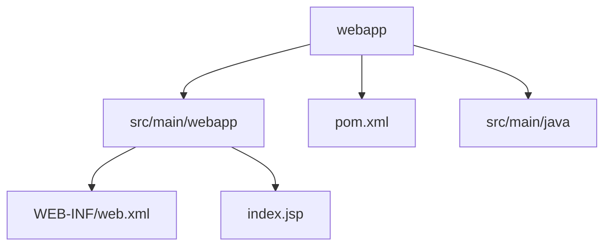
