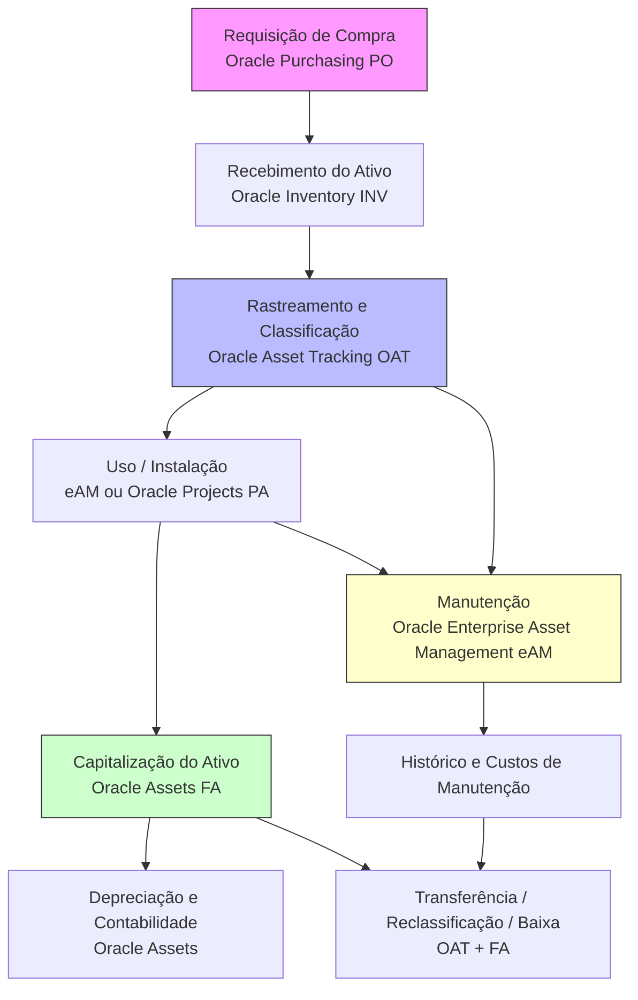
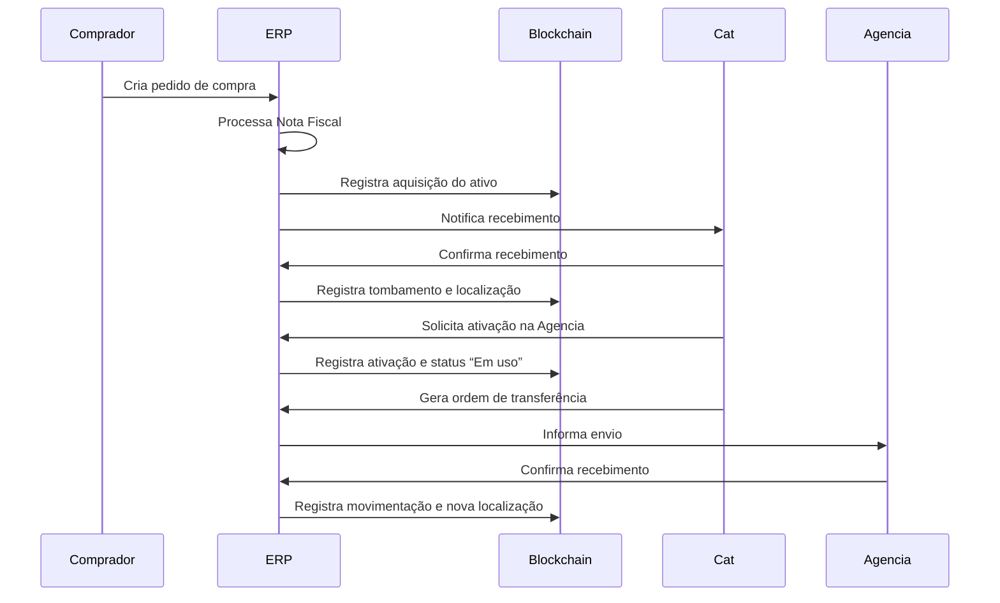

“A segurança é um processo, não um produto… não existe segurança perfeita.
Curiosamente, isso não é necessariamente um problema. …
A segurança não precisa ser perfeita, mas os riscos precisam ser administráveis…”
## Histórico
Implantando em 2002, com o sistema [Gestão Patrimonial SISPRO](https://www.sispro.com.br/gestao-patrimonial/), pois o Brasil, aplicava-se o Fiscal (RIR/99, GAAP nacional). Em 2008, os ERPs passaram a ofertar por uma combinação de **mudanças regulatórias internacionais**, **pressões de compliance**, e **necessidades de padronização contábil** que se intensificaram nesse período.
### **Crise Financeira Global (2008) e Maior Rigor em Controles Internos**
A crise de 2008 gerou uma **maior preocupação com governança, transparência e controle financeiro**.

Reguladores e investidores começaram a **exigir relatórios mais detalhados e precisos sobre os ativos das empresas**, incluindo:

- [ ] Vida útil econômica.
- [ ] Valor residual.
- [ ] Localização e uso.

| Aspecto                 | Antes de 2008                  | Após 2008 com IFRS/ERPs modernos         |
| ----------------------- | ------------------------------ | ---------------------------------------- |
| Integração com ERP      | Fraca ou inexistente           | Totalmente integrada                     |
| Base contábil           | Fiscal (RIR/99, GAAP nacional) | Econômica e internacional (IFRS)         |
| Controle de depreciação | Manual, único método fiscal    | Vários métodos (fiscal, gerencial, IFRS) |
| Impairment              | Não aplicado                   | Obrigatório                              |
| Componentização         | Não utilizada                  | Requerida em muitos casos                |
| Foco                    | Fiscalização                   | Transparência e controle gerencial       |

- [ ] **Impairment** é a redução no valor contábil de um ativo quando este excede seu **valor recuperável**, conforme definido pelas normas contábeis, principalmente o **IAS 36** (ou o **CPC 01** no Brasil).

### Oracle Assets (FA): Controle Contábil e Fiscal
O módulo Oracle Assets (FA) é o núcleo para o registro contábil dos ativos. Ele permite:
- [ ] Capitalização e depreciação automática de ativos
- [ ] Cálculo de valores residuais, reavaliações e baixas
- [ ] Geração de relatórios fiscais e gerenciais
- [ ] Associação de ativos a centros de custo e unidades organizacionais

FA é fundamental para garantir que os ativos estejam devidamente registrados nas demonstrações financeiras, obedecendo à conformidade legal e às normas de contabilidade (como IFRS (International Financial Reporting Standards) ou GAAP (Generally Accepted Accounting Principles)).

Desde 2008, o Brasil **adotou oficialmente o IFRS**, e a contabilização de ativos fixos segue as normas internacionais, com algumas particularidades locais.

O início da depreciação depende de dois fatores principais:
- [ ]  **Data de colocação em serviço** (In-Service Date);
	- [ ] No momento da adição do ativo, você define o **“Date Placed in Service”**.
- [ ]  **Status do ativo** (deve estar "Ativo" ou "Em uso");

Ativos que precisam ser utilizados (ex: equipamentos de outsourcing)

###  Principais normas aplicáveis ao Ativo Fixo no Brasil:

| Norma                          | Descrição                                                                                                 |
| ------------------------------ | --------------------------------------------------------------------------------------------------------- |
| **CPC 27**                     | Trata do reconhecimento, mensuração e depreciação de **ativos imobilizados**. Equivale ao IAS 16 do IFRS. |
| **CPC 01**                     | Redução ao valor recuperável de ativos (**impairment**).                                                  |
| **CPC 04**                     | Para ativos intangíveis (não se aplica diretamente a ativo fixo tangível, mas pode ser relacionado).      |
| **Lei 6.404/76 (Lei das S/A)** | A legislação societária brasileira, adaptada ao IFRS desde a Lei 11.638/2007.                             |
|                                |                                                                                                           |
### Oracle Asset Tracking (OAT): Rastreabilidade Operacional
O Oracle Asset Tracking (OAT) atua como ponte entre a contabilidade (FA) e as operações físicas (eAM e Inventory). Ele rastreia ativos em tempo real desde:

- [ ] A aquisição, com controle de número de série, tipo e custo;
- [ ] O estoque temporário, antes da instalação;
- [ ] A instalação física e a mudança de status (em uso, em manutenção, aposentado);
- [ ] O vínculo a projetos, locais ou unidades de manutenção;

OAT é essencial para manter visibilidade completa dos ativos, mesmo antes de serem capitalizados, especialmente em ambientes complexos com muitos movimentos e ativos móveis.

### **Enterprise Asset Management (eAM): Manutenção e Confiabilidade**
O módulo **eAM** gerencia o **ciclo de vida técnico** dos ativos, incluindo:

- [ ] Planejamento e execução de manutenções preventivas, corretivas e preditivas
- [ ] Registro de ordens de trabalho e eventos de falha
- [ ] Controle de peças sobressalentes, mão de obra e custos de manutenção
- [ ] Monitoramento de desempenho e confiabilidade

Além de ativos internos, o eAM também permite o **controle de ativos sob outsourcing**, garantindo que fornecedores prestem serviços dentro dos SLAs definidos, com registro completo das intervenções realizadas.

### **Benefícios da Integração FA + OAT + eAM**

|Benefício|Descrição|
|---|---|
|**Rastreabilidade completa**|Do estoque ao uso final, com histórico físico e contábil|
|**Controle fiscal e gerencial**|Precisão na depreciação e na apuração de custos|
|**Gestão de terceiros**|Visibilidade sobre ativos sob responsabilidade de prestadores|
|**Melhoria na manutenção**|Planejamento eficiente, redução de falhas e aumento de disponibilidade|
|**Apoio à auditoria e compliance**|Transparência nos dados de ativos físicos e financeiros|
## Inovação do Blockchain
Blockchain é uma cadeia de blocos interligados e criptografados, formando um livro-razão imutável.  Um banco de dados blockchain armazena dados em blocos interligados em uma cadeia.

A utilização do blockchain no controle de ativos tem ganhado destaque por trazer segurança, transparência, rastreabilidade e eficiência à gestão de ativos.

- [ ] **Segurança e Imutabilidade**: Registra transações de forma **imutável**;
- [ ] **Rastreabilidade Total**: É possível **acompanhar o ciclo de vida completo de um ativo**, desde sua criação ou aquisição até sua alienação ou baixa, com registro de todas as movimentações;
- [ ] **Automação com Smart Contracts**: Automatizar processos relacionados a ativos - transferencia, manutenção programada, alertas de conformidade e etc. As empresas usam contratos inteligentes para autogerenciar seus contratos comerciais, sem a necessidade de assistência de uma terceira parte. São programas armazenados no sistema de blockchain e executados automaticamente quando algumas condições predeterminadas são cumpridas. Eles executam verificações simuladas para que as transações possam ser concluídas com segurança.

| Característica               | O que significa                                                 |
| ---------------------------- | --------------------------------------------------------------- |
| Autoexecução                 | A lógica do contrato roda sozinha, sem precisar de intervenção. |
| Transparência                | O código e as ações do contrato são visíveis na blockchain      |
| Imutabilidade                | Após implantado, não pode ser alterado sem consenso.            |
| Segurança                    | Baseado em criptografia, é resistente a fraudes.                |
| Eliminação de intermediários | Diminui custos e burocracias.\|                                 |
- [ ] Ativos físicos podem ser monitorados por sensores (IoT), e os dados podem ser registrados automaticamente no blockchain;
	- [ ] Detecção de falhas em tempo real
	- [ ] Tomada de decisão baseada em dados confiáveis
- [ ] [Fluxo do Asset Tracking](https://docs.oracle.com/cd/V39571_02/current/acrobat/122cseug.pdf)

![[Pasted image 20250518064447.png]]

### Registrar a transação

- Quem foram os envolvidos na transação?
- O que aconteceu durante a transação?
- Quando a transação ocorreu?
- Onde a transação ocorreu?
- Por que a transação ocorreu?
- Qual é o volume do ativo que foi trocado?
- Quantas pré-condições foram cumpridas durante a transação?
### Obter consenso
A maioria dos participantes da rede blockchain distribuída precisa concordar que a transação registrada é válida.
### Vincular os blocos
Quando os participantes chegam a um consenso, as transações na blockchain são gravadas em blocos, equivalentes às páginas de um livro contábil.
### Compartilhar o ledger
O sistema distribui a cópia mais recente do ledger central para todos os participantes.![[Pasted image 20250518111443.png]]
## Tipos de redes blockchain

| Tipo                       | Entenda                                                                                                                                    |
| -------------------------- | ------------------------------------------------------------------------------------------------------------------------------------------ |
| Redes blockchain públicas  | Não precisam de permissão e deixam que todos participem dela.                                                                              |
| Redes blockchain privadas  | A autoridade determina quem pode ser membro e quais direitos esses membros terão na rede.                                                  |
| Redes blockchain híbridas  | empresas podem configurar um sistema privado, baseado em permissão, juntamente com um sistema público.                                     |
| Redes blockchain consórcio | Organizações previamente selecionadas compartilham a responsabilidade de manter a blockchain e determinar os direitos de acesso aos dados. |
## Protocolos da blockchain
São conjuntos de regras que definem como os dados são estruturados, verificados, transmitidos e protegidos na rede.

- [ ]  Hyperledger Fabric é um projeto de código aberto com um conjunto de ferramentas e bibliotecas.
- [ ] Ethereum é uma plataforma de blockchain descentralizada de código aberto que pode ser usada para criar aplicações de blockchain pública.
- [ ] Cardano, Tezos, EOS, TRON, Tendermint (Cosmos)
