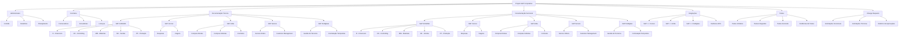

## Estreuturação de Equipe

## Estruturação Forma de Trabalhar

### Diretórios

```mermaid

graph TD
    A[Projeto SAP Corporativo] --> A1[Administrativo]
    A --> A2[Contratos]
    A --> A3[Documentação Técnica]
    A --> A4[Documentação Funcional]
    A --> A5[Integrações]
    A --> A6[Testes]
    A --> A7[Change Requests]

    %% Administrativo
    A1 --> A1a[Comitês]
    A1 --> A1b[Relatórios]
    A1 --> A1c[Planejamento]

    %% Contratos
    A2 --> A2a[Fornecedores]
    A2 --> A2b[Consultorias]
    A2 --> A2c[Licenças]

    %% Documentação Técnica
    A3 --> A3a[SAP S/4HANA]
    A3 --> A3b[SAP Concur]
    A3 --> A3c[SAP Ariba]
    A3 --> A3d[SAP Service]
    A3 --> A3e[SAP Fieldglass]

    %% Documentação Funcional
    A4 --> A4a[SAP S/4HANA]
    A4 --> A4b[SAP Concur]
    A4 --> A4c[SAP Ariba]
    A4 --> A4d[SAP Service]
    A4 --> A4e[SAP Fieldglass]

    %% S/4HANA Submódulos
    A3a --> A3a1[FI - Financeiro]
    A3a --> A3a2[CO - Controlling]
    A3a --> A3a3[MM - Materiais]
    A3a --> A3a4[SD - Vendas]
    A3a --> A3a5[PP - Produção]

    A4a --> A4a1[FI - Financeiro]
    A4a --> A4a2[CO - Controlling]
    A4a --> A4a3[MM - Materiais]
    A4a --> A4a4[SD - Vendas]
    A4a --> A4a5[PP - Produção]

    %% Concur
    A3b --> A3b1[Despesas]
    A3b --> A3b2[Viagens]

    A4b --> A4b1[Despesas]
    A4b --> A4b2[Viagens]

    %% Ariba
    A3c --> A3c1[Compras Diretas]
    A3c --> A3c2[Compras Indiretas]
    A3c --> A3c3[Contratos]

    A4c --> A4c1[Compras Diretas]
    A4c --> A4c2[Compras Indiretas]
    A4c --> A4c3[Contratos]

    %% Service
    A3d --> A3d1[Service Orders]
    A3d --> A3d2[Customer Management]

    A4d --> A4d1[Service Orders]
    A4d --> A4d2[Customer Management]

    %% Fieldglass
    A3e --> A3e1[Gestão de Terceiros]
    A3e --> A3e2[Contratação Temporária]

    A4e --> A4e1[Gestão de Terceiros]
    A4e --> A4e2[Contratação Temporária]

    %% Integrações
    A5 --> A5a[SAP <-> Concur]
    A5 --> A5b[SAP <-> Ariba]
    A5 --> A5c[SAP <-> Fieldglass]
    A5 --> A5d[Interfaces APIs]

    %% Testes
    A6 --> A6a[Testes Unitários]
    A6 --> A6b[Testes Integrados]
    A6 --> A6c[Testes de Aceite]
    A6 --> A6d[Evidências de Testes]

    %% Change Requests
    A7 --> A7a[Solicitações Funcionais]
    A7 --> A7b[Solicitações Técnicas]
    A7 --> A7c[Histórico de Aprovações]
```
