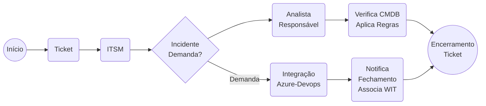
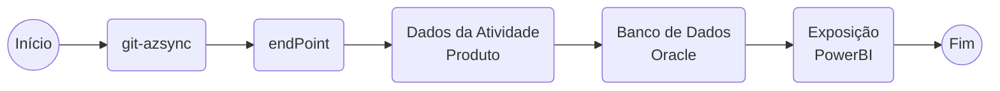

Estamos adotando o modelo C4 de treinamento, quatro partes que devem ser:

- [ ] Conceitos: Alguns fatos e conceitos teóricos sobre o tema;
- [ ] Conexões: Fazer com que os participantes se conectem uns com os outros e conectar os participantes com o que eles já podem saber sobre o tópico;
- [ ] Concretude: Uma atividade ou simulação para vivenciar o tema;
- [ ] Conclusão: Uma oportunidade para os participantes avaliarem o que aprenderam sobre o tema.

A solicitação do registro de incidentes, estabelece um ponto de contato entre os usuários e a equipe de TI, com a geração de tickets, permitindo um acompanhamento adequado da solicitação, entregando aos clientes informações oportunas e diretas das ações tomadas em relação aos incidentes.

Um dos aspectos mais IMPORTANTES para a rápida resolução é a coleta de informações impostadas ou anexadas pelo Cliente, durante sua abertura.

Nela deverão ser registrados, caminho que o cliente percorreu até o incidente, relatórios de logs ou saídas oriundas a sua identificação ou apontamentos/percepções que achar necessário.

Com estas informações capturadas pelo Cliente e sua resolução pelo atendente, comporão o Banco de Soluções (FAQs) , auxiliarão gestão de incidentes, mudanças e problemas da Organização, acelerando o sua resolução.

# Tudo em um único lugar
Efetua a integração dos chamados centrada em sua ferramenta de PROJETO.

Utilize a integração de todas as ferramentas com o seu software de comunicação.

Todos as SOLICITAÇÕES DE SERVIÇO, são inseridas no REPOSITÓRIO-DO-PRODUTO, que serão analisadas pelo Product Manager e priorizadas.

Efetua a leitura dos PRODUTOS que a PAT (Personal Access Token) tem acesso e salva através de um serviço no ORDS, as informações a serem consumidas pelo PowerBI.

## Incidente x Solicitações
Nossa Equipe estará atendendo a partir deste momento em dois sistemas distintos que obdecerão o conceito Incidente e/ou Problema e Solicitações.
### Incidente
Todo incidente deverá ser registrado no Sistema  e obedecerá o seguinte fluxo de trabalho.
#### Nível especializado
O processo de atendimento começa quando o **cliente** por meio de acesso ao sistema, ele aponta uma interrupção não planejada de um serviço de TI ou uma redução da qualidade de um serviço de TI.

- [ ] A partir deste acionamento, este Ticket, passa para um atendente de **Nivel 1**, que buscará o entendimento da solicitação e assumirá o atendimento.
- [ ] O atendente de Nível 1, efetuará a análise do Ticket e poderá solicitar as EVIDENCIAS e/ou MAIORES informações, se assim achar necessário ou efetuar o cancelamento da Solicitação, caso os requisitos mínimos não sejam inseridos na solicitação ou que seja identificado uma evolução ou modificação em um item de software.
- [ ] O primeiro atendente buscará solucionar o incidente, utilizando as informações na **base de conhecimento** da instituição e caso já exista uma solução, aplicará a mesma encerrando o atendimento ou informará ao usuário o numero do FAQ, para que o mesmo o faça. O FAQ deverá ser evidenciado no chamado.
- [ ] Caso contrário, este deverá efetuar o encaminhamento para o **Nível 2**, efetuando a triagem parcial do incidente, ou seja, deverá ser inserido pelo menos um dos labels: **Dúvida, Bug, Documentação e Gravidade.**

Ao findar o atendimento, o mesmo deverá produzir um relatório de incidente e fornecer uma documentação para ser anexada ou corrigida na Base de Conhecimento.

| Definição | Entenda                                                                                                                                                                                                                                                                                                                                                                                                                                                                                                                                                         |
| --------- | --------------------------------------------------------------------------------------------------------------------------------------------------------------------------------------------------------------------------------------------------------------------------------------------------------------------------------------------------------------------------------------------------------------------------------------------------------------------------------------------------------------------------------------------------------------- |
| N1        | Realiza o suporte básico, onde o problema é identificado e priorizado; Possui um conhecimento já passado através e cadastrado em um Solution Database. Esta focado na identificação e encaminhamento do problema para o grupo responsável por resolvê-lo; Esclarecerá dúvidas simples e atenderá usuários com problemas de baixa complexidade com o apoio de uma base de conhecimento. Hoje, o suporte inicial pode ser realizado por Bots de RPA e assistentes virtuais solucionam taretas simples, como desbloquelo de senhas, FAQS e triagéns automatizadas. |
| N2        | Oferece suporte na tentativa de resolver o problema; Normalmente possui um conhecimento por ter participado da implantação e/ou ser um profundo conhecedor do tema. Técnicos analisam incidentes complexos com dashboards de automação e inteligencia artificial.                                                                                                                                                                                                                                                                                               |
| N3        | Os chamados a fornecedores seriam de grupo. Um chamado aberto no fornecedor, tem que ser OBRIGATORIAMENTE, ser conhecido pelo Usuário Chave/Product Owner e Analista Funcional/Técnico. Os chamados de suporte não poderão ser realizados em hipótese alguma na conta da Empresa fornecedora de serviço ou no e-mail Individual do colaborador; Desenvolvem bots complexos, integram sistemas com APIs e aplicam machine learning.                                                                                                                              |
| Projeto   | Um projeto é um esforço temporário (deve ter datas de início e fim definidas) que tem como finalidade um resultado único e possui recursos delimitados (força de trabalho, materiais que serão utilizados, infraestrutura, verbas e prazos, colaboram para que não falte mão de obra para concluir o projeto ou que ele exceda a verba disponível).                                                                                                                                                                                                             |
|           | Um projeto é *TUDO AQUILO* que precisamos realizar para gerar algo novo ou *mante-lo em funcionamento*: seja uma casa, um sistema informatizado, um estudo/pesquisa, um trabalho de conclusão de curso, uma contratação ou um compra importante.                                                                                                                                                                                                                                                                                                                |
| NOC       | MONITORAMENTO DE INFRAESTRUTURA AUTOMATIZADA Sensores e scripts automatizados garantem a operação continua da infraestrutura, com alertas inteligentes e respostas automaticas.                                                                                                                                                                                                                                                                                                                                                                                 |
| SOC       | SEGURANÇA CIBERNETICA COM AUTOMAÇÃO DE RESPOSTA (SOAR)- Ferramentas de detecção com worrkflows de resposta automatizada protegem dados em tempo real                                                                                                                                                                                                                                                                                                                                                                                                            |
#### Controle de Chamados ao Fornecedor
As contas serão divididas em dois grandes grupos, sendo Funcionais e Técnicos.

- [ ] Um chamado aberto no fornecedor, tem que ser OBRIGATORIAMENTE, ser conhecido pelo Usuário Chave/Product Owner e Analista Funcional/Técnico.
- [ ] Os chamados de suporte não poderão ser realizados em hipótese alguma na conta da Empresa fornecedora de serviço. Para tal utilizem os e-mails criados dois logins “papéis" e conta de e-mail objetivando a abertura e recebimento de notificações de forma única, evidenciando o problema a todos do projeto, para que os mesmos analisem o impacto em seus módulos. As pessoas envolvidas terão obrigatoriamente notificar o responsável pelo MÓDULO.

### FAQ (Frequently Asked Questions)
Termo ingles, que concentra as respostas sobre as dúvidas mais comuns dos clientes e/ou atendentes.
Podemos dizer que é uma ferramenta estratégica de autoatendimento, que tem como objetivo oferecer soluções para perguntas ou incidentes recorrentes e com isso, agilizando a resolução de problemas e de respostas rápidas sem a necessidade de um agente.
#### Dicas para Criação de um FAQ

- [ ] Oferecer um passo a passo
- [ ] Realize um bom uso de imagens (que podem associar ao atendente, lembre-se 90% das informações processadas pelo cérebro são visuais);
- [ ] Caso haja informações adicionais e/ou outros FAQs, crie link para estes documentos, não polua o FAQ.
- [ ] Peça em seu comentário sobre o FAQ informado no atendimento.
- [ ] Peça para que avalie o FAQ, sempre que possível.
## Solicitação de Serviço ou Projeto(NOVA DEMANDA)

- [ ] Ao receber uma **NOVA DEMANDA**, a **EQUIPE RESPONSÁVEL** (SCRUM MASTER, PRODUCT MANAGER/OWNER e TIME) pelo **PRODUTO**, deverá efetuar a análise e priorização da mesma.
- [ ] Para a PRIORIZAÇÃO deverá ser utilizada a MATRIZ - GUT (Gravidade, Urgência e Tendência) – **PRODUCT BACKLOG**.
- [ ] O **TIME DO PRODUTO** (DEV, SCRUM MASTER, PO), analisará a DEMANDA e efeturá o entendimento, devendo criar a especificação funcional/não-funcional, histórias e critérios de aceitação. As histórias devem ser priorizadas para no mínimo 2(Duas) sprints. Os critérios de aceitação(DoD), devem ser **DEFINIDOS** e **ACORDADOS** pelo **TIME**.
- [ ] As histórias deverão ser **PONTUADAS** em seu **TAMANHO**. Este **TAMANHO** deverá ser expresso em **HORAS**. Se o PO/STAKEHOLDER aprovar a especificação, prazo, deverá ser alocada a SPRINT-PLANNING, caso contrário deverá ser retomada o processo. Deverá ser levado em consideração **NÃO** só o desenvolvimento da **SOLUÇÃO**, bem como os **TESTES UNITÁRIOS**. - SPRINT-PLANNING/READY TO DEV
- [ ] O TIME deverá elaborar a ESTRATÉGIA DE RAMIFICAÇÃO (se assim achar necessário), INTEGRAÇÃO, VERIFICAÇÃO, VALIDAÇÃO, CODE REVIEW, CRIAÇÃO DA PIPELINE (se for o caso) e ATUALIZAÇÃO DO MANUAL DO PRODUTO.
- [ ] O TIME e o SCRUM MASTER deverá efetuar a DISTRIBUIÇÃO DAS TAREFAS. OS ELEMENTOS DO TIME poderão ESCOLHER um PBI e quebrar em TAREFAS menores, objetivando um trabalho de no máximo 1(um) dia e efetuando a liberação do mesmo – DOING/DESENVOLVIMENTO
- [ ] O TIME deverá CODIFICAR, TESTAR e INTEGRAR(as tarefas e testes unitários são codificadas e o software INTEGRADO na BRANCH da SPRINT).
- [ ] O PO deverá VALIDAR as HISTÓRIAS ENTREGUES com base no CRITÉRIO DE ACEITE. O PO poderá ADIANTAR a validação, caso as histórias sejam entregues ANTECIPADAMENTE.
- [ ] O PO e/ou SCRUM MASTER poderá se assim achar necessário, mudar a ordem das entregas, caso a prioridade e o valor ao cliente mude.
- [ ] Os testes de STRESS, CONTRATO ou REGRESSÃO, deverão ser avaliados neste cenário. Um BUG deverá ser aberto para o devido ajuste caso algum problema seja encontrado. - QUALIDADE
- [ ] O SCRUM MASRER se reúne com o TIME para apresentar as HISTÓRIAS desenvolvidas na SPRINT. (SOMENTE SERÃO APRESENTADAS AQUELAS QUE PASSARAM NO CRITÉRIO DE ACEITAÇÃO). - SPRINT REVIEW
- [ ] Após a apresentação, o SCRUM MASTER, TIME e PO deverão realizar uma revisão da SPRINT e se for o caso, PROPOR melhoria no processo.
# Informações Mínimas

- [ ] Endereço da Rede ou da Aplicação (Uniform Resource Locator) - protocolo://dominio/caminho[:porta]
- [ ] Informe o login, opções de acesso, caminho;
- [ ] Caminho percorrido até receber o incidente;
- [ ] Print da Tela, na qual o incidente ocorre;
- [ ] Texto descrevendo o incidente (campos preenchidos, valores - para que possam ser simulados) e qual era o resultado esperado;
- [ ] Caso seja um concurrent ou job, o usuário deverá fornecedor o ID, da solicitação, a saída do concurrent e o log do concurrent;

**Observação**: Caso a Responsabilidade não evidencie a Localidade
