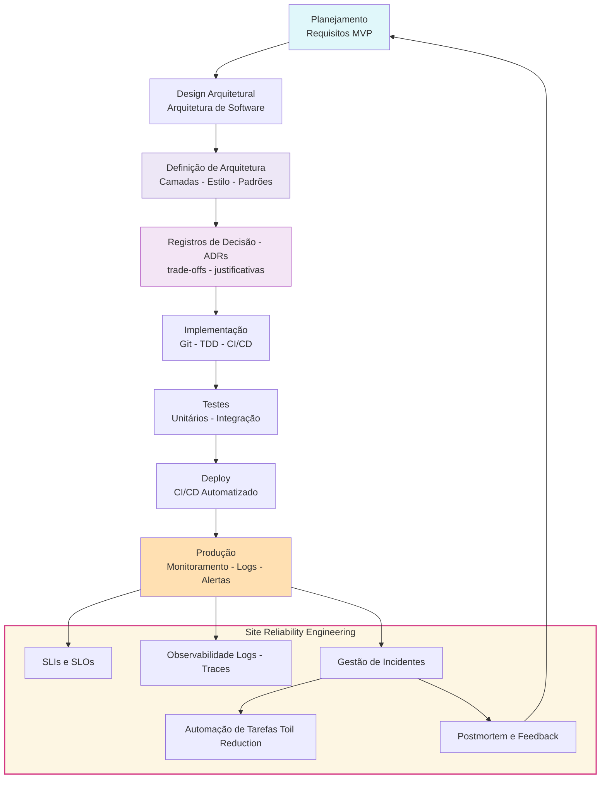

**Engenharia de Software** é a disciplina da computação que trata da aplicação sistemática de princípios, técnicas e métodos de engenharia para o desenvolvimento, operação e manutenção de software. Ela busca garantir que o **software seja construído com qualidade, dentro do prazo e orçamento**, atendendo às necessidades do usuário final.

## Principais objetivos:

- [ ] Criar software **confiável**, **eficiente** e **escalável**
- [ ]  Reduzir **custos de desenvolvimento e manutenção**
- [ ] Melhorar a **produtividade e previsibilidade**
- [ ] Promover a **colaboração entre equipes técnicas e de negócio**

- [ ] **Toil Reduction** é a prática de **reduzir o trabalho repetitivo, manual, e operacional** que **não agrega valor direto ao usuário**, mas que é necessário para manter os sistemas funcionando. Essa ideia vem do **Site Reliability Engineering (SRE)**, criado pelo Google.
- [ ]
