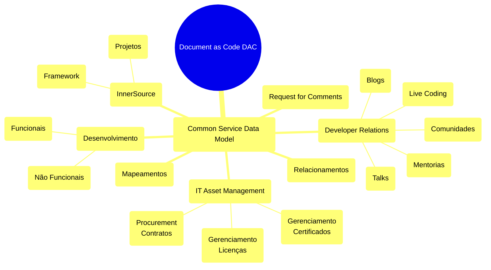

Os analfabetos do século 21 não serão aqueles que não sabem ler e escrever, mas aqueles que não sabem aprender, desaprender e reaprender.
  
### **Aprender, desaprender e reaprender**
#### Geração B-Alpha

| Geração                          | Entenda                                                                                                                                                                                                                                                                 |
| -------------------------------- | ----------------------------------------------------------------------------------------------------------------------------------------------------------------------------------------------------------------------------------------------------------------------- |
| Baby Boomers (Explosão de Bebês) | Valorizam um emprego fixo e estável, se importando mais com sua experiência do que com sua capacidade de inovação.                                                                                                                                                      |
|                                  | Preferência por qualidade e não quantidade.                                                                                                                                                                                                                             |
|                                  | Não é influenciado por terceiros;                                                                                                                                                                                                                                       |
| Geração "X"                      | Filhos dos Baby Boomers                                                                                                                                                                                                                                                 |
|                                  | Busca da individualidade sem a perda da convivência em grupo;                                                                                                                                                                                                           |
|                                  | Maturidade e escolha de produtos de qualidade e inteligência;                                                                                                                                                                                                           |
|                                  | Ruptura com as gerações anteriores e seus paradigmas;                                                                                                                                                                                                                   |
|                                  | Busca maior por seus direitos;                                                                                                                                                                                                                                          |
|                                  | Procura de liberdade.                                                                                                                                                                                                                                                   |
| Geração "Y" (Milennials)         | Geração que desenvolveu-se em uma época marcada pelo avanço da tecnologia e prosperidade econômica.                                                                                                                                                                     |
|                                  | Estão sempre conectados;                                                                                                                                                                                                                                                |
|                                  | Procuram informação fácil e imediata;                                                                                                                                                                                                                                   |
|                                  | Vivem em redes de relacionamento virtuais;                                                                                                                                                                                                                              |
|                                  | Compartilham tudo o que é seu: dados, fotos, hábitos. etc;                                                                                                                                                                                                              |
|                                  | Tem um grande fluxo de informações diariamente.                                                                                                                                                                                                                         |
| Geração Z                        | Nativas digitais , estando desde pequenos já familiarizadas com a internet e todas suas possibilidades, com o compartilhamento de arquivos constantes, com os smartphones, tablets, e principalmente estando sempre conectadas e ligadas ao que acontece em tempo real. |
|                                  | Desapegado das fronteiras geográficas;                                                                                                                                                                                                                                  |
|                                  | Demasiados ansiosos;                                                                                                                                                                                                                                                    |
|                                  | Falta de intimidade e relação social;                                                                                                                                                                                                                                   |
|                                  | Necessidade extrema de interação e exposição de opinião.                                                                                                                                                                                                                |
| Geração Alpha                    | vive um momento em que se preza a diversidade e a espontaneidade.                                                                                                                                                                                                       |
|                                  | Hiperconectividade;                                                                                                                                                                                                                                                     |
|                                  | Novas configurações familiares;                                                                                                                                                                                                                                         |
|                                  | Independência e autonomia;                                                                                                                                                                                                                                              |
|                                  | Estímulos constantes;                                                                                                                                                                                                                                                   |
|                                  | Preocupação com a saúde mental;                                                                                                                                                                                                                                         |
|                                  | Valorização das experiências;                                                                                                                                                                                                                                           |

#### Equilíbrio
 Defina limites claros para ajudar você a manter o equilíbrio e permanecer atualizado e produtivo a longo prazo.
#### Ecologia pessoal
Conforme descrito pelo Rockwood Leadership Institute , envolve :

- [ ] **Manter equilíbrio, ritmo e eficiência para sustentar nossa energia ao longo da vida**.
- [ ] **"Eu não conseguia me concentrar ou começar uma tarefa. Eu tinha falta de empatia pelos usuários".**
- [ ] Identifique suas motivações: Entender suas motivações pode ajudar a priorizar o trabalho de uma forma que o mantenha engajado e pronto para novos desafios;
- [ ] Reflita sobre o que faz você ficar desequilibrado e estressado:
- [ ] Falta de feedback positivo?
- [ ] Não dizer 'não';
- [ ] Trabalhando sozinho;
- [ ] Pouco tempo ou recursos para a realização das atividades?
- [ ] Demandas conflitantes;
- [ ] [Lista de verificação de esgotamento](https://governingopen.com/resources/signs-of-burnout-checklist.html).

#### Seja feliz  

- [ ] Descanse e recarregue as energias;
- [ ] Tire os fins de semana para relaxar e rejuvenescer;
- [ ] Defina limites: Você não pode dizer sim a todas as solicitações.

#### Por que contribuir para o código aberto
Contribuir com o código aberto pode ser uma maneira gratificante de aprender, ensinar e adquirir experiência em praticamente qualquer habilidade que você possa imaginar.
  
- [ ] Melhore as habilidades existentes;
- [ ] Conheça pessoas interessadas em coisas semelhantes;
- [ ] Encontre mentores e ensine outros;
- [ ] Aprenda habilidades interpessoais;
#### Anatomia de um projeto
Um projeto típico tem os seguintes tipos de pessoas:

- [ ] **Autor**: A pessoa/pessoas ou organização que criou o projeto
- [ ] **Proprietário**: A(s) pessoa(s) que tem(têm) propriedade administrativa sobre a organização ou repositório (nem sempre o mesmo que o autor original)
- [ ] **Mantenedores**: Colaboradores responsaveis por conduzir a visão e gerenciar os aspectos organizacionais do projeto (eles tambem podem ser autores ou proprietarios do projeto).
- [ ] **Colaboradores**: Todos que contribuíram com algo para o projeto
- [x] **Membros da Comunidade**: Pessoas que usam o projeto. Eles podem ser ativos em conversas ou expressar sua opinião sobre a direção do projeto;
#### Documentação
Esses arquivos geralmente são listados no nível superior de um repositório.

- [ ] **LICENÇA**: Por definição, todo projeto de código aberto deve ter uma licença de código aberto . Se o projeto não tiver uma licença, ele não é de código aberto.
- [ ] **README**: O README é o manual de instruções que dá as boas-vindas aos novos membros da comunidade no projeto. Ele explica por que o projeto é útil e como começar.
- [ ] **CONTRIBUTING**: Enquanto os READMEs ajudam as pessoas a usar o projeto, os documentos de contribuição ajudam as pessoas a contribuir para o projeto. Ele explica quais tipos de contribuições são necessárias e como o processo funciona. Embora nem todo projeto tenha um arquivo CONTRIBUTING, sua presença sinaliza que este é um projeto acolhedor para contribuir. Um bom exemplo de um Guia de Contribuição eficaz seria o do repositório Docs da Codecademy .
- [ ] **CODE_OF_CONDUCT**: O código de conduta define regras básicas para o comportamento dos participantes associados e ajuda a facilitar um ambiente amigável e acolhedor. Embora nem todo projeto tenha um arquivo CODE_OF_CONDUCT, sua presença sinaliza que este é um projeto acolhedor para contribuir.
- [ ] **Outra documentação**: Pode haver documentação adicional, como tutoriais, orientações ou políticas de governança e etc.
#### Discussões

- [x] **Solicitações de pull**: Onde as pessoas discutem e revisam alterações que estão em andamento, seja para melhorar a linha de código de um colaborador, o uso da gramática, o uso de imagens, etc.
- [ ] **Fóruns de discussão ou listas de discussão**: Podem usar esses canais para tópicos de conversação (por exemplo, "Como eu…" ou "O que você acha sobre…" em vez de relatórios de bugs ou solicitações de recursos).
- [ ] **Canal de bate-papo síncrono**: Slack ou Teams.
#### Analise o Projeto

- [ ] Ele tem uma licença? Normalmente, há um arquivo chamado LICENSE na raiz do repositório.
- [ ] Quando foi o último commit?
- [ ] Quantos colaboradores o projeto tem?
- [ ] Com que frequência as pessoas fazem commits? (No GitHub, você pode encontrar isso clicando em "Commits" na barra superior.)

#### Quantas questões em aberto existem?

- [ ] Os mantenedores respondem rapidamente aos problemas quando eles são abertos?
- [ ] Há discussão ativa sobre as questões?
- [ ] Os problemas são recentes?
- [ ] Os problemas estão sendo fechados? (No GitHub, clique na aba "fechados" na página Problemas para ver os problemas fechados.)
#### Comunicando-se
Não importa se você é um colaborador ou está tentando ingressar em uma comunidade: "trabalhar com outras pessoas é uma das habilidades mais importantes que você desenvolverá no código aberto".

- [ ] Dê contexto: Ajude outros a se atualizarem rapidamente.
- [ ] Faça sua lição de casa antes: Antes de pedir ajuda, certifique-se de verificar o README, a documentação, os problemas (abertos ou fechados), a lista de discussão de um projeto e pesquise na internet por uma resposta.
- [ ] Mantenha as solicitações curtas e diretas.
- [ ] Não tem problema fazer perguntas (mas seja paciente!).
- [ ] Acima de tudo, mantenha a classe.
  
### Contribua com o guia.de.código.aberto

- [ ] [Guia de código Aberto](https://github.com/github/opensource.guide/blob/main/_articles/how-to-contribute.md)

#### Gentileza gera Gentileza - José Datrino, também conhecido com o Profeta Gentileza.

|                              |                              |
| ---------------------------- | ---------------------------- |
|  |  |

  
  #### **Catalisando uma Revolução Cultural ("eu" para o "nós")**

- [ ] À medida que navegamos no cenário de TI, nesta rápida evolução, frequentemente nos encontramos na busca incessante de ficar à frente, com tecnologias de ponta e metodologias inovadoras (TRAM)
- [ ] Não aprendemos a compartilhar, mas de fato, precisamos reajustar nossos instrumentos, e essa afinação exige uma mudança cultural que considero significativa, mas como?
- [ ] Sair de apresentações solo para um concerto harmonizado;
- [ ] Reuniões e discussões devem engrandecer assistência e a cooperação;
- [ ] Talvez esta mudança de paradigma do "eu" para o "nós" possa revolucionar a cultura de trabalho, tornando-a mais inclusiva, solidária e bem-sucedida.

#### Como preconizado no Scrum

- [ ] A formação de times e organizações multifuncionais e de alto desempenho, onde pessoas de várias funções, conhecimentos se envolvem umas com as outras em um espírito de ajuda e cooperação, ou seja, quando fomentamos o sucesso uns dos outros, inadvertidamente lançamos as bases para o nosso próprio sucesso.
####  Como gostamos de fluxos, podemos:

- [ ] **Objetivo**: Promover uma cultura proativa e cooperativa pela a união da equipe, aumente a produtividade e impulsione o sucesso coletivo na organização.
- [ ] **Identificar a necessidade**: Incentive discussões abertas e comunicação transparente dentro da equipe para entender melhor as funções e os desafios de cada um.
- [ ] **Ofereça ajuda**: Ofereça sua experiência, tempo e recursos para ajudar a resolver o problema ou superar o obstáculo.
- [ ] **Colaboração Contínua(CC)**: Promover uma cultura de colaboração, envolvendo colegas com diversas habilidades e conhecimentos para contribuir na resolução do problema.
- [ ] **Compartilhe Conhecimento (CC)**: Compartilhe conhecimento e experiências abertamente para ajudar a equipe a crescer junto.
- [ ] **Reconhecimento e Esforços(RE)**: Reconheça e aprecie os esforços feitos pelos membros da equipe para serem úteis.
- [ ] **Melhoria Contínua (MC)**: Incentive cada membro da equipe a sugerir melhorias que possam tornar o fluxo de trabalho mais eficiente e benéfico.
#### "Noção de Justiça"

- [ ] Um ambiente é degradado, quando *regras* não são seguidas;
- [ ] **Os fins não justificam os meios**: mais importante do que definir métricas de sucesso para a sua empresa é o que você coloca em prática pra atingir esses resultados.
- [ ] Em algum lugar, há alguém fazendo algo totalmente novo e disruptivo que, potencialmente, pode mudar a vida de bilhões de pessoas, as tecnologias estão surgindo e se popularizando em uma velocidade estonteante, ou seja, pressão por inovação.
#### Transformação digital e inovação constante

- [ ] Two Pizza Teams - **Equipes pequenas e autônomas**;
- [ ] A tecnologia é uma ferramenta poderosa, mas o segredo é usá-la com **inteligência e estratégia**.
- [ ] **Experimentar e aprender: Errar faz parte do processo!**
- [ ] **Tecnologia com propósito**: A inovação deve estar alinhada com a visão da sua empresa.
- [ ] **Invista em conhecimento**: Treinamentos e capacitação são essenciais para preparar sua equipe para o futuro.

#### Habilidades humanas e inteligência emocional

- [ ] A criatividade, empatia, comunicação clara e a capacidade de lidar com ambiguidades se **tornarão ativos de altíssimo valor para as empresas**.
- [ ] Como desenvolver e incentivar a inteligência emocional?
- [ ] **Feedback contínuo**: positivo ou construtivo;
- [ ] **Empatia estruturada**: compreender profundamente as necessidades de clientes e colaboradores (DevEx, Innersource);
- [ ] **Treinamentos focados em inteligência emocional**: empatia, gestão de conflitos e autoconhecimento.

#### Sustentabilidade e Responsabilidade social

- [ ] A Geração Z e os Millennials exercem influência cada vez maior, exigindo que as empresas não sejam apenas rentáveis, mas também ambiental e socialmente comprometidas.
- [ ] Incorporar valores sustentáveis em todos os níveis — da cultura interna às políticas de fornecimento, comunicar com transparência, Equilibrar lucro e propósito.

#### Gestão de riscos e resiliência organizacional

- [ ] Construção de uma verdadeira arquitetura da resiliência, com pilares como: **Agilidade, Planos de continuidade e Diversificação**.

#### Liderança Inclusiva e Diversidade

- [ ] Capacitar para a inclusão (**racismo, sexismo, homofobia, etarismo**);
- [ ] **Dar voz, criando fóruns, comitês e espaços onde as pessoas se sintam à vontade para propor soluções** e trazer visões diversas para a organização;
#### Aprendizado Contínuo e Desenvolvimento de talentos

- [ ] As habilidades que possuímos hoje podem se tornar obsoletas em uma fração do tempo;
- [ ] World Economic Forum, **quase metade dos profissionais precisará se requalificar em 2025**;
- [ ] **Amplie suas habilidades para cativar talentos** a querer trabalhar contigo, exercita a mente e abre espaço para trabalhar a inovação em esferas diferentes e em ambientes cada vez mais competitivos.
- [ ] Pensar fora da caixa precisará entender de perto as **motivações individuais** de cada pessoa de seu time, criando trilhas de desenvolvimento personalizadas, que alinhem aspirações pessoais às metas organizacionais.
#### Novas formas de trabalho e Equilíbrio entre **vida profissional e pessoal**

- [ ] Quando os limites não estão bem estabelecidos, a chance de gerar um **burnout** é enorme;
- [ ] Adotar estratégias que priorizem a flexibilidade sem perder a eficiência;
- [ ] **Flexibilidade responsável** significa deixar bem claras as metas e resultados esperados;
- [ ] **Cultura de confiança** ganha força e a avaliação passa a ser baseada no que é entregue, não nas horas "logadas" no computador;
- [ ] **Quando todo mundo está engajado, bem cuidado e focado no que realmente importa, a distância deixa de ser um problema e vira oportunidade**.
#### Time
Um jogador que faz um time grande é mais valioso do que um grande jogador.
Perder-se no grupo para o bem do grupo, isso é trabalho em equipe.
John Wooden (ex-técnico de basquete do UCLA Bruins)

### Princípios da InnerSource
Plataformas de gerenciamento de código-fonte desempenham um papel crítico no desenvolvimento de software moderno, fornecendo um repositório central para armazenar, gerenciar e versionar código-fonte e documentação, bem como colaborar com o desenvolvimento de aplicações.

### Quem pode ver o quê?
A **transparência** desempenha um papel vital em promover a colaboração e encorajar a participação.
O projeto deve ser estruturado para permitir que o maior número possível de indivíduos contribuam, sendo assim, é importante reconhecer que certas restrições e considerações que podem impedir que tudo seja abertamente acessível dentro da empresa.
Isso pode envolver a configuração de diferentes repositórios ou controles de acesso com base na sensibilidade do código, tipo de projeto ou funções individuais dentro da organização.

#### Security-First

- [ ] Código sensível é transmitido para fora da empresa;
- [ ] Todos os repositórios devem ser seu próprio silo;
- [ ] O acesso para saber que cada repositório existe é concedido apenas individualmente pela alta gerência;
- [ ] **Repositórios sensíveis**: aqueles cujo lançamento tem impacto no mercado ou é uma infraestrutura central com implicações de segurança;
  
### Lberte-se

| Tipo                                                                             | Área |
| -------------------------------------------------------------------------------- | :--: |
| Aprendizagem, copiar e colar (exemplos, modelos)                                 |  x   |
| Alteração, correção, adição ou atualização de conteúdo (sites, documentação)     |  x   |
| Construir dentro do serviço interno de outra pessoa                              |  x   |
| Deduplicação. Não construa a mesma coisa duas vezes, construa uma solução geral. |  x   |
| Garantir o alinhamento entre projetos relacionados                               |  x   |
| Não se deixe atrasar por quem é o dono                                           |  x   |
| Use ferramentas reutilizaveis criadas para as circuntancia da empresa.           |  x   |

### **Veja o mundo**

  
  <!--
Baby Boomers 314 - 1946 AND 1964 Baby Boomers
Geração X 1281 - 1965 AND 1980 Geração X
Geração Y (Millennials) 1496 - 1981 AND 1996 Geração Y (Millennials)
Geração Z 122 - 1997 AND 2012 Geração Z  

SELECT
CASE
WHEN to_char(birthdate,'YYYY') BETWEEN 1946 AND 1964 THEN 'Baby Boomers'
WHEN to_char(birthdate,'YYYY') BETWEEN 1965 AND 1980 THEN 'Geração X'
WHEN to_char(birthdate,'YYYY') BETWEEN 1981 AND 1996 THEN 'Geração Y (Millennials)'
WHEN to_char(birthdate,'YYYY') BETWEEN 1997 AND 2012 THEN 'Geração Z'
WHEN to_char(birthdate,'YYYY') >= 2013 THEN 'Geração Alpha'
ELSE 'Data de Nascimento Inválida'
END AS geracao,
count(*)
FROM xxbbtsgate.vw_people_x_ebs
-->
###  "Não seja um Grande Líder"
Um líder geralmente se foca em inspirar e guiar as pessoas, enquanto um chefe se concentra mais em exercer autoridade e gerenciar resultados.
Muitas vezes, as pessoas podem ser boas em ambos os aspectos, mas a forma como lideram pode variar.

| Grande Lider        | Entenda                                                                                                                                                                                                                                                      |
| ------------------- | ------------------------------------------------------------------------------------------------------------------------------------------------------------------------------------------------------------------------------------------------------------ |
| Micromanager        | O gerente micromanager tende a supervisionar cada detalhe do trabalho de sua equipe, controlando até mesmo as tarefas mais simples. Ele tem dificuldade em delegar responsabilidades e confia pouco na capacidade de seus colaboradores para tomar decisões. |
| Credit Hog          | O gerente "credit hog" é aquele que busca assumir para si o crédito pelo trabalho e pelas conquistas de sua equipe, em vez de reconhecer o esforço coletivo.                                                                                                 |
| Blame Shifter       | O gerente "blame shifter" é aquele que nunca assume a responsabilidade pelos erros, preferindo transferir a culpa para os outros.                                                                                                                            |
| Inconsistent Leader | O líder inconsistente altera suas decisões e expectativas com frequência, criando confusão e incerteza na equipe.                                                                                                                                            |
| The Bully Boss      | O gerente agressivo ou "bully boss" utiliza a intimidação e o abuso de poder para controlar a equipe.                                                                                                                                                        |
| Plays Favorites     | O gerente que favorece alguns membros da equipe em detrimento de outros cria um ambiente de trabalho desigual e divisivo.                                                                                                                                    |
| Overly Critical     | Um líder excessivamente crítico foca demais nos erros e falhas, muitas vezes deixando de reconhecer os acertos e sucessos.                                                                                                                                   |
| Disconnected Leader | O gerente desconectado é aquele que está distante das necessidades e da realidade de sua equipe.                                                                                                                                                             |
| Ego-Centric Leader  | O líder centrado no próprio ego coloca suas próprias necessidades e ambições à frente das da equipe e da organização.                                                                                                                                        |
| Unethical Leader    | O líder antiético adota comportamentos e práticas que não seguem princípios morais ou legais, como enganar, manipular ou tomar decisões baseadas em interesses pessoais.                                                                                     |
