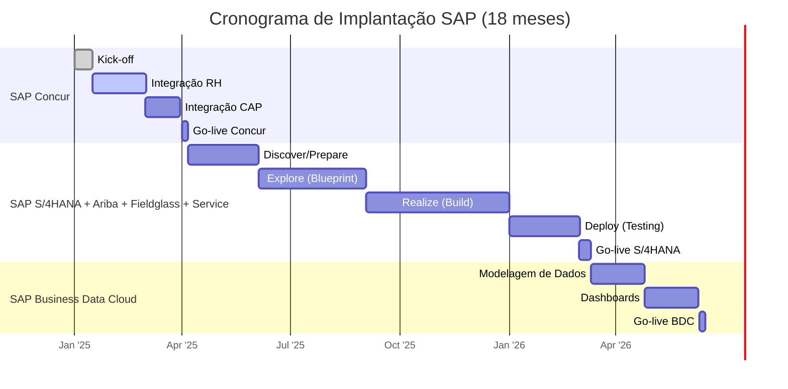
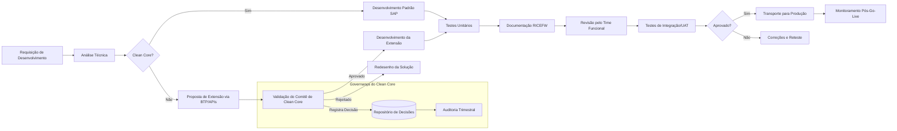
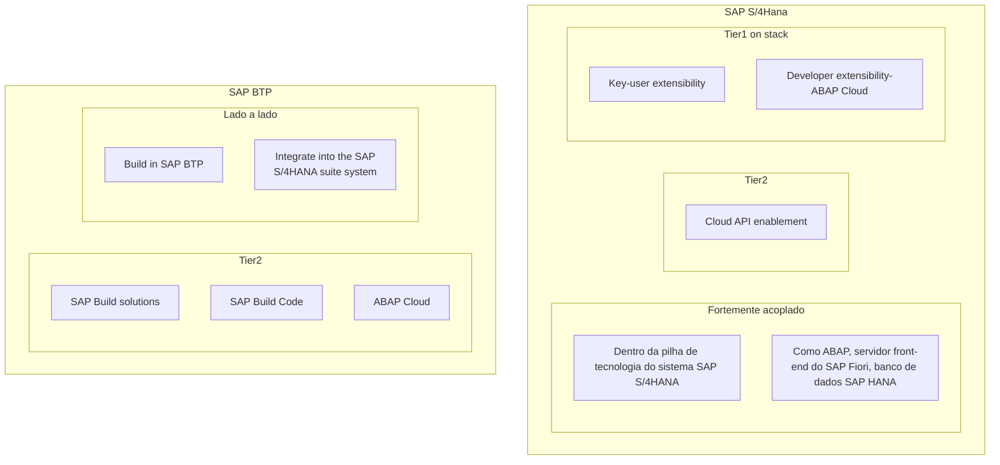
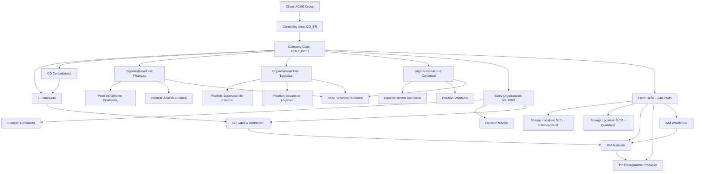
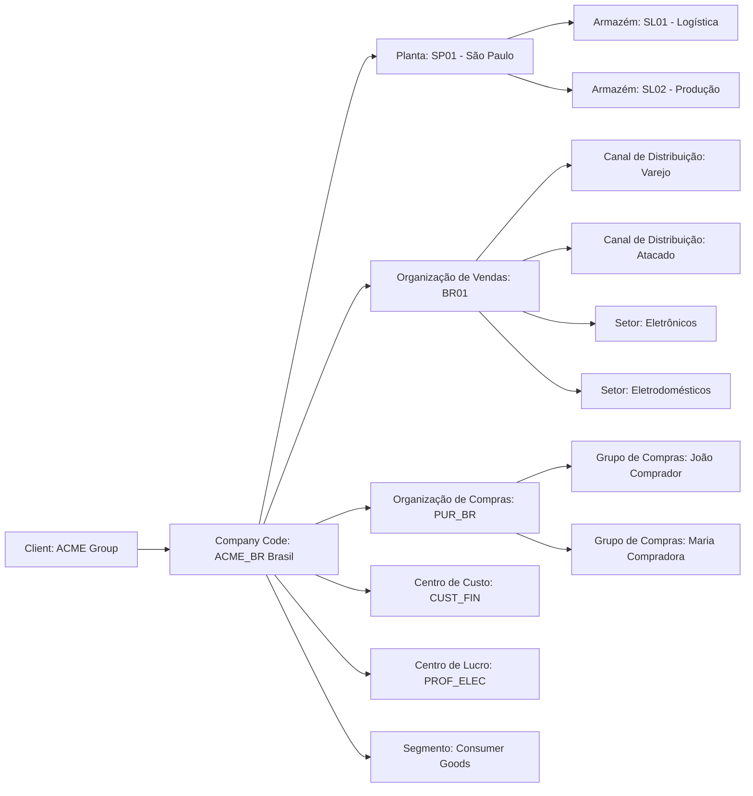
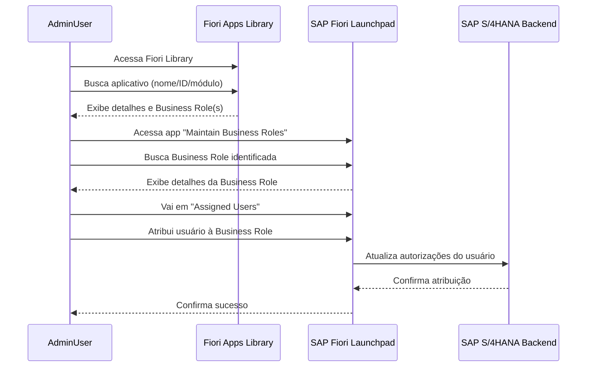
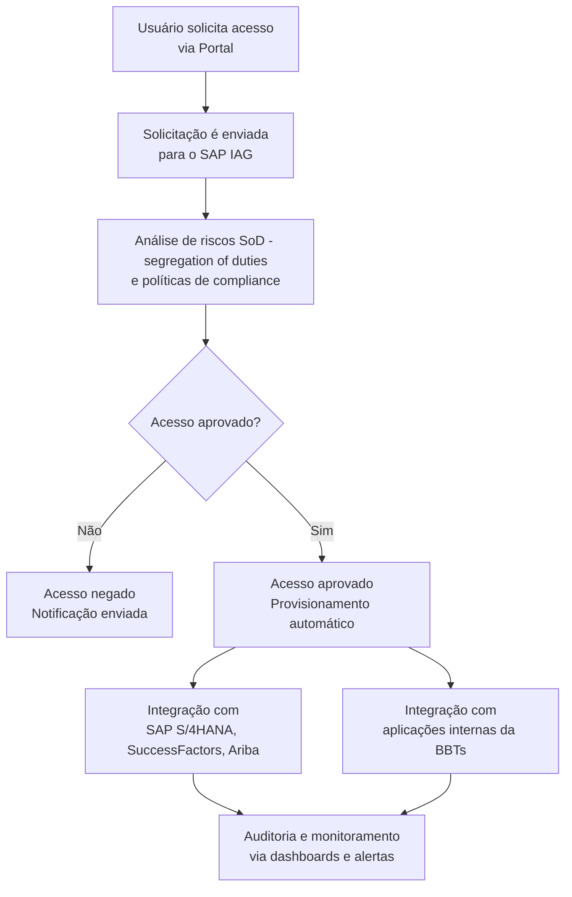

Projetos de transformação empresarial bem-sucedidos – incluindo transformações de ERP, modernizações de aplicativos e  migrações para a nuvem – exigem que os negócios e a TI colaborem efetivamente.

## **PROJETO BÁSICO PARA CONTRATAÇÃO DE SOFTWARES SAP**  
*(S/4HANA RISE, CONCUR, ARIBA, FIELDGLASS, SERVICE E BUSINESS DATA CLOUD)*  

---

### **1. OBJETO**  
Contratação de licenças e serviços para implantação dos softwares:  
- **SAP S/4HANA (RISE)** – Módulos FI, CO, MM, SD, PP, PM, HCM.  
- **SAP Concur** – Gestão de despesas e viagens.  
- **SAP Ariba** – Procurement e sourcing.  
- **SAP Fieldglass** – Gestão de workforce externa.  
- **SAP Service** – Gestão de serviços.  
- **SAP Business Data Cloud (DAC)** – Integração de dados analíticos.  

**Metodologias**:  
- **SAP Activate** (implantação ágil).  
- **Clean Core** (evitar customizações no core).  
- **RICEFW** (padrão para desenvolvimentos).  

---

### **2. CRONOGRAMA FÍSICO-FINANCEIRO (18 MESES)**  
#### **Fases e Marcos Principais**  
| **Fase**               | **Duração** | **Entregas**                              |  
|-------------------------|-------------|------------------------------------------|  
| **1. SAP Concur**       | 3 meses     | Integração RH + Contas a Pagar legado.   |  
| **2. SAP S/4HANA + Ariba + Fieldglass + Service** | 12 meses | Go-live módulos financeiros, compras e serviços. |  
| **3. SAP Business Data Cloud** | 3 meses | Modelagem de dados e dashboards. |  

#### **Gráfico de Gantt (Mermaid)**  


---

### **3. ALOCAÇÃO FINANCEIRA (ESTIMATIVA)**  
| **Fase**               | **Custo (R$)** | % do Orçamento |  
|-------------------------|----------------|----------------|  
| SAP Concur             | R$ 1,2M        | 15%            |  
| SAP S/4HANA + Ariba + Fieldglass + Service | R$ 5,5M | 65% |  
| SAP Business Data Cloud | R$ 1,3M        | 20%            |  
| **Total**              | **R$ 8,0M**    | **100%**       |  

*(Valores hipotéticos – ajustar conforme licenciamento e escopo real)*  

---

### **4. METODOLOGIAS**  
#### **4.1 SAP Activate**  
- **Fase 1 (Concur)**:  
  - **Discover**: Mapeamento de processos de RH e CAP.  
  - **Realize**: Configuração + integração via SAP PI/PO.  
- **Fase 2 (S/4HANA)**:  
  - **Explore**: Workshops para definição de Clean Core.  
  - **Deploy**: Testes UAT com usuários-chave.  

#### **4.2 Clean Core**  
- Uso de **extensões** (BAdIs, APIs) no lugar de modificações no core.  
- Personalizações via **SAP BTP** (ex.: apps em SAP Build).  

#### **4.3 RICEFW**  
- Exemplos:  
  - **Reports**: Custos por centro de lucro.  
  - **Interfaces**: Concur → S/4HANA (CAP).  
  - **Workflows**: Aprovação de requisições Ariba.  

---

### **5. GESTÃO DE RISCOS**  
| **Risco**                  | **Mitigação**                          |  
|-----------------------------|---------------------------------------|  
| Atraso na integração legada | Time dedicado + buffer no cronograma. |  
| Customizações excessivas    | Validação pelo comitê de Clean Core.  |  

---  
**Próximos Passos**:  
- Refinar escopo com SAP Partner.  
- Validar infraestrutura cloud (RISE).  

---  
**Observação**: O cronograma assume paralelismo entre módulos após o Go-live do Concur. Ajustar prazos conforme complexidade das integrações.

SAP FIori não era da SAP e passou a ser do SAP FIori - Ele é, na verdade, **uma abordagem de design de interface e uma coleção de aplicações SAP com foco na experiência do usuário**.

- O **SAP Fiori Launchpad** é a **plataforma de acesso central** onde os usuários veem e acessam suas Fiori Apps.
- Parece uma tela inicial com **ícones (tiles)** para cada aplicativo que o usuário tem permissão para usar.
- Personalizável por perfil, cargo e preferência do usuário.

|Termo|O que é?|Exemplo|
|---|---|---|
|**SAP Fiori**|Conjunto de apps com design moderno|App para aprovar pedidos de compra|
|**Fiori Launchpad**|Portal web com acesso aos apps|Tela inicial com todos os tiles (ícones) de apps disponíveis|

Transações Fiori nativas e transações Fiorizadas (fioriappslibrary.hana.ondemand.com/sap/fix/externalViewer/)


O SAP HANA é um banco de dados em memória, com armazenamento em colunas, projetado para alto desempenho.  _Todos os dados são compactados e mantidos na memória, o que permite_ a execução de operações em grandes volumes de dados sem acessar o disco, evitando gargalos de entrada/saída.

O dimensionamento do hardware é complexo e muitos fatores precisam ser considerados. O fator de crescimento é especialmente difícil de mensurar e é fácil cometer erros.
_Se for superestimado, recursos caros não serão_ utilizados, resultando em um custo total de propriedade (TCO) excessivo.

_O RISE with SAP inclui diferentes componentes do SAP BTP e SAP Business Network para

| Característica       | **RISE with SAP**             | **GROW with SAP**                 |
| -------------------- | ----------------------------- | --------------------------------- |
| Público-alvo         | Grandes empresas / legadas    | Empresas médias / em crescimento  |
| Tipo de nuvem        | Privada ou pública            | Nuvem pública (public cloud)      |
| ERP incluído         | SAP S/4HANA (qualquer edição) | SAP S/4HANA Cloud, public edition |
| Abordagem            | Transformação / migração      | Adoção rápida / Greenfield        |
| Customização         | Alta                          | Limitada (pré-configurado)        |
| Tempo de implantação | Médio a longo                 | Curto (mais rápido)               |
| Custo                | Mais elevado                  | Mais acessível                    |

A assinatura RISE with SAP inclui não apenas o SAP S/4HANA Cloud, edição privada, mas também a infraestrutura do hyperscaler e uma gama de serviços de gerenciamento técnico que a SAP fornece mediante um acordo de nível de serviço (SLA) previamente acordado. Inclui também os tickets de consumo para SAP BTP, o pacote inicial do SAP Business Network para SAP S/4HANA, o SAP Signavio Process Insights e o SAP Process Intelligence. Aqui está uma breve descrição desses diferentes componentes:

|Processo|Nome em inglês|Função principal|Área principal|
|---|---|---|---|
|Projeto para Operação|Project to Operate|Planejar e executar projetos|PM, PS, CO|
|Registro para Relatório|Record to Report|Contabilidade e relatórios financeiros|FI, CO|
|Lead-to-Cash|Lead to Cash|Vendas até recebimento|SD, FI|
|Fonte para Pagamento|Source to Pay|Compras até pagamento|MM, FI|
|Recrutar para Aposentar|Recruit to Retire|Ciclo de vida do funcionário|HCM, SuccessFactors|
|Solicitação de Serviço|Request to Service|Gerenciar e executar solicitações de serviço|CS, ITSM|
PMW -


| Fase SAP Activate         | Mês | % Esforço Planejado (acumulado) |     |
| ------------------------- | --- | ------------------------------- | --- |
| Discover (Descoberta)     | 1   | 5%                              | 5   |
| Prepare (Preparação)      | 2   | 15%                             | 10  |
| Explore (Exploração)      | 3   | 35%                             | 20  |
| Realize (Realização)      | 4   | 70%                             |     |
| Deploy (Implantação)      | 5   | 90%                             |     |
| Run (Suporte pós go-live) | 6   | 100%                            |     |


| Característica                         | Oracle E-Business Suite (EBS) | Oracle Fusion Applications        | SAP (S/4HANA)                     |
| -------------------------------------- | ----------------------------- | --------------------------------- | --------------------------------- |
| **Modelo de Dados Organizacionais**    | Multi-Org                     | Enterprise Structures             | Enterprise Structure / Org Units  |
| **Separação Legal/Fiscal**             | Legal Entity                  | Legal Entity                      | Company Code                      |
| **Unidade Operacional Principal**      | Operating Unit                | Business Unit                     | Plant / Company Code / Org Units  |
| **Controle Contábil**                  | Set of Books / Ledger         | Primary Ledger / Secondary Ledger | Ledger / Chart of Accounts        |
| **Centro de Lucro ou Custo**           | Cost Center / OU              | Cost Center / Business Unit       | Cost Center / Profit Center       |
| **Hierarquia Flexível (multiempresa)** | Limitada (via Multi-Org)      | Sim (com estrutura unificada)     | Sim (com Company Codes + Orgs)    |
| **Modelo Cloud-Ready**                 | Não (on-premise)              | Sim (nativamente Cloud)           | Sim (S/4HANA Cloud ou on-premise) |

|Função / Conceito|Oracle EBS|Oracle Fusion ERP|SAP S/4HANA|
|---|---|---|---|
|Entidade legal|Legal Entity|Legal Entity|Company Code|
|Unidade de operação|Operating Unit|Business Unit|Plant, Sales Org|
|Unidade contábil|Ledger|Ledger|Ledger / Chart of Accts|
|Controle de custo/lucro|OU / Cost Center|BU / Cost Center|Cost Center / Profit Ctr|
|Unidade de estoque|Inventory Org|Inventory Org|Plant|
|Gerenciamento centralizado|Limitado|Sim|Sim|



### **Legenda do Fluxo**:
1. **Análise Técnica**: Classifica se o desenvolvimento requer modificação no core.
2. **Comitê de Clean Core**:  
   - Avalia soluções alternativas (BTP, APIs, User Exits).  
   - Mantém um repositório de decisões para auditoria.  
3. **Documentação RICEFW**: Inclui specs técnicas e manuais do usuário.
4. **Validações**:  
   - Testes unitários/integração.  
   - Aprovação funcional antes do transporte.  
5. **Pós-Go-Live**: Monitoramento de performance e ajustes.  

### **Regras do Comitê de Clean Core**:
- **Entrada**: Formulário padrão com justificativa de necessidade.  
- **Saída**:  
  - ✅ Aprovação com registro no repositório.  
  - ❌ Rejeição com recomendação de redesign.  
- **Frequência**: Reuniões semanais para demandas críticas.  

---

**Exemplo Prático**:  
- **Cenário**: Customização de relatório financeiro.  
- **Decisão do Comitê**:  
  - ✖ **Negado**: Modificar tabela padrão do SAP.  
  - ✔ **Aprovado**: Desenvolver app no SAP Analytics Cloud via BTP.  

--- 
**Saída do Mermaid**: Gere o diagrama em ferramentas como [Mermaid Live Editor](https://mermaid.live/) para visualização interativa.


```
Ledger (Set of Books)
└── Legal Entity
    └── Operating Unit (OU)
        └── Inventory Organization(s)


Client
└── Company Code
    └── Plant
        └── Storage Locations
```

| Função / Conceito        | Oracle EBS / Fusion    | SAP S/4HANA        |
| ------------------------ | ---------------------- | ------------------ |
| Entidade de estoque      | Inventory Organization | Plant              |
| Local interno de estoque | Subinventory / Locator | Storage Location   |
| Transações de estoque    | Sim                    | Sim                |
| Integração com produção  | Sim (WIP / MFG)        | Sim (PP / MRP)     |
| Contabilidade de estoque | Por Org. de Inventário | Por Valuation Area |


| **Company Code** | Valor do material é igual em todas as plantas da empresa. |
| ---------------- | --------------------------------------------------------- |
| **Plant**        | Valor do material pode variar de planta para planta.      |
|                  |                                                           |
Na maioria das implementações modernas (especialmente no **S/4HANA**), a **Valuation Area por Plant** é **obrigatória**, pois permite maior controle.

# Clean Core
Clean Core é um conceito, gestão do ciclo de vida da aplicação.

- [ ] Política de controle de modificações: **Evitar modificações no código-fonte do SAP S/4HANA**;
- [ ] Remoção de código obsoleto: **Eliminar código não utilizado ou redundante**;
- [ ] Uso de APIs: **Dar prioridade no uso de APIs para extensões e integrações**.

## Tecnologia para extensões e programas personalizados

### Razões claras para desenvolver on-stack

- [ ] Uso intensivo de dados do software SAP S/4HANA, leitura e gravação;
- [ ] Alta frequência de interação com o SAP S/4HANA;
- [ ] Diretrizes para proteger o desempenho e a resiliência da integração;
- [ ] Arquitetura de destino (acoplamento flexível entre o componente da plataforma SAP BTP e o sistema SAP S/4HANA);
- [ ] Replicação de dados para interações de usuário críticas para o desempenho;
- [ ] Preferência por comunicação assíncrona em vez de síncrona (o protocolo OData V4 oferece opções correspondentes);
	- [ ] O [OData](https://www.odata.org/) (Open Data Protocol) é um [padrão OASIS](https://www.oasis-open.org/committees/tc_home.php?wg_abbrev=odata) aprovado pela [ISO/IEC](https://www.oasis-open.org/news/pr/iso-iec-jtc-1-approves-oasis-odata-standard-for-open-data-exchange) que define um conjunto de melhores práticas para a construção e o consumo de APIs RESTful;
### Possibilidade de desenvolvimento no SAP BTP

- [ ] Dados do software SAP S/4HANA raramente acessados ​​ou replicados;
- [ ] Integração assíncrona possível;

- [ ] Se você precisar usar os dados, eles não devem ser transferidos em grandes quantidades, pois talvez não seja necessário acesso em tempo real.
- [ ] Se você... Seria ótimo se você pudesse fazer integração assíncrona aqui.




- [ ] O OData (Open Data Protocol) é um padrão OASIS aprovado pela ISO/IEC que define um conjunto de melhores práticas para a construção e o consumo de APIs RESTful.

Incorpore padrões de resiliência para interações
Siga o guia do desenvolvedor para SAP BTP
### PAAS (Plataform as a Service)

**Extensibilidade de Usuário-chave (In-App Key-user Extensibility)**: Possibilita fazer extensões e customizações dentro do SAP S/4HANA, usando aplicações Fiori. Apesar do nome ser Key-User Extensibility, essa é uma opção de extensibilidade mais direcionada a consultores funcionais e desenvolvedores, podendo ser feita por usuários-chave que tenham mais domínio técnico do SAP. Possibilidades dessa extensibilidade:

- [ ] Adaptar telas do SAP Fiori.
- [ ] Adicionar lógica e campos customizados.
- [ ] Criar análises personalizadas.
- [ ] Criar formulários e modelos de e-mail.
- [ ] Criar objetos de negócios customizados.

**Extensibilidade do Desenvolvedor SAP BTP (Side-by-Side Developer Extensibility)**: Possibilita a criação de extensões e customizações maiores e mais complexas, para isso são utilizados serviços disponíveis no SAP Business Tecnology Plataform, os desenvolvimentos feitos aqui estão desacoplados do S/4HANA, portanto, mantendo o core do sistema limpo. Possibilidades dessa extensibilidade:

- [ ] Criar aplicações personalizadas.
- [ ] Desenvolver aplicativos móveis.
- [ ] Implementar soluções de IoT e Big Data.
- [ ] Implementar soluções de inteligência artificial.

**Extensibilidade do Desenvolvedor - In-App (On-Stack Developer Extensibility)**: Possibilita a criação de extensões e customizações maiores e mais complexas, neste caso usando ABAP Cloud - On-Stack, desenvolvendo dentro do próprio S/4HANA, desta maneira não é necessário o SAP BTP. Mesmo desenvolvendo dentro do S/4HANA, existem regras e validações que garantem a cumprimento dos princípios do Clean Core. Possibilidades dessa extensibilidade:

As possibilidades são quase as mesmas da Extensibilidade do Desenvolvedor - SAP BTP (Side-by-Side Extensibility), entretanto algumas delas são mais seguras e performáticas se criadas no SAP BTP.
- [ ] Criar aplicações personalizadas.
- [ ] Desenvolver aplicativos móveis (recomendado no SAP BTP).
- [ ] Implementar soluções de IoT e Big Data (recomendado no SAP BTP).
- [ ] Implementar soluções de inteligência artificial (recomendado no SAP BTP).

## Business Technology Platform - PAAS (Plataform as a Service)

| Model   | Descricao |
| ----    | ---- |
| App Dev | Foco total em desenvolvimento de aplicações, aqui estão serviços como: SAP Build Apps, SAP Build Workzone, SAP Build Code, entre outros. |
| Automation | Foco total em automatização e workflows, aqui estão serviços como: SAP Build Process Automation, SAP Task Center, entre outros. |
| Integration | Foco total em integração entre sistemas e aplicações, aqui estão serviços como: SAP Integration Suite, SAP Business Accelerator Hub, entre outros. |
| Data and Analytics | Foco total em extração, tratamento e análises de dados e indicadores, aqui estão serviços como: SAP Datasphere, SAP Analytics Cloud, entre outros. |
| Artificial Intelligence | Foco total em desenvolvimento de aplicações com uso de inteligência artificial, aqui estão serviços como: SAP AI Core, SAP AI Launchpad, entre outros. |

## Core Data Services (CDS)
Os CDSs são usados para criar estruturas de dados complexas, views e interfaces de serviço que podem ser consumidas por aplicativos Fiori e outros componentes do S/4HANA.

### Code Pushdown
Mover a lógica de processamento de dados para o nível do banco de dados.
Os CDSs facilitam isso ao permitir que operações complexas sejam definidas e executadas diretamente no banco de dados, reduzindo a quantidade de dados transferidos e melhorando significativamente o desempenho das aplicações.

#### CDSs em comparação com as views ABAP tradicionais
- [ ] Melhor desempenho devido ao processamento no nível do banco de dados
- [ ] Reutilização mais fácil em diferentes contextos (analítico, transacional)
- [ ] Capacidade de incluir anotações para metadados e comportamentos
- [ ] Integração mais simples com ferramentas de desenvolvimento SAP modernas
- [ ] Suporte nativo para criação de serviços OData


https://help.sap.com/docs/SAP_S4HANA_CLOUD/323bd3f1dc8248bc8647c62f1baa6a3a/c3c00e55db333e6ae10000000a44176d.html?state=DRAFT&version=2208.500

SAP Help Portal - SAP Online Help


acima como parametrizar o ciclo de vida do produto conforme o regulamento


https://help.sap.com/docs/SAP_S4HANA_CLOUD/323bd3f1dc8248bc8647c62f1baa6a3a/d3e9223994114f6e970b673715add4e8.html

SAP Help Portal - SAP Online Help

# SAP Documentação

- [ ] [Documentação das APIs](https://api.sap.com/)
- [ ] Site Professor
	- [ ] https://www.linkedin.com/pulse/medir-%C3%A9-importante-mas-como-okr-bsc-mbo-hoshin-kanri-nascimento/
	- [ ]

acima as funcionalidades do EHS environm

## Estrutura Organizacional






1.1) Quais das seguintes afirmações são verdadeiras sobre o banco de dados SAP HANA? _Os dados podem ser indexados e agregados_, _Os dados_ _X_ _C são estruturados em colunas_ e _Os dados são executados na memória_

2.0) O professor deu a dica de :



Unidade 2

Cada aplicativo SAP Fiori é criado em torno do usuário, e não da função.
- [x]  True
- [ ] False

Os aplicativos SAP Fiori podem ser classificados como qual dos seguintes: _Escolha as respostas corretas._ Folha de dados, Transacional e Analítico


PERT (Project Evaluation and Review Technique) e CPM (Critical Path Method)
MRP (Material Requirements Planning, ou Planejamento das Necessidades de Materiais) e o
MRP II (Manufacturing Resource Planning, ou Planejamento dos Recursos de Manufatura)

Principais Diferenças:

| Característica | MRP (Planejamento das Necessidades de Materiais) | MRP II (Planejamento dos Recursos de Manufatura)        |
| -------------- | ------------------------------------------------ | ------------------------------------------------------- |
| Foco           | Materiais                                        | Todos os recursos da produção                           |
| Função         | Calcular necessidades de materiais               | Gerenciar todos os recursos da produção                 |
| Capacidade     | Considera capacidade infinita                    | Leva em consideração a capacidade real                  |
| Integração     | Não integra com outras áreas da empresa          | Integra com outras áreas (financeiro, engenharia, etc.) |
| Planejamento   | Plano de compras e cronograma de produção        | Planejamento estratégico da produção                    |

![[Pasted image 20250604090656.png]]

- **Estoque Mínimo (EM) =** Consumo Médio (CM) x Tempo de Ressuprimento (TR)
- **Estoque Máximo (EMáx) =** (Consumo Médio + Consumo Máximo) x Tempo de Ressuprimento – Estoque Mínimo.
- **Ponto de pedido = média de consumo das mercadorias por dia x tempo de reposição das mercadorias em dias + estoque mínimo.**

Imagine que uma empresa consome 10 unidades por dia de um determinado produto.

- Tempo de reposição do fornecedor: 5 dias
	- Tempo de segurança (margem para atraso): 2 dias
- Lote de compra: 100 unidades

### Cálculos:

**Estoque Mínimo**
= 10 × 2 = **20 unidades**
**Estoque Máximo**
= (10 × 5) + 100 = 50 + 100 = **150 unidades**
**Ponto de Ressuprimento**
= 10 × 5 = **50 unidades**

https://prod-174.westus.logic.azure.com:443/workflows/a6e5b201ddc749e6951f949b3180c3a3/triggers/manual/paths/invoke?api-version=2016-06-01&sp=%2Ftriggers%2Fmanual%2Frun&sv=1.0&sig=vhFhXEgnsCwkcZ87ehwyvbTamXLg-enKKkprt3w9LiE


https://prod-174.westus.logic.azure.com:443/workflows/a6e5b201ddc749e6951f949b3180c3a3/triggers/manual/paths/invoke?api-version=2016-06-01&sp=%2Ftriggers%2Fmanual%2Frun&sv=1.0&sig=vhFhXEgnsCwkcZ87ehwyvbTamXLg-enKKkprt3w9LiE


|     |                                        |                                                                  |
| --- | -------------------------------------- | ---------------------------------------------------------------- |
| CFO | Diretor(a) financeiro                  | Chief Financial Officer                                          |
| CIO | Diretor(a) de tecnologia da informação | Chief Information Officer                                        |
| CEO | Chefe executivo do escritório          | Chief Executive Officer                                          |
| CTO | Diretor(a) de tecnologia               | Chief Technology Officer                                         |
| CPO | Diretor(a) de produtos                 | Chief Product Officer                                            |
| CLO | Diretor(a) jurídico                    | Chief Legal Officer / Learning Officer                           |
| CCO | Diretor(a) de comunicação              | Chief Compliance Officer / Commercial Officer / Customer Officer |
| CKO | Diretor(a) de conhecimento             | Chief Knowledge Officer                                          |
| CBO | Diretor(a) de negócios                 | Chief Business Officer                                           |
| CVO | Diretor(a) de consultoria              | Chief Visionary Officer                                          |

#  SAP Cloud Identity Access Governance (IAG)
A solução de **SAP Cloud Identity Access Governance (IAG)** é projetada para oferecer **gestão centralizada de identidades e acessos**, integrando-se de forma fluida com aplicações SAP e não SAP no ambiente da empresa.
Ela possibilita **controle automatizado, seguro e em conformidade** com políticas de governança, riscos e compliance (GRC).

#### **Componentes Principais da Solução:**

- **SAP IAG (Identity Access Governance):**

    - Gerencia solicitações e aprovações de acesso.
    - Automatiza análise de riscos de segregação do funções (SoD).
    - Suporte à conformidade com auditorias e normas regulatórias.
    - Integração nativa com SAP S/4HANA, SAP SuccessFactors e SAP Ariba.

#### **Integração com Aplicações da BBTs:**

- **Conectores customizados e APIs** permitem a integração do SAP IAG com os sistemas internos da BBTs, como:
    - Sistemas legados de RH e ERP não SAP.
    - Soluções próprias de BI e Data Analytics.
    - Ferramentas internas de ticketing e workflow (como Jira, ServiceNow ou equivalentes).
- **Fluxos unificados de provisionamento e desprovisionamento de usuários**, garantindo que as permissões corretas sejam aplicadas automaticamente com base em regras de negócios e cargos.
- **Monitoramento contínuo e auditoria** por meio de dashboards integrados, com alertas proativos para acessos indevidos ou riscos de conformidade.

#### **Benefícios da Solução Integrada:**

- **Redução de riscos operacionais e de compliance.**
- **Automatização de processos manuais**, com ganhos de eficiência.
- **Experiência unificada para gestores e usuários finais.**
- **Adoção mais ágil de políticas de segurança e conformidade.**
- **Escalabilidade e preparação para ambiente multi-cloud.**





Olá Time BBTS, Boa Tarde!

Seguem as dúvidas respondidas, caso persistam, favor me avisar.

- As questões relacionadas ao controle de acesso, definição e atribuição de role aos usuários, substituição temporária de usuários (recebendo os perfis de acesso da pessoa que sairá de férias, por exemplo), já está embutido no licenciamento do IaM que está no nosso bom ou seria outro SKU (ex: GRC AC)?

- No SAP IAG são definidas as “Business Roles”, nesta função desenhamos as BR (com base em definição de negócio) e fazemos a ligação delas com as roles técnicas replicadas dos sistemas origem.
- No Escopo da BB Tecnologia não estamos considerando o SAP S/4HANA for access control, e posicionamos apenas o **SAP Cloud Identity Access Governance (IAG)**.
-
- As principais diferenças entre os dois são:

Principais diferenças sumaridas:

|   |   |   |
|---|---|---|
|**Feature**|**SAP S/4HANA for Access Control**|**SAP Cloud Identity Access Governance (IAG)**|
|Deployment|On-premises or Private Cloud|Cloud-based|
|Scope|Complete SAP S/4HANA system|Access Governance and Compliance for SAP and Non-SAP systems|
|Access Control|Managed within S/4HANA|Centralized, role-based, and risk-based|
|Security|Business manages own security and compliance|SAP provides the platform, customer manages policies|
|Integration|Business manages integration with other systems|Integrates with SAP and non-SAP systems through connectors|

- **Portanto, o SAP IAG cobre a Gestão de acessos em todas as aplicações SAP e não – SAP ( podendo ser estendida para aplicações não SAP que não tenham conectores nativos).**
- O SAP S/4HANA for Access Control, basicamente cobre SOD para S/4HANA e para o SAP SuccessFactors.

- Para substituição temporária é parametrizado em tempo de projeto  a funcionalidade denominada Privileged Access Management  (PAM). Segue abaixo a  documentação do Privileged Access Management

[https://help.sap.com/docs/SAP_CLOUD_IDENTITY_ACCESS_GOVERNANCE/37bacb728d75468c92b1f1e20d5afbe2/cee1cb62728f469bb027ec60a543f499.html?version=CLOUDFOUNDRY](https://help.sap.com/docs/SAP_CLOUD_IDENTITY_ACCESS_GOVERNANCE/37bacb728d75468c92b1f1e20d5afbe2/cee1cb62728f469bb027ec60a543f499.html?version=CLOUDFOUNDRY "https://help.sap.com/docs/SAP_CLOUD_IDENTITY_ACCESS_GOVERNANCE/37bacb728d75468c92b1f1e20d5afbe2/cee1cb62728f469bb027ec60a543f499.html?version=CLOUDFOUNDRY")

- A questão de controle de fraudes, avaliando os perfis de usuários e sugerindo possíveis riscos e problemas de "compliance" estão neste SKU do IaM?

- Com relação ao processo de monitoramento de riscos de acesso contínuo, está incluso no produto SAP IAG. Na documentação abaixo, na página 16, mostra o passo a passo de como efetuar este monitoramento.

chrome-extension://efaidnbmnnnibpcajpcglclefindmkaj/https://help.sap.com/doc/e9d1aeae5c5f42b9a02ae0ed9f4a8bda/1902/en-US/IAG%20Access%20Analysis_Integration.pdf

Mantenha o foco no alvo
Todos os membros relevantes da equipe podem acessar e atualizar sua fonte compartilhada de verdade, garantindo que as pessoas certas entendam a situação atual e as perspectivas futuras.

Exibir fluxos de dados e dependências
Tanto as partes interessadas de TI quanto as de negócios podem usar o intuitivo Diagramas para visualizar conexões e fluxos de dados entre aplicativos e processos. Aprofunde-se no contexto de negócios de sua escolha e entenda todas as dependências.

O que é migração de dados?
Migração de dados refere-se à seleção, preparação, extração e transformação de dados e sua transferência permanente entre sistemas de armazenamento, formatos de dados ou sistemas computacionais. Quando os dados são transferidos de um local para outro ou de uma aplicação para outra, isso geralmente envolve novas tecnologias ou mudanças nos negócios.


[CÁLCULO DE DESCUMPRIMENTO DE ENTREGAS - SAP]
-----------------------------------------------------------------
| FASE               | MARCO PRINCIPAL       | DATA PLANEJADA | DATA REAL | DIAS DE ATRASO | PENALIDADE/DIA | VALOR TOTAL | LINK COM PROJETO |
|--------------------|-----------------------|----------------|-----------|----------------|----------------|-------------|------------------|
| SAP Concur         | Go-live Concur        | 01/04/2025     |           | =MAX(0,D5-C5)  | R$ 2.500,00    | =E5*F5      | Hyperlink         |
| SAP S/4HANA        | Go-live Financeiro    | 01/03/2026     |           | =MAX(0,D6-C6)  | R$ 5.000,00    | =E6*F6      | Hyperlink         |
| SAP Ariba          | Go-live Procurement   | 15/03/2026     |           | =MAX(0,D7-C7)  | R$ 3.000,00    | =E7*F7      | Hyperlink         |
| SAP Fieldglass     | Go-live VMS           | 30/03/2026     |           | =MAX(0,D8-C8)  | R$ 3.000,00    | =E8*F8      | Hyperlink         |
| SAP BDC            | Go-live Analytics     | 10/06/2026     |           | =MAX(0,D9-C9)  | R$ 1.500,00    | =E9*F9      | Hyperlink         |
-----------------------------------------------------------------

[RESUMO FINANCEIRO]
-------------------------------------------
| TOTAL DIAS ATRASO: =SUM(E5:E9)          |
| TOTAL PENALIDADES: =SUM(G5:G9)          |
| % ATRASO PROJETO: =E10/540*100          |
-------------------------------------------

[LEGENDA]
1. Fórmula "=MAX(0,D5-C5)": Calcula apenas atrasos (ignora adiantamentos)
2. Penalidades devem constar no Contrato (ex.: 0,1% do valor da fase/dia)
3. Links direcionam para o cronograma físico do projeto
4. 540 dias = 18 meses (duração total projetada)

[INSTRUÇÕES]
1. Preencher apenas a coluna "Data Real" quando ocorrerem entregas
2. Valores de penalidade devem refletir o contrato original
3. Para projetos críticos, sugerir escala progressiva:
   - 1-5 dias: R$ X/dia
   - 6-10 dias: R$ 1,5X/dia
   - +10 dias: Acionar garantias contratuais
