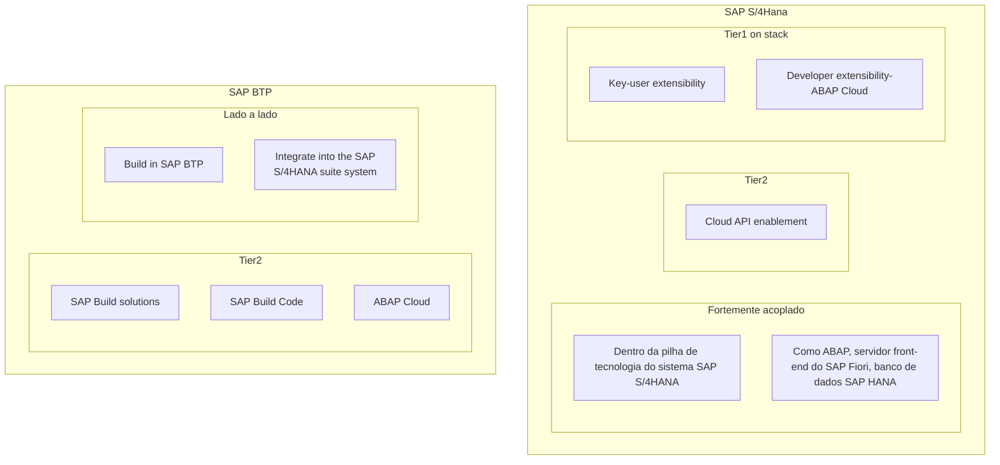
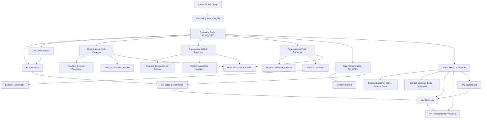
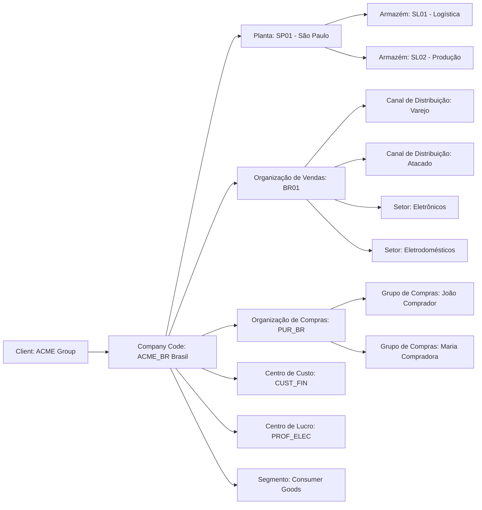
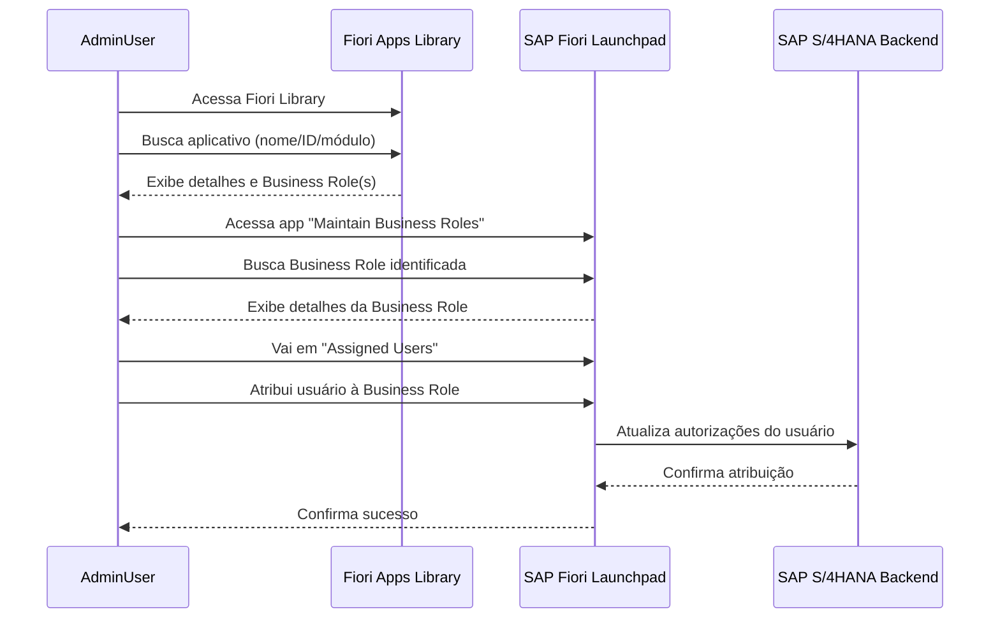

SAP FIori não era da SAP e passou a ser do SAP FIori - Ele é, na verdade, **uma abordagem de design de interface e uma coleção de aplicações SAP com foco na experiência do usuário**.

- O **SAP Fiori Launchpad** é a **plataforma de acesso central** onde os usuários veem e acessam suas Fiori Apps.
- Parece uma tela inicial com **ícones (tiles)** para cada aplicativo que o usuário tem permissão para usar.
- Personalizável por perfil, cargo e preferência do usuário.

|Termo|O que é?|Exemplo|
|---|---|---|
|**SAP Fiori**|Conjunto de apps com design moderno|App para aprovar pedidos de compra|
|**Fiori Launchpad**|Portal web com acesso aos apps|Tela inicial com todos os tiles (ícones) de apps disponíveis|

Transações Fiori nativas e transações Fiorizadas (fioriappslibrary.hana.ondemand.com/sap/fix/externalViewer/)


O SAP HANA é um banco de dados em memória, com armazenamento em colunas, projetado para alto desempenho.  _Todos os dados são compactados e mantidos na memória, o que permite_ a execução de operações em grandes volumes de dados sem acessar o disco, evitando gargalos de entrada/saída.

O dimensionamento do hardware é complexo e muitos fatores precisam ser considerados. O fator de crescimento é especialmente difícil de mensurar e é fácil cometer erros.
_Se for superestimado, recursos caros não serão_ utilizados, resultando em um custo total de propriedade (TCO) excessivo.

_O RISE with SAP inclui diferentes componentes do SAP BTP e SAP Business Network para

| Característica       | **RISE with SAP**             | **GROW with SAP**                 |
| -------------------- | ----------------------------- | --------------------------------- |
| Público-alvo         | Grandes empresas / legadas    | Empresas médias / em crescimento  |
| Tipo de nuvem        | Privada ou pública            | Nuvem pública (public cloud)      |
| ERP incluído         | SAP S/4HANA (qualquer edição) | SAP S/4HANA Cloud, public edition |
| Abordagem            | Transformação / migração      | Adoção rápida / Greenfield        |
| Customização         | Alta                          | Limitada (pré-configurado)        |
| Tempo de implantação | Médio a longo                 | Curto (mais rápido)               |
| Custo                | Mais elevado                  | Mais acessível                    |

A assinatura RISE with SAP inclui não apenas o SAP S/4HANA Cloud, edição privada, mas também a infraestrutura do hyperscaler e uma gama de serviços de gerenciamento técnico que a SAP fornece mediante um acordo de nível de serviço (SLA) previamente acordado. Inclui também os tickets de consumo para SAP BTP, o pacote inicial do SAP Business Network para SAP S/4HANA, o SAP Signavio Process Insights e o SAP Process Intelligence. Aqui está uma breve descrição desses diferentes componentes:

|Processo|Nome em inglês|Função principal|Área principal|
|---|---|---|---|
|Projeto para Operação|Project to Operate|Planejar e executar projetos|PM, PS, CO|
|Registro para Relatório|Record to Report|Contabilidade e relatórios financeiros|FI, CO|
|Lead-to-Cash|Lead to Cash|Vendas até recebimento|SD, FI|
|Fonte para Pagamento|Source to Pay|Compras até pagamento|MM, FI|
|Recrutar para Aposentar|Recruit to Retire|Ciclo de vida do funcionário|HCM, SuccessFactors|
|Solicitação de Serviço|Request to Service|Gerenciar e executar solicitações de serviço|CS, ITSM|
PMW -


| Fase SAP Activate         | Mês | % Esforço Planejado (acumulado) |     |
| ------------------------- | --- | ------------------------------- | --- |
| Discover (Descoberta)     | 1   | 5%                              | 5   |
| Prepare (Preparação)      | 2   | 15%                             | 10  |
| Explore (Exploração)      | 3   | 35%                             | 20  |
| Realize (Realização)      | 4   | 70%                             |     |
| Deploy (Implantação)      | 5   | 90%                             |     |
| Run (Suporte pós go-live) | 6   | 100%                            |     |


| Característica                         | Oracle E-Business Suite (EBS) | Oracle Fusion Applications        | SAP (S/4HANA)                     |
| -------------------------------------- | ----------------------------- | --------------------------------- | --------------------------------- |
| **Modelo de Dados Organizacionais**    | Multi-Org                     | Enterprise Structures             | Enterprise Structure / Org Units  |
| **Separação Legal/Fiscal**             | Legal Entity                  | Legal Entity                      | Company Code                      |
| **Unidade Operacional Principal**      | Operating Unit                | Business Unit                     | Plant / Company Code / Org Units  |
| **Controle Contábil**                  | Set of Books / Ledger         | Primary Ledger / Secondary Ledger | Ledger / Chart of Accounts        |
| **Centro de Lucro ou Custo**           | Cost Center / OU              | Cost Center / Business Unit       | Cost Center / Profit Center       |
| **Hierarquia Flexível (multiempresa)** | Limitada (via Multi-Org)      | Sim (com estrutura unificada)     | Sim (com Company Codes + Orgs)    |
| **Modelo Cloud-Ready**                 | Não (on-premise)              | Sim (nativamente Cloud)           | Sim (S/4HANA Cloud ou on-premise) |

|Função / Conceito|Oracle EBS|Oracle Fusion ERP|SAP S/4HANA|
|---|---|---|---|
|Entidade legal|Legal Entity|Legal Entity|Company Code|
|Unidade de operação|Operating Unit|Business Unit|Plant, Sales Org|
|Unidade contábil|Ledger|Ledger|Ledger / Chart of Accts|
|Controle de custo/lucro|OU / Cost Center|BU / Cost Center|Cost Center / Profit Ctr|
|Unidade de estoque|Inventory Org|Inventory Org|Plant|
|Gerenciamento centralizado|Limitado|Sim|Sim|


```
Ledger (Set of Books)
└── Legal Entity
    └── Operating Unit (OU)
        └── Inventory Organization(s)


Client
└── Company Code
    └── Plant
        └── Storage Locations
```

| Função / Conceito        | Oracle EBS / Fusion    | SAP S/4HANA        |
| ------------------------ | ---------------------- | ------------------ |
| Entidade de estoque      | Inventory Organization | Plant              |
| Local interno de estoque | Subinventory / Locator | Storage Location   |
| Transações de estoque    | Sim                    | Sim                |
| Integração com produção  | Sim (WIP / MFG)        | Sim (PP / MRP)     |
| Contabilidade de estoque | Por Org. de Inventário | Por Valuation Area |


| **Company Code** | Valor do material é igual em todas as plantas da empresa. |
| ---------------- | --------------------------------------------------------- |
| **Plant**        | Valor do material pode variar de planta para planta.      |
|                  |                                                           |
Na maioria das implementações modernas (especialmente no **S/4HANA**), a **Valuation Area por Plant** é **obrigatória**, pois permite maior controle.

# Clean Core
Clean Core é um conceito, gestão do ciclo de vida da aplicação.

- [ ] Política de controle de modificações: **Evitar modificações no código-fonte do SAP S/4HANA**;
- [ ] Remoção de código obsoleto: **Eliminar código não utilizado ou redundante**;
- [ ] Uso de APIs: **Dar prioridade no uso de APIs para extensões e integrações**.

## Tecnologia para extensões e programas personalizados

### Razões claras para desenvolver on-stack

- [ ] Uso intensivo de dados do software SAP S/4HANA, leitura e gravação;
- [ ] Alta frequência de interação com o SAP S/4HANA;
- [ ] Diretrizes para proteger o desempenho e a resiliência da integração;
- [ ] Arquitetura de destino (acoplamento flexível entre o componente da plataforma SAP BTP e o sistema SAP S/4HANA);
- [ ] Replicação de dados para interações de usuário críticas para o desempenho;
- [ ] Preferência por comunicação assíncrona em vez de síncrona (o protocolo OData V4 oferece opções correspondentes);
	- [ ] O [OData](https://www.odata.org/) (Open Data Protocol) é um [padrão OASIS](https://www.oasis-open.org/committees/tc_home.php?wg_abbrev=odata) aprovado pela [ISO/IEC](https://www.oasis-open.org/news/pr/iso-iec-jtc-1-approves-oasis-odata-standard-for-open-data-exchange) que define um conjunto de melhores práticas para a construção e o consumo de APIs RESTful;
### Possibilidade de desenvolvimento no SAP BTP

- [ ] Dados do software SAP S/4HANA raramente acessados ​​ou replicados;
- [ ] Integração assíncrona possível;

- [ ] Se você precisar usar os dados, eles não devem ser transferidos em grandes quantidades, pois talvez não seja necessário acesso em tempo real.
- [ ] Se você... Seria ótimo se você pudesse fazer integração assíncrona aqui.




- [ ] O OData (Open Data Protocol) é um padrão OASIS aprovado pela ISO/IEC que define um conjunto de melhores práticas para a construção e o consumo de APIs RESTful.

Incorpore padrões de resiliência para interações
Siga o guia do desenvolvedor para SAP BTP
### PAAS (Plataform as a Service)

**Extensibilidade de Usuário-chave (In-App Key-user Extensibility)**: Possibilita fazer extensões e customizações dentro do SAP S/4HANA, usando aplicações Fiori. Apesar do nome ser Key-User Extensibility, essa é uma opção de extensibilidade mais direcionada a consultores funcionais e desenvolvedores, podendo ser feita por usuários-chave que tenham mais domínio técnico do SAP. Possibilidades dessa extensibilidade:

- [ ] Adaptar telas do SAP Fiori.
- [ ] Adicionar lógica e campos customizados.
- [ ] Criar análises personalizadas.
- [ ] Criar formulários e modelos de e-mail.
- [ ] Criar objetos de negócios customizados.

**Extensibilidade do Desenvolvedor SAP BTP (Side-by-Side Developer Extensibility)**: Possibilita a criação de extensões e customizações maiores e mais complexas, para isso são utilizados serviços disponíveis no SAP Business Tecnology Plataform, os desenvolvimentos feitos aqui estão desacoplados do S/4HANA, portanto, mantendo o core do sistema limpo. Possibilidades dessa extensibilidade:

- [ ] Criar aplicações personalizadas.
- [ ] Desenvolver aplicativos móveis.
- [ ] Implementar soluções de IoT e Big Data.
- [ ] Implementar soluções de inteligência artificial.

**Extensibilidade do Desenvolvedor - In-App (On-Stack Developer Extensibility)**: Possibilita a criação de extensões e customizações maiores e mais complexas, neste caso usando ABAP Cloud - On-Stack, desenvolvendo dentro do próprio S/4HANA, desta maneira não é necessário o SAP BTP. Mesmo desenvolvendo dentro do S/4HANA, existem regras e validações que garantem a cumprimento dos princípios do Clean Core. Possibilidades dessa extensibilidade:

As possibilidades são quase as mesmas da Extensibilidade do Desenvolvedor - SAP BTP (Side-by-Side Extensibility), entretanto algumas delas são mais seguras e performáticas se criadas no SAP BTP.
- [ ] Criar aplicações personalizadas.
- [ ] Desenvolver aplicativos móveis (recomendado no SAP BTP).
- [ ] Implementar soluções de IoT e Big Data (recomendado no SAP BTP).
- [ ] Implementar soluções de inteligência artificial (recomendado no SAP BTP).

## Business Technology Platform - PAAS (Plataform as a Service)

| Model   | Descricao |
| ----    | ---- |
| App Dev | Foco total em desenvolvimento de aplicações, aqui estão serviços como: SAP Build Apps, SAP Build Workzone, SAP Build Code, entre outros. |
| Automation | Foco total em automatização e workflows, aqui estão serviços como: SAP Build Process Automation, SAP Task Center, entre outros. |
| Integration | Foco total em integração entre sistemas e aplicações, aqui estão serviços como: SAP Integration Suite, SAP Business Accelerator Hub, entre outros. |
| Data and Analytics | Foco total em extração, tratamento e análises de dados e indicadores, aqui estão serviços como: SAP Datasphere, SAP Analytics Cloud, entre outros. |
| Artificial Intelligence | Foco total em desenvolvimento de aplicações com uso de inteligência artificial, aqui estão serviços como: SAP AI Core, SAP AI Launchpad, entre outros. |

## Core Data Services (CDS)
Os CDSs são usados para criar estruturas de dados complexas, views e interfaces de serviço que podem ser consumidas por aplicativos Fiori e outros componentes do S/4HANA.

### Code Pushdown
Mover a lógica de processamento de dados para o nível do banco de dados.
Os CDSs facilitam isso ao permitir que operações complexas sejam definidas e executadas diretamente no banco de dados, reduzindo a quantidade de dados transferidos e melhorando significativamente o desempenho das aplicações.

#### CDSs em comparação com as views ABAP tradicionais
- [ ] Melhor desempenho devido ao processamento no nível do banco de dados
- [ ] Reutilização mais fácil em diferentes contextos (analítico, transacional)
- [ ] Capacidade de incluir anotações para metadados e comportamentos
- [ ] Integração mais simples com ferramentas de desenvolvimento SAP modernas
- [ ] Suporte nativo para criação de serviços OData


https://help.sap.com/docs/SAP_S4HANA_CLOUD/323bd3f1dc8248bc8647c62f1baa6a3a/c3c00e55db333e6ae10000000a44176d.html?state=DRAFT&version=2208.500

SAP Help Portal - SAP Online Help


acima como parametrizar o ciclo de vida do produto conforme o regulamento


https://help.sap.com/docs/SAP_S4HANA_CLOUD/323bd3f1dc8248bc8647c62f1baa6a3a/d3e9223994114f6e970b673715add4e8.html

SAP Help Portal - SAP Online Help

# SAP Documentação

- [ ] [Documentação das APIs](https://api.sap.com/)
- [ ] Site Professor
	- [ ] https://www.linkedin.com/pulse/medir-%C3%A9-importante-mas-como-okr-bsc-mbo-hoshin-kanri-nascimento/
	- [ ]

acima as funcionalidades do EHS environm

## Estrutura Organizacional






1.1) Quais das seguintes afirmações são verdadeiras sobre o banco de dados SAP HANA? _Os dados podem ser indexados e agregados_, _Os dados_ _X_ _C são estruturados em colunas_ e _Os dados são executados na memória_

2.0) O professor deu a dica de :



Unidade 2

Cada aplicativo SAP Fiori é criado em torno do usuário, e não da função.
- [x]  True
- [ ] False

Os aplicativos SAP Fiori podem ser classificados como qual dos seguintes: _Escolha as respostas corretas._ Folha de dados, Transacional e Analítico


PERT (Project Evaluation and Review Technique) e CPM (Critical Path Method)
MRP (Material Requirements Planning, ou Planejamento das Necessidades de Materiais) e o
MRP II (Manufacturing Resource Planning, ou Planejamento dos Recursos de Manufatura)

Principais Diferenças:

| Característica | MRP (Planejamento das Necessidades de Materiais) | MRP II (Planejamento dos Recursos de Manufatura)        |
| -------------- | ------------------------------------------------ | ------------------------------------------------------- |
| Foco           | Materiais                                        | Todos os recursos da produção                           |
| Função         | Calcular necessidades de materiais               | Gerenciar todos os recursos da produção                 |
| Capacidade     | Considera capacidade infinita                    | Leva em consideração a capacidade real                  |
| Integração     | Não integra com outras áreas da empresa          | Integra com outras áreas (financeiro, engenharia, etc.) |
| Planejamento   | Plano de compras e cronograma de produção        | Planejamento estratégico da produção                    |

![[Pasted image 20250604090656.png]]

- **Estoque Mínimo (EM) =** Consumo Médio (CM) x Tempo de Ressuprimento (TR)
- **Estoque Máximo (EMáx) =** (Consumo Médio + Consumo Máximo) x Tempo de Ressuprimento – Estoque Mínimo.
- **Ponto de pedido = média de consumo das mercadorias por dia x tempo de reposição das mercadorias em dias + estoque mínimo.**

Imagine que uma empresa consome 10 unidades por dia de um determinado produto.

- Tempo de reposição do fornecedor: 5 dias
	- Tempo de segurança (margem para atraso): 2 dias
- Lote de compra: 100 unidades

### Cálculos:

**Estoque Mínimo**
= 10 × 2 = **20 unidades**
**Estoque Máximo**
= (10 × 5) + 100 = 50 + 100 = **150 unidades**
**Ponto de Ressuprimento**
= 10 × 5 = **50 unidades**

https://prod-174.westus.logic.azure.com:443/workflows/a6e5b201ddc749e6951f949b3180c3a3/triggers/manual/paths/invoke?api-version=2016-06-01&sp=%2Ftriggers%2Fmanual%2Frun&sv=1.0&sig=vhFhXEgnsCwkcZ87ehwyvbTamXLg-enKKkprt3w9LiE


https://prod-174.westus.logic.azure.com:443/workflows/a6e5b201ddc749e6951f949b3180c3a3/triggers/manual/paths/invoke?api-version=2016-06-01&sp=%2Ftriggers%2Fmanual%2Frun&sv=1.0&sig=vhFhXEgnsCwkcZ87ehwyvbTamXLg-enKKkprt3w9LiE
